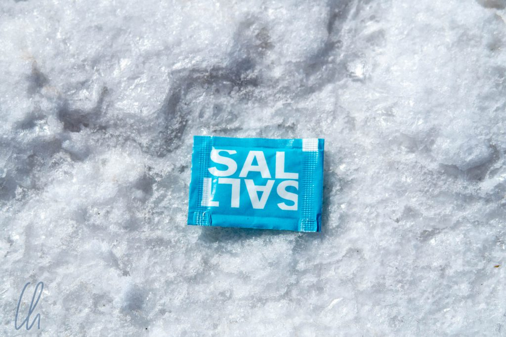

Der Salar de Uyuni ist der vielleicht bekannteste Ort Boliviens. Kein Wunder, denn wenn man auf der endlos wirkenden Salzfläche steht, kann man schon den Eindruck haben, sich auf einem anderem Planeten zu befinden. Da es keine öffentlichen Verkehrsmittel gibt, man vielfach nur mit einem Geländewagen vorankommt und viele Standard-Touranbieter ihre Gäste in landestypisch ungeheizten Unterkünften einquartieren, griffen wir etwas tiefer in die Tasche und stellten uns eine individuelle Route zusammen (theoretisch mit Heizung). Für 5 Tage erkundeten wir mit unserem Führer Diter und Fahrer Rubén (Zorro) den Salar de Uyuni und das südliche Altiplano bis Tupiza.

<!--more-->

## Der Salar de Uyuni

Der Salar ist die [größte Salzpfanne der Welt](https://de.wikipedia.org/wiki/Salar_de_Uyuni), 140 km lang und 110 km breit. Entstanden ist sie vor ca. 10.000 Jahren durch die Austrocknung eines Sees, nur das Salz blieb zurück. Somit ist die Salzfläche quasi eben mit nur minimalen Höhenunterschieden. Während der Regenzeit sammelt sich Wasser auf der Oberfläche der Salzkruste und verdunstet während der darauf folgenden Monate. Vor allem zu Beginn der Trockenzeit ist die Salzpfanne strahlend weiß. Die Kristalle glitzern in der Sonne, es bilden sich wabenförmige Muster aus und man könnte beinahe denken, es wäre kein Salz, sondern Schnee und Eis.

Auch die Temperaturen konnten den Eindruck von Schnee und Eis stützen, denn es war trotz strahlenden Sonnenscheins auf 3650 Metern Höhe kalt. Ende Mai/Anfang Juni lagen die Höchsttemperaturen tagsüber bei 10 Grad und nachts kühlte es sich bis auf -5 Grad ab. Wenn wir über das Salz gingen, fühlte es sich in etwa wie Laufen auf verharschtem Schnee an, da die Salzkruste unter unseren Füßen knirschte. Interessanterweise klirrte es auch leise, wenn man Salzkristalle aufwirbelte.

https://www.youtube.com/watch?v=XqLU7wH_c4k

Die Fahrt auf dem Salar war sehr bequem und wir kamen erstaunlich zügig voran. Einige Abschnitte hatten Fahrspuren, die jedes Jahr nach der Regenzeit neu „angelegt“ werden. Aber auch "offroad" fühlte sich die Fahrt fast wie auf einer asphaltierten Straße an. Rubén fuhr auf den langen trockenen Strecken zwischen 90 und 110 km/h und wir hatten das Gefühl, dass er problemlos noch weiter hätte beschleunigen können. Geschwindigkeitsrekorde stellten wir also keine auf ;), aber verglichen mit vielen anderen Wegen, die wir in den vergangenen Monaten benutzt hatten, war der Salar de Uyuni eine wohltuende Abwechslung :).

https://www.youtube.com/watch?v=oaKdVEP_oiM

Würde es auf dem Salar allerdings doch einmal schneien (und es schneit wirklich!), hätte der Winterdienst von Uyuni wenig zu tun. Die „Straßen“ auf dem Salar wären sofort perfekt gestreut ;).

## Salz- und Lithiumgewinnung auf dem Salar de Uyuni

Es findet ein Abbau des omnipräsenten Salzes statt. Man könnte es einfach vom Boden aufsammeln und das geschieht quasi auch. Entweder wird das weiße Mineral von der Oberfläche abgefräst oder in Blöcken aus dem Boden geschnitten und abtransportiert.

Die Salzblöcke werden auch als Baumaterial verwendet. Unser gut geheiztes Hotel „Palacio del Sal“ direkt neben dem Salar machte seinem Namen alle Ehre und bestand zu einem großen Anteil aus solchen Ziegeln. Kunstvolle Salzskulpturen zierten die Lobby und die Gänge. Am besten gefiel uns die lebensgroße Nachbildung eines weißen Lamas. In unserem Bad hing ein interessantes Hinweisschild, dass man beim Duschen die Badezimmertür schließen solle, damit durch die erhöhte Luftfeuchtigkeit kein Salz von der Decke tropfte.

Noch entscheidender als das Salz sind in Bolivien in der Zukunft vielleicht die [Lithiumvorkommen](https://www.dw.com/en/bolivias-evo-morales-plans-lithium-mining-offensive/a-39727810), angeblich die größten weltweit. Gesehen haben wir vom Abbau nichts und das Projekt scheint sich auch noch in der Anfangsphase zu befinden. Je eine deutsche und eine chinesische Firma betreiben kleine Anlagen. Es gibt wohl zwei Faktoren, die Probleme aufwerfen: Der Reinheitsgrad des Lithiums ist nicht so hoch wie an anderen Orten der Welt, so dass der Abbauprozess noch optimiert werden muss. Außerdem möchte Bolivien kein reiner Rohstofflieferant sein, sondern möglichst viel Wertschöpfung im Land betreiben. Ein sehr guter Ansatz, aber anscheinend nicht einfach umzusetzen.

## Sehenswürdigkeiten am Rande des Salars

Der Salar de Uyuni an sich ist eine unwirtliche Umgebung, auf der Salzfläche selbst gibt es kein Leben. Am Rande der Salzpfanne jedoch befanden sich schon in präkolumbianischer Zeit menschliche Siedlungen. Eine solche lag bei Pucara Ayque, wo wir die Ruinen von runden Steinhäusern und eine Grabhöhle besichtigten.

Außerdem beobachteten wir in der Nähe einige [James Flamingos](https://de.wikipedia.org/wiki/James-Flamingo), die sich erstaunlicherweise in diesem lebensfeindlichen Klima wohlfühlen.

Die Cueva de las Galaxias (auch "Gruta de las Galaxias" oder "Gruta Cristal"; "Die Höhle der Galaxien") wurde erst vor vergleichsweise kurzer Zeit im Jahre 2003 entdeckt. Sie enthält filigrane Gesteinsformationen, die aus dem [Kontakt von Wasser mit Lava](http://uyuniland.com/uyuni/informacion-turistica-de-uyuni.php) entstanden sein sollen.

## Sonnenuntergang auf dem Salar

Der Sonnenuntergang auf dem Salar war ein besonderes Erlebnis. Ende Mai/Anfang Juni gab es noch einige Stellen, an denen das Wasser ein paar Zentimeter tief auf der Salzkruste stand. Es war fast windstill und so bildete die Wasseroberfläche einen riesigen Spiegel, der den Himmel und die Landschaft reflektierte.

Um uns die Zeit bis zum Sonnenuntergang trotz einsetzender Kälte etwas angenehmer zu gestalten, baute unser Guide nach bester Safari-Tradition einen Tisch mit einer Flasche Wein als Sundowner und ein paar Knabbereien auf. Welch angenehme Überraschung :).

Kaum war die wärmende Sonne hinter dem Horizont verschwunden, wurde es schlagartig bitterkalt! Nicht so sehr an den Füßen, die waren sowieso schon gefühllos, da wir seit fast einer Stunde in Gummistiefeln im kalten Wasser standen, sondern vor allem an den Händen. Beim Einfangen der Abendstimmung froren mir fast die Finger ab, aber das Farbspiel am Horizont war es wert!

## Inseln im Salzmeer

Mitten in der Salzwüste ragen einige Hügel auf, Land im Salzmeer, die nicht nur Erhebungen über dem Salzspiegel darstellen, sondern auch Inseln des Lebens sind. Sie geben Vögeln, Viscachas und Insekten eine Heimat. Sträucher und Kakteen wachsen auf den Eilanden in der sonst rein weißen Einöde aus Salz, und was für Kakteen! Sie ragen meterhoch in den Himmel.

Am bekanntesten ist die [Insel Incahuasi](https://de.wikipedia.org/wiki/Isla_Incahuasi). Ein kurzer Wanderweg führt über die Insel und auf den knapp 80 Meter über dem Salar liegenden Gipfel. Von oben genossen wir den beeindruckenden 360 Grad-Rundumblick über den Salar: Weiß, soweit das Auge reicht.

Die Isla Incahuasi ist aber bei weitem nicht die einzige Insel im Salar. Wir besuchten außerdem die Isla Campana, die nicht ganz so riesige Kakteen beheimatete, dafür aber menschenleer war.

## Trickfotos auf dem Salar de Uyuni

Durch das homogene Weiß des Salar de Uyuni verschwimmen die Grenzen zwischen Nah und Fern, wodurch lustige Trickfotos möglich sind. Diter war bestens ausgerüstet und hatte seinen Freund Tommy dabei, einen Plastikdinosaurier, der uns auf dem Salar Furcht und Schrecken einflößte ;)

Der Kniff bei diesen Bildern liegt darin, dass man nicht erkennt, ob die Objekte im Foto direkt vor der Kamera stehen oder weiter entfernt sind, es ist also ein Spiel mit der Perspektive. Auf diese Weise lassen sich zum Beispiel Größenverhältnisse umkehren. Dabei sollte man darauf achten, dass alle Motive im Fokus sind. Man muss also mit geschlossener Blende (z.B. f22, möglichst hohe Zahl) oder mit einem kleinen Sensor (zum Beispiel einem Smartphone) fotografieren, um den gewünschten Effekt zu erzielen. Alternativ kann man zwei Bilder mit unterschiedlichem Fokus machen und diese bei der Nachbearbeitung zusammenführen.

Und das ist das Ergebnis:

Nachdem wir das System verstanden hatten, kamen uns immer mehr Ideen, die wir leider wegen Zeitmangels nicht mehr umsetzen konnten. Auf alle Fälle war es ein Riesenspaß!

## Sonnenuntergang und Sternenhimmel

Abends auf dem Weg zurück zum Hotel hielten wir wieder zum Sonnenuntergang an, allerdings ohne Sundowner… Diesmal gab es kein reflektierendes Wasser, dafür feine Wabenstrukturen im Salz, die im Licht der letzten Sonnenstrahlen ihre Farbe zu verändern schienen.

Nachdem die Sonne untergegangen war, kamen die Sterne zum Vorschein. Fernab größerer Ortschaften leuchteten die Milchstraße und der Sternenhimmel der Südhalbkugel hell in der eisigen Finsternis, bevor der aufgehende Mond sie überstrahlte.

Die Landschaft am und auf dem Salar de Uyuni erinnerte fast an einen anderen Planeten und auf gewisse Weise ist sie das auch. Im Film „Star Wars: The Last Jedi“ diente der Salar als [Kulisse](https://www.dw.com/es/bolivia-star-wars-los-%C3%BAltimos-jedi-se-film%C3%B3-en-el-salar-de-uyuni/a-38541679) für den Mineralplaneten [Crait](https://de.wikipedia.org/wiki/Orte_aus_Star_Wars#Crait).

To be continued.
