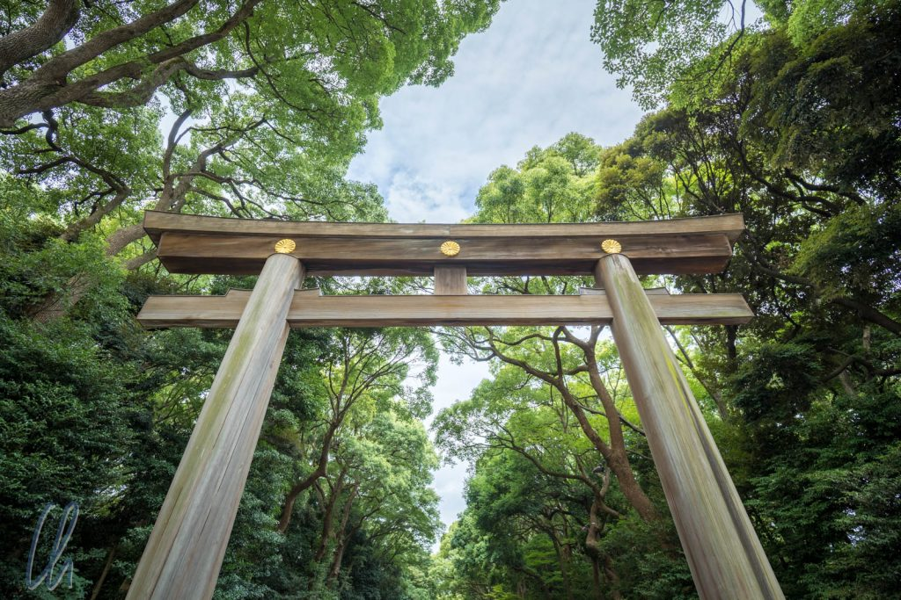
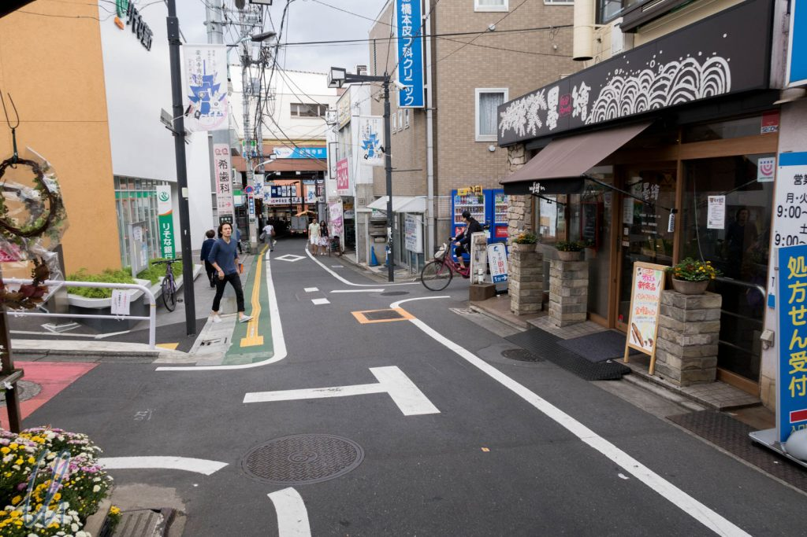
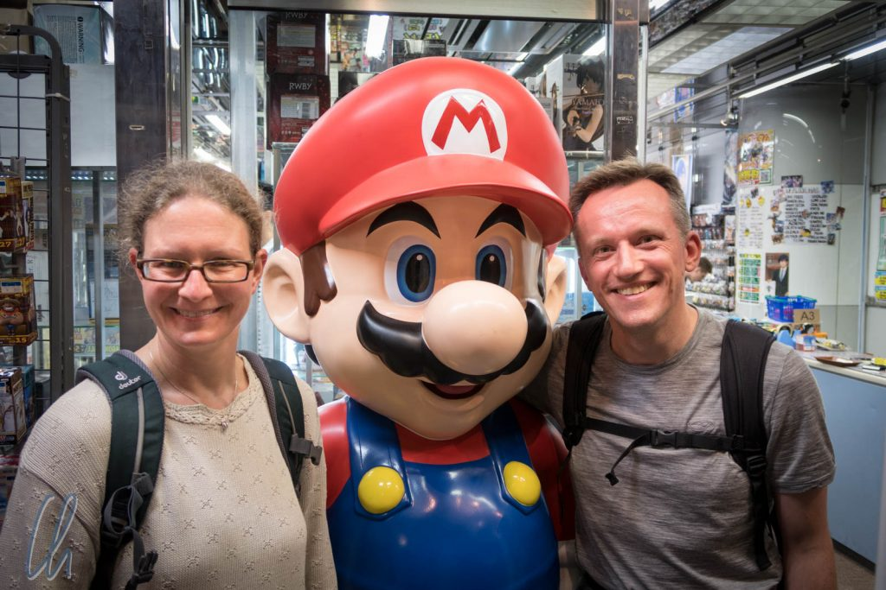

# Sightseeing in der Mega-City Tokyo

Tokyo ist die Mega-City schlechthin. Die Statistik sagt, dass Tokyo-Yokohama die größte Metropolregion der Welt ist. Das spüren wir gleich, wenn wir uns ins Getümmel stürzen. Wir schwimmen mit im Strom der Menschen; der 3- bis 6-Minutentakt der Züge und U-Bahnen gibt den Rhythmus an. Wir fühlen uns fast wie in einem Flipper: Sobald die Kugel im Rollen ist, gibt es kein Halten mehr. Also ziehen wir den Abzug und machen etwas Sightseeing! Es gibt so viel zu erleben!

<!--more-->

## Zu Fuß oder mit der Bahn durch die Mega-City

Vom Hotel aus fahren wir entweder über mehrere Rolltreppen in die Tiefe, um eine der beiden U-Bahnlinien zu nehmen, oder wir gehen zu Fuß. Die Hauptstraßen im Zentrum von Tokyo sind breit, oft 3 Spuren pro Richtung, gut ausgebaute Gehwege gibt es auch. Nebenstraßen sind hingegen in der Regel sehr eng, häufig nur insgesamt eine Spur. Einen Stau haben wir erstaunlicherweise nie gesehen. Man fährt eben Bahn, nimmt das Rad oder geht zu Fuß. Tokyo ist groß (in der Ausdehnung, in der Höhe und in der Tiefe) und eng zugleich, hier gibt es kaum Platz für (sehr teure) Parkplätze. Dadurch ist Tokyo für eine solch riesige Stadt erstaunlich leise. Oft können wir uns ganz normal selbst an einer Hauptstraße unterhalten, ohne die Stimme zu erheben.

Auch in den Bahnen ist es extrem leise, selbst in der Rush-Hour. Fast alle Japaner nutzen ihr Smartphone, um zu lesen oder zu spielen, viele haben Kopfhörer im Ohr. Es wird aber nicht telefoniert, dadurch würden ja die Mitreisen gestört. Schilder weisen überall darauf hin, das Telefon bitte auf lautlos zu stellen, um Rücksicht zu nehmen. Schließlich nutzen einige Pendler die Zeit auf dem Weg zu oder von der Arbeit zum Schlafen und wachen dann wie durch ein Wunder an der - hoffentlich richtigen Haltestelle - auf und steigen aus.

## Gaming in Akihabara

So richtig laut wird es in Tokyo nur an bestimmten Stellen, wo riesige Leinwände an großen Straßenkreuzungen Werbespots zeigen, vorzugsweise in angesagten Vierteln, oder wenn man den Lärm bewusst aufsucht, z.B. in einer Spielhalle. Dort können junge Mädchen mit Maschinengewehren auf Zombiejagd gehen oder im Cockpit eines Raumschiffs Außerirdische bekämpfen, junge Männer spielen vor dem Monitor E-Gitarre . Häufig sind die Spielhallenbesucher in Grüppchen unterwegs. Es gibt aber auch andere Spiele, die fast schon pädagogisch wertvoll sind. Es geht zum Beispiel darum, bestimmte Rhythmen zu trommeln oder farbige Impulse in Musik umzusetzen. Natürlich haben wir auch selbst mal unser Können getestet und kräftig getrommelt.

https://www.youtube.com/watch?v=dOVWmdcJPjY

Sehr überrascht waren wir, zwischen all den Automaten auch einen mit dem ersten Super Mario Land zu finden! So haben wir natürlich einige 100 Yen-Münzen investiert. Kurze Zeit später trafen wir Super Mario sogar persönlich :)

## Eine Stadt der Kontraste

Auch wenn wir unseren Ausflug nach Akiharaba an unserem letzten Tag in Tokyo unternahmen, so zeigt er doch sehr gut, dass Tokyo nicht nur durch die vermeintlichen A-Sehenswürdigkeiten, wie dem Meiji-Schrein, Asakusa, dem [Tsukiji-Fischmarkt](http://wittmann-tours.de/japan-kulinarisch-sushi-sashimi-und-tsukiji/) oder die [Shibuya-Crossing](https://www.youtube.com/watch?v=xIUmzEP4Q6I) beeindruckt. Die echte Faszination Tokyos liegt in seinen Gegensätzen, alte Schreine und über Generationen gehegte Gärten zwischen Hochhausschluchten voller eilender Menschen, manche mit bunt gefärbten Haaren und zerrissener Jeans, Frauen in einer Art kurzem Petticoat, die Mehrheit in konservativer Bürouniform, aber meistens japanisch höflich und zuvorkommend.

Das Spektrum reicht von der großen Kultur im Nationalmuseum über die vielen Tempel und Schreine, winzige Nudelsuppenlokale, die so schon Jahrhunderte existiert haben könnten, futuristische Vergnügungsviertel mit verrückten Cafés, Geschäften und anderen mehr oder weniger jugendfreien Zerstreuungsangeboten bis hin zu den funkelnden [Lichtern der Stadt](http://wittmann-tours.de/tokyo-ein-lichtermeer/). Tradition und Moderne treffen aber auch in anderen Dimensionen aufeinander. So gibt es zwischen Online-Manga-Comic zum Zeitvertreib in der U-Bahn und dem Besuch beim Schrein um die Ecke auch einige ur-japanische Dingen wie z.B. Origami oder Bonsai-Bäume. Für sich alleine oder auch in Kombination sind dies schon Sehenswürdigkeiten genug und es würde eigentlich reichen, durch die Stadt zu gehen und sich das Treiben anzuschauen.

## Zu Besuch bei der winkenden Katze

Wir sind ein bisschen abgeschweift, beginnen wir also mit dem Anfang unseres Sightseeing-Programms: Nachdem wir unseren Jetlag (erstaunlich gut) ausgeschlafen hatten, trafen wir uns an unserem ersten Tag mit Tom-san von den [Tokyo Free Guides](http://www.tokyofreeguide.org/), um Tokyo unter anderem abseits der ausgetretenen Pfade zu erkunden.

Das erste Ziel ist der Gōtoku-ji Temple. Er ist erstaunlicherweise so wenig bekannt, dass es noch [keinen Wikipedia-Artikel](https://en.wikipedia.org/wiki/G%C5%8Dtoku-ji) über ihn gibt. Dies ist der Tempel der winkenden Katze, der [Maneki-Neko](https://de.wikipedia.org/wiki/Maneki-neko). Dieser Glücksbringer hat angeblich hier seinen Ursprung und ist mittlerweile weltweit verbreitet, gefühlt v.a. in der asiatischen Welt.

Auch wenn es mehrere unterschiedliche Legenden zum Ursprung gibt, so glauben wir natürlich die hier erzählte Variante: Ein Samurai suchte in einer stürmischen Nacht ein Lager. Er stand unter einem Kiefernbaum in der Nähe eines Hauses, welches einem alten Mönch gehörte. Der Samurai erblickte eine Katze am Eingang des Hauses, die sich gerade wusch und mit den Pfötchen über die Ohren wischte. Diese Geste interpretierte der Samurai als Zeichen, das Haus zu betreten. In dem Moment schlug der Blitz in die Kiefer ein, unter der er eben noch gestanden hatte. Aus Dankbarkeit, dass er überlebt hatte, gab er dem alten Mönch viel Geld. Durch diese Stiftung wurde Gotoku-ji gegründet.

Auf der Suche nach dieser Geschichte stiegen wir am Bahnhof Gōtokuji aus und sahen ein anderes Tokyo: Maximal 2- bis 3-stöckige schmale Häuser, enge Straßen, weniger Menschen. Nach 15min Fußweg erreichten wir den Tempel. Wir waren (fast) die einzigen Besucher, und es fühlte sich nicht mehr nach Großstadt an. Wir schauten uns ungestört den Tempel und den umliegenden Friedhof an. Dabei erfuhren wir, dass Religion in Japan etwas anders funktioniert als bei uns, aber das wäre bestimmt ein anderer Blog-Post.

## In Tokyo gibt es so viel zu sehen!

Zusammen mit Tom-san besuchten wir an diesem Tag weitere interessante Orte, zuerst den Meiji-Schrein, anschließend den Garten Happo-en, in dem wir bis zu 520 Jahre alte Bonsais bewunderten. Die Shoppingmeile Takeshita-dori zieht vor allem junge Leute unter 30 an, und bietet vom Katzen-Cafe bis zum Laden für niedliche Handy-Cover alles, was das Herz begehrt. Im Origami Center in Ochatonomizu lernten wir einen Origami-Meister kennen, der, angeregte Konversation mit Bewunderern betreibend, in wenigen Handgriffen Kraniche, Frösche und vielerlei mehr faltete, ohne auch nur hinzusehen. Schon nach Sonnenuntergang besuchten wir den Kanda Myōjin-Schrein, der sehr schön beleuchtet war.

Ohne einheimische Führung haben wir uns natürlich an den folgenden Tagen auch die A-Sehenswürdigkeiten angesehen, die wirklich sehr interessant, teilweise aber etwas überlaufen waren. Vor allem in Asakusa fühlten wir uns eher auf einem Rummelplatz als in einem Tempel, und die Chinesen hatten klar die Überhand. Sehr empfehlen hingegen können wir das kleine [Samurai-Museum](http://www.samuraimuseum.jp/en/) in Shinjuku, welches die Geschichte der Samurai in einer lebendigen und engagierten Führung zum Leben erweckt hat.

## Hanamizu-Tours

Für den Samstag hatte Ken für uns einen Rundgang abseits der touristischen Pfade entworfen. Startpunkt war die Tokyo Station. Wir schlenderten über die Ginza, so etwas wie die 5th Avenue von Tokyo, und besuchten den Zojo-ji Tempel und den Atago Schrein.

Bei erstgenanntem fand zu unserem Erstaunen eine Art Volksfest statt, so dass die beschauliche Atmosphäre kurzfristig unterbrochen war. Es war überraschend, aber interessant, zu sehen, dass 12- bis 14-jährige Mädchen Popmusik direkt vor dem Tempel darboten und dabei eine sehr mitreißende Dance-Show lieferten! Der zweite Tempel war geplant ruhig, schön in einer grünen Oase auf einem Hügel gelegen, den wir über die lange, steile Treppe des Erfolgs erreichten - eine Oase mitten in der Großstadt.

Gegen Abend fuhren wir nach Odaiba, um die Skyline und die Freiheitsstatue zu sehen, wovon wir ja [schon berichteten](http://wittmann-tours.de/tokyo-ein-lichtermeer/).

## Fazit zu Tokyo

Wir haben Tokyo sehr genossen, auch und besonders wegen der einheimischen Führung. Vielen herzlichen Dank an Tom, Ken und Hagen, dass Ihr und Eure Stadt gezeigt habt! Arigatou gozaimasu!

In 6 Tagen konnten wir einen Eindruck von Tokyo erhalten, dieser modernen Mega-City, 6 Wochen wären angemessener gewesen... Die Stadt ist unglaublich vielfältig und aufregend, zweilen aber auch etwas anstrengend wegen der Menschenmassen. Trotz all der augenscheinlichen Moderne gibt es viele traditionelle Elemente, vielleicht mehr, als man vermuten würde.

Dieser Blog-Post ist lang geworden, aber dennoch nur sehr ausschnitthaft. Da wir noch deutlich mehr gesehen haben, lassen wir die Bilder sprechen, die Euch hoffentlich noch mehr von der Vielfalt Tokyos vermitteln. Viel Spaß beim Ansehen!

\[envira-gallery id="697"]
