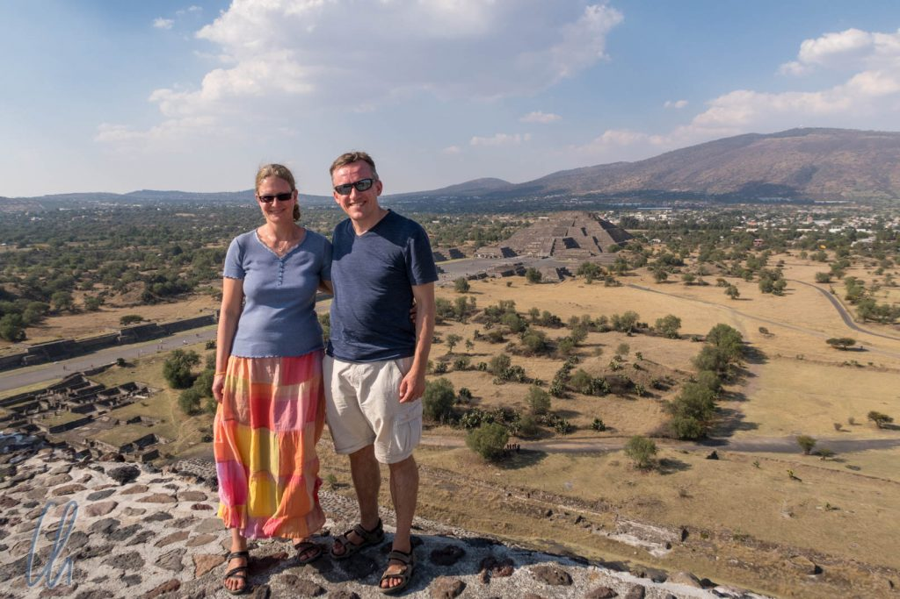
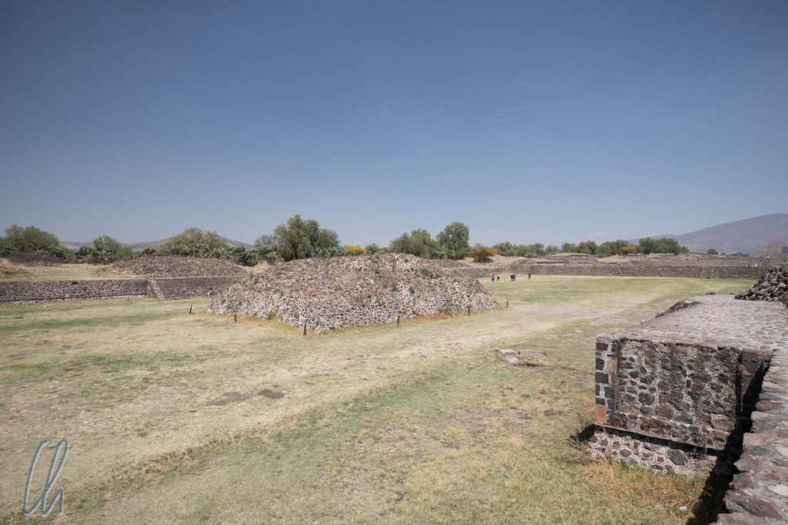
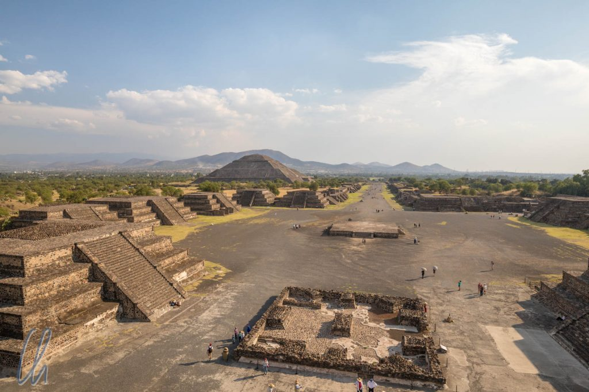
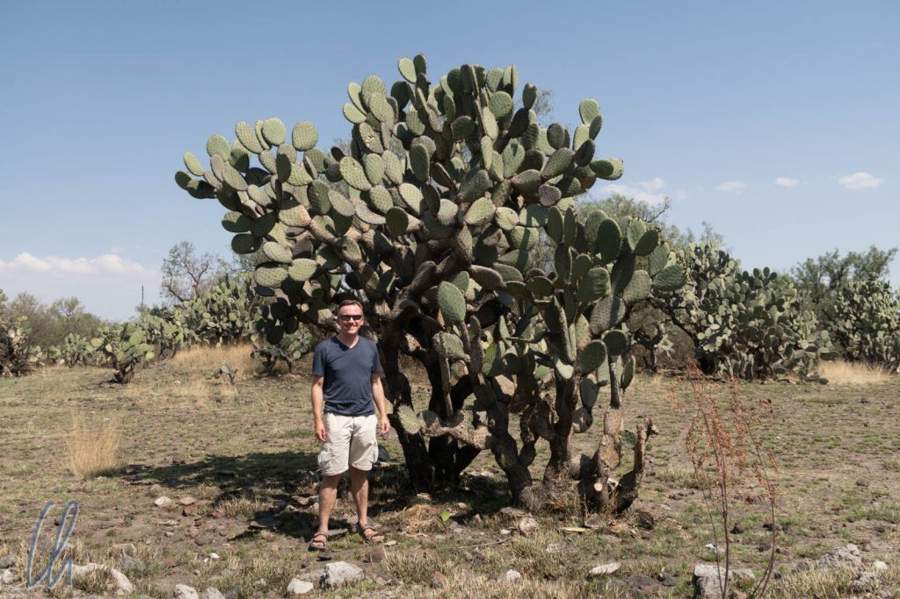
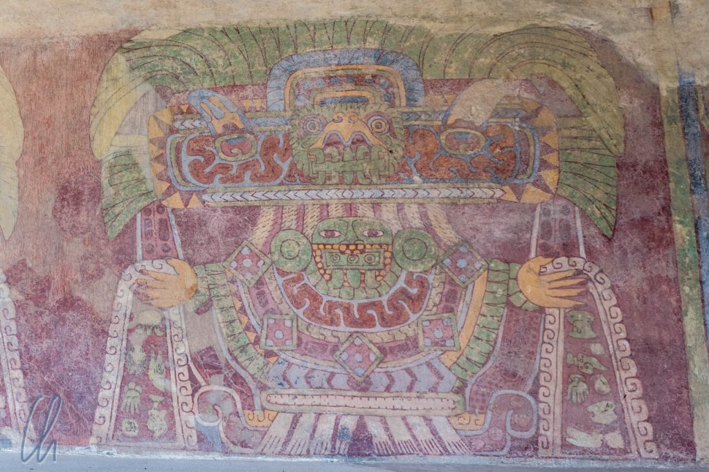
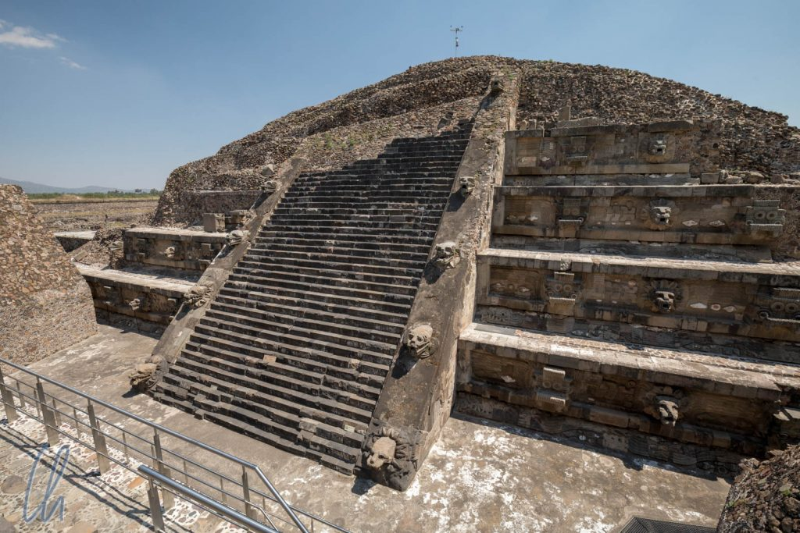

Die bekanntesten präkolumbianischen Kulturen sind die Maya (auf der Yucatan Halbinsel) und die Azteken mit Tenochtitlan als Hauptstadt (heute Mexiko City). Das Wissen, dass es in der Geschichte Mittelamerikas noch weitere hochentwickelte Völker gegeben hat, ist nicht so verbreitet. Eine der ältesten Hochkulturen ist das Volk von Teotihuacán, dessen historische Hauptstadt direkt vor den Toren von Mexiko City liegt. Seine Blütezeit erlebte es von 100 bis 650 n. Chr. und es legte wichtige Grundsteine für andere mesoamerikanischen Kulturen. Einige danach folgenden Völker sahen sich als legitime und geistige Nachfahren von Teotihuacán. Sie übernahmen Errungenschaften aus einigen Bereichen wie z.B. Handwerk, Architektur und auch religiöse Anschauungen.

<!--more-->

## Unterwegs in Teotihuacán

Teotihuacán ist relativ einfach mit dem Bus von Mexico City aus zu erreichen. Mit einmal umsteigen am Terminal Norte dauerte die Anfahrt ungefähr 2 Stunden. Da die Busse auch abends nach Schließung der historischen Stätte noch zurückfahren, hatten wir genug Zeit, das mehrere Quadratkilometer große Gelände zu erkunden - und die Zeit brauchten wir auch. In brütender Hitze liefen wir gut 14 Kilometer an diesem Tag.

Unterwegs auf der Calzada de los Muertos („Straße der Toten“), der Hauptstraße von Teotihuacán, hörten wir oft Jaguare fauchen. Die wilden Katzen schlichen aber nicht zwischen den Ruinen umher, sondern es waren Souvenirverkäufer, die die Geräusche verursachten, und ihre Waren anpriesen: Eben jenen Jaguar-Imitator, auch Jaguarfiguren und andere mehr oder weniger kitschige pesudo-historische Staubfänger. Die Händler waren jedoch erfreulich unaufdringlich, womöglich auch wegen der Hitze. Für zukünftige Touristen hoffen wir, dass dies so bleibt, und dass die Verkäufer nie ein Praktikum in Marrakesch machen werden ;)

Der Name Calzada de los Muertos entstand aus der Annahme der Azteken, bei den Gebäuden an der Straße handele es sich um Mausoleen hochstehender Persönlichkeiten. Bei Ausgrabungen stellte man jedoch fest, dass die Bauwerke keine Grabstätten waren, sondern vermutlich eher Wohnpaläste von wichtigen Würdenträgern und Priestern.

Beim Besteigen der Pyramiden spürten wir zum ersten Mal die mexikanische Höhenluft: Teotihuacán liegt wie Mexiko City auf gut 2300 Metern - kein Wunder dass die mexikanische Fußball-Nationalmannschaft bei Heimspielen meistens gewinnt ;). Beim Erklimmen der steilen und hohen Stufen stieg unsere Pulsfrequenz schnell an. Umso wichtiger war es, zwischendurch ausgiebig Fotos zu machen und den Reiseführer zum besseren Verständnis der historischen Hintergründe zu konsultieren ;). Von oben boten sich eindrucksvolle Ausblicke über die historische Anlage.

Außerhalb des archäologischen Hauptgebietes besuchten wir auch die Ruinen palastähnlicher Wohnhäuser, die teilweise noch gut erhaltene Wandbemalungen mit lebhaften Motiven und leuchtenden Farben aufwiesen.

## Wer waren die Bewohner Teotihuacáns?

Die [Geschichte](https://de.wikipedia.org/wiki/Teotihuac%C3%A1n) von Teotihuacán lässt sich stark vereinfacht ungefähr so zusammenfassen: Ab 600 v. Chr. scheint es an diesem Ort eine Siedlung gegeben zu haben. In den kommenden Jahrhunderten weitete sich die Macht von Teotihuacán weiter aus. Die Blütezeit Teotihuacáns begann ab 100 n. Chr.

In der Stadt lebten bis zu 150.000 Menschen. Es muss also eine stark arbeitsteilige Gesellschaft gewesen sein und die Bevölkerung war auf Lebensmittelimporte angewiesen. Ihr Wohlstand lag unter anderem in den Rohstoffen der Region begründet. In der Nähe gab es zum Beispiel seltene Vorkommen von [Obsidian](https://de.wikipedia.org/wiki/Obsidian), das damals als harter Grundstoff für Werkzeuge sehr begehrt war. Die Teotihuacaner hatten damit ein Quasi-Monopol in Mittelamerika und in vielen Werkstätten in der Stadt wurden aus dem glänzenden Stein z.B. Messer und Nadeln für den Handel hergestellt. Die durch den Fernhandel aufgebauten Beziehungen zu anderen Völkern führten zu dem großen Einfluss der Stadt in weiten Teilen Mittelamerikas.

Ab 650 n. Chr. ging es dann bergab und die Stadt wurde um das Jahr 750 verlassen und teilweise zerstört. Was genau die Ursache war, ist heute schwer zu sagen. Es gibt aber bestimmt nicht nur einen Faktor. Verschiedene Theorien machen Krieg, Feuer, Dürre, Spannungen innerhalb der Bevölkerung oder Abhängigkeit von Nahrungsmittelimporten als mögliche Ursachen für den Niedergang von Teotihuacán verantwortlich.

## Das Erbe von Teotihuacán

Die Azteken fanden Teotihuacán Jahrhunderte später (ca. 1325) als Ruinenstadt vor und gaben ihr den Namen, den wir heute kennen, und der soviel bedeutet wie "Wo man zu einem Gott wird". (Schriftliche Überlieferungen gibt es nicht, erst die Maya hatten eine vollständige Schrift.) Die Azteken sahen Teotihuacán als den Ort an, an dem die fünfte Sonne erschaffen wurde und die Götter sie durch Opferung ihres Blutes in Bewegung setzten. Die Stadt lag in Ruinen, aber viele Elemente der Kultur lebten weiter.

Einige der Gottheiten Mesoamerikas haben ihren Ursprung in Teotihuacán. So wurde zum Beispiel [Quetzalcoatl](https://de.wikipedia.org/wiki/Quetzalcoatl), die gefiederte Schlange, zuerst von den Bewohnern Teotihuacans angebetet. Quetzalcoatl ist eine der zentralen Gottheiten in einigen mittelamerikanischen Kulturen. In Teotihuacán war es ein Naturgott, bei den Azteken wurde er als Gott des Windes, des Himmels, der Erde und als Schöpfergott betrachtet. Eine weitere Gottheit, der wir immer wieder begegneten, war [Tlaloc](https://de.wikipedia.org/wiki/Tlaloc), der Regengott und Gott der Fruchtbarkeit.

## Eine Stadt mit gewaltigen Ausmaßen

Die gewaltigen Ausmaße von Teotihuacán beeindrucken bereits ohne Betrachtung der geschichtlichen Hintergründe. Die Sonnenpyramide zum Beispiel hat eine ähnlich große Grundfläche wie die [Cheops-Pyramide](https://de.wikipedia.org/wiki/Cheops-Pyramide) in Ägypten. Noch eindrucksvoller wird das Bauwerk von 70 Metern Höhe, wenn man bedenkt, dass es, wie alle Gebäude der präkolumbianischen Zivilisationen, ohne die Verwendung von Arbeitstieren oder des Rades, also nur durch reine menschliche Kraft, gebaut wurde. In damaliger Zeit waren alle wichtigen Gebäude verputzt und in leuchtenden Farben bemalt und müssen den Menschen in früherer Zeit wie ein Wunder erschienen sein.

Bei den Ausgrabungen von Teotihuacán ab 1884 ging man damals etwas anders vor, als man dies heute tun würde. Die Archäologen rund um den damaligen mexikanischen Generalinspekteur der Monumente [Leopoldo Batres](https://en.wikipedia.org/wiki/Leopoldo_Batres) arbeiteten in Wildwest-Manier auch mit Dynamit, damit Ausgrabungen und Rekonstruktion der Monumente schneller vorwärts gingen. Auf der Suche nach tiefer liegenden Strukturen wurde mutig gesprengt. Anschließend baute man die Pyramiden wieder auf, ungefähr so, wie wir sie gesehen haben. Dabei wurden mögliche Funde für immer zerstört und der Wiederaufbau orientierte sich mehr an Batres Vorstellungen, als an wissenschaftlichen Erkenntnissen.

Trotz aller Bemühungen der Conquistadoren, die alten heidnischen Kulturen komplett auszurotten, weiß man heute doch erstaunlich viel über ihre historischen Hintergründe. Es war faszinierend, Teotihuacán, diese gewaltige Stadt eines längst untergegangenen Volkes, zu besuchen und sich die Organisation der Gesellschaft, ihre Religion und das Leben dort vorzustellen.
