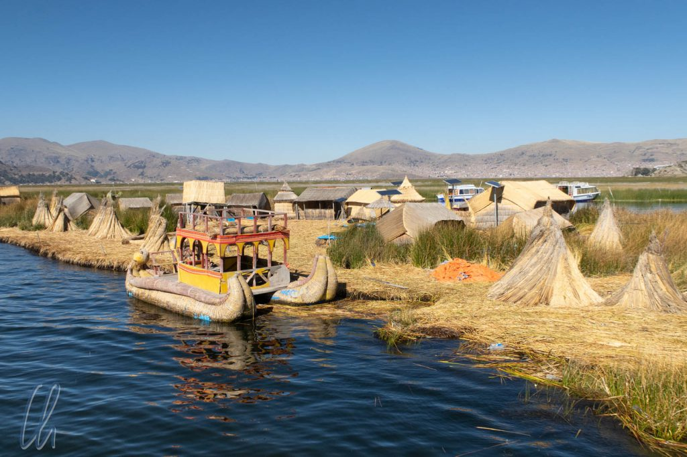

Der Titicacasee ist eine der großen Sehenswürdigkeiten sowohl von Peru als auch von Bolivien. Er liegt zu 59% in Peru und zu 41% in Bolivien. Neben der Landschaft ist die ursprüngliche Lebensweise der Menschen dort sehr interessant. Da wir im Reiseführer gelesen hatten, dass in Bolivien eine reine Touristen-Show aufgeführt wird, entschieden wir uns für eine zweitägige Tour inklusive Homestay auf der Insel Amantaní - in der Hoffnung auf einen authentischen Einblick in den Alltag der Menschen am See.

<!--more-->

## Die schwimmenden Inseln der Uros

Als erstes besuchten wir ein traditionelles Dorf auf schwimmenden Reet-Inseln. Das Volk der Uros war ursprünglich vor langer, langer Zeit vor den [Collas](https://en.wikipedia.org/wiki/Colla_Kingdom) und Inka auf den See geflohen und hat diese interessante Lebensform entwickelt. Dass es hier an Authentizität mangeln würde, erahnten wir schon auf der Fahrt. Nicht nur unser Boot (mit 12 Personen) stach in See, sondern auch viele andere. In Uros legte jedes Schiff an einer anderen schwimmenden Insel, bei einer anderen Gemeinschaft von wenigen Familien, an.

Schon der erste Schritt vom Boot auf die Insel war bemerkenswert, da der Boden etwas nachgab. Es fühlte sich so an, als würde man auf einem nicht zurückfedernden Trampolin laufen. Das Oberhaupt der Gemeinschaft hieß uns willkommen. Wir bekamen eine Einführung in die Bautechnik der Insel, die aus mehreren Lagen [Totora-Schilf](https://de.wikipedia.org/wiki/Totora-Schilf) besteht. Die Inseln müssen in regelmäßigen Abständen erneuert werden. Da das Material unten im Wasser verrottet, muss oben immer wieder nachgelegt werden. Damit sie nicht wegtreiben, sind die Inseln am Boden des Sees verankert. Auch Hütten und Boote werden aus dem Reet angefertigt. Ein Teil des Schilfes ist sogar eßbar und erinnert geschmacklich an Bambussprossen, allerdings nicht knackig, sondern weich.

## Kaufen statt kennenlernen

Das anschließende Kennenlernen der Familie beschränkte sich auf minimale Konversation, wobei die sprachliche Verständigung nicht das Problem war. Jede Antwort auf unsere Fragen endete mit der Aufforderung, doch mal die ausgelegten Souvenirs anzusehen und am besten gleich etwas zu erstehen. Bei jeder weiteren Frage spürten wir eine ansteigende innere Unruhe, warum wir redeten statt zu kaufen. Schade, da die Häuser und die Lebensweise der Menschen durchaus interessant waren. Immerhin durften wir einen Blick in eine der Hütten werfen, die ebenfalls zu einem großen Teil aus Totora bestand und nur einen Raum enthielt. Elektrischer Strom wurde mit Hilfe von Solarzellen erzeugt, die entfernt an Straßenlaternen erinnerten.

Abschließend müssen wir leider konstatieren, dass die Menschen, die wir besucht haben, zwar noch auf den schwimmenden Inseln leben, dass aber die traditionelle Lebensweise quasi verschwunden zu sein scheint. Bei 400 bis 500 Besuchern, die dort pro Tag abgefertigt werden, ist das kein Wunder, da sie vermutlich auch keine Zeit mehr zum Fischen o.ä. haben.

## Homestay auf Amantaní

Der Abschied auf Uros fiel uns damit nicht schwer und wir fuhren weiter zur Insel Amantaní, [unserem eigentlichen Ziel](https://de.wikipedia.org/wiki/Amantan%C3%AD), wo wir eine Nacht bei einer Familie verbringen würden. Amantaní liegt so weit von Puno (der größten Stadt am Titicacasee) entfernt, dass Ausflüge für Tagestouristen nicht möglich sind. Die einzige Besuchsform, die die Bewohner zulassen, ist der Homestay bei einer der Familien. Zusätzlich hat die Gemeinschaft auf Amantaní weitere Regeln, um ihre traditionelle Lebensweise zu bewahren. Autos sind auf der Insel verboten und die ersten Motorräder auf der Insel waren ein großes Politikum. Die jungen wollen sie, die älteren Menschen lehnen sie ab.

An der Anlegestelle wurden wir von unserer Gastgeberin Marleni und ihrer Tochter Crais (vielleicht ein spanisch transkribiertes Grace?) empfangen. Zusammen mit Desiree aus den Niederlanden und Jonas aus Belgien würden wir bis zum nächsten Morgen ein Teil ihrer Familie sein. Das Haus der Gastgeber lag gut 100 Meter oberhalb des Sees. Da wir unpraktischerweise unser gesamtes Gepäck dabei hatten, war es auf 4000 Metern über dem Meeresspiegel ein doppelt anstrengender Aufstieg. Daher konnten wir das gepflegte Dorf, die teilweise terrassierten Felder und den herrlichen Blick über den See zu diesem Zeitpunkt noch nicht gebührend würdigen. Stattdessen waren wir froh, als wir 20 Minuten später endlich am Haus ankamen. Dort lernten wir auch Marlenis Mann Willi kennen.

Unser Zimmer war sehr einfach eingerichtet mit zwei Betten und einem Stapel Decken gegen die nächtliche Kälte. Auch zur Ausstattung gehörte eine Gemeinschaftstoilette im Hof und eine Tonne voll - natürlich - kalten Wassers zum Waschen. Die Toilettenspülung funktionierte manuell mit Wasser aus einem anderen Behälter. Entgegen unseren Erwartungen gab es immerhin elektrisches Licht und auf der ganzen Insel Internetempfang. Der Fortschritt war auch auf Amantaní angekommen!

## Pfingstspaziergang

Nach dem Mittagessen, das Marleni für uns zubereitet hatte, machten wir mit der ganzen Gruppe einen Spaziergang über die Insel. Wir gingen entlang der Felder und an anderen gepflegten Häusern vorbei und trafen die anderen Reisenden von unserem Boot. In einer kleinen Demonstration lernten wir die landwirtschaftlichen Erzeugnisse der Insel kennen, unter anderem verschiedene Kartoffelsorten in den unterschiedlichsten Farben. Nach einer Einführung durften wir uns darin versuchen, auf traditionelle Art Maismehl zu mahlen, was vor allem eine Menge Geduld von uns verlangte.

Anschließend gingen wir bergauf, um ein lokales Fest zu besuchen, denn es war Pfingstsonntag. Pfingsten ist ein großes Fest auf Amantaní, es findet eine dreitägige Fiesta statt. Viele Menschen der Insel trafen sich oben am Berg, wo eine kleine Kapelle steht. Die Feiernden tranken und tanzten zu traditioneller Musik. Die Tänze erinnerten uns ein wenig an albanische Volkstänze: Die Menschen bildeten einen großen Kreis und bewegten sich alle gemeinsam zur Musik, zuweilen bildete sich auch eine Polonaise. Es gab Traditionen bei dem Fest, die wir nicht ganz verstanden. So sahen wir einen Mann mit schwarz bemaltem Gesicht und einem Plüschaffen auf den Schultern in der Menge. Unser Führer erklärte, dass dieser Verkleidete den Leuten Glück bringen solle. Die Fiesta war den Einheimischen vorbehalten, die Besucher durften aber gerne zusehen. Nach ungefähr einer halben Stunde setzten wir unsere Wanderung zum Pachatata-Gipfel, der zweithöchsten Erhebung der Insel, fort.

Pachamama ("Mutter Erde") ist der höchste Berg von Amantaní, Pachatata ("Vater Erde") der zweithöchste. Auf beiden Gipfeln befinden sich alte Ruinen aus der Zeit der [Tiwanaku](https://de.wikipedia.org/wiki/Tiahuanaco)-Kultur, die auch heute noch beim Inselfest als Heiligtum genutzt werden. Außenstehende dürfen die historischen Bauwerke nicht betreten. Oben auf dem Pachatata angekommen hatten wir einen wunderbaren Blick über die ganze Insel, den Titicacasee und die schneebedeckten Gipfel der Cordillera Real auf bolivianischer Seite bei Sonnenuntergang. Kaum war die Sonne verschwunden, wurde es schlagartig kalt.

## Fiesta Peruana

Zurück "zu Hause" blieb uns keine Zeit, uns auszuruhen. Crais spannte uns sofort ein, um mit ihr im Hof des Hauses Fußball zu spielen. Die Regeln legte sie immer wieder neu aus, so dass prinzipiell die beiden gegenüberliegenden Wände die Tore waren, aber auch nicht immer. Meistens zählten unsere Tore nicht ;) - aber es war ein großer Spaß :). Am Ende waren wir trotzdem alle Gewinner und Crais schenkte uns von ihrem Spielzeug, auf das wir es ihr wieder schenken konnten.

Nach dem Abendessen war es Zeit für die nächste Fiesta, diesmal eine Party für die Besucher. Für das echte einheimische Flair wurden wir traditionell eingekleidet. Mona bekam einen Rock und eine Bluse mit Gürtel geliehen. Ich wurde mit Poncho und Mütze zu einem echten Amantanianer gewandelt.

Auf der Fiesta gab es traditionelle Musik mit andinen Instrumenten, Gesang und Tanz. Im praxisnahen Unterricht guckten wir uns die Schritte ab und durften mittanzen. Insgesamt waren in etwa 40 Besucher (sprich Ausländer, die im Homestay auf Amantaní übernachteten) gekommen. Natürlich war es ein reines Touristenspektakel, aber auf eine sehr nette Art und Weise, wie der gesamte Aufenthalt auf Amantaní.

Nachts gab es natürlich keine Heizung, dafür viele schwere Wolldecken und eine sehr harte Matratze. Trotzdem war die Nacht erstaunlich angenehm und wir haben nicht gefroren.

## Authentisch oder inszeniert?

Am nächsten Morgen war nach dem Frühstück die Zeit für den Abschied gekommen. Der Aufenthalt bei Marleni und Willi hat uns sehr gut gefallen, auch wenn es natürlich inszeniert war und sich unsere Gastgeber eher im Hintergrund hielten. Sie bewirteten uns, zogen sich leider zum Beispiel bei den Mahlzeiten zurück und ließen uns vier Gäste unter sich essen, obwohl wir alle mehr oder weniger gut spanisch sprachen.

Trotzdem war der Aufenthalt authentisch genug, um einen kleinen Einblick in das alltägliche Leben unserer Gastgeber zu bekommen. Das lag bestimmt auch daran, dass sie nur gelegentlich Ausländer beherbergen. Auf Amantaní gibt es ein Rotationsprinzip für die Verteilung der Reisenden: Jede Familie nimmt zehn Touristen auf, danach ist ein anderer Haushalt dran. 97% aller Familien auf Amantaní nehmen an dem Homestay-Programm teil. So kann es bis zu drei Monaten dauern, bis eine Gastgeberfamilie wieder an der Reihe ist.

## Rückfahrt mit Halt auf Taquile

Auf der Rückfahrt nach Puno hielten wir bei der Insel Taquile an, die auch die Insel der strickenden Männer genannt wird. So steht es im Reiseführer und so pries es auch unser menschlicher Guide an. Leider sahen wir bei unserem Besuch keinen einzigen strickenden Mann, noch nicht einmal in einem der beiden großen Wollwarengeschäfte auf der Insel, die gleichzeitig die beiden wichtigsten Sehenswürdigkeiten waren. Mehrere Touristengruppen wurden von ihrem Führer dorthin getrieben. So erinnerte uns der Besuch auf Taquile ein wenig an eine Kaffeefahrt.

Dafür war die Landschaft sehr hübsch. Wir machten einen schönen Spaziergang und genossen den wunderbaren Ausblick über den Titicacasee und über die Insel. Der Himmel und das Wasser des Sees waren bei strahlendem Sonnenschein tiefblau. Wegen der Höhe (ca. 4000m) herrschte aber trotzdem kein T-Shirt-Wetter. Die Temperaturen lagen bei 12 bis 14 Grad Celsius. Bevor wir wieder an Bord des Bootes gingen, bekamen wir ein leckeres Mittagessen serviert: eine Titicaca-Forelle, die wir mit Blick auf das Wasser verspeisten.

## Hat es sich gelohnt?

Zusammenfassend waren wir sehr froh, dass wir auf Amantaní bei der Familie übernachtet haben, da alles andere etwas enttäuschend war. In Uros wurde eine Touristenshow abgespult und Taquile war zwar landschaftlich schön, erinnerte jedoch ein wenig an eine Kaffeefahrt. Auch wenn es zwei schöne Tage waren, so vermissten wir teilweise die Authentizität.

Themen wie Umweltschutz oder die Ökologie des Sees wurden während der zwei Tage komplett ausgeblendet. Nur auf Nachfrage gab es eine sehr geschönte Version. Die Wasserqualität in der Nähe der Hafenstadt Puno sei nicht so gut, sonst aber exzellent. Verschmutzung durch die Abwässer von Minen (i.S.v. Bergbau), wodurch Schwermetalle in den See geleitet werden, erwähnte unser Führer Elvis zum Beispiel mit keinem Wort.

## Der bedrohte Titicacasee

Leider trügt der Anschein vom reinen blauen Wasser des unberührten Gebirgssees. Der Zustand des Titicacasees ist besorgniserregend. 2012 wurde er vom Global Nature Fund zum [bedrohten See des Jahres](https://de.m.wikipedia.org/wiki/Bedrohter_See_des_Jahres) ernannt. Ungeklärte Abwässer v.a. der Großstadt Puno und zahlreicher illegaler Minen führen zu kritischer Verschmutzung des Sees. Noch dazu sinkt der Wasserstand zunehmend durch Abnahme der Dauer der Regenzeit und Rückgang der Andengletscher. Genaue Zahlen gibt es nicht, aber wenn man zum Thema "Wasserqualität Titikakasee" bei Google sucht, kommen Artikel zutage wie "[Dem Titicacasee droht der Tod](https://www.welt.de/wissenschaft/umwelt/article141113086/Dem-Titicacasee-droht-der-Tod.html)" oder "[Lake Titicaca: One of the world's most beautiful sights now polluted with rubbish and toxic chemicals](https://www.independent.co.uk/environment/lake-titicaca-pollution-video-rubbish-toxic-chemicals-litter-peru-bolivia-rubbish-trash-a7607826.html)". Es gibt seit Jahren [viele gute Absichten](http://www.mining.com/peruvian-president-advocates-sustainable-mining/), die Wasserqualität zu verbessern, aber greifbare Taten sind daraus anscheinend noch nicht hervorgegangen.

Sowohl der immer intensivere Tourismus, der die Schwelle der Nachhaltigkeit schon deutlich überschritten hat und die Umweltverschmutzung könnten den Menschen am See mittel- und langfristig vermutlich sehr schaden. Der Tourismus ist eine der wichtigsten Einnahmequellen, die versiegen könnte, wenn die Besucher kein authentisches Erlebnis haben. Der See an sich ist die noch wichtigere Lebensgrundlage der Menschen. Sie trinken sein schwermetallbelastetes Wasser und essen die Fische, die im verschmutzten Gewässer leben. Beides stimmt uns leider für die Zukunft eher nachdenklich…
