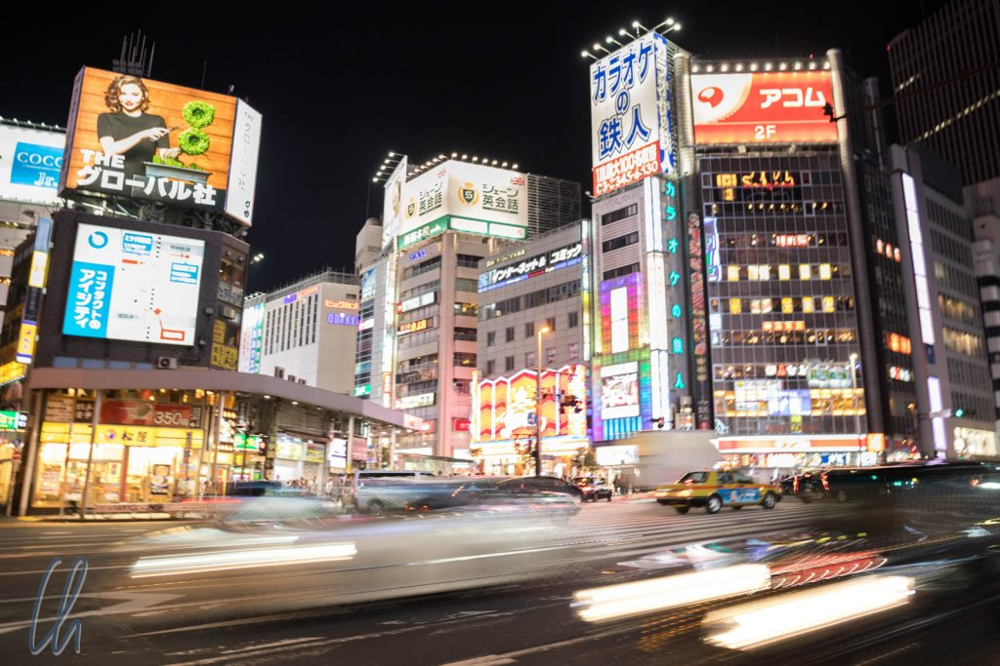
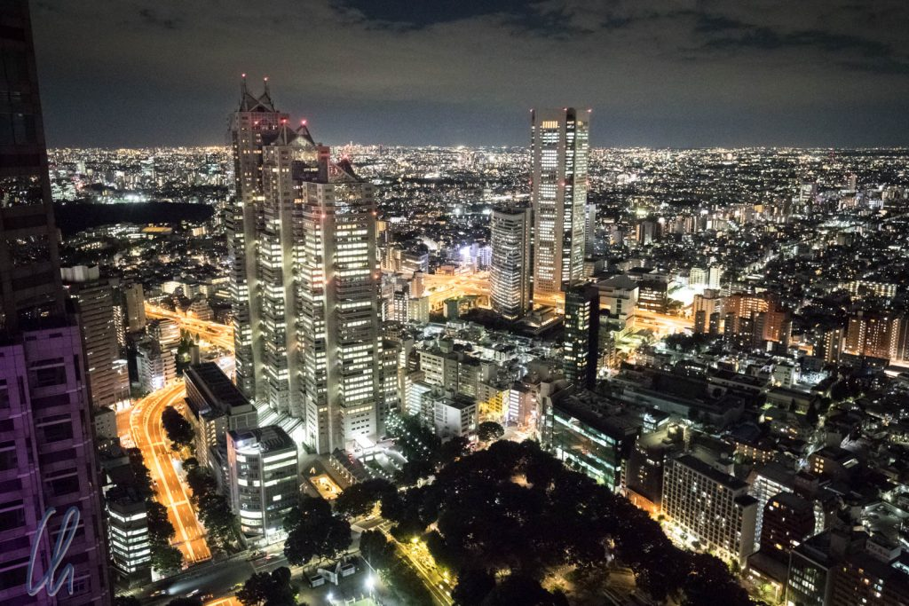
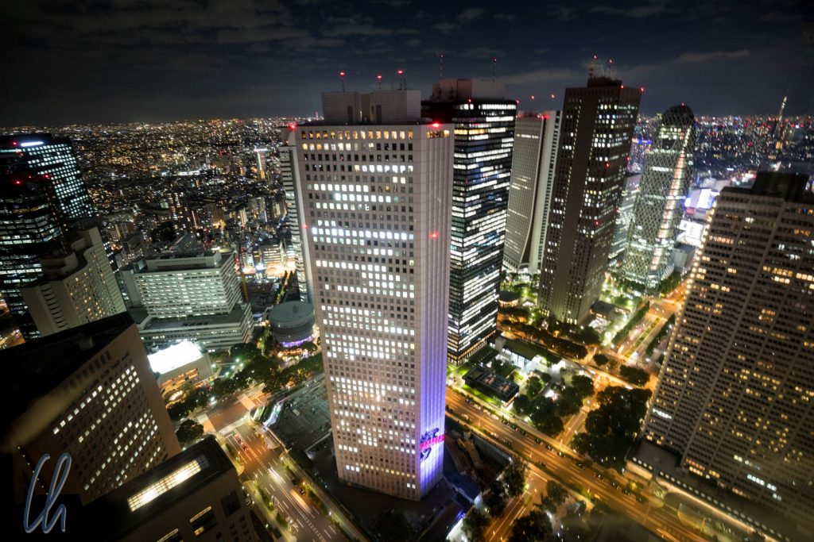
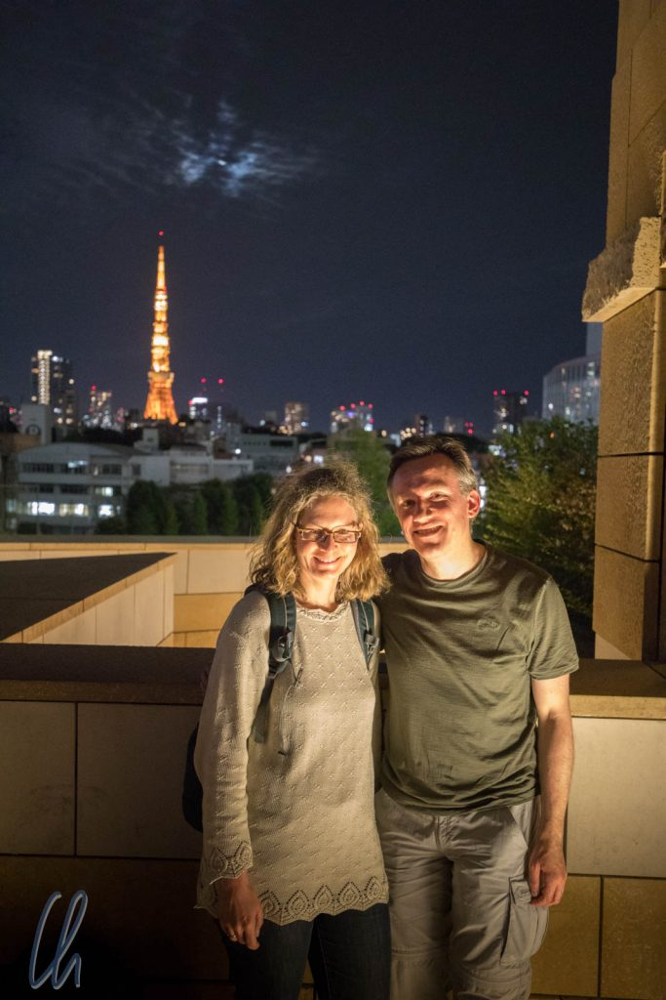
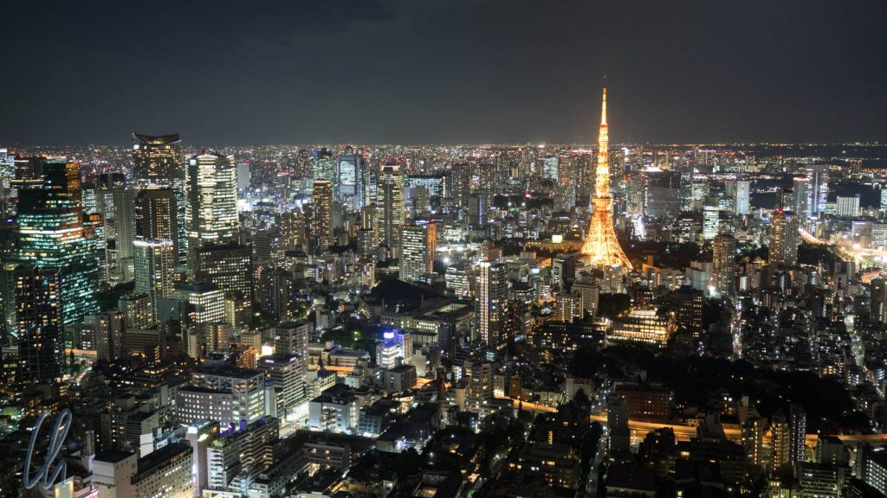

# Tokyo, ein Lichtermeer

Im Land der Aufgehenden Sonne wird es in der Tat früh hell: Sonnenaufgang ist hier morgens zurzeit ca. 5:45. Eine Sommerzeit gibt es nicht, und so formuliere ich die gewagte These, dass der Grund darin liegt, die Lichter der Stadt besser zur Geltung kommen zu lassen ;). Tokyo sieht tagsüber schon beeindruckend aus, abends aber erstrahlt die Stadt in aller Pracht. Es entsteht ein Lichtermeer aus Leuchtreklame, statisch oder als riesige Leinwände, der normalen Straßenbeleuchtung, den Autos… Zusammen erhellen sie die Straßenschluchten. Sicher gibt es einige Hotspots in Shinjuku, Shibuya ([Shibuya Crossing](https://www.youtube.com/watch?v=xIUmzEP4Q6I)) oder Akiharaba, aber Lichter gibt es überall.

<!--more-->

## Tokyo von oben

Tokyo ist die größte Metropolregion der Welt, 38 Millionen Menschen leben hier. Dass Tokyo groß ist, merkt man sofort, wenn man angekommen ist. Um aber ein Gefühl dafür zu bekommen, wie groß Tokyo wirklich ist, ist ein Perspektivwechsel nötig: Von oben und am besten in der Dämmerung oder nachts.

Wir waren auf dem [Metropolitan Government Building](https://de.wikipedia.org/wiki/Tokyo_Metropolitan_Government_Building) und auf dem [Roppongi Mori Hills Tower](https://de.wikipedia.org/wiki/Roppongi_Hills_Mori_Tower). Beide Male katapultierte uns ein Lift ohne Zwischenstopp ins 50 plus x-te Stockwerk, und den Weg nach oben spürt man in den Ohren.

Oben angekommen ist der Blick aus der Vogelperspektive atemberaubend: Auf 360 Grad ist kein Ende des Häusermeeres in Sicht, Lichter bis zum Horizont. Interessanterweise bilden aus dieser Perspektive die Straßen, nicht die Bahnlinien, die Schlagadern der Stadt:

Markante Gebäude ragen natürlich hervor. Einzigartig und nicht zu übersehen ist der [Tokyo Tower](https://de.wikipedia.org/wiki/Tokyo_Tower):

## Tokyo Bay

Eine andere Perspektive ergibt sich, wenn man die Skyline mit etwas Abstand betrachtet. Ken hatte die tolle Idee, nach [Odaiba](https://de.wikipedia.org/wiki/Odaiba) zu fahren, einer Insel aus gewonnenem Land in der Tokyo Bay. Der Weg dorthin führt über die sog. [Rainbow Bridge](<https://de.wikipedia.org/wiki/Rainbow_Bridge_(Tokio)>), die wir in der Dämmerung überquerten. Sie ist ein weiteres Wahrzeichen von Tokyo und vor der Skyline sehr schön anzuschauen. Zudem fahren viele farbenfroh beleuchtete Restaurant-Boote in die Bucht, um dort zu ankern und den Gästen neben gutem Essen auch einen attraktiven Ausblick zu bieten. Für uns sind die Boote weitere bunte Flecken im Panorama und eine schöne optische Zugabe.

Und dann folgt noch eine Überraschung. In Tokyo gibt es eine Freiheitsstatue!

