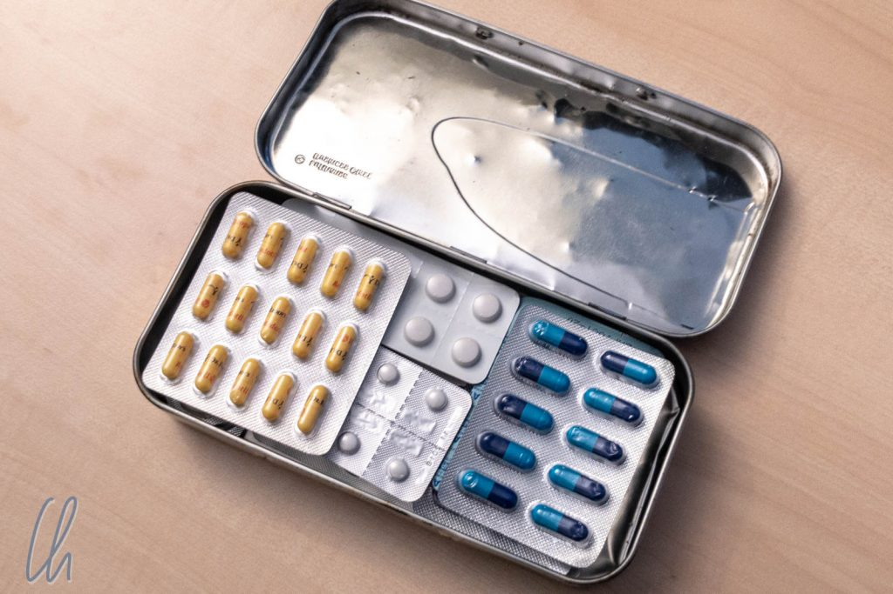
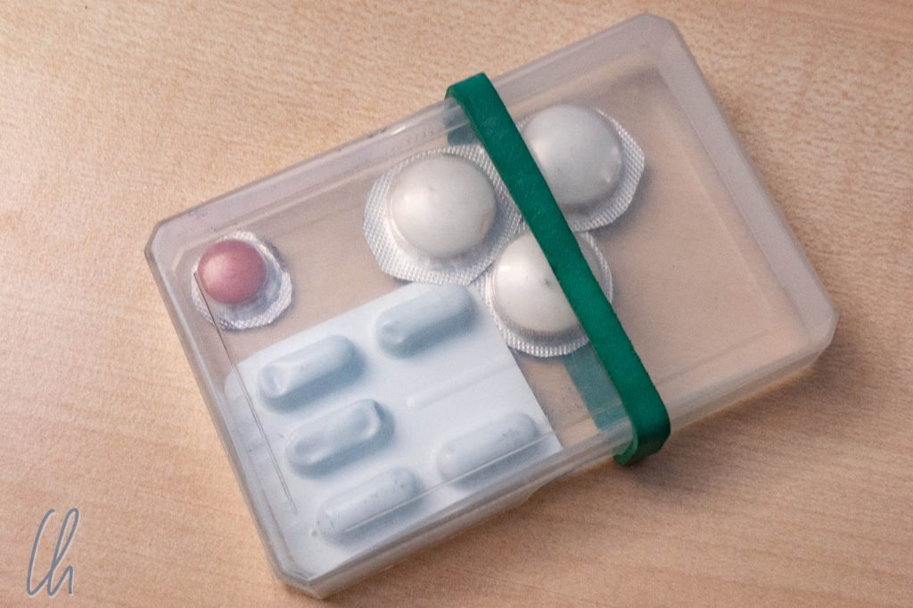
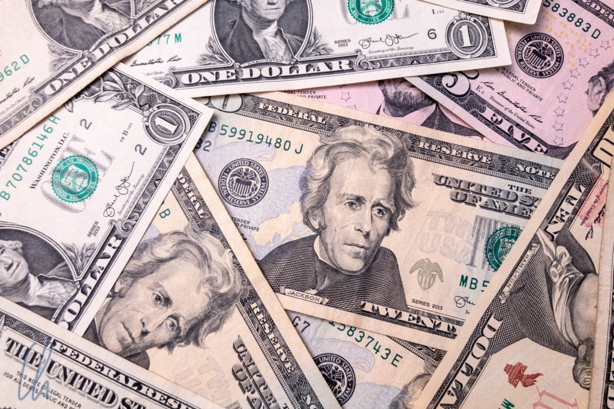

# Travel Hacks - Alles in die Dose

Wittmann Tours ist ein etwas anderes Reiseblog. Wir sind absolut Non-Profit und damit gibt es bei uns Reisetipps, zu Neudeutsch [Travel Hacks](https://de.wikipedia.org/wiki/Lifehack), die ihr nirgendwo sonst finden werdet. Im Laufe der 14 Monate haben wir vieles gelernt, auch, wie man so eine Reise organisiert. Die folgenden Low-Tech Reisetipps könnt ihr problemlos umsetzen. Alles, was ihr braucht ist jeweils eine Dose.

<!--more-->

## Reiseapotheke in der Dose

Als Augenärztin und Apotheker-Sohn ist unsere Reiseapotheke etwas umfangreicher als Aspirin und ein paar Pflaster. Die Erfahrung lehrt zwar, dass man die wenigsten Medikamente wirklich gebraucht werden. Aber für den Fall der Fälle waren wir von Schürfwunden bis Malaria-Prophylaxe für 3 Monate, von Aspirin bis Xusal gut ausgerüstet! Hier soll es allerdings nicht darum gehen, was in der Reiseapotheke gehört, sondern um die Frage: "Wie nimmt man all das Zeug mit?"

Das erste Problem sind (v.a. bei Tabletten) das Volumen. Diese sind in Blistern verpackt, haben einen Beipackzettel und eine Packung. Neben der eigentlichen Medizin hat man also 85% Luft dabei. Und lässt man die Umverpackungen zuhause, so werden die Tabletten gerne unfreiwillig aus den Blistern gedrückt, wenn Druck auf sie ausgeübt wird. Damit werden sie (mittel- und langfristig) unbrauchbar. Die Lösung dafür ist eine stabile Dose.

## Vier konkrete Tipps für die Reiseapotheke

Nach vielen Reisen und einigen Experimenten hier die ultimativen Tipps zur Volumen-Verkleinerung der Reiseapotheke:

1. 1. 1. Umverpackungen zuhause lassen
   2. Alle Blister in einer Dose transportieren, damit diese nicht gequetscht werden. Mit ein Bisschen Puzzeln bekommt man erstaunlich viel unter.
   3. Um noch mehr Platz zu sparen, Blister zerschneiden, überstehende Ränder kurzen ohne dabei die Fächer der Tabletten anzuschneiden. Im Laufe der Zeit leere Tablettenfächer ebenfalls abschneiden.
   4. Beipackzettel als PDF runterladen und digital mitnehmen. Dabei unbedingt darauf achten, dass die Beipackzettel auch offline verfügbar sind und nicht nur in der Cloud (nach Murphy gibt's im Notfall kein Internet)

Mit diesen einfachen Tipps wird die Reiseapotheke zum Platzwunder! Das gleiche funktioniert auch im ganz kleinen. Eine Schachtel für ein Kartenspiel eignet sich bestens, um darin ein paar Malaria-Tabletten, etwas gegen Reiseübelkeit oder Durchfall immer im Tagesrucksack dabei zu haben

## Bargeld sicher dabei haben

Gesundheit ist unbezahlbar, aber ohne Geld funktioniert keine Weltreise. Und das liebe Geld hat uns unterwegs das eine oder andere Mal auch auf vor Herausforderungen gestellt, Umtauschen, funktionstüchtige Geldautomaten suchen etc. Außerdem lernten wir unterwegs abschätzen zu könne, wieviel Bargeld wir pro Tag brauchten, um nicht unnötig viel dabeizuhaben. Der Rest blieb vermeintlich sicher im Hotel. In 90% unserer Unterkünfte hatten wir keinen Safe und einen Rucksack kann man nicht abschließen.

Leider passierte es uns auch einmal, dass uns Geld aus dem Rucksack geklaut wurde, das war in [Myanmar](http://wittmann-tours.de/category/asien/myanmar/), noch fast am Anfang unserer Reise. Wir machten dafür zwei Faktoren verantwortlich: Unsere Dummheit (der Rucksack war zwar geschlossen, aber das Portemonnaie lag oben auf) und die gute Gelegenheit. Von da an waren unsere Geldbeutel immer in alten Plastiktüten verpackt. Mit Erfolg: In den folgenden 12 Monaten wurde uns kein Geld mehr aus dem Rucksack geklaut.

## Geld für den Notfall - die Spardose

Diese Episode war allerdings eher ein Vorspann zum eigentlichen Travel Hack, die Absicherung des Worst Case. Was passiert, wenn das Gepäck verloren geht, wenn Grenzbeamte auf einmal kleine Geschenke fordern, wenn absolut keine Geldautomaten funktionieren, wenn man pleite ist und vermeintlich nichts mehr geht? Für solche Fälle hatten wir immer Bargeldreserven in US-Dollar dabei, die wir nie einplanten und nur im absoluten Notfall benutzen würden. Aber wohin damit?

Im Rucksack verstecken? Ja, irgendwie. Aber bestimmt nicht in den gleichen Geldbeutel stecken, wie das Geld für den täglichen Gebrauch. Und selbst wenn jemand den Rucksack mit viel Zeit auseinandernimmt, sollte er/sie Probleme haben, den Notgroschen zu finden. Außerdem dürfen die Scheine nicht leiden. In vielen Ländern werden Dollar zwar akzeptiert, (zum vollen Kurs) aber nur, wenn sie makellos sind: Keine Flecke, keine Risse, keine Eselsohren. Ein Problem der Unmöglichkeit? Unser Vorschlag: Eine Dose.

Jeder von uns beiden hatte 150 Dollar in kleinen Scheinen (max. 20 Dollar-Scheine) als Geheimvorrat dabei, unauffällig in einer Dose für Brausetabletten aufgerollt dabei. Diese Dose konnte wir gut und unauffällig im Rucksack verstaut. Nur auf Flügen oder auf ausgewählten Busfahrten haben wir die Döschen in unser Handgepäck genommen. Am Ende haben wir den Notvorrat zum Glück nicht gebraucht!
