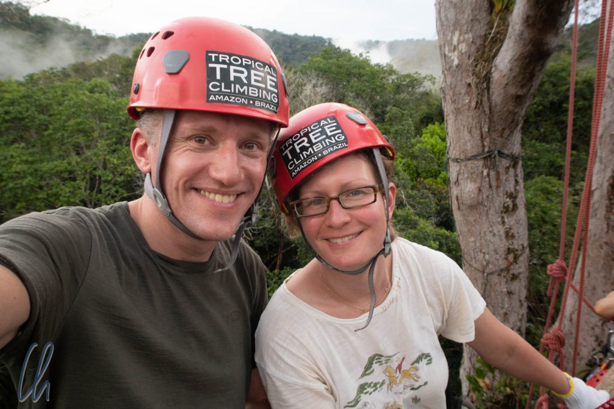
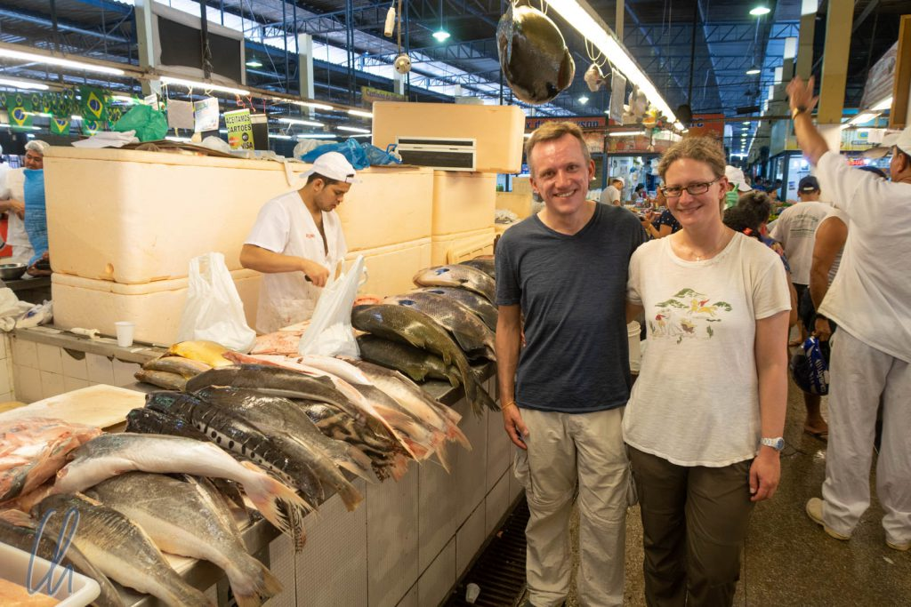

Wer ist als Kind nicht leidenschaftlich im heimischen Garten in den Bäumen herumgeklettert? Wir wollten nun einen der Urwaldriesen im Dschungel besteigen, um den Regenwald aus einer anderen Perspektive kennenzulernen. Dieser Plan war der Anlass, Vanessa und Leo in der Wildnis zu besuchen und einige Nächte in ihrem [Homestay](https://www.amazonemotions.com/) zu verbringen. Neben der Kletterei lernten wir außerdem noch viel Spannendes über den Dschungel, seine Bewohner und über mögliche Strategien, den Wald zu nutzen, zu schützen und zu regenerieren.

<!--more-->

## Fangfrische Amazonas-Fische

Bei manchen Ausflügen ist schon die Anreise Teil des Abenteuers, so auch diesmal. Bevor wir von Manaus in den Regenwald aufbrachen, besuchten wir zusammen mit Salgahino (unserem Fahrer) den Fischmarkt, um für die kommenden Tage einzukaufen. Da Salgahino nur Portugiesich sprach, war die Kommunikation etwas eingeschränkt und so folgten wir ihm einfach in die Gebäude, in denen die Lebensmittel verkauft wurden. Der Reiseführer beschrieb die historische Markthalle, architektonisch interessanter, aber der lebendige Markt für die Einheimischen ist nebenan. Hier bearbeiten die Verkäufer die Fische, dass die Schuppen in alle Richtungen fliegen.

Die Ausmaße des Fischmarktes konnten es auf keinen Fall mit [Tsukiji](http://wittmann-tours.de/japan-kulinarisch-sushi-sashimi-und-tsukiji/) in Tokio aufnehmen, die Größe der Fische aber auf alle Fälle. Im Amazonas schwimmen riesige Exemplare: Es gab zum Beispiel den [Surubim](https://de.wikipedia.org/wiki/Surubim)- und den [Pintado](https://de.wikipedia.org/wiki/Pseudoplatystoma)-Wels mit einem gestreiften oder gefleckten Muster und einer Länge von 1-2 Metern. Der [Tambaquí](https://de.wikipedia.org/wiki/Schwarzer_Pacu) ist mit einem Meter und ca. 40 Kilo ebenfalls kein Goldfisch. Von dieser Sorte kaufte Salgahino zwei ganze Fische, die später im Ganzen gegrillt wurden.

Vom [Pirarucú](https://en.wikipedia.org/wiki/Arapaima_gigas) erstand er riesige Filetstücke. Der ganze Fisch (besser das Amazonasungeheuer?) kann bis zu 4,5 Metern lang werden. Außerdem kauften wir noch einige Exemplare eines anderen kleineren Fisches ([Jaraqui](http://amazonwaters.org/fish/jaraquis/)) mit hübsch gelb-schwarz gestreiften Flossen. Diese waren vielleicht 25 Zentimeter lang und der Verkäufer ritzte kunstvoll und in höchstem Tempo beide Seiten des Fisches mit zahlreichen Schnitten ein, damit die Gräten beim Essen nicht stören sollten, was sie dann auch nicht taten. Unsere Einkäufe luden wir zusammen mit mehreren Säcken Eiswürfeln in die Dachbox des Autos und machten uns auf den Weg nach Norden. Gut 150 Kilometer Fahrt lagen vor uns.

## Angekommen bei Vanessa und Leo

Die kaum befahrene, aber sehr gute Straße durch den Regenwald war im Wesentlichen gerade und flach mit nur wenigen Hügeln oder Senken. Wir fuhren durch den Dschungel und am Rande der Straße, wo das grüne Dickicht der Straße weichen musste, sahen wir die rötliche, eigentlich unfruchtbare Erde, die trotzdem das Fundament dieses unendlichen Waldes ist. Das Tempolimit lag bei 90 km/h, dies wurde sogar mit Hilfe mehrerer Starenkästen (oder sind das in Brasilien Papageienkästen?) "kontrolliert". Salgahino kannte sie natürlich alle ;). So erreichten wir das Anwesen von Vanessa und Leo am frühen Nachmittag.

Die beiden hatten vor ca. 17 Jahren einige Hektar Dschungel gekauft, um dort ihr Haus zu bauen, den Regenwald auf ihrem Grundstück aber ansonsten zu schützen. Sie legten einen Garten für Gemüse und Obst an, der ihrem Eigenbedarf dient. Die Idee, Tropical Tree Climbing anzubieten, entstand allerdings erst später. Leo war (und ist) professioneller Fotograf (obwohl dies heutzutage nicht mehr sein Hauptberuf ist), der unter anderem Orchideen in den Kronen der Bäume fotografierte. Hierfür erlernte er das Klettern interessanterweise beim brasilianischen Militär. Jahre später entstand daraus ein Angebot für Besucher wie uns.

## Zuhause im Regenwald

Das Unterkunftsgebäude steht auf einem kleinen Hügel im Regenwald. Von einer großen Terrasse blickt man über die Bäume und die offene Küche scheint sich mitten im Dschungel zu befinden. Da kann es durchaus mal sein, daß ein Stabinsekt an der Spüle sitzt oder ein großer Käfer beim Essen im Gemüse landet. Jeden Tag bereitete Vanessa zusammen mit ihren Kindern aus den frischen Zutaten, die im wunderbaren Garten wachsen, gesunde und abwechslungsreiche Gerichte zu. Die frisch in Manaus erworbenen Amazonas-Fische komplettierten den Speiseplan :). Wir genossen auch die Outdoor-Dusche, die nach oben hin offen war. So schien uns tagsüber die Sonne auf den Scheitel und abends konnte man sich im Schein der Mondes und der Sterne waschen.

Mittlerweile ist das Besteigen der Bäume nur eine Aktivität von vielen, die das Paar anbietet. Besonders gut hat uns der Familenanschluss gefallen. So nahmen wir die Mahlzeiten zusammen mit Vanessas Mutter, Vanessa, Leo, ihren drei Kindern und den anderen Gästen an einem langen Tisch in der nach draußen offenen Küche ein, unterhielten uns oder spielten Karten. Sie alle genießen es, ihre Erfahrungen mit den Besuchern zu teilen. Was bedeutet es, im Regenwald zu leben, und wie kann man ihn nachhaltig nutzen, gleichzeitig aber schützen und sogar regenerieren? Das hört sich zu gut an, um wahr zu sein? Dachten wir auch, aber im Kern nutzen sie die Erfahrung der Ureinwohner und gleichzeitig fundierte wissenschaftliche Erkenntnisse.

## Terra Preta - Schwarze Erde

Schon in der Schule haben wir gelernt, dass [Brandrodung](https://de.wikipedia.org/wiki/Brandrodung) ("Slash & Burn") im Regenwald nicht nachhaltig ist. Die Bäume werden gefällt und die Biomasse abgebrannt, damit die Asche den Boden düngt. Im Anschluss kann das Stück Land für einige Monate oder bestenfalls wenige Jahre landwirtschaftlich genutzt werden (z.B. für den Anbau von Maniok). Danach ist die Erde ausgelaugt, denn es kommen keine Nährstoffe nach und die heftigen Regenfälle waschen die fruchtbaren Bestandteile des Bodens weg. Wenn der Anbau sich nicht mehr lohnt, müssen die Menschen weiterziehen und anderswo den Dschungel roden. So wird (vereinfacht dargestellt) mehr und mehr Regenwald systematisch zerstört. Ein wesentliches Problem ist, dass die regelmäßig auftretenden sintflutartigen Regenfälle die Nährstoffe auswaschen, da diese nicht in der wenig fruchtbaren Erde gebunden werden können.

Um dem entgegenzuwirken, stellt Leo [Terra Preta](https://de.wikipedia.org/wiki/Terra_preta) (Schwarze Erde) her. Dieses Konzept, mit dessen Hilfe fruchtbarer Boden geschaffen werden kann, wurde vor etwa 4000 Jahren von den indigenen Völkern im Dschungel entwickelt. Terra Preta besitzt, wir zitieren [Wikipedia](https://de.wikipedia.org/wiki/Terra_preta#Eigenschaften), "hervorragende Voraussetzungen für intensive und nachhaltige Landwirtschaft in den feuchten Tropen". Was ist diese geheimnisvolle Schwarze Erde und warum wird diese Strategie nicht flächendeckend genutzt?

Die Herstellung ist ein längerer Prozess. Vereinfacht gesagt besteht Terra Preta aus einer Mischung von Kompost mit Holzkohle und [Pflanzenkohle](https://de.wikipedia.org/wiki/Pflanzenkohle). Diese Zusammensetzung kann hohe Nährstoffmengen binden, so dass diese nicht ausgewaschen werden. Ein wesentlicher Nachteil ist, dass man für die Modifizierung der Erde viel Zeit braucht. Leo berichtete, er habe ausgelaugten Boden (ein Stück seines Landes, das landwirtschaftlich genutzt worden war, bevor er es gekauft hatte) mit Terra Preta angereichert. Er schätzte, dass es ca. 10 Jahre gedauert habe, bis die Erde eine wirklich gute Basis hatte - aber es hat funktioniert!

## Ein moderner Garten Eden

Leo betreibt beim Bewirtschaften seiner Anbauflächen keine Monokultur. Auf den ersten Blick kann man gar kein System erkennen. Seine Philosophie ist es, einen natürlichen Garten zu schaffen, der die Menschen ernährt, ohne den Wald zu zerstören. So steht Maniok neben einem Papaya-Baum, neben Bananen, neben Maracuja und ganz vielen anderen Früchten und Gemüsen. Leo erntet, lässt jedoch immer auch einen Teil zurück, damit die Pflanzen weiter wachsen können. Außerdem sind die Tiere seine Gärtner. Sie bekommen (oder besser nehmen sich) einen Teil von der Ernte, säen aber auch Samen aus.

So pflanzen die [Agutis](https://de.wikipedia.org/wiki/Agutis) (kleine Nagetiere) [Brazil Nut](https://de.wikipedia.org/wiki/Paranussbaum)-Bäume (Paranuß), allein schon dadurch, dass sie die einzigen Tiere sind, die die massive Schale dieser Nüsse öffnen können. Sie legen wie unsere europäischen Eichhörnchen Vorräte an, indem sie die Nüsse vergraben, jedoch nicht alle wiederfinden. Leo vertraut darauf, dass wild ausgesäte Pflanzen, die sich im Gewirr des Dschungels durchsetzen können, bessere Erträge liefern, da sie an einem geeigneten Ort stehen. Bis zur Ernte muss man sich allerdings lange gedulden, ungefähr 20 Jahre. Danach kann der Baum aber für Hunderte von Jahren wertvolle Nahrung spenden - wenn man die Nüsse öffnen kann. Dazu braucht man Kraft, die richtige Technik und eine stabile Machete. Wir probierten ebenfalls unser Glück beim Aufhacken der dicken Hülle, scheiterten aber kläglich.

Wir fanden Leos und Vanessas Arbeit und die Ergebnisse faszinierend. Hier war der lebende Beweis, dass der Dschungel problemlos landwirtschaftlich nachhaltig genutzt werden kann. Ein Konzept, das für viele Kleinbauern funktionieren würde, aber in dieser Form sicher seine Grenzen hat, wenn es darum geht, kontrolliert große Erträge für die Versorgung ganzer Städte systematisch anzubauen. Aber warum sollte es nicht auch eine extensivere Form der Nutzung von Terra Preta geben?

## Den Regenwald mit allen Sinnen genießen

Wir schweifen vom eigentlichen Thema ab? Könnte man so sagen, schließlich haben wir noch keinen Baum bestiegen. Touché! Das Klettern war aber letztlich nur einer der Wege, um den Dschungel zu erleben. Die meiste Zeit verbrachten wir damit, Leos Garten zu besichtigen, die Landwirtschaft im Regenwald kennenzulernen oder Leo bei seinem neuesten Projekt zu begleiten, der [Beobachtung von Jaguaren](https://www.amazonemotions.com/wildlife-conservation/) und anderen Tieren des Waldes.

Hierfür hatte er professionelle [Kamerafallen](https://de.wikipedia.org/wiki/Kamerafalle) in seinem Waldgebiet installiert, die er regelmäßig kontrollierte, um die gewonnenen Daten zu sammeln. Wir begleiteten ihn also auf einer Wanderung durch den Wald. Dabei sahen wir - zum Glück ;) - keinen Jaguar, aber dafür einige Tierspuren und vor allem interessante Pflanzen, zum Beispiel eine Liane, die große Mengen trinkbares Frischwasser speichert.

## Tropical Tree Climbing

Und natürlich kletterten wir dann auch auf einen Urwaldriesen. Wir bestiegen die "Prinzessin", wie Vanessa und Leo den Baum liebevoll nannten, einen Angelim Tree. Das Klettern funktionierte etwas anders als in unserer Kindheit im Deutschen Wald. Wir kletterten nicht am Stamm des Baumes hoch. Stattdessen nutzen wir Seile, an denen wir uns mit einer ausgeklügelten Technik selbst in die Höhe hievten.

Wir saßen in einem Klettergeschirr, welches am Seil aufgehängt war. Über ein System aus einem Knoten, einem Metallschieber und einer Schlaufe für einen Fuß hoben wir uns über einen Flaschenzug selbstständig in die Höhe. Hierzu mussten wir immer wieder das Seil verkürzen und uns mit dem eigenen Körpergewicht in die nun höher hängende Schlaufe stellen. Das Ganze war durchaus anstrengend, auch wegen der hohen Luftfeuchtigkeit, und wir schafften die 30 Meter gemütlich in einer halben Stunde.

Oben angekommen änderte Leo die Sicherung und wir standen auf einem der immer noch baumstammdicken Äste, um von dort in aller Ruhe den Regenwald beobachten zu können. Die "Prinzessin" überragte die anderen Bäume, so dass wir einen schönen Blick auf das grüne Dach des Regenwaldes und die umgebenden Hügel genießen konnten.

## Der Regenwald von oben

Die Aussicht war atemberaubend. Die "Prinzessin" hatte gerade ihre Blätter abgeworfen, damit hatten wir freie Sicht. In den Tropen gibt es keine Jahreszeiten wie wir sie kennen. Trotzdem haben die Bäume Ruhephasen, um sich zu regenerieren und neu auszutreiben. Zwei Wochen später würde die "Prinzessin" blühen. Oben auf dem Baum waren wir allerdings nicht allein: Kapuziner-Affen turnten zum Beispiel durch die Nachbarbäume. Kolibris, Spechte, Tukane und viele andere Vögel landeten direkt in den Ästen der "Prinzessin", nur wenige Meter von uns entfernt.

Allmählich setzte die Dämmerung ein. Je dunkler es wurde, desto mehr Zikaden fingen an zu zirpen. Der Wald begann, sich zu verändern und in den Nachtmodus zu wechseln. Leider kündigte sich Regen an, so dass wir etwas früher als geplant abstiegen. Verglichen mit dem Aufstieg war der Abstieg sehr bequem. Wir mussten nur von oben auf den Knoten drücken und es ging abwärts, je mehr wir drückten, desto schneller. Ließen wir los, stoppte der Abstieg.

Kurz bevor wir auf dem Rückweg wieder das Haus erreicht hatten, hörten wir ein immer lauter werdendes Rauschen, das schließlich zu einem Dröhnen anschwoll. Es war ein heftiger tropischer Regenguss, der uns eben noch erwischte, bevor wir uns unter das schützende Dach flüchten konnten. Zur Stärkung nach der anstrengenden Baumbesteigung wartete schon ein Amazonasfestmahl mit frischem Gemüse aus dem eigenen Garten und über dem offenen Feuer gegrillten Fisch auf uns.

Wir waren gekommen, um den Dschungel kennenzulernen. Dass wir den Regenwald und sein Ökosystem in derart vielen Facetten erleben würden, hätten wir nicht erwartet.
