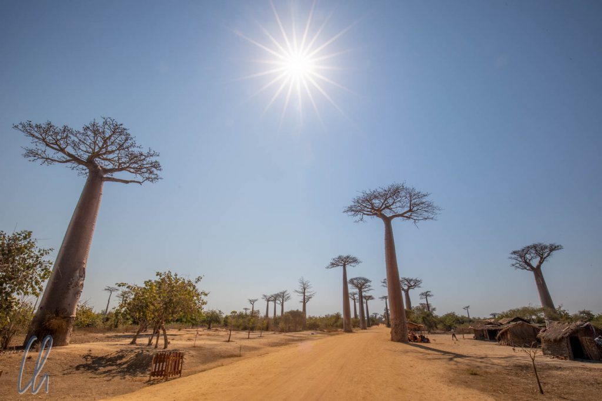

# Über die Baobab-Allee nach Norden

Was kommt einem in den Sinn, wenn man an Madagaskar denkt? Vielleicht Vanille oder Pfeffer, die Lemuren, ganz bestimmt aber die Baobab-Bäume, [Affenbrotbäume](https://de.wikipedia.org/wiki/Afrikanischer_Affenbrotbaum), wie sie auf Deutsch heißen. Sie wachsen in den Trockenwäldern im Süden und Westen der Insel. Die berühmtesten stehen an der sogenannten Baobab-Allee und in ihrer direkten Umgebung.

<!--more-->

## Auf der Baobab-Allee

Die Baobab-Allee liegt gut eine Stunde nördlich von Morondava entfernt. Die Allee selbst ist gut 300 Meter lang und von zahlreichen riesengroßen Baobabs gesäumt. Die Straße ist eher eine Piste, aber trotzdem handelt es sich offiziell um die Route Nationale Nummer 8. Wir waren nicht die einzigen Vazahas, die die imposanten Bäume bestaunten. Sie gehören zur Spezies [Adansonia grandidieri](https://de.wikipedia.org/wiki/Adansonia_grandidieri), die mit bis zu 30m höchsten Affenbrotbäume Madagaskars.

Dafür, dass die Baobab-Allee ein echter Besucher-Hotspot auf Madagaskar ist, ging es zur Mittagszeit erstaunlich ruhig zu. Es wurde kein Eintritt verlangt, wir mussten keinen obligatorischen lokalen Führer engagieren und es wurden nur wenige Versuche unternommen, uns Souvenirs zu verkaufen. Stattdessen gingen die Menschen ihren alltäglichen Tätigkeiten nach. Fahrradrikschas transportierten Holzkohle, Handwagen und Zebu-Karren passierten die Allee und viele Menschen gingen zu Fuß durch die heiße, staubige Mittagshitze.

Einige wenige Verkaufsstände gab es trotzdem, die unter anderem Baobab-Früchte anboten. An manchen Bäumen sahen wir eingeschnittene Trittstufen am Stamm, die zum Ernten des Obstes angelegt worden waren. Das muss ein schwindelerregendes Vergnügen sein! Die Früchte selbst sind kokosnussgroße, braune, feste Kugeln mit samtiger Außenhaut. In ihrem Inneren sind zahlreiche Samen in das weiße Fruchtfleisch eingebettet. Die Samen mit Fruchtfleisch konnte man lutschen wie Bonbons. Dabei isst man nur die Fruchtfleischreste, die Samen spuckten wir anschließend wie Kirschkerne aus.

Später probierten wir auch den angenehmen süß-säuerlichen Baobab-Saft, der etwas an Tamarindensaft erinnerte.

## Baobab-Mythen und Legenden

Der Baobab müsste eigentlich mit einem weiblichen Artikel versehen werden. Auf Malagasy heißt er Renala, die „Mutter des Waldes“. Um seine sehr charakteristische Silhouette ranken sich zahlreiche [Mythen](https://de.wikipedia.org/wiki/Afrikanischer_Affenbrotbaum#Mythologie_und_Literatur). Mehrere Legenden berichten über Vorkommnisse, die schließlich dazu führten, dass der Baobab aus dem Boden gerissen wurde und anschließend mit der Baumkrone nach unten wieder landete. In der Tat könnte man auf die Idee kommen, das Wurzelwerk des Affenbrotbaumes würde in den Himmel ragen. Die meiste Zeit des Jahres ist der Baobab kahl, wie wir ihn auch erlebten. In der kurzen Zeit, in der er blüht, schmückt sich der Baum hingegen mit riesigen, wunderschönen Blüten.

Spannenderweise soll der Baobab auch außerhalb seiner afrikanischen Heimat spirituelle Bedeutung haben. Angeblich glauben die Japaner, der Affenbrotbaum sei der heilige [Sakaki Baum](https://de.wikipedia.org/wiki/Sperrstrauch#Kulturelles_und_Nutzung), der im Shintoismus eine wichtige Rolle spielt. Wir sahen nur eine kleine Gruppe Japaner auf der Baobab-Allee (obwohl alle Schilder auch japanische Beschriftungen trugen) und im Internet fanden wir leider auch keine ausführlichere Erklärung dieses Zusammenhangs. Vielleicht nähren wir durch Zitieren auch nur eine Legende. Auf jeden Fall würden wir uns über informative Kommentare zu diesem interessanten Thema freuen.

## Zeitsprung: Die Baobab-Allee bei Sonnenuntergang

Einige Tage später, auf dem Rückweg vom Besuch der Tsingys, fuhren wir erneut über die Baobab-Allee. Diesmal kamen wir kurz vor Sonnenuntergang an. Das warme Abendlicht ist die beste Zeit, um die Affenbrotbäume zu sehen. In der Tat waren deutlich mehr Vazahas dort als bei unserem ersten Besuch. Trotzdem blieb der Trubel überschaubar, es waren vielleicht 12 bis 15 Fahrzeuge wie unseres vor Ort.

Die Abendsonne tauchte die Baobabs in ein wunderschönes warmes Licht. Kein Wunder, dass dieser Ort weltweit bekannt ist und umso erstaunlicher, dass die Besucherzahlen trotzdem noch nicht übermäßig hoch waren.

Schnell ging die Sonne unter und die Baobabs zeigten im Gegenlicht ihre bizarren Silhouetten. Ursprünglich waren die riesigen Bäume Teil eines sie umgebenden Trockenwaldes, dieser ist aber leider mittlerweile großflächig abgeholzt. Die Baobabs werden teils aus Respekt nicht gefällt, aber auf lange Sicht könnten sie trotzdem verkümmern, da ihnen die umgebende Vegetation fehlt. Um dem entgegenzuwirken und die Allee zu regenerieren, werden weitere Affenbrotbäume angepflanzt, die allerdings mindestens Jahrzehnte brauchen werden, um im Konzert der großen mitspielen zu können.

## Weitere Baobabs

Ursprünglich (vor dem Zeitsprung) waren wir aber auf dem Weg nach Norden gewesen. Unterwegs hielten wir bei einigen weiteren bekannten Bäumen an. Es gibt zwei bekannte Paare von sich umschlingenden Baobabs, die [Baobabs Amoureux](https://en.wikipedia.org/wiki/Avenue_of_the_Baobabs#Baobab_Amoureux), die verliebten Affenbrotbäume.

Eines der Baobab-Paare befand sich interessanterweise noch in einem Trockenwaldgebiet. Dort wartete auf einem benachbarten Baum eine Überraschung auf uns, ein Lemur, genauer gesagt ein [Sikafa.](https://de.wikipedia.org/wiki/Sifakas) Das schöne Tier war eine Waise und wurde von den Einheimischen regelmäßig gefüttert. Außerdem hatte sich ein Maus-Maki in einem Hohlraum des hölzernen Souvenirstandes häuslich eingerichtet. Angelockt durch ein bisschen Banane schaute er gelegentlich hervor, nur um sich rasch wieder zu verstecken.

Wie das Ökosystem rund um einen Affenbrotbaum eigentlich aussehen sollte, sahen wir auch beim sogenannten heiligen Baobab, wohl dem Baum mit dem größten Stammdurchmesser, den wir an diesem Tag sahen. Er stand nicht frei, sondern war von vielen anderen Bäumen umgeben. Der Baumriese war von einem Zaun abgetrennt und um seinen Stamm waren bunte Tücher geschlungen. Beim Betreten der Umfriedung zogen wir, wie es die Etikette verlangte, respektvoll unsere Schuhe aus.

## Gute Nacht Baobabs

Nach einer Nachtwanderung im Kirindy Nationalpark (mehr dazu im nächsten Blogpost), erreichten wir unsere Unterkunft nicht weit vom heiligen Baobab. Es war eine mondlose, dunkle Nacht und die Milchstraße schimmerte hell im Himmel über uns. Der Zugang zum heiligen Baum war abgesperrt, aber nur wenige Meter weiter standen einige weniger berühmte, aber trotzdem stattliche freistehende Exemplare am Rande eines Feldes. Es sah fast so aus, als reichten ihre Zweige hoch bis zu den leuchtenden Sternen.

