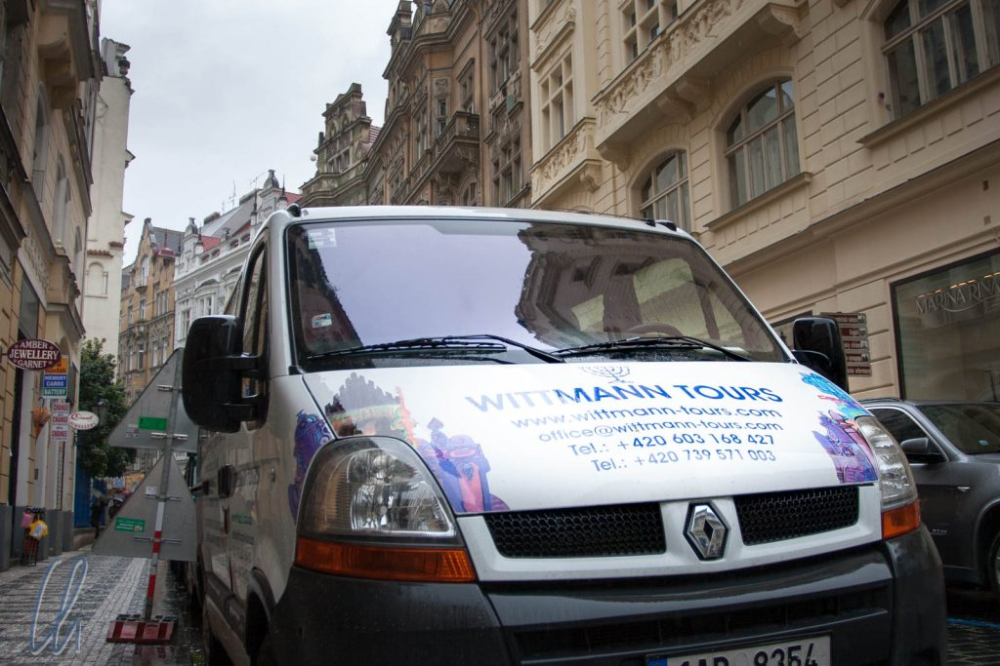

# Über Wittmann-Tours

Obwohl wir schon seit 2007 zusammen sind und zusammen reisen, ist die eigentliche Geburtsstunde von Wittmann-Tours der 21.07.2011. Wir verbrachten ein verlängertes Wochenende in Prag. Mona war (wie immer) bestens vorbereitet und hatte unser (umfangreiches) Programm ausgearbeitet. Leider war das Wetter "nicht optimal", es regnete in Strömen. Wir starteten trotzdem unsere Besichtigungstour. Auf dem Weg zu unserer ersten Station, dem jüdische Friedhof, sahen wir dieses Fahrzeug:

In den kommenden Tagen haben wir sehr viel vom wunderschönen Prag gesehen, glücklicherweise auch bei guten Wetter, und fast alles zu Fuß. Das hatte jedoch zur Folge, dass v.a. meine (Christians) Füße schmerzten, und ich begann, über das Power-Besichtigungsprogramm "mit Wittmann Tours" zu scherzen, schließlich war ja Mona damals die Wittmann von uns beiden.

<!--more-->

## Aus Spaß wurde Ernst

Im Laufe der Jahre ist aus dem ambitionierten Besichtigungsprogramm von Wittmann-Tours ein geflügeltes Wort geworden, mit dem wir unsere selbst organisierten Reisen bezeichnen, quasi unser eigenes Reisebüro. Seit unserer [Hochzeit am 17.08.2013](http://chrwittm.blogspot.de/) hat Wittmann-Tours 2 Vollzeitkräfte, und seit unserem ersten Hochzeitstag (manchmal auch "Baumwollene Hochzeit" genannt) tragen wir zuweilen ein Wittmann Tours T-Shirt, auf dem unsere bisherigen Reisen zu sehen sind. Jeder Pin markiert ein Land, das wir schon gemeinsam bereist haben:

## Mit Wittmann-Tours auf Weltreise ab Oktober 2017

Da es noch so viele weiße (oder graue?) Flecken auf unserer Reiselandkarte gibt und wir beide in der glücklichen Lage sind, länger frei nehmen zu können, haben wir uns entschlossen, unseren Traum zu verwirklichen und ab Oktober 2017 für 14 Monate auf Weltreise zu gehen, und die Reise buchen wir natürlich bei Wittmann-Tours!

In unserem Wittmann-Tours Blog möchten wir über unsere Reisen und Erfahrungen berichten und mit Euch teilen: Erlebnisse, Abenteuer, fremde Kulturen, Kulinarisches oder auch nur ganz Alltägliches, was manchmal sogar das spannendste am Reisen sein kann.

Die Vorbereitungen laufen auf Hochtouren, und wir können es kaum erwarten, dass es am 2. Oktober losgeht. Wir freuen uns drauf!
