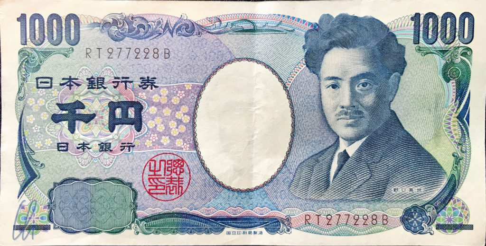

# Überlegungen zum Thema Trinkgeld, ein Kommentar mit Tips

Das Geben von Trinkgeld außerhalb des eigenen Heimatlandes, wo man mit den lokalen Sitten und Konventionen vertraut ist, stellt ein verzwicktes Kapitel dar. Nach meinem Verständnis besteht der Sinn einer zusätzlichen finanziellen Zuwendung darin, guten Service zu belohnen. Auf Reisen aber wandelt sich dieses Konzept leider allzu oft - vor allem in Afrika - von einer freiwilligen Dreingabe zu einer Notwendigkeit für das Personal. Die Bezahlung der Servicekräfte wird einfach auf die Gäste abgewälzt. Wieviel angemessen ist, stellt den Besucher dabei oft vor ein großes Rätsel. Wir wollen diesen Artikel dazu nutzen, unsere Erfahrungen mit Euch zu teilen.

<!--more-->

## Jeder Angestellte verdient ein faires und angemessenes Gehalt

In Japan herrscht eine eindeutige Einstellung zum Thema Trinkgeld. Es wird als überflüssig und sogar unhöflich empfunden. Versucht man in Japan, einem Kellner eine Aufmerksamkeit am Tisch im Restaurant zurückzulassen, sollte man nicht verwundert sein, wenn er nach dem Fund des Geldes versucht, es zurückzugeben. Er nimmt dann nämlich an, der Gast hätte es dort vergessen. Auch in den USA gab es vor mehr als hundert Jahren eine [Zeit ohne Trinkgelder](https://de.wikipedia.org/wiki/Trinkgeld#Vereinigte_Staaten). Die Bediensteten lehnten Tips ab, um ihren (gesicherten) Lohn nicht zu gefährden.

Auch in Deutschland ist es manchmal schwer nachvollziehbar, warum im Zusammenhang mit bestimmten Dienstleistungen Trinkgeld überreicht wird und bei anderen nicht. Man stelle sich vor, ein(e) Kassierer(in) im Supermarkt würde eine kleine Spende erwarten. Eigenartig, nicht wahr? Dem Schaffner im Zug ein Trinkgeld geben? Absurd wenn man eine Fahrkarte bei ihm kauft, ganz normal, wenn er ein Getränk serviert. Seltsam, oder?

Nun hat sich aber für manche Berufe auf dieser Welt das Geben von Trinkgeld eingebürgert und leider ist dabei auch manches ethisch fragwürdige Einkommensmodell entstanden. Im "Land der unbegrenzten Möglichkeiten" müssen Grundgehalt und Trinkgeld zusammen den [Mindestlohn](https://www.dol.gov/general/topic/wages/wagestips) erreichen. Das hat zur Folge, dass einige Kellner gar kein oder nur ein sehr geringes Grundgehalt bekommen und auf Tips angewiesen sind. Ein Restaurantbesitzer kann somit die Bezahlung des Bedienpersonals vollständig auf seine Kunden abwälzen. Das macht nicht den Eindruck eines verantwortungsvollen Arbeitgebers oder eines angemessenen Gehaltes.

## Trinkgeld auf Reisen

Da Trinkgeld ein heikles Thema ist, gibt es in jedem Reiseführer dazu ein paar Anhaltspunkte, die aber leider nicht immer hilfreich und manchmal aufgrund von Inflation veraltet sind. Von Land zu Land ist ein etwas anderer Prozentsatz vom Serviceumsatz angemessen (bzw. üblich), aber auch das sind nur sehr grobe Richtlinien. Beide Richtungen der Abweichung können problematisch sein. Zu geringe Zuwendungen ("Undertipping") können beleidigend wirken, zu hohe ("Overtipping") steigern die Erwartungen langfristig ins Unrealistische.

Nun war es kein Zufall, dass wir zu diesem Zeitpunkt unserer Weltreise in Afrika vermehrt Überlegungen zum Thema Trinkgeld anstellten, da es auf diesem Kontinent unserer Wahrnehmung nach auf die Spitze getrieben wurde. Selbst bei der Teilnahme an wirklich teuren Safaris kann es passieren (so auch auf unserer [Reitsafari](http://wittmann-tours.de/auf-reitsafari-in-der-masai-mara/)), das man diskret mit den Reiseunterlagen ein Blatt Papier als "Tipping Guide" ausgehändigt bekommt, auf dem die Erwartungen schon mal abgesteckt werden. Dabei werden stolze Beträge anempfohlen, die in Summe mehrere hundert Dollar ausmachen können. Dabei drängen sich natürlich mehrere Fragen auf: Warum können die Servicekräfte nicht durch den Arbeitgeber fair bezahlt werden? Und warum so viel? Die vermutete Antwort: Man zahlt als Gast das volle Gehalt des Personals und das ist eigentlich ein Unding.

Andere Auswüchse können sich darin äußern, dass bei einer Unternehmung unbestellt immer mehr Guides und Scouts oder weitere Hilfskräfte auftauchen/eingesetzt werden, die natürlich alle ein Trinkgeld erwarten. - Die gut erzogenen Touristen wissen ja, dass es sich gehört, eine finanzielle Anerkennung zu verteilen. Ein Beispiel wäre das [Simiengebirge](http://wittmann-tours.de/das-simien-gebirge-heimat-der-dschelada-affen-und-aethiopischen-steinboecke): Vor Ort mußten wir einen lokalen Führer (O.K.) und einen bewaffneten Scout nehmen. Letzterer war eine netter Begleiter, der pflichtgemäß sein Gewehr spazieren trug, aber wofür er genau zuständig war haben wir bis zum Ende nicht herausbekommen. Gefährliche Tiere lebten dort nicht, Zwischenfälle waren unbekannt. Stattdessen meinen wir verstanden zu haben, dass es Aufgabe der Scouts ist, den Park zu bewachen, damit niemand illegal Holz schlägt oder Tiere jagt. Da schlich sich bei uns der Verdacht ein, dass der Tourismus eine günstige Möglichkeit bietet, ein Zubrot zu erhalten, Trinkgeld sei Dank.

## Unangenehme Situationen beim Tipping

Unangenehm wird es, wenn sich z.B. ein Führer nach der Tour über das Trinkgeld beschwert und mehr fordert. Solch ein Verhalten kann das bis dahin positive Erlebnis unschön enden lassen. Manche Guides oder Helfer fragten schon während der Ausflüge nach Geld, um den Gast an seine "Verpflichtung" zu erinnern.

Um solchen Situationen vorzubeugen, hatten wir uns feste Regeln gesetzt, von denen wir nur selten abgewichen sind, auch nicht wenn ein Führer protestierte. So etwas passierte uns allerdings nur in Äthiopien. Die Leute dort, die regelmäßig mit Touristen zu tun haben, waren meisterliche Schauspieler, wenn es darum ging, das tief beleidigte, hart arbeitende Serviceperson zu mimen. Eine beliebte Masche war es, aus Protest das Trinkgeld wieder zurückzugeben. In diesem Fall sollte man es gerne wieder annehmen und nicht erstaunt sein, wenn es doch nicht so gemeint war. Verhandlungen über Bakschisch haben wir nie zugelassen, nicht zuletzt damit sich Guides dies nicht zur Gewohnheit machen.

## Das verpackte Trinkgeld

Um Diskussionen bei der Übergabe der finanziellen Aufmerksamkeit weitestgehend zu unterbinden, haben wir uns soweit möglich vorher überlegt, welcher Servicemitarbeiter wieviel Trinkgeld bekommen würde. Dies richtete sich nach der verrichteten Tätigkeit, der Zeit, die er mit uns verbracht hatte und natürlich nach seinem Engagement und seiner Kompetenz. Dabei gab es in jedem Land einen Standardtarif von uns, von dem wir nur in seltenen Ausnahmefällen abgewichen sind. Zusätzlich haben wir das Geld nach einigen schlechten Erfahrungen in Äthiopien nur noch in einem Behelfsumschlag verpackt übergeben. Ein kleiner Papierblock reichte, um die Scheine zu umwickeln und eventuell den Namen und/oder eine nette Botschaft darauf zu schreiben, z.B. „Thank you for guiding us“. Damit wurde die finanzielle Zuwendung zu einem freundlichen Geschenk mit Wertschätzung und nicht nur eine Pflichtübung. Und ganz nebenbei erschwerte diese Aktion es der Person, das hoffentlich angemessene Trinkgeld spontan nachzuzählen.

Die Strategie mit dem Umschlag funktionierte auch dann wunderbar, wenn unbestellte Helfer auftauchen. In diesem Fall haben wir nach dem Ende der Tour ein Gruppentrinkgeld an den eigentlich engagierten Führer übergeben. Dabei achteten wir darauf, dass die Geldübergabe zum von allen Beteiligten unübersehbaren Happening wurde, bei dem allen klar wurde, dass der (unsichtbare) Inhalt brüderlich geteilt werden sollte. So hatten wir den schwarzen Peter an den Guide weitergereicht.

Dieses Vorgehen ist unserer Meinung nach auch dann sinnvoll, wenn die ganze Crew gute Arbeit geleistet hat. Für den Reisenden ist es in vielen Ländern schwierig, genug Kleingeld zur Verfügung zu haben. Als Tourist bekommt man oft nur (zu) große Scheine aus dem Geldautomaten und die Locals können meistens deutlich einfacher wechseln.

## Tipping Tips für Guides

Aber auch umgekehrt hätten wir ein paar Tips für Guides, um ihr Trinkgeld eventuell aufzubessern. Umgekehrt sollte man als Tourist etwas subtilere Hinweise auch deuten bzw. versuchte Manipulation erkennen können. Dabei ist die Regel Nummer Eins natürlich, dass man eine sehr gute Leistung erbringen sollte, wenn man ein Bakschisch haben möchte. Wir hatten allerdings in manchen Fällen den Eindruck, dass bei einigen Mitgliedern des Servicepersonals die Erwartungshaltung herrschte, schon eine reine physische Anwesenheit qualifiziere zum Erhalt von Trinkgeld.

Ein möglicher Weg zu einem positiven Eindruck ist es unserer Meinung nach, den Kunden kennenzulernen und auch etwas von sich selbst zu erzählen. Entwickelt sich ein professionell-freundschaftliches Verhältnis, sind das beste Voraussetzungen, den Gast freigiebig zu stimmen. Hingegen wirkte es auf uns immer sehr unhöflich und plump, wenn direkt nach Geld gefragt wurde. Ein geschickteres Vorgehen wäre es, die eigene Leistung (subtil) hervorzuheben. So könnte ein Kofferträger z.B. sagen "Your suitcase is quite heavy!". Wenn dies der Wahrheit entspricht, dann könnte der Wink vielleicht verstanden werden und zu einer guten Gratifikation führen.

## Wie hoch sollte das Trinkgeld sein?

Wie hoch das Trinkgeld sein sollte, ist häufig schwierig zu entscheiden. Prozentuale Rechnungen sind unserer Meinung nach nur dann sinnvoll, wenn die soziale Schere im Land nicht zu groß ist, sonst landet man schnell im Bereich des Overtipping. Geht man zum Beispiel in Äthiopien in einem touristischen Lokal essen und erhält am Ende eine Rechnung von 300 Birr, dann würde ein Trinkgeld von 10% 30 Birr ausmachen. Wenn das einheimische Durchschnittseinkommen aber nur bei [45](https://de.wikipedia.org/wiki/Wirtschaft_%C3%84thiopiens)-[60](https://www.laenderdaten.info/durchschnittseinkommen.php) Birr pro Tag liegt ist, dann verdient ein Kellner bereits an einem Gast überdurchschnittlich viel. Ob das angemessen erscheint, sollte jeder für sich selbst entscheiden. Allein die Aussage, dass solch ein Betrag für uns sehr wenig Geld darstellt (unter einem Euro), greift vermutlich zu kurz.

Wir wollen jedoch nicht für niedrige Trinkgelder plädieren, sondern für angemessene. Eine gute Lösung ist es immer, wenn möglich Einheimische zu fragen, eventuell den eigenen Reiseleiter, und sich dann den lokalen Konventionen anzupassen. In Äthiopien hat uns Maru beraten und auf [Madagaskar](http://wittmann-tours.de/category/afrika/madagaskar/) hat Tahina das gesamte Pourboire für uns gemanaged. Dort haben wir die Idee einer zentralen Trinkgeldkasse zu schätzen gelernt, die der Reiseleiter eigenständig verwaltet. Er konnte am besten einschätzen, wieviel Trinkgeld jeweils angebracht war und wir gaben Tahina Rückmeldung, welchen Eindruck die einzelnen lokalen Führer bei uns hinterlassen hatten.

Gute Anhaltspunkte für die Ermittlung eines angemessenen Trinkgeldes sind unserer Meinung nach durchschnittliche Einkommen im entsprechenden Land, die man zum Vergleich heranziehen kann. In seltenen Fällen findet man auch Daten darüber, wieviel bestimmte Berufsgruppen in einem Staat verdienen. Vielleicht ist der Beruf eines Führers mit dem eines Lehrers vergleichbar? Auch wenn man pauschale Regeln hat (1-2 Euro pro Tag), sollte man diese ein wenig mit dem einheimischen Lohnniveau abgleichen, um einen fairen Kompromiss zwischen den Anschauungen vom Wert des Geldes im eigenen Herkunftsland und den lokalen Gegebenheiten zu finden.

## Service Charges und Tipping Boxes

Vermutlich als eine Spielart des Trinkgeldes könnte man die Service Charge betrachten. Dieses Konzept funktioniert so, dass ein fester Prozentsatz zur Entlohnung des Bedienpersonals auf die Rechnung geschlagen wird. In solchen Fällen haben wir nur bei außergewöhnlich aufmerksamen Kellnern ein kleines Trinkgeld gegeben. Leider ist bei der Service Charge nicht erkennbar, wie das Geld schließlich verteilt wird. Ist es nur eine 10%ige Preiserhöhung, die der Restaurantbesitzer einstreicht und gehen die Mitarbeiter am Ende sogar leer aus? Bekommen die Kellner und vielleicht auch die guten, für den Gast unsichtbaren Geister hinter den Kulissen ihren Anteil? Oder dokumentiert der Besitzer damit, wie er das Gehalt für die Servicekräfte kalkuliert? Man kann nur hoffen, dass das Trinkgeld auch wirklich in gerechtem Ausmaß bei denen ankommt, die es verdient hätten.

Auf unserer Reise standen häufig vor allem in der Lobby von Hotels Tipboxen. Grundsätzlich sind sie eine gute Erfindung, da sie dafür sorgen können, dass Trinkgelder gerecht verteilt werden, so dass auch diejenigen etwas bekommen, die im Hintergrund agieren. Auf der anderen Seite schaffen sie Intransparenz, kein Gast kann nachvollziehen, wie und ob eine faire Verteilung stattfindet. Auch schränkt das Konzept die Möglichkeit etwas ein, eine besonderes engagierte Person unter den Servicekräften individuell zu belohnen. Aber im Prinzip bietet eine Tipbox dem Reisenden die Möglichkeit, auf diskrete Weise den hilfsbereiten Mitarbeitern eine finanzielle Aufmerksamkeit zukommen zu lassen. Besonders in Äthiopien wussten wir dies nach den regelmäßigen unangenehmen Auseinandersetzungen zu schätzen.

## Trinkgeld ist doch selbstverständlich?

Wofür gibt es eine finanzielle Zuwendung, für eine gute, sehr gute oder egal für welche Leistung? In einigen Ländern scheint sich die Anschauung verbreitet zu haben, dass allein schon der Kontakt mit Touristen zu einer Geldforderung berechtigt. In Lalibela (Äthiopien) hatten wir eine Hose zum Flicken bei einem Schneider abgegeben. Am kommenden Tag klopfte es am Nachmittag an der Tür unseres Hotelzimmers, ein junger Mann brachte das reparierte Kleidungsstück zurück. Das Nähen hatte gerade einmal 100 Birr (ca. 2,50 Euro) gekostet und der folgende Dialog spielte sich ab:

"I am student, like tip." Ok, dachte ich, warum nicht, schön dass es so schnell ging. Als ich den Geldbeutel zückte, schob er schnell nach. "300 O.K.?". Etwas verdutzt aufgrund des ambitionierten Vorschlags erwiderte ich: "I do not think this is appropriate" und reichte ihm zunächst 100 Birr. Er staunte, vielleicht mehr als ich. Um zu ermessen, was sein Beitrag an der Reparatur der Hose war, fragte ich (wenig eloquent und im Nachhinein vielleicht missverständlich): "What did you do?". Daraufhin sagte er "It's up to you." und ging so zügig, dass ich ihm keinen aus meiner Sicht angemessenen Botenlohn geben konnte.

## Angemessene Trinkgelder

So kann das Thema Trinkgeld zu unangenehmen Erlebnissen führen. Nach unseren Erfahrung trifft man als Reisender desto mehr auf unrealistische Erwartungshaltungen, je touristischer die Orte sind, die man besucht. Daher ist es wichtig sich mit diesem komplexen und teilweise auch intransparenten Kapitel zu beschäftigen. Oft geht das Unwissen vermutlich, v.a. in wirklich armen Ländern, zugunsten von Führern und Servicekräften aus, da man sich als Europäer schwer vorstellen kann, dass für uns minimale Geldbeträge in anderen Ländern einen Wert besitzen. Manchmal hat man auch einfach nicht das passende Kleingeld zur Hand und gibt daher verhältnismäßig viel.

Ich möchte nicht hartherzig erscheinen, ich versuche lediglich, das oft sehr undurchsichtige und manchmal sogar emotionale Thema zu objektivieren. Es ist jedem freigestellt, mehr zu geben, als im Reiseland üblich, aber meiner Meinung nach verschärft es die Spirale auf mehrere Arten. Zum einen wächst damit das Einkommen im Tourismus überproportional, die Erwartungshaltungen verschieben sich und eventuell führt dies zur Kürzung vom Grundgehalt (weil die Trinkgelder ohnehin ausreichen). Außerdem können dadurch auch Jobs in der Tourismusbranche zu attraktiv werden. Wenn Lehrer oder Ärzte ihre Berufe aufgeben, um in Hotels oder als Fremdenführer zu arbeiten, dann wirkt sich das nachvollziehbar negativ auf den Entwicklungsstand eines Landes aus.

Eine weitere Frage, die man sich stellen könnte, betrifft die Währung des Trinkgelds. Die finanzielle Anerkennung in Landeswährung zu geben, ist auf keinen Fall verkehrt. Aber es sind auch Situationen denkbar, in denen Dollars oder Euro die bessere Option sind, v.a. wenn es sich um höhere Beträge handelt und die Einkünfte angespart werden sollen. In manchen Länder herrscht eine starke Inflation, d.h. Geld in Euro oder Dollar kann langfristig wertvoller und sicherer sein. Die Fremdwährung kann sogar eine Hürde darstellen, das Ersparte rasch wieder auszugeben. Sinn macht das Ganze natürlich nur in eintauschbaren Beträgen, sprich in Banknoten, also auf keinen Fall in Münzen.

## Postscriptum

Die Bilder dieses Beitrags zeigen die Vorderseiten der Geldscheine mit dem niedrigsten Wert einiger Länder, die wir bereist haben (und von Banknoten, die wir tatsächlich in die Hände bekommen haben). Es ist wirklich interessant, was die verschiedenen Nationen auf ihren Geldscheinen abbilden. Der Wert des kleinsten Scheins stellt allerdings auf keinen Fall einen Indikator dafür dar, was ein angemessenes Trinkgeld sein könnte ;).
