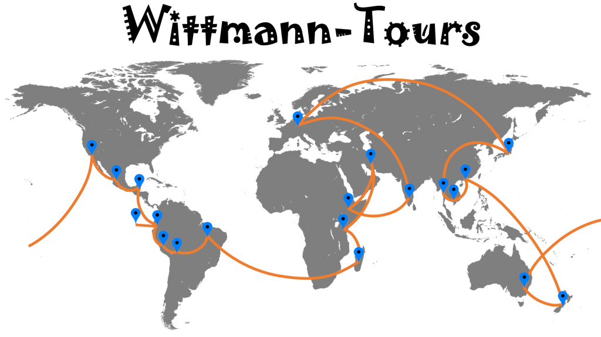

# Unsere Reiseroute

Wenn wir von unserer Weltreise erzählen, ist die erste Frage in der Regel „Wo geht’s denn hin?“. Auch wenn wir es selbst ganz genau noch gar nicht wissen, so haben wir doch eine ganz gute Idee, wie unsere Reiseroute aussehen soll. Wir haben eine Auswahl von Ländern getroffen, die wir bereisen wollen, und zu jedem Land kennen wir ungefähr den Zeitraum, wann wir dort sein wollen. Außerdem haben wir jeweils eine Idee, warum wir das Land ausgesucht haben. Das kann seine Kultur, spannende Sehenswürdigkeiten, beeindruckende Natur, oder, oder, oder sein. Pro Land haben wir ungefähr 4 Wochen geplant.

Die Reihenfolge haben wir anhand der Geographie, der Jahreszeiten (bzw. Regen- und Trockenzeit) und ein paar sonstigen Faktoren festgelegt. Eine große Hilfe war das [Reisezeiten-Tool](http://weltreise-info.de/route/reisezeiten.html?route=jp-s/512,burma/1024,cb/2048,hk/2048,nz-s/2048,au-s/1,us-sw/2,mx-n/2,bz-mx-y/4,ec-g/8,pe-c/16,bo-w/32,bo-e/32,br-n/64,br-s/64,mg/128,tz/256,in-so/3072,in-sw/2048) von Weltreise-Info.de. Aber genug der Vorrede, hier ist unsere aktuell geplante Reiseroute:

<!--more-->

## Asien

Wir beginnen unsere Weltreise in Japan, dem Land der aufgehenden Sonne, wegen der spannenden Kultur, der sehr freundlichen und extrem höflichen Japaner, des schmackhaften Essens und nicht zuletzt wegen des Fuji und der fliegenden Eichhörnchen. Anschließend fliegen wir nach Myanmar. Auch wenn Myanmar bestimmt kein Geheimtipp mehr ist, so hoffen wir doch, noch das „ursprüngliche“ Südostasien erleben zu können. 28 Tage später (maximale Visumsdauer) fliegen wir weiter nach Kambodscha, um auch eine andere Seite Südostasiens zu sehen. Mitte Dezember bildet Hongkong den Abschluss für uns in Asien mit einem kurzen Stopover zur Flugoptimierung und auch, um zu herauszufinden, wie es sich vom chinesischen Festland unterscheidet, wo wir 2016 waren.

## Ozeanien

Über Weihnachten und Neujahr fliegen wir zu Livia und Doris nach Neuseeland. Das letzte Mal haben wir uns vor 4 Jahren gesehen – muss es mehr Gründe geben? Und wenn wir mehr oder weniger „in der Gegend“ sind, dann erst recht. Im neuen Jahr setzen wir unsere Reise im Südosten Australiens fort. Wir haben so viel Positives über Australien gehört, dass wir nicht weiterfliegen können, ohne Land und Leute mit eigenen Augen zu sehen.

## Die Amerikas

Unsere Reise durch Amerika beginnt im US-amerikanischen Kalifornien, wo wir Mary-Alice treffen. Von dort reisen wir Richtung Süden nach Mexiko ins nicht so bekannte Kalifornien, auf die Halbinsel Baja California, um Buckelwale, schräge Kakteen und die außergewöhnliche Natur zu sehen. Von dort möchten wir Mexiko bis Yukatan durchqueren und die Maya-Stätten anschauen. In Belize freuen wir uns auf mehr als nur Schnorcheln, Strand, Sommer, Sonne, Sonnenschein. Dort soll es auch große Regenwälder und erlebenswerte Kultur geben.

Anschließend planen wir, Ecuador zu bereisen und diesmal Galapagos nicht auszulassen. Über das Hochland setzen wir unsere Reise nach Peru (Machu Picchu) und Bolivien (Salar Uyuni) fort. Anschließend wenden wir uns Richtung Osten ins Amazonasbecken und weiter nach Brasilien.

## Afrika

Der erste Stopp in Afrika soll Madagaskar sein. 2011 unternahmen wir schon einmal eine Reise in Madagaskar und waren begeistert. Daher möchten wir mehr sehen, z.B. die Baobab Allee oder den Masoala Regenwald. Madagaskar ist damit das einzige Land auf unserer Reise, das wir schon vorher gemeinsam bereist haben.

Auf dem Festland Afrikas möchten wir in Tansania auf Safari gehen, die Wanderung der Herden durch die Serengeti beobachten und auch andere Gegenden des Landes erkunden.

## Iran und zurück nach Afrika

Anschließend sieht unsere Route eher kurios aus. Aber was wir über das Klima im Iran und in Äthiopien gelesen haben, hat uns dazu bewogen, erst in den Iran zu reisen und dann nach Äthiopien. Von allen Ländern auf unserer Reiseroute weckt der Iran die meisten bedenkenvollen Nachfragen: „Echt?“, „Warum?“, das sind noch die harmlosen Reaktionen. Leider schwingt beim Thema Iran immer geopolitisches Unbehagen mit, aber alle Iran-Reisenden, die wir getroffen haben, waren begeistert. Daher wollen wir zum aktiven Abbau von Vorurteilen einen Teil der Achse des Bösen selbst erleben.

Mit Äthiopien ist es ähnlich, es ist eher unbekannt, aber es gibt viele interessante Reiseberichte und eine spannende Kultur, die uns zurück nach Afrika führen.

## Zum Abschluss nach Indien

Indien darf anscheinend auf keiner Weltreise fehlen ;). Und da Indien am Anfang unserer Reise aufgrund des Klimas nicht mehr auf die Reiseroute „gepasst“ hat, planen wir Indien und v.a. den Süden Indiens als krönenden Abschluss unserer Reise (z.B. auf dem Rücken von Marwari Pferden), bevor wir Mitte Dezember, pünktlich zur Weihnachtszeit, nach Deutschland zurückzukehren.

Soweit der grobe Plan – aber er kann sich natürlich ändern ;).
