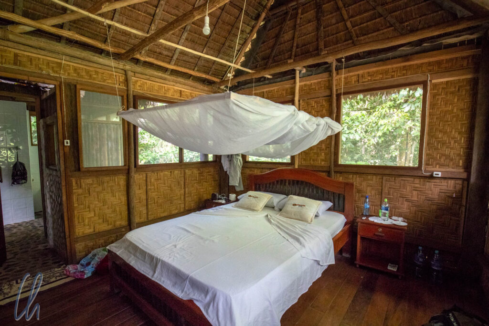

# Unsere Siebensachen für die Weltreise

Dies soll kein Artikel sein im Stil von "10 Dinge, die Du auf Deiner Trekkingtour durch den Himalaya vermissen wirst" oder "7 Dinge, die Dir das Leben am Amazonas leichter machen". Leider enden solche Empfehlungen oft in "23 Dingen, an denen Du Dich auf Reisen totschleppst". Daher fassen wir in diesem Post ausschließlich Tipps, zu Neudeutsch [Reise-Hacks](https://de.wikipedia.org/wiki/Lifehack), zusammen, die sich im Alltag in 14 Monaten Weltreise bewährt haben - garantiert praxistauglich und ohne [Affiliate Links](https://de.wikipedia.org/wiki/Affiliate-Marketing).

<!--more-->

## Was Ihr getrost zu Hause lassen könnt

Manche vermeintlich sinnvollen Gadgets oder oft empfohlene Dinge könnt Ihr unserer Meinung nach bedenkenlos daheim lassen. Da wäre zum Beispiel das Moskitonetz. Wir hatten eines dabei und können die Tage seines Einsatzes lässig an einer Hand abzählen. Entweder gab es bereits ein Insektennetz in unserer Unterkunft oder es bestand keinerlei Möglichkeit, eines aufzuhängen. Damit stellte es die meiste Zeit eigentlich nur Ballast dar. Besser einsetzbar und außerdem kleiner im Packmaß ist da ein Klebeband (z.B. Leukosilk), um eventuelle Löcher und Risse in vorhandenen Netzen zu flicken.

Eine schicke, auffüllbare Wasserflasche kann man auch getrost zu Hause lassen. Es wäre eher ein Mode-Accessoire, ist aber unsinnig, nimmt Platz weg und verursacht nur Arbeit, da man sie reinigen muss. Wenn es auch nicht gerade ökologisch ist, so haben wir doch die meiste Zeit Flaschenwasser getrunken, um Montezumas Rache vorzubeugen. (In den meisten von uns bereisten Ländern sollte man besser kein Leitungswasser zu sich nehmen, sicherheitshalber nicht einmal zum Zähneputzen.) Zur Reduktion von Plastikmüll haben wir allerdings immer möglichst große Flaschen gekauft und diese zum Mitnehmen in kleinere umgefüllt, bis sie nach einigen Tagen sowieso durchgenudelt waren.

## Weniger ist mehr

Es gibt etliche Internetseiten und Reiseführer, die sinnvolle Packlisten veröffentlichen. Da eine Packliste sehr individuell ist und auch Mona und ich unterschiedliche Vorlieben hatten, nennen wir hier nur einige wirklich unverzichtbare, aber vielleicht nicht offensichtliche Gegenstände: Eine Stirnlampe, ein Handtuch (wie bereits das Standardwerk "Per Anhalter durch die Galaxis" empfahl; besser die Outdoor-Variante), Panzerklebeband (duct tape), eine Wäscheleine mit einigen Wäscheklammern (Vorsicht: nicht unterwegs hängenlassen!), ein Taschenmesser (eher kleiner als größer), ein Schwammtuch und eine kleine Bürste, wenn man Dinge reinigen möchte, eine Ersatzbrille, Kontaktlinsen zum Schnorcheln und einen robusten, wasserabweisenden Packsack für den großen Trekkingrucksack. Er schützt Euer Gepäck unterwegs vor den automatischen Transportsystemen auf Flughäfen, auf dem Dach von Bussen etc. und ist auch praktisch, wenn man sein Gepäck zwischendurch aufteilen muss, z.B. um Dinge vorübergehend zurückzulassen.

Offensichtliche Dinge wie Sonnencreme oder Klamotten wollen wir an sich unerwähnt lassen. Wichtig ist nur, dass Ihr auf keinen Fall zu viel mitnehmen solltet, denn offensichtlich muss man alles tragen und ein zu hohes Gewicht des Gepäcks kann zu Schwierigkeiten bei Transportbegrenzungen auf Inlandsflügen führen. Es besteht (fast) überall die Möglichkeit, Bekleidung unterwegs für wenig Geld waschen (zu lassen), dazu sollte man zur Sicherheit mindestens 2 Nächte in Folge am gleichen Ort verweilen. Außerdem sollte man sich, vor allem für längere Reisen, vergegenwärtigen, dass man vieles auch unterwegs kaufen kann, z.B. Sonnencreme, Shampoo, Zahnpasta, auch Kleidungsstücke. Diese Erledigungen des täglichen Lebens können ganz nebenbei auch interessante Einblicke bieten.

Von allen praktischen Aspekten abgesehen gibt einem eine solche Reise die Möglichkeit, unnützen Ballast - nicht nur materiell - hinter sich zu lassen, sich auf das Wesentliche zu beschränken und zu konzentrieren und möglichst offen die Kultur der besuchten Länder auf sich wirken zu lassen.

## Nur mit Nähset um die Welt

Bevor man allerdings liebgewonnene, praktische Kleidungsstücke ersetzt, kann man sie oft problemlos reparieren lassen oder selbst Nadel und Faden zur Hand nehmen. Ein gutes Nähset mit einigen Nadeln, Garn in verschiedenen Farben und (viel) stabilem Zwirn ist unserer Meinung nach auf Reisen unentbehrlich. So stopften wir Löcher in T-Shirts, Risse in Hosen und [Knabberattacken](http://wittmann-tours.de/nosy-mangabe) auf unsere Rucksäcke.

Manche Stücke waren aber schließlich doch am Ende und so mussten wir verschlissene Hosen und Hemden ersetzen oder wir (v.a. Mona) kauften T-Shirts als Souvenirs in den verschiedenen Ländern. Dabei darf man allerdings nicht vergessen, dass idealerweise für jedes neue Stück, ein altes zurückbleiben sollte ;).

## Reiseführer auf dem Kindle

Wie nimmt man Reiseführer für 19 Länder mit? Bestimmt nicht als Buch, sonst müsste man eine halbe Bibliothek mitschleppen, sondern digital. Wir nutzen die Kindle-App auf unseren diversen Geräten, hatten aber keinen Original-Kindle dabei. Damit waren wir zwar nicht übermäßig zufrieden, aber die digitale Variante war dennoch die beste Möglichkeit, um unser Gepäck schlank zu halten. Vor allem beim virtuellen Blättern in den Ratgebern haben wir uns zwischendurch sehr nach einem echtem Buch gesehnt.

@Amazon und die Reiseführerverlage: Ohne den Oberlehrer spielen zu wollen: Einen Reiseführer liest man nun mal nicht von vorne bis hinten durch, sondern in der Regel abschnittsweise. Es ist wichtig, schnell navigieren und Markierungen finden zu können. Dafür wurde unserem Verständnis nach die [PageFlip](https://www.amazon.de/Kindle-Pageflip-Querlesen-Ohne-Seite-Verlieren/b?ie=UTF8&node=10665636031)-Funktion erfunden, mit deren Hilfe man besser in einem eBook "blättern" kann.

Leider bieten häufig selbst brandneue Auflagen von Reiseführern dieses Feature nicht, z.B. der Lonely Planet India mit über 1000 Seiten, der zudem noch ständig hing oder abstürzte… Stattdessen waren die Inhalte 1:1 von Papier auf eBook portiert worden, wodurch die elektronischen Ausgaben quasi unbenutzbar sind. Also empfiehlt es sich sehr, vor dem Kauf zu überprüfen, ob PageFlip aktiviert ist!

## Reiseapotheke in der Dose

Selbst Medikamente kann man (meist) problemlos unterwegs in der Apotheke besorgen. In vielen Ländern braucht man nicht einmal eine ärztliche Verordnung. Wir füllten unsere Reiseapotheke, zum Glück selten genug, immer dann auf, wenn wir etwas verbraucht hatten. So kauften wir zum Beispiel in Bolivien und Äthiopien Antibiotika (ganz ohne Rezept), jeweils in kleinen Städten.

Als Augenärztin und Sohn einer Apothekerin enthielt unsere Reiseapotheke etwas mehr als nur Aspirin und ein paar Pflaster. Die Erfahrung lehrt zwar, dass man die wenigsten Medikamente wirklich braucht und dass man vieles auch unterwegs bekommt. Für den Fall der Fälle waren wir trotzdem gut ausgerüstet mit allem, was man für die Behandlung von Schürfwunden braucht, Malaria-Prophylaxe für insgesamt 3 Monate, sterile Kanülen und Spritzen und viele Tabletten und Kapseln von "Aspirin" bis "Xusal". Hier soll es allerdings nicht darum gehen, was in die Reiseapotheke gehört, sondern um die Frage: "Wie nimmt man das Zeug am besten mit?"

Eine Schwierigkeit beim Verstauen (v.a. bei Tabletten) ist das Volumen. Diese sind in Blister verpackt und liegen samt Beipackzettel in einer Pappschachtel. Neben dem eigentlichen Arzneimittel hat man also 85% Luft dabei. Lässt man die Umverpackungen aber zu Hause, so werden die Kapseln gerne beim Transport aus den Blistern gequetscht, wenn Druck auf sie ausgeübt wird, was vor allem im Rucksack unvermeidlich ist. Damit werden sie schließlich unbrauchbar. Die Lösung für dieses Problem ist ein stabiles Behältnis.

## Vier konkrete Tipps für die Reiseapotheke

Nach vielen Reisen und einigen Experimenten hier nun die ultimative Strategie zur Volumen-Verkleinerung der Reiseapotheke:

1. 1. 1. Umverpackungen zu Hause lassen.
   2. Alle Blister in einer Dose transportieren, damit diese nicht gedrückt werden. Mit ein bisschen Puzzeln bekommt man erstaunlich viel hinein.
   3. Um noch mehr Platz zu sparen, Blister zerschneiden: Überstehende Ränder kürzen, ohne dabei die Fächer der Tabletten anzuschneiden. Im Laufe der Zeit leere Tablettenfächer ebenfalls abschneiden.
   4. Beipackzettel als PDF herunterladen und digital mitnehmen. Dabei unbedingt darauf achten, dass die Beipackzettel auch offline verfügbar sein sollten und nicht nur in der Cloud. (Nach Murphys Gesetz gibt es im Notfall kein Internet.)

Mit Hilfe dieser einfachen Tipps wird die Reiseapotheke zum Platzwunder! Das Gleiche funktioniert auch im ganz kleinen. Die Schachtel eines Kartenspiels eignet sich bestens, um darin ein paar Malaria-Tabletten, etwas gegen Reiseübelkeit, Kopfschmerzen oder Durchfall immer im Tagesrucksack griffbereit zu haben.

## Bargeld sicher mitnehmen

Ohne Geld würde eine Weltreise ziemlich schnell zum Ende kommen. Und das liebe Kapital hat uns unterwegs das eine oder andere Mal vor Herausforderungen gestellt: Umtauschen, dicke Bündel von Scheinen unauffällig verstauen, funktionstüchtige Geldautomaten suchen etc. Außerdem lernten wir im Laufe der Zeit abzuschätzen, wieviel Bargeld wir pro Tag benötigen würden, um nicht unnötig viel dabeizuhaben. Den Rest ließen wir mehr oder weniger sicher im Hotel zurück. In 90% unserer Unterkünfte stand uns kein Safe zur Verfügung und einen Rucksack kann man nicht abschließen.

Leider passierte es uns auch einmal, dass uns in der Unterkunft Geld aus dem Rucksack geklaut wurde. Das geschah in [Myanmar](http://wittmann-tours.de/category/asien/myanmar/), noch fast am Anfang unserer Reise. Wir machten dafür zwei Faktoren verantwortlich: Unsere Nachlässigkeit (der Rucksack war zwar geschlossen gewesen, aber das Portemonnaie hatte oben auf gelegen) und die günstige Gelegenheit, die sich wahrscheinlich eines der Zimmermädchen zunutze gemacht hatte. Von da an waren unsere Börsen mit der Geldreserve immer in alte Plastiktüten gewickelt und in der Tiefe unserer Rucksäcke verstaut. Mit Erfolg: In den folgenden 12 Monaten wurden wir in den Hotels nicht mehr bestohlen.

## Die eiserne Reserve

Es hat sich bewährt, ein paar US-Dollar als Reserve dabei zu haben, ein Vorrat, der unterwegs nie eingeplant wird und auf den man wirklich nur im absoluten Notfall zurückgreift, wenn alle Geldautomaten streiken, keine Kreditkarten akzeptiert werden oder der Rest gestohlen worden ist. Dieser Bestand sollte idealerweise aus neuwertigen US-Dollar-Scheinen von 1 bis 50 Dollar ohne Knicke, Risse oder Eselsohren bestehen, damit sie auch wirklich überall angenommen werden.

Auch empfiehlt es sich, Plastikgeld in Form von Kreditkarten mitzunehmen, am besten mehrere (falls eine unfreiwillig den Besitzer wechselt), mindestens aber eine Master- und eine VISA-Card. Je nach Land wird die eine oder andere Marke problemlos akzeptiert, aber nicht notwendigerweise beide.

Eher aus der Not geboren (nachdem uns in Mexiko eine Kreditkarte [gestohlen worden war](http://wittmann-tours.de/frueher-tenochtitlan-heute-mexiko-city/)), haben wir eine "virtuelle Karte" zu schätzen gewusst. Dies ist eine gültige Kreditkarte, die sicher zu Hause liegt, von der Ihr aber alle Daten kennt und auch ein Foto greifbar habt. Mit dieser haben wir alle Online-Transaktionen getätigt, also zum Beispiel Flüge oder Hotels gebucht. Das Zahlungsmittel kann nicht verlorengehen, steht Euch aber trotzdem immer zur Verfügung.

## Mit Uber um die Welt

Auch der Online-Finanzservice [Paypal](https://de.wikipedia.org/wiki/PayPal) hat sich unterwegs bewährt, vor allem für Zahlungen bei [Uber](<https://de.wikipedia.org/wiki/Uber_(Unternehmen)>). Der in Deutschland umstrittene Fahrdienst ist unserer Meinung nach auf Reisen Gold wert. In Brasilien waren Uber (viel) günstiger als normale Taxis und mindestens so zahlreich. In Kalkutta, Indien, dauerte es meistens nur ein bis zwei Minuten, bis unser bestellter Wagen eintraf. Auch in Amman, der Hauptstadt Jordaniens, nutzten wir den Dienst und haben nur Positives zu berichten. In Dar es Salaam in Tansania schätzten wir die Tatsache, dass wir keine Preise verhandeln mussten, da bei Uber die App den Preis vorab festlegt. Die Online-Buchung der Fahrt überwindet auch eine mögliche Sprachbarriere, da das Programm Abholpunkt und Fahrtziel im Idiom des Landes auf dem Smartphone übermittelt. So sind Missverständnisse nahezu ausgeschlossen. Während der Fahrt kann man außerdem die eigene Position auf der Route über die App verfolgen. Dies gibt dem Nutzer Sicherheit.

Sollte man etwas im Auto vergessen, wäre die Fahrt sogar nachvollziehbar und man könnte den Wagenlenker im Nachhinein kontaktieren. Um sicherzugehen, dass der Fahrer vertrauenswürdig ist, sollte man trotzdem die Bewertung, das Nummernschild, das Profilbild und den Namen mit den Tatsachen vergleichen. Wir versuchten immer zu verifizieren, dass auch wirklich der richtige Chauffeur am Steuer saß und wenn es nur eine als Frage formulierte Begrüßung mit dem übermittelten Namen war. Nur ein einziges Mal saß ein anderer Fahrer am Steuer, woraufhin wir nicht einstiegen, sondern gleich das nächste Uber bestellten.

## Immer online mit lokalen SIM-Karten

Voraussetzung für die freie Fahrt mit Uber ist allerdings verlässliches mobiles Internet. Statt teurem Roaming empfehlen wir, in jedem bereisten Staat eine lokale SIM-Karte zu kaufen. Je nach Land schwankte der Aufwand für die Erlangung der Karte stark. Über bemerkenswerte Prozesse in einigen Nationen berichteten wir in den [ersten Eindrücken](http://wittmann-tours.de/tag/erste-eindruecke/). In den meisten Ländern reichten umgerechnet zwischen 3 und 10 Euro pro Monat, um für die Dauer unseres gesamten Aufenthaltes über die Runden zu kommen. Mit Hilfe einschlägiger Webseiten wie [Too Many Adapters](https://toomanyadapters.com/buying-local-sim-cards/) oder das [Fandom Prepaid Data SIM Card Wiki](https://prepaid-data-sim-card.fandom.com/wiki/Prepaid_SIM_with_data) haben wir schließlich überall eine gute Lösung gefunden.

Außerdem ersparte uns die lokale SIM-Karte viel Ärger über/mit langsames/m WLAN. Mit dem Smartphone einen Hotspot einzurichten, war oft die bessere Wahl, auch wenn wir manchmal ein Gigabyte Datenvolumen nachkaufen mussten. Ab Tansania hatten wir uns von den Hotel-WLANs fast komplett unabhängig gemacht und waren so gut wie immer via unseren eigenen Hotspot online.

Das Mobiltelefon funktionierte trotz der alternativen SIM-Karte einwandfrei weiter. WhatsApp kann sogar die gewohnte deutsche Nummer beibehalten, so dass Verwandte und Freunde in Deutschland den SIM-Karten-Wechsel nicht bemerkten.

## App-Empfehlung: Maps.me

Online zu sein, erleichtert einem heutzutage das Leben unterwegs immens. Auf Reisen muss man in der Regel nicht unbedingt ständig erreichbar sein, aber gutes Internet ist für Planung und Organisation unverzichtbar und ganz besonders auch für die Navigation. Es gestaltet sich sicher spannend, fremde Orte ohne Karte zu erkunden und den Weg mit Händen und Füßen zu erfragen, aber manchmal möchte man einfach nur ohne Umwege von A nach B kommen.

Hierfür liegt die Nutzung von Google Maps nahe: Wir verwendeten die App gerne und häufig. Google brachte uns zuverlässig ans eingegebene Ziel. Trotz weltweit verbreitetem Internet ist man unterwegs zwar selten, aber dennoch regelmäßig immer mal wieder offline: Sei es, dass noch keine lokale SIM-Karte im Mobiltelefon steckt oder dass es auf diesem Globus doch noch Orte ohne (oder mit sehr langsamem) Internet gibt. Die Lösung für diesen Missstand ist vermeintlich einfach: Offline-Kartenmaterial. Auf Google Maps kann man Kartenausschnitte herunterladen und damit offline navigieren, dies funktioniert auch problemlos, aber: In einigen Ländern darf man keine Offline-Karten herunterladen, z.B. in Japan, unserem ersten Reiseland.

Bei der Suche im AppStore stießen wir auf Maps.me, welches auf OpenStreetMap basiert. Mit dieser App kann man leicht Karten herunterzuladen. Die Handhabung des Downloads ist zudem deutlich einfacher als bei Google Maps, da man nicht selbst gewählte Ausschnitte festlegen muss, sondern ganze Länder, Regionen oder Staaten laden kann. Je nach gewählter Nation sind die Karten größer oder kleiner. Insgesamt umfassen die Kartendaten für unser Empfinden jedoch ein erstaunlich geringes Datenvolumen: Unsere gesamte Reiseroute benötigt weniger als 3 GB auf unseren Smartphones. Sowohl im Ausland wie auch in Deutschland ist Maps.Me zwar was die Bedienung anbetrifft nicht ganz so komfortabel wie Google Maps, aber v.a. wenn man zu Fuß unterwegs ist, sei es in der Stadt oder beim Wandern, deutlich detaillierter.

## Immer trocken dank Regenschirm

Das letzte wichtige Utensil für die Reise, das wir Euch ans Herz legen möchten, ist ein Regenschirm. Es klingt vielleicht kurios, aber ein kleiner Knirps hat unterwegs viel zu bieten. Im Gegensatz zu einer noch so dünnen Regenjacke schwitzt man nicht (zusätzlich) unter einem Schirm. Vor allem in den wärmeren Gegenden dieser Welt, die wir besucht haben, ist dies nicht zu verachten. Wir lernten diese Strategie vor vielen Jahren von einer Mitreisenden auf Kuba. Beate spazierte damals geschützt unter ihrem mobilen Stoffdach durch den tropischen Dschungel (anfänglich hielten wir uns mit Spott nicht zurück), während wir bald nicht mehr unterscheiden konnten, ob die triefende Nässe unserer Klamotten mehr durch die Anstrengung der strammen Wanderung in der schwülen Luft oder durch die ergiebigen Niederschläge entstanden war.

Bei wechselhaftem Wetter kann man einen Regenschirm schnell aufspannen oder wieder zusammenklappen. Wohin mit dem nassen Parapluie, wenn der Schauer vorbeigezogen ist? Entweder klemmt man ihn außen an den Rucksack oder man steckt ihn in eine Plastiktüte, so haben wir es von den Japanern gelernt. Überdies kann man das portable Schutzdach bei Bedarf auch als Sonnenschirm verwenden.
