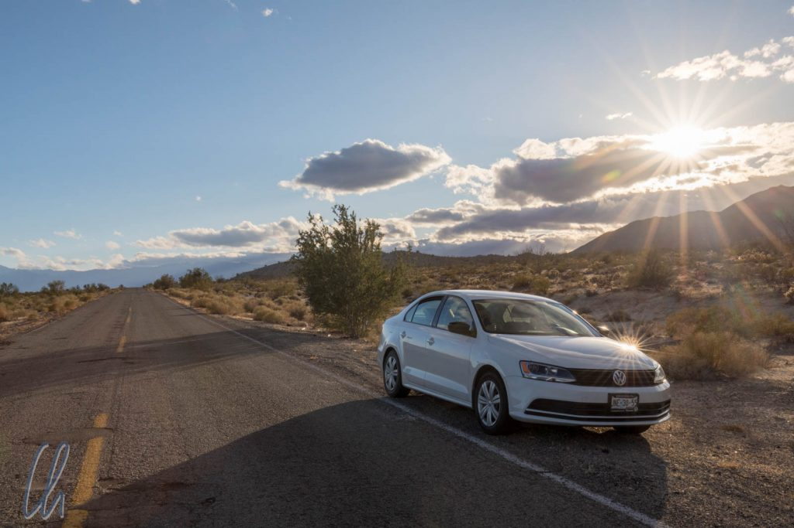
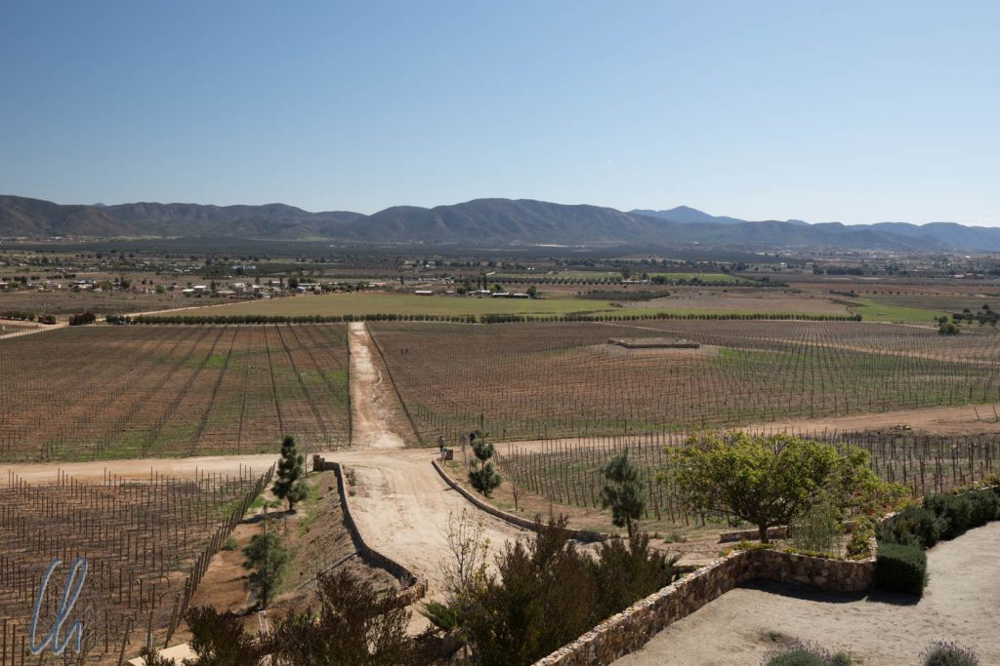
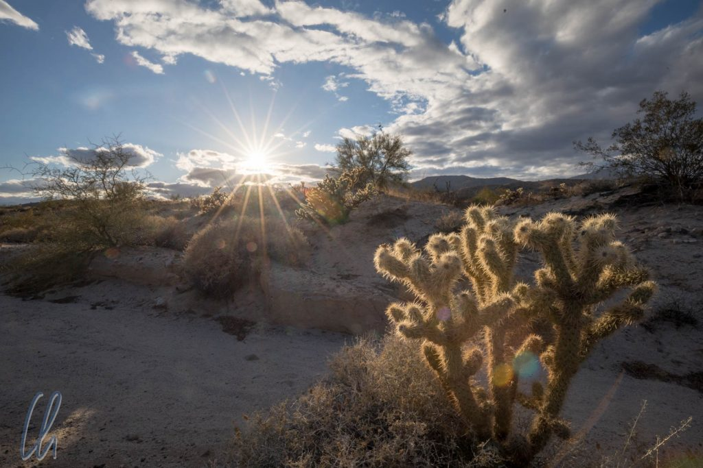
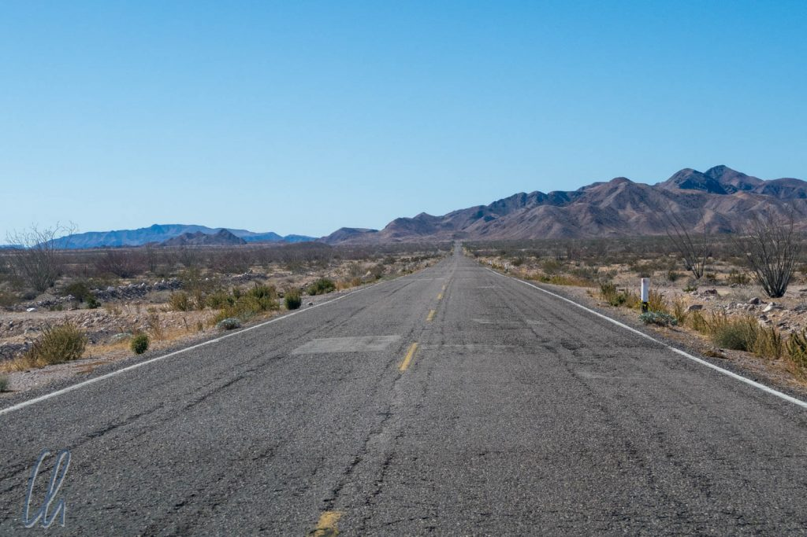
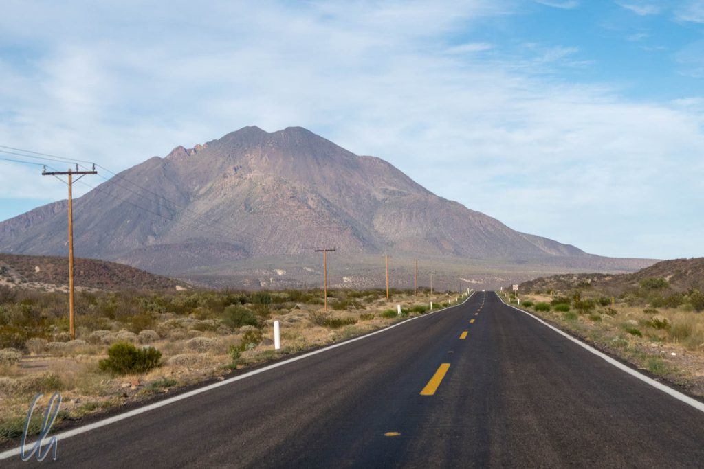

# Unterwegs auf der Baja California

Die Baja California, eine riesige Halbinsel, misst von der Grenzmauer in Tijuana im Norden bis zur südlichen Spitze in Cabo San Lucas 1630km in der Länge. (Zum Vergleich: Die Strecke von Flensburg nach Lindau/Bodensee beträgt 955km). Die meiste Zeit folgten wir der Straße "Carretera 1", der Lebensader der Baja California. Mit ein paar Umwegen hatten wir am Ende des Roadtrips ziemlich genau 2000km mehr auf den Kilometerzähler unseres Mietwagens gefahren und zwischendurch viel erlebt.

<!--more-->

## Valle de Guadalupe

Welche Art von Vegetation erwartet man in Mexiko? Hauptsächlich Kakteen und Agaven. Daher waren wir etwas erstaunt, als wir lernten, dass es im Norden der Baja California auch ein großes Weinanbaugebiet gibt. Das [Valle de Guadalupe](https://en.wikipedia.org/wiki/Valle_de_Guadalupe) liegt etwas nördlich von Ensenada. Insgesamt werden in dieser Gegend 90% des mexikanischen Weins angebaut - das hört sich viel an, jedoch ist der Weingenuss in Mexiko nicht sehr verbreitet. Dort gibt es um die 120 (nach anderen Angaben 150) Weingüter, die verschiedenste Weine kultivieren.

Um einen Eindruck zu bekommen, besuchten wir 3 Weingüter, natürlich mit Fahrer, damit alle an den obligatorischen Weinproben teilnehmen konnten ;). Mitte Februar wirkten die Weinstöcke recht nackt ohne Blätter oder Trauben und insgesamt machte die Erde einen es sehr trockenen Eindruck. Der Weinanbau funktioniert hier ausschließlich mit intensiver Bewässerung. Die meisten Ergebnisse können sich allerdings sehen lassen. Besonders gut haben uns Rotwein-Cuvées mit [Nebbiolo](https://de.wikipedia.org/wiki/Nebbiolo)-Trauben vom Weingut Las Nubes und ein Schokoladenwein von Adobe Guadalupe geschmeckt :)

## Ein dünn besiedeltes Land

Südlich von Ensenada nahm die Bevölkerungsdichte auf der Baja deutlich ab und die Orte wurden klein bis sehr klein, manche konnte man in einem Wimpernschlag verpassen. Wenige (oder weniger als) hundert Einwohner wohnten in kleinen Häusern oder permanent erscheinenden Wohnmobilen. So hieß es auch für uns, im Voraus zu planen. Anders als in anderen Regionen der Welt gibt es auf der Baja California nicht an jeder Ecke ein Restaurant oder einen Supermarkt. Auch Tankstellen sind rar, bis zur nächsten kann man schon mal bis zu 200 Kilometer zurücklegen. Der Reiseführer empfahl, bei jeder Gelegenheit aufzutanken, da es auch Versorgungsengpässe geben solle. Ganz so eng nahmen wir es jedoch nicht und wir konnten an jeder Tankstelle auftanken, die wir anfuhren.

Ebenfalls in Abständen von vielleicht 100 Kilometern befanden sich [Militärcheckpoints](http://www.bajainsider.com/article/baja-military-checkpoints) an der Straße. Der erste Anblick war zunächst etwas furchteinflößend. Fünf oder sechs meist junge, durchtrainierte Soldaten standen in Uniform mit Gewehren an den Checkpoints, um den Verkehr zu kontrollieren. Wir wurden meist nach einem höflichen kurzem Dialog ("Woher? Wohin?") durchgewunken, nur einmal mussten auch den Kofferraum öffnen, aber die Jungs sahen so aus, als ob sie im Zweifelsfall keinen Spaß verstünden.

## Eine abwechslungsreiche Straße

Der Zustand der Carretera 1 variierte gewaltig. Es gab frisch fertiggestellte bzw. erneuerte Abschnitte mit breiter, glatter Fahrbahn und guter Fahrbahnmarkierung, aber trotzdem mit einem offiziellen Tempolimit von nur 80km/h. In der Realität fuhren die meisten Autos und die LKWs(!) auf asphaltierten Wegen mindestens 100+km/h, manche deutlich schneller. Dann gab es die alten, engen Abschnitte, auf denen ein LKW seine Spur wirklich komplett ausfüllte. Dort war der Asphalt sehr rau und laut, und selbst 80 km/h fühlten sich mindestens wie 120 km/h an. Wieder andere Abschnitte waren mit Schlaglöchern übersät, einige so tief, dass darin ein Riesenkaktus hätte wachsen können ;).

Neben den Schlaglöchern waren die Speed Bumps ("Tope") gewollte Hindernisse in Ortsdurchfahrten, an Brücken oder vor Kreuzungen. Zur Verkehrsberuhigung waren sie in der Tat bestens geeignet und wirkungsvoller als jedes Verkehrsschild, da es bei den meisten wirklich sinnvoll war, quasi auf null herunterzubremsen, über den Tope zu holpern und anschließend wieder zu beschleunigen. Allerdings war allein schon deren Existenz für uns ungewohnt und manche waren schlecht oder gar nicht gekennzeichnet, so dass wir über einige Speed Bumps noch mit etwas unangemessener Geschwindigkeit hoppelten ;) Armer Jetta!

Das Gegenstück zum Tope war der "Wade", eine Durchfahrt durch ein trockenes Flussbett. Keines davon führte auch nur einen Tropfen Wasser und die karge Landschaft ließ uns vermuten, dass reißende Fluten wohl eher eine Seltenheit sind. An einigen Stellen mutierte die Straße so jedoch zur Achterbahn, auf und ab, auf und ab :)

Aufgrund des Straßenzustandes war das erste Zeichen von Zivilisation an einem Ort meist nicht die Tankstelle, sondern ein Reifenhändler (Llanteria) oder ein Vulkanisierer. Neben der Straße lagen überall geborstene Pneus, die die Wichtigkeit und Rentabilität solcher Unternehmen bewiesen. Außerdem gab es vergleichsweise häufig Geschäfte für Autoteile, Bremsen oder Batterien. Zum Glück wurden wir von Kfz-Pannen entlang des Weges verschont :).

## San Felipe und das Tal der Riesen

Ab Ensenada fuhren wir einen Umweg über San Felipe an der Ostküste der Baja California, um die Riesenkakteen im Valle de los Gigantes ("Tal der Riesen") zu sehen. San Felipe an sich wirkte trotz eines wunderschönen Strandes leider etwas trostlos. Für die Anzahl der Häuser gab es zu wenige Bewohner, für die Anzahl der (teilweise unfertigen) Hotels gab es zu wenige Touristen. Was die Gäste angeht, so gibt es bestimmt besser besuchte Zeiten, auch wenn man sich des Eindruckes nicht erwehren konnte, daß ein erwarteter Tourismusboom wohl deutlich überschätzt worden ist. Viele Souvenirstände warteten vergebens auf Käufer, abends waren nur einige wenige Restaurants geöffnet und auch die waren trotz köstlichem Essens nicht gut besucht.

Was die Einheimischen angeht, so sind viele in den Norden abgewandert. Norden soll hierbei nicht unbedingt USA bedeuten. In dieser strukturschwachen Region sind viele Menschen auf der Suche nach Arbeit in die Nähe der Grenze gezogen, um in sog. [Maquiladoras](https://de.wikipedia.org/wiki/Maquila), Fabriken auf mexikanischer Seite, eine Anstellung zu finden.

Dafür war das Valle de los Gigantes in der Nähe von San Felipe wirklich gigantisch. Von dem Parkranger, der uns das Tor ins Tal öffnete, wurden wir überschwänglich begrüßt. Anscheinend fühlte er sich alleine in der Wüste ziemlich einsam. Als er erfuhr, dass wir von so weit angereist waren (USA und Deutschland), wurde er sichtlich enthusiastisch und gab uns gleich eine Einführung in die Flora. Die Giganten sind [Mexican Giant Cardon-Kakteen](https://de.wikipedia.org/wiki/Pachycereus_pringlei), die Hunderte von Jahren, einige über 1000 Jahre alt werden. Sie wachsen nur wenige Zentimeter pro Jahr und erst mit circa 75 Jahren bekommen sie ihren ersten Seitenarm. Die riesigen Kakteen sind also steinalt. Wie groß sie wirklich werden, sieht man erst, wenn der Maßstab auf dem Foto erkennbar wird.

Von San Felipe aus fuhren wir auf der Carretera 5 immer weiter Richtung Süden, bis wir ca. 200 km nördlich von Guerrero Negro (das war unser Ziel) wieder auf die Carretera 1 treffen sollten. Unser Reiseführer berichtete davon, dass die Fahrt immer einfacher werde und dass die Verbindung bis Ende 2016 komplett geteert sein solle. Die ersten 110 Kilometer waren gut und nach einem Militärcheckpoint weitere ca. 40 Kilometer ausgezeichnet. Danach schien das Geld für den Bau erschöpft gewesen zu sein und die asphaltierte Straße hörte schlagartig auf.

## Im Gelände-Jetta unterwegs auf der Carretera 5

So zuckelten wir mit unserem Gelände-Jetta über die kurvige und unebene Piste. Bei jedem Buckel und jedem Schlagloch fühlte man förmlich, wie die Stoßdämpfer einem Härtetest unterzogen wurden. Diese Fahrspur war die Hauptverkehrsstraße der Region, die auch von LKWs (bis zu Kategorie eines 40-Tonners) genutzt wurde. Unsere Durchschnittsgeschwindigkeit lag gezwungenermaßen bei etwa bei 20 km/h. Gerne wären wir etwas schneller vorangekommen, um den letzten Teil der Strecke bis Guerreo Negro nicht im Dunkeln fahren zu müssen. Dennoch hatte die langsame Fahrt auch sein Positives. Wir konnten die beeindruckende Wüstenlandschaft bewundern mit schroffen Bergen, sandigen Hügeln, ungewöhnlich geformten Felsblöcken und verschiedenartigen Kakteen.

An einigen Stellen teilte sich die Straße oder es gab Abschnitte, auf denen Bauaktivitäten schon neue Pisten in die Landschaft geschlagen hatten. Aus Mangel an Schildern fuhren wir tendenziell so, wie das GPS die alte Strecke zeigte, folgten aber auch anderen Fahrzeugen über alternative Pisten, die meistens eine Abkürzung waren. Manchmal liefen teilweise drei verschiedene Fahrspuren mehr oder weniger parallel zueinander.

Zur Mittagszeit stoppten wir mitten im Nirgendwo für unser landschaftlich schönstes Picknick auf der Baja California. Das Auto stellten wir neben der Straße ab, ein Felsen diente als Ablage und Sitzgelegenheit und ein hagerer Baum spendete etwas Schatten.

## Felskunst in der Nähe von Mulegé

Nach dem 3-tägigen Aufenthalt in Guerrero Negro zum [Whale Watching](http://wittmann-tours.de/die-wale-von-guerrero-negro/) setzten wir unseren Weg nach Süden fort. Unser nächstes Ziel war Mulegé, wo wir Jahrtausende alte Höhlenmalereien anschauen wollten. Nach langer Suche fanden wir einen kompetenten Führer ("Salvador"), der uns zu den Stätten brachte.

Morgens holte uns Salvador in einem Minibus vom Hotel ab. Nach einem kurzen Stopp beim [INHA](https://de.wikipedia.org/wiki/Instituto_Nacional_de_Antropolog%C3%ADa_e_Historia)-Büro, wo wir die Eintrittsgelder bezahlten, ging es los in die Wildnis auf einer abenteuerlichen Piste, die sich auf dem Gebiet einer riesigen Farm befand. Das erste Ziel waren die sog. Piedras Pintas, viele uralte [Petroglyphen](https://de.wikipedia.org/wiki/Petroglyphe). Der Weg führte durch ein ausgetrocknetes Flussbett, und die in den Stein gearbeiteten Bilder waren vielerorts an den Felswänden zu sehen. Manche sprangen einem förmlich ins Auge, bei anderen war es eher ein Suchspiel. Wir sahen verschiedenste Motive: Schamanen, Fische, Wale, Rochen, Schildkröten, Coyoten, Antilopen und andere Tiere.

Anschließend fuhren wir zum eigentlichen Highlight, den Höhlenmalereien von La Trinidad. Nach gut einer Stunde Fahrt auf einer holperigen Schotterstraße erreichten wir die Farm „La Trinidad“. Dann liefen wir ca. 30min zu Fuß durch eine reizvolle Wildwest-Landschaft, bis wir die Höhle erreichten. Diese muss teilweise eingestürzt sein, da wir einen Geröllabhang erklommen und von dort die Malereien auf einer Felswand sehen konnten, die von einem Felsüberhang geschützt wird. Am eindrucksvollsten ist ein prächtiger Hirsch in rot, der von vielen anderen Bildern umgeben ist, die allerdings nicht alle aus der gleichen Zeit stammen. Außerdem sieht man einen Menschen neben einem anscheinend erlegten Stück Wild, Fische und Handabdrücke von Kindern.

Salvador erklärte uns, was man mittlerweile über die Höhlenmalereien weiß und welche Theorien es zu ihrer Deutung gibt. Ihr Alter beträgt mehrere 1000 Jahre. Die mit heller Farbe gezeichneten Motive sind älter, die roten Malereien etwas jünger. Es war faszinierend, diese uralten Kunstwerke zu betrachten und etwas über ihre mögliche Bedeutung für die Stämme zu erfahren.

## Steife Brise in La Paz

Weiter südlich erreichten wir La Paz, das bekannt für sein Angebot an Wassersport-Aktivitäten ist. Wir hätten gerne einen Bootsausflug zur [Isla Espiritu Santo](https://de.wikipedia.org/wiki/Isla_Esp%C3%ADritu_Santo) gemacht, doch der wurde leider vom Winde verweht. Wegen schlechtem Wetter (vor allem wegen der stürmischen Böen) wurde unsere Tour vom Anbieter abgesagt. Schade… Trotzdem verbrachten wir einen angenehmen Tag in La Paz, besuchten das Walmuseum, den Zócalo und die koloniale Kathedrale Nuestra Senora de la Paz, flanierten den gepflegten Malecon entlang, lagen am geschützten Pool in der Sonne und trainierten unsere [Kartenspielkünste](http://wittmann-tours.de/fun-games-in-den-usa-wir-spielen-karten).

Ja, das liebe Wetter… Auch die Einheimischen beklagten sich. Leider herrschte auf der Baja im Februar Winter. Trotz meistens strahlend blauem Himmel wurde es nicht wärmer als 20 Grad, nachts war es sehr kühl und ständig wehte ein kalter Wind. So müssen wir ein paar Pünktchen in der B-Note abziehen ;).

## Wie war die Baja California?

Einerseits war die Baja California trotz Reiseführer und Internet noch ein echtes Abenteuer. Im Vorfeld erwies sich die Suche nach Informationen oft als wenig erfolgreich. Internetseiten beschränken sich zu 95% auf den Norden bis Ensenada und den Süden ab La Paz. Selbst im „Lonely Planet“ gab es einige Durststrecken und der „Rough Guide Mexiko“ war zwar nicht aktuell, aber trotzdem noch etwas hilfreicher. Der beste Weg, an Informationen zu kommen, war hinzufahren und mit den Leuten zu reden. Dabei kam so manch interessanter Tipp zutage. Südlich von San Felipe badeten wir zum Beispiel in angenehmen heißen Quellen mit Blick auf das Treiben der Pelikane im Meer.

Andererseits ist die Baja California in vielerlei Hinsicht sozusagen Mexiko light. Die Ortschaften konzentrieren sich sehr auf den Norden und den Süden und dort existiert auch touristische Infrastruktur. Vor allem im Süden machte die Baja den Eindruck, als sei sie ein großer Spielplatz für US-Amerikaner. Dort wirkte vieles künstlich, an der Küste reihten sich Hotelbunker aneinander und es scheint einen regelrechten Bauboom zu geben. Strände, die im Reiseführer noch als komplett naturbelassen beschrieben wurden, waren schon bebaut oder die Bauarbeiten waren in vollem Gange. Todos Santos, wo angeblich das legendäre von den Eagles besungene [Hotel California](https://www.youtube.com/watch?v=Cck1TMtVedA) steht, war ebenfalls sehr touristisch.

Es gibt aber nicht nur Hotels, sondern auch andere interessante Angebote. Apotheken verkaufen zum Beispiel rezeptfrei Antibiotika, Schmerzmittel sowie diverse Potenzmittel. Ob wirklich drin ist, was draufsteht?

Das [Whale Watching](http://wittmann-tours.de/die-wale-von-guerrero-negro/) in Guerreo Negro war definitiv der Höhepunkt unserer Reise auf der Baja California. Als Ort hat uns Mulegé am besten gefallen mit seinen kleinen, bunten gepflegten Häuschen und den unwirklich hohen Bürgersteigen. Die kleine Stadt wirkte authentisch, hatte etwas Instrastrukur, war aber kaum touristisch. Die Landschaft am Wegesrand mit ihrer verschiedenartigen, teilweise verblüffenden Vegetation unter dem leuchtend blauen Himmel war sehr sehenswert. So wurde es auf den langen Fahrstrecken (auch dank [Maná](https://de.wikipedia.org/wiki/Man%C3%A1) und Mariachi Musik) nicht langweilig.
