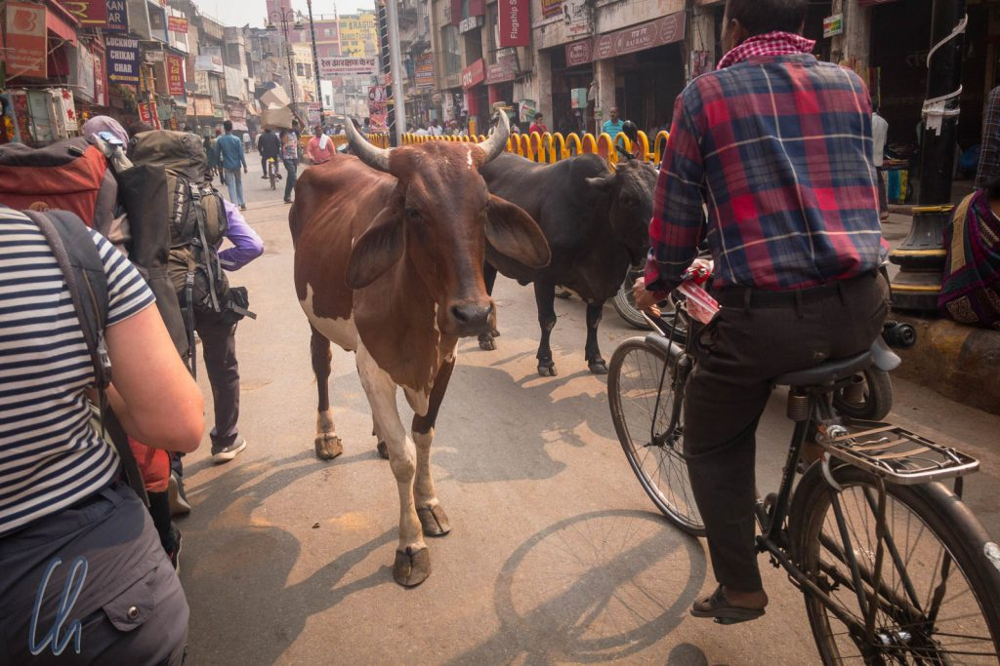
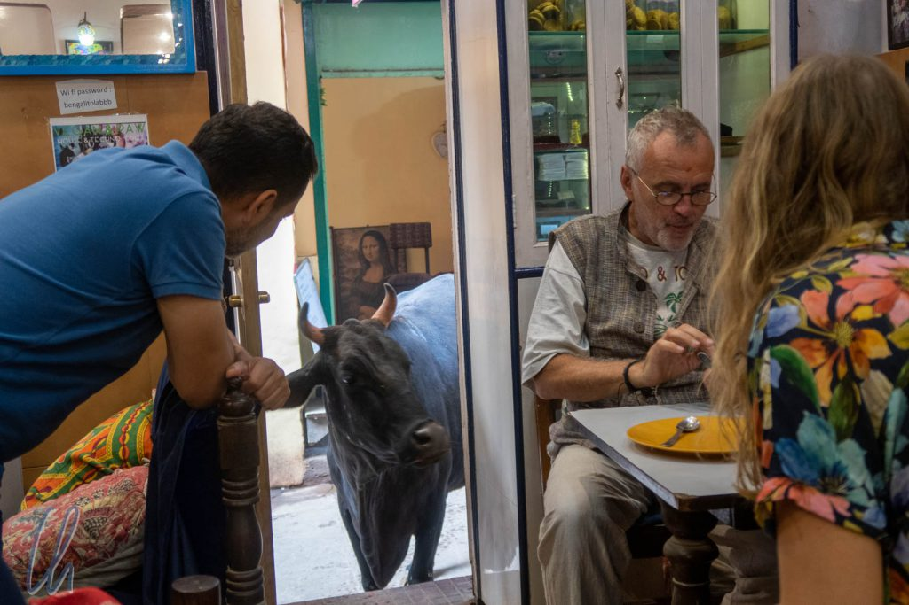

# Varanasi, die Heiligste Stadt des Hinduismus

Varanasi, im Westen besser bekannt unter dem Namen Benares, stellt die Heiligste Stadt des Hinduismus und damit ganz Indiens dar. Die ersten Eindrücke der Stadt, die auf den Besucher förmlich einstürmen, sind vielfältig, intensiv und nicht unbedingt positiv. Varanasi zeigte sich erstmal voller Menschen, laut und dreckig, es stank nach Fäkalien. Als Reisende begegneten wir vielen Neppern, Schleppern und Bauernfängern. Die religiöse Bedeutung des Ortes erschloss sich uns also nicht auf Anhieb, mit der Zeit aber (und einem guten Führer) verstanden wir langsam mehr. Es dauerte einige Tage, bis wir diese tatsächlich tief in Varanasi verwurzelte Spiritualität begreifen konnten.

<!--more-->

## Holy Cow!

Varanasi wirkt auf den westlichen Besucher erst einmal wie ein vollkommenes Chaos, oder, um es umgekehrt auszudrücken, gegenüber Varanasi erschien uns Kolkata im Rückblick als eine sehr gut organisierte Stadt, geradezu eine Oase der Ruhe. Vom Flughafen aus nahmen wir ein Taxi in die Stadt. Unser Fahrer fädelte sich ambitioniert durch den chaotischen, lauten, nach Abgasen stinkenden Verkehr, der im Zentrum in einem chronischen Stau kulminierte. Das Taxi hielt notgedrungen in einem Kreisverkehr und wir stiegen aus. Die engen Straßen in direkter Nähe zum Ganges sind für Autos nicht befahrbar. Viele Häuser, so auch unser Hotel, waren nur zu Fuß durch ein Labyrinth von schmalen Gassen erreichbar.

Auf unserem Weg begegneten wir der ersten Heiligen Kuh auf der Straße. Erst dachten wir, dies sei etwas ganz besonderes. Je länger wir allerdings in Varanasi weilten, desto mehr gewöhnten wir uns daran, dass die Paarhufer ganz normal ins Straßenbild gehörten. Sie wurden von den Passanten gefüttert und getränkt, man machte ihnen hochachtungsvoll Platz, sie wurden nicht angehupt(!) und manchmal berührten die Hindus sie sogar ehrfürchtig. Die Art und Weise des Umgangs mit den Heiligen Kühen auf der Straße ist nur eines der vielen Zeichen der täglich gelebten Spiritualität.

Die Heiligen Kuhfladen der Rinder taten allerdings ihren Teil dazu, dass Varanasi auf keinen Fall nach Chanel No. 5 duftete. Zur Vielfalt des Bouquets trug der Geruch von allgegenwärtig verrottendem Bio-Müll (offiziell: Futter für die Heiligen Kühe) bei, der beißende Gestank nach Urin aus den offenen Pissoirs in den Gassen und der Duft nach Räucherstäbchen von zahlreichen Tempeln. Wenn wir durch die schmalen Sträßchen gingen, konnte jeder Moment seinen ganz eigenen Geruch entfalten.

## Unterwegs in Varanasi

Der dichte Verkehr und der Trubel der Stadt waren auf den ersten Blick ihre markantesten Merkmale. Zu jeder Tageszeit waren die Straßen und Gassen mehr als belebt. Zu Fuß umrundeten wir im Slalom andere Menschen, die Heiligen Kühe, Hunde, den Müll und die Exkremente. Zudem fuhren selbst in den engsten Passagen noch Motorroller, die hupend und mit offensivem Fahrstil die Vorfahrt für sich beanspruchten.

Auf den Straßen teilten sich Menschen, Kühe, Fahrräder, Motorroller, Tuktuks, Autos und Lkws die oft engen Fahrbahnen, deren Markierungen keine nennenswerte Bedeutung zu haben schienen. Die meiste Zeit herrschte ohnehin so viel Verkehr, dass er meist zähflüssig langsam, wenn auch relativ gleichmäßig und unaufhaltsam floss. Trotzdem versuchte jeder einzelne Verkehrsteilnehmer unter wiederholtem Hupen, die kleinsten Lücken für sich auszunutzen, vor allem die Tuktuks und die Zweiräder. Hielt ein Lastwagen an, so kam der Verkehr auf keinen Fall zum Halten, sondern die Fahrzeuge bahnten sich ihren Weg um das Hindernis herum, in etwa so, als legte man einen Stein in einen Bach und dieser würde dann vom Wasser umflossen.

https://www.youtube.com/watch?v=mJZ1fc7fuCI

## Spaziergang über die Ghats am Gangesufer

Auch direkt am Ufer des Ganges konnten wir den Trubel nicht hinter uns lassen, obwohl es dort keinen Autoverkehr gab. Der Weg über die Ghats, die Treppen, die zum Wasser hinabführen, hatte viele Stufen, mal drei rauf, dann wieder fünf runter, etwas links, dann wieder rechts usw. "Boat, Sir, boat!" Eine Bootsfahrt auf dem Ganges stellt zweifelsohne einen der Höhepunkte eines Besuches von Varanasi dar. "Boat! Boat? Cheap price!" Zu den Stoßzeiten, zu Sonnenauf- und -untergang herrschte Hochbetrieb auf dem Fluss mit kleinen und mittelgroßen Wasserfahrzeugen, die, wie ein Insektenschwarm brummend, den Fluss auf- und abfuhren. "You want boat?" Vom Wasser aus kann man die Stadt auf ganz andere Art und Weise erleben. "Excuse me, boat?" Das Angebot an Booten und Bootsführern erschien unerschöpflich. "Boat, Sir, boat!" Solange die Sonne am Himmel stand, vergingen keine 2 Minuten, bis ein neuer Kapitän "Sir, boat?" in unsere Richtung rief.

In all diesem Chaos wirkte Varanasi sehr authentisch. Das Leben am Ganges wird sich wahrscheinlich so oder so ähnlich bereits seit hunderten von Jahren abgespielt haben: Nicht nur rituelle Waschungen und die zeremonielle Verbrennung von Verstorbenen auf offenen Scheiterhaufen spielen sich dort ab, sondern hauptsächlich alltägliche Handlungen. Frauen waschen und trocknen Kleidungsstücke an den Ghats, Wasserbüffel werden vorbeigetrieben, Bettler bitten um Almosen, Gruppen von Jugendlichen unterhalten sich lautstark, Blumen und Souvenirs werden verkauft.Man kann sich einen Chai, einen indischen Gewürztee, genehmigen und sich, wie viele Inder, einfach niederlassen und das bunte Treiben zu Lande und zu Wasser beobachten.

Schlendert man am Ganges entlang, wird man kein einziges Kettenhotel finden und in ganz Varanasi keine westlichen kommerziellen Marken. Trotz allen Gewinnstrebens im Detail (im ersten Angebot zehnfach überhöhte Tuktuk-Preise oder ein stolzer Übernachtungsobolus für Hotelzimmer direkt am Ganges) befindet sich noch keiner der einstmals prächtigen Paläste am Flußufer im Besitz einer der international verbreiteten Hotelketten. Vermutlich würde solch ein Tabubruch diesen heiligen Ort entweihen, der den Indern so viel bedeutet.

## Pilgerfahrt nach Varanasi

Während des Fluges nach Varanasi saß ich neben einem erfolgreich wirkenden, international tätigen Inder. Er war nach meiner Schätzung knapp 40 Jahre alt, kam aus Singapur und plante, drei Tage später weiter in die USA zu fliegen. Drei bis viermal im Jahr, so berichtete er, verbringe er einige Tage in Varanasi, um Energie zu tanken, zu meditieren und den Göttern zu opfern. Eine solche Begegnung ist natürlich nicht repräsentativ für alle Inder, aber Hindus (also 80% der Bevölkerung im Land) aus allen Alters-, Einkommens- und Bevölkerungsschichten reisen nach Varanasi. Wir sahen arme und reiche indische Familien auf Pilgerfahrt, Obdachlose auf den Straßen und Sadhus, Bettelmönche, die in der Tat nur von Almosen leben. Sie alle eint der hinduistische Glaube und sie trachten danach, zur geistigen Reinigung und Absolution der Sünden im Ganges zu baden und am Ende ihres Lebens idealerweise in Varanasi zu sterben.

Jedes Jahr kommen mehr als [5 Mio. Besucher](http://www.uptourism.gov.in/site/writereaddata/siteContent/tourism-stats.pdf?cd=MwAwADcA) nach Varanasi (Stand 2015, davon nur 5% Ausländer). Die überwältigende Mehrheit von ihnen sind keine Touristen, sondern Gläubige: Viele Quellen reden von 10.000 Pilgern pro Tag. Allein schon dieses Verhältnis machte Varanasi zu einem wahrhaft landestypischen Erlebnis, da z.B. die meisten Geschäfte, auch die Souvenirläden, eine klare indische Zielgruppe hatten.

## Das Heilige Gangeswasser

Was die Pilger tapfer ignorierten, war die desaströse Wasserqualität des Ganges. Toxische Abwässer aus der Industrie, Müll, Fäkalien und Leichenteile verunreinigen den in Fluss in einem solchen Maße, dass alle nur vorstellbaren Grenzwerte weit überschritten sind. In den 1980er Jahren waren im Rahmen eines Aktionsplanes der indischen Regierung [fleischfressende Schildkröten](https://www.smithsonianmag.com/smart-news/indias-government-once-released-25000-flesh-eating-turtles-ganges-river-180953384/) im Ganges ausgesetzt worden, die die Leichenteile verspeisen sollten. Leider zeigte dieser Lösungsansatz nur mäßigen Erfolg, was neben der allgegenwärtigen Korruption hauptsächlich daran lag, dass die Schildkrötenpopulation durch Fischerei dezimiert wurde.

Die Müllabfuhr in Varanasi funktionierte übrigens unserer Beobachtung nach folgendermaßen: Man warf den Abfall einfach irgendwo auf den Boden, für Touristen gab es für das gute Gewissen Mülleimer. Abends machten sich Arbeiter mit Besen daran, den Müll, den Kühe, Wasserbüffel oder Ziegen nicht gefressen hatten, in den Fluss zu kehren. Früher war das Konzept wahrscheinlich bis zu einem gewissen Grade schlüssig, aber in der Gegenwart ist der Müll zu nicht unwesentlichen Anteilen mit Plastik durchsetzt. Die Leidtragenden sind auch die Heiligen Kühe. Wir sahen mehrere Boviden, die Müllhaufen durchstöberten und auf Plastiktüten herumkauten.

## Varanasi, die Heiligste Stadt des Hinduismus

Varanasi besitzt für die Hindus einen vergleichbaren Stellenwert wie Rom für die Katholiken und Mekka für die Muslime. Was macht die Bedeutung des Ganges und von Varanasi aus? Geographisch betrachtet ist der [Ganges](https://en.wikipedia.org/wiki/Ganges) der zweitgrößte Fluss Indiens und durchzieht die Nation wie eine Lebensader. Nicht zuletzt dadurch fand der Strom Eingang in die indische Mythologie, personifiziert durch die Göttin [Ganga](https://de.wikipedia.org/wiki/Ganga) (Mutter Ganga). Der Fluss wiederum verkörpert im Hinduismus [Gangas Reinheit](https://de.wikipedia.org/wiki/Ganga#Bedeutung_im_Hinduismus). Damit ist nicht die Sauberkeit des Wassers gemeint, sondern seine spirituelle Reinigungskraft, die Sünden abwäscht, Segen spendet und Unheil abwehrt. Der Legende nach fließt der Ganges vom Himmel auf die Erde. Auf diesem Wege durchströmt sein Wasser die Haare Shivas, die die zerstörerische Kraft des Elementes bremsen, das sonst mit seiner Wucht die Erde zerschmettern würde.

Der Legende nach wurde Varanasi von [Shiva](https://de.wikipedia.org/wiki/Shiva), einem der drei Hauptgötter des Hinduismus, [gegründet](https://en.wikipedia.org/wiki/Varanasi#Hindu_Mythology) und soll die älteste Stadt der Welt sein (was jedoch nicht belegbar ist). Varanasi wird außerdem in zahlreichen hinduistischen Texten erwähnt und ist einer der [sieben Heiligen Pilgerorte](https://en.wikipedia.org/wiki/Sapta_Puri) des Hinduismus, an denen ein Hindu [Moksha](https://de.wikipedia.org/wiki/Moksha), die Erlösung, erlangen kann. Dies bedeutet, dass der Kreislauf der Wiedergeburten ([Samsara](https://de.wikipedia.org/wiki/Samsara)) beim Tod durchbrochen wird, die Seele wird befreit und das letzte Lebensziel gilt als erfüllt.

Wer in Varanasi stirbt, allerdings nicht irgendwo in der Stadt, sondern in einem Bereich von 3km rund um das Zentrum, kann Moksha erlangen. Dies ist allerdings kein Automatismus. Der Kreislauf der Wiedergeburten kann nur durchbrochen werden, wenn die Seele in sich ruht, wenn man ein gutes Leben geführt hat.

## Den ewigen Kreislauf der Wiedergeburten durchbrechen

Tatsächlich kommen viele Menschen, größtenteils Inder, aber auch Ausländer, nach Varanasi, um dort zu sterben. Die durchschnittliche Sterberate liegt in Indien bei [7,3 Tote pro 1000 Einwohnern und Jahr](https://www.indexmundi.com/de/indien/sterberate.html). Varanasi hat offiziell 1,2 Mio. Einwohner, also müssten in der Stadt durchschnittlich 8760 Menschen pro Jahr bzw. 24 Menschen pro Tag versterben. In der Realität finden allerdings jeden Tag 80 bis 120 Verbrennungen an den zwei Haupt-Kremationsghats statt. Alleine am Manikarnika Ghat sollen pro Jahr 32.000 Körper eingeäschert werden, jeden Tag brennen dort die Feuer ohne Unterbrechung, rund um die Uhr. Kein Wunder, dass einer der zahlreichen Beinahmen von Varanasi "Mahashmashana" lautet, der große Verbrennungsplatz.

Da vielen Gläubigen das Geld fehlt und weil die lokalen Hotels angeblich alten, kranken, dem Tode nahen Menschen die Unterbringung verwehren, gibt es spezielle Sterbehäuser, in denen die Menschen ihre letzten Tage verbringen können. Dort werden sie aber nur aufgenommen, wenn sie voraussichtlich in den nächsten 2 Wochen versterben. Auf einem Stadtrundgang sahen wir eines dieser Hospize, ein unscheinbares Gebäude, das wir ohne unseren Führer Amrit nicht weiter beachtet hätten. Eine lesenswerte Reportage rund um dieses Haus findet Ihr hier: <https://edition.cnn.com/interactive/2014/04/world/india-hotel-death/index.html>

Auch wenn es sich bei dem Sterbehaus um eine Stiftung handelt, ist der Aufenthalt dort nicht ganz kostenlos. Elektrizität wird in Rechnung gestellt und für die eigene Verpflegung muss jeder selbst sorgen. Auch in Indien gibt es damit nichts umsonst. Der Tod in Varanasi kostet zudem nicht nur das Leben (was ein geringer Preis wäre in Anbetracht der womöglich erreichten Erlösung), sondern auch den Scheiterhaufen, um an einem der Ghats verbrannt zu werden. Dies soll je nach Holzqualität und -menge mit bis zu 5.000 Rupien (70 USD) zu Buche schlagen, obwohl für jeden Leichnam nur gerade so viel Holz verwendet wird, wie notwendig ist, um den Körper so vollständig wie möglich einzuäschern.

## Manikarnika Ghat, eines der Burning Ghats

Am nächsten Morgen trafen wir unseren Führer Amrit noch vor Sonnenaufgang, um eine Bootsfahrt auf dem Ganges zu unternehmen, die Kremation der Verstorbenen zu sehen und mehr über die Zeremonie zu erfahren. Varanasi war noch nicht zur seiner üblichen Betriebsamkeit erwacht und um diese Zeit bewegten sich nur wenige Wasserfahrzeuge auf dem Fluss. Wir fuhren in der Morgendämmerung flussabwärts zum [Manikarnika Ghat](https://en.wikipedia.org/wiki/Manikarnika_Ghat), wo die Feuer direkt am Ufer rund um die Uhr brennen. Vom Boot aus sahen wir den Abschluss einer Zeremonie an einem Scheiterhaufen.

Eine traditionelle Bestattung kann bis zu 13 Tage dauern. Es gibt dabei immer einem Haupt-Trauernden. Typischerweise übernimmt der älteste Sohn des Toten oder der Mann der Tochter diese Funktion. Ganz in weiß gekleidet, führt er die trauernde Familie an und muss auch Teile der Zeremonie durchführen.

Noch zu Hause (oder im Sterbehaus) wird der Körper des Verstorbenen zur letzten Säuberung mit [Ghee](https://de.wikipedia.org/wiki/Ghee), geklärter Butter, gesalbt; zum einen brennt er dann besser, zum anderen ist Ghee ein Produkt der Kuh und damit heilig. Anschließend wird der Tote in ein weißes unbesticktes Leichentuch gehüllt, welches absolute Reinheit symbolisiert. Für den Weg zum Ghat bedeckt man den Leichnam mit weiteren dekorativen Stoffen und Blumen.

## Das Verbrennungsritual

Ist die Trauergemeinde beim Ghat eingetroffen, wird das Gesicht des auf den Scheiterhaufen gebetteten Toten aufgedeckt und mit Wasser aus dem Ganges übergossen. Das ist die letzte Reinigung vor der Kremation. Nun werden alle bunten Tücher entfernt und das Feuer zu Füßen des Leichnams entzündet. Hierfür benutzt man ein Bündel Stroh, welches an der ewigen, von Lord Shiva höchstselbst entzündeten Flamme in Brand gesteckt wurde.

Wenn der Körper größtenteils verbrannt ist, bleiben immer Stücke übrig (beim Mann ist dies typischerweise die Brust und bei einer Frau der Hüftbereich). Der Haupt-Trauernde muss diese in den Ganges werfen. Anschließend schöpft er einen Krug Wasser aus dem Fluss, stellt sich mit dem Rücken zur Feuerstelle auf und wirft das Gefäß rückwärts auf den Scheiterhaufen. Daraufhin verlässt er sogleich den Schauplatz der Zeremonie und blickt nicht mehr zurück. Die Trauergemeinde folgt ihm und sie suchen ein anderes Ghat auf, um im Strom zu baden und sich damit von der Unreinheit des Todes zu säubern. Ein zeremonielles Verstreuen der Überreste des Verstorbenen im Fluss findet nicht statt. Stattdessen wird die Asche in großen Metallschüsseln an den Rand des Ganges transportiert und dann ins Wasser gekippt.

## Puja, Verehrung bei Sonnenaufgang

Im Laufe der Zeremonie stieg die Sonne auf der gegenüberliegenden Seite des Ganges immer höher. Wegen des Morgennebels aufgrund der Verdunstung von der Wasseroberfläche dauerte die Dämmerung ungewöhnlich lange für diese Breitengrade. Der gelbe Planet ging als leuchtender Ball am Horizont auf und die Sonnenstrahlen, die auf der Wasseroberfläche reflektierten, segnen die Menschen, unabhängig von ihrer Kaste, so glauben die Hindus, beim Bad im Ganges.

Einwohner und Pilger kamen am diesem Morgen zum Fluss, um ihre Gebete (Puja) zu sprechen und sich im Ganges zu reinigen. Die Mehrzahl waren Männer. Frauen und Kinder sahen wir eher später am Tag zusammen mit ihren Familien. Einige seiften sich zunächst von oben bis unten ein, andere gingen ohne weitere Vorbereitungen direkt in den Strom. Teil der Puja ist es, das Wasser auf rituelle Art und Weise zurück in den Fluss rinnen zu lassen. Dazu bildet der Betende mit beiden Händen eine Schale, hebt das Heilige Nass empor und lässt es dann herablaufen.

## Ganga Aarti

Jeden Abend findet am [Dashashwamedh Ghat](https://en.wikipedia.org/wiki/Dashashwamedh_Ghat) das Ganga Aarti statt, eine Zeremonie, um Mutter Ganga, der Göttin des Heiligen Flusses zu huldigen. Hunderte der unterschiedlichsten Besucher versammelten sich am Ghat, saßen auf dem Boden und auf den Treppen, andere beobachteten das Geschehen von Booten aus. Mehrere Priester in weißen Gewändern zelebrierten einen beeindruckenden Gottesdienst mit läutenden Glocken, Kerzenleuchtern, großen Feuer- und Räuchergefäßen, die sie in kreisenden Bewegungen zur Musik schwenkten. Die Hindus glauben, dass sich der Segen Gangas auf alle Anwesenden überträgt. Wir waren dankbar, diesem bewegenden Ritual beiwohnen zu dürfen.

https://www.youtube.com/watch?v=3iNJxas98cE

Später am Abends wurde es endgültig ruhiger am Ganges und ab etwa 21 Uhr herrschte am Flussufer eine fast beschauliche Stimmung. Das Hupen der Mopeds und Tuktuks drang nur noch sehr leise von fern durch das Häuserlabyrinth. Die Bootsführer waren nach Hause gegangen. Einige Ghats waren stimmungsvoll beleuchtet und auf dem Ganges trieben ein paar Öllämpchen (Diyas) gemächlich stromabwärts.

