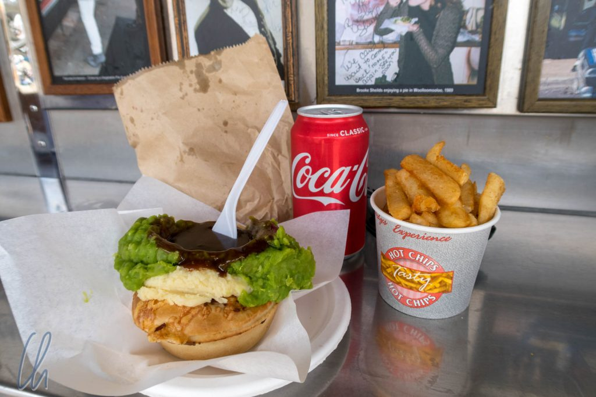

# Vier Tage in Sydney

In den vergangenen Tagen waren wir viel gefahren, Australien ist schon richtig groß ;). Die Strecke von Mon Repos nach Sydney betrug gut 1300km entlang einer sehr sehenswerten Küste. In Sydney angekommen, haben wir uns zuerst unseres Auto entledigt (Thank you Hans!). Sydney erkundeten wir zu Fuß, mit der Bahn und per Schiff.

<!--more-->

## Wo alles begann

Am ersten Morgen besuchten wir den Botanischen Garten. Dort hatten wir uns zu einer Aborigine-Führung angemeldet. Unsere Führerin mit heller Haut und roten Haaren stellte sich als Ureinwohnerin vor. Wir waren sehr erstaunt, da wir in ihr niemals eine Aborigine erkannt hätten. Bereits zu diesem Zeitpunkt wurde eine gängige Vorstellung widerlegt - Reisen bildet :).

Auf der Tour stellte sie uns viele Pflanzen samt traditionellen Verwendungsmöglichkeiten und einige (aus unserer Sicht) australische Kuriositäten vor. In Australien gibt es zum Beispiel Grasbäume. Sie wachsen extrem langsam und sehen für unsere europäischen Augen sehr ungewöhnlich aus.

Außerdem erfuhren wir, dass Kapitän Arthur Phillip ziemlich genau an diesem Platz am 26. Januar 1788 mit der First Fleet an Land gegangen war, laut offizieller australischer Zeitrechnung der Beginn der Besiedlung. Die Sichtweise der Aborigines auf dieses Datum ist ganz anders. Das gilt sowohl für den Botanischen Garten in Sydney im Kleinen als auch für ganz Australien allgemein. Dort, wo heute der Park ist, war früher ein besonderer Ort, an dem Initiationsriten durchgeführt wurden. Auch die Veränderung des Landes durch Bebauung sahen die Ureinwohner als störenden Eingriff in die Natur. Für wenige Momente wirkte unsere nette Führerin sehr ärgerlich - und wir wurden zum ersten Mal Zeugen eines tiefen Konfliktes in der australischen Gesellschaft.

Der Moment verflog schnell und die Führung endete mit der Verkostung von traditionell zubereitetem Bush-Brot ("Damper"). Das war allerdings nur ein leckeres Häppchen. Für unser richtiges Mittagessen mussten wir noch ein bisschen Laufen.

## Harry weckt den Tiger in Dir

Unser Ziel war [Harry's Cafe de Wheels](https://en.wikipedia.org/wiki/Harry's_Cafe_de_Wheels), ein ehemaliger Food Truck in Kings Cross am Hafen, der auf über 70 Jahre Tradition zurückblicken kann und mittlerweile eine fest installierte Bude ist. Im Laufe der Jahre wurde das Cafe de Wheels eine Institution und viele Stars und Sternchen waren hier zu Gast. Hier reihten wir uns gerne ein ;).

Die Spezialität des Hauses ist der „Tiger“, eine herzhafte Fleischpastete nach Wahl, die mit Kartoffelpüree und mushy peas bedeckt wird. In das breiige Topping wird eine Mulde gedrückt und diese mit Soße aufgefüllt. Als Beilage gab es Pommes Frites und Cola. Eigentlich das ideale Katerfrühstück nach einer durchzechten Nacht, aber ebenso gut ein kulinarisches Commonwealth Highlight zur Mittagszeit!

## Das sensationelle Sydney-Panorama

Vieles, was wir über Brisbane geschrieben haben, trifft auch auf Sydney zu, allerdings ist hier alles etwas größer. Mit 4 Millionen Einwohnern ist Sydney die größte Stadt Australiens und doppelt so groß wie Brisbane. In den Parks gibt es außergewöhnliche Vögel (z.B. [Gelbhaubenkakadus](https://de.wikipedia.org/wiki/Gelbhaubenkakadu)), die Namen der Straßen und Plätze sind sehr britisch und es gibt viele englisch anmutende, prachtvolle Gebäude. Insgesamt macht die Metropole einen schicken und selbstbewußten Eindruck. Das Besondere an Syndey ist jedoch seine Lage, seine Lage und nochmal seine Lage.

Die Mündung des [Parramatta River](https://de.wikipedia.org/wiki/Parramatta_River) bildet den [Port Jackson](https://de.wikipedia.org/wiki/Port_Jackson), Sydneys riesigen natürlichen Hafen mit zahlreichen Nebenbuchten. An vielen Punkten in der Stadt hat man einen herrlichen Blick aufs Wasser und das gibt einem ein Gefühl der Weite, so dass man sich zwischen den Wolkenkratzern nicht so eingeengt vorkommt. Die [Harbour Bridge](https://de.wikipedia.org/wiki/Sydney_Harbour_Bridge) (von den Einwohnern Syndeys liebevoll „Coat Hanger“ genannt) überspannt Port Jackson, verbindet das Nord- und das Südufer und bildet einen Fixpunkt der Skyline. Vom Aussichtspunkt auf einem der Brückenpfeiler bietet sich eine wundervoller Ausblick.

## Ausflug nach Manley

An einem anderen Tag fuhren wir nach Manly, um dort den sog. North Head auf einer Wanderung zu umrunden, den nördlichen Ausläufer des Landes an der Hafeneinfahrt. Zum Startpunkt brachte uns eine Linienfähre, die am Circular Quay ablegte, direkt zwischen Opernhaus und Harbour Bridge. Entsprechend atemberaubend war der Blick, vor allem am Anfang der Fahrt.

In Manly angekommen, begannen wir unsere Wanderung. Das Thermometer zeigte bestimmt schon 30 Grad - warm aber kein Vergleich zu den extremen Temperaturen der vorherigen Tage, über die selbst die [Lippische Landeszeitung](http://wittmann-tours.de/wp-content/uploads/2018/03/IMG-1443-crop.jpg) berichtet hatte. (Zu dem Zeitpunkt befanden wir uns noch weiter im Norden Australiens, wo es nicht ganz so heiß war.)

Unser Weg führte über einige Strände, durch einen trotz der Trockenheit erstaunlich grünen kleinen Wald, über einen professionell angelegten langen Boardwalk durch buschbestandene Vegetation mit interessanten Pflanzen. Eine Sehenswürdigkeit auf dem Weg war der Dritte Quarantäne Friedhof.

Die nahegelege [Quarantänestation](https://de.wikipedia.org/wiki/Quarantine_Station_North_Head) diente dazu, erkrankte Passagiere einlaufender Schiffe abzusondern, um die Ausbreitung von Infektionserkrankungen in der Bevölkerung zu verhindern. Der Friedhof war relativ klein. Dennoch berichtete eine Informationstafel von einem archäelogischen Forschungsprojekt rund um den Friedhof. Immer wieder erlebten wir in Australien, wie die relativ kurze Geschichte seit der Kolonialisierung als wichtiges Kulturgut angesehen wird.

Von der Spitze des North Head bot sich ein wunderschöner Blick auf die Bucht von Sydney und die Skyline in der Ferne. Kapitän Phillip hatte sich damals einen ausgesprochen schönen Platz zum Landen ausgesucht! Auf dem Weg zurück wanderten wir zunächst durch struppige, mannshohe Vegetation bis wir schließlich den kurzen Abstieg erreichen, der zur idyllischen geschützten kleinen Bucht des Shelly Beach führte. Endlich konnten wir uns in den erfrischenden Fluten des Pazifik abkühlen.

## Der Zoo von Sydney

Unseren letzten Tag in Sydney verbrachten wir im [Taronga Zoo](https://de.wikipedia.org/wiki/Taronga_Zoo), um mehr über die ungewöhnliche australische Tierwelt zu erfahren. Der Zoologische Garten ist wunderschön auf einer Halbinsel der Bucht von Sydney gelegen, so dass einige Tiere, vor allem die Giraffen mit ihren langen Hälsen, einen Panoramablick über Sydney genießen können.

Besonders interessierten uns natürlich diejenigen einheimischen Tiere, die wir vermutlich in freier Wildbahn nicht sehen würden. Beim Betrachten der giftigen Spinnen im Terrarium hofften wir sehr, dass uns ein Wiedersehen ohne trennende Glasscheibe erspart bleiben würde.

Einer unserer Favoriten war das [Platypus (Schnabeltier)](https://de.wikipedia.org/wiki/Schnabeltier). Es ist eines der extrem seltenen eierlegenden Säugetiere, 40 bis 50 Zentimeter lang. Es schwamm ziemlich agil nach Nahrung schnäbelnd durch sein halbdunkles Aquarium und sah wirklich putzig aus. Als englische Zoologen die ersten Exemplare in die Heimat schickten, bezweifelte die europäische Fachwelt die Echtheit des Tieres. So unwahrscheinlich erschien die Existenz eines solchen Lebewesens, dass es eher glaubhaft schien, die „Beweisstücke“ seien aus Teilen verschiedener Spezies zusammengenäht worden.

Der Taronga Zoo war sehr sehenswert. Die Lemuren haben unsere Vorfreude auf Madagaskar im August gesteigert, und wir haben einige weitere typisch australische Tiere gesehen: Einige Arten nachtaktiver Nager (alles Beuteltiere, die sich hüpfend fortbewegen), ca. schweinchengroße, pelzige Wombats, dynamische Echidnas und den prächtigen [Leierschwanz-Vogel](https://de.wikipedia.org/wiki/Leierschw%C3%A4nze). Am späten Nachmittag wurden sogar die Kängurus und Wallabys aktiv.

