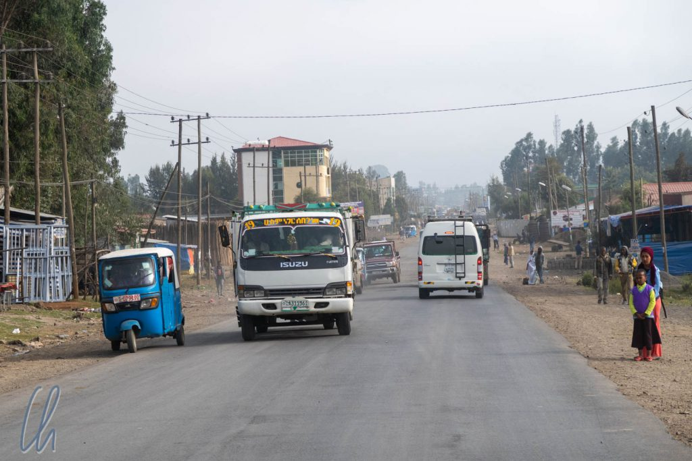
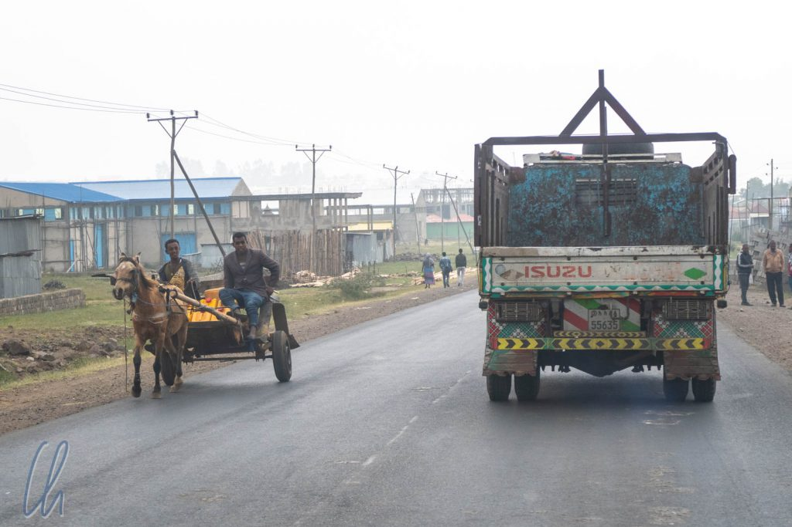
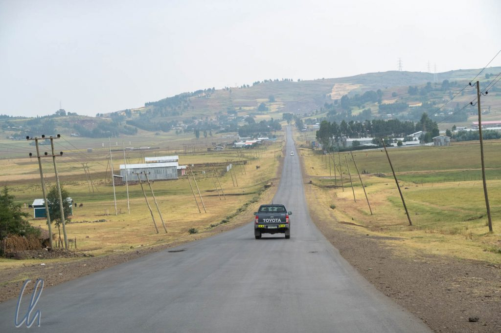
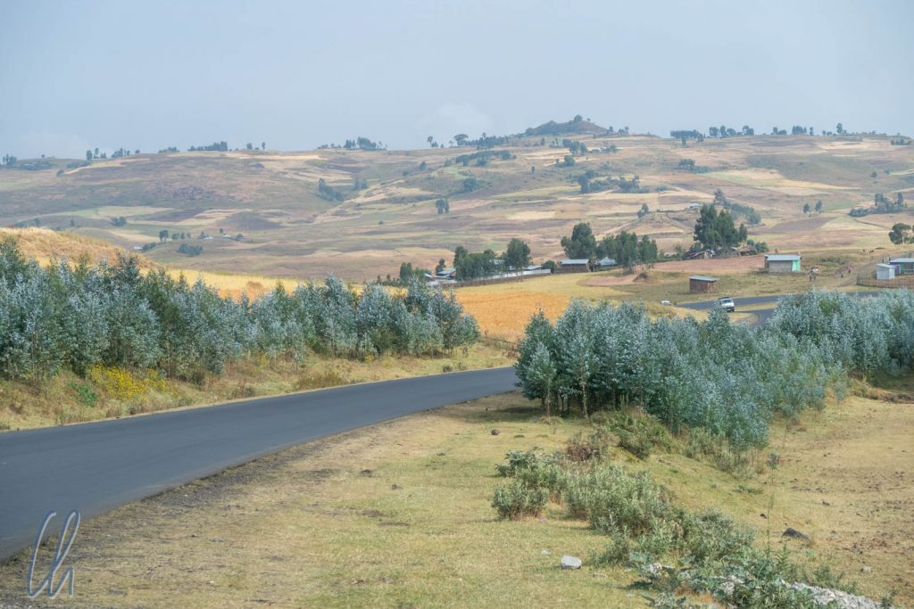
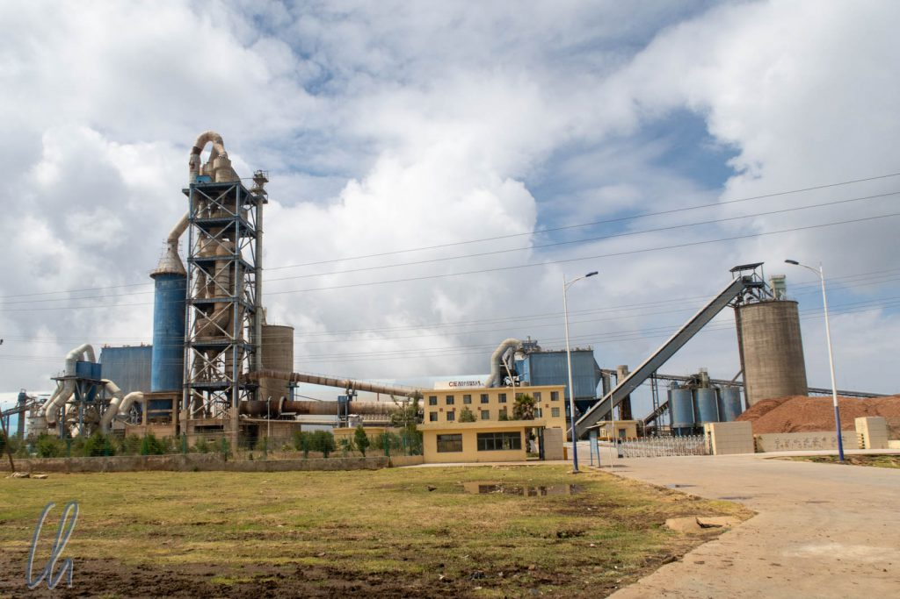
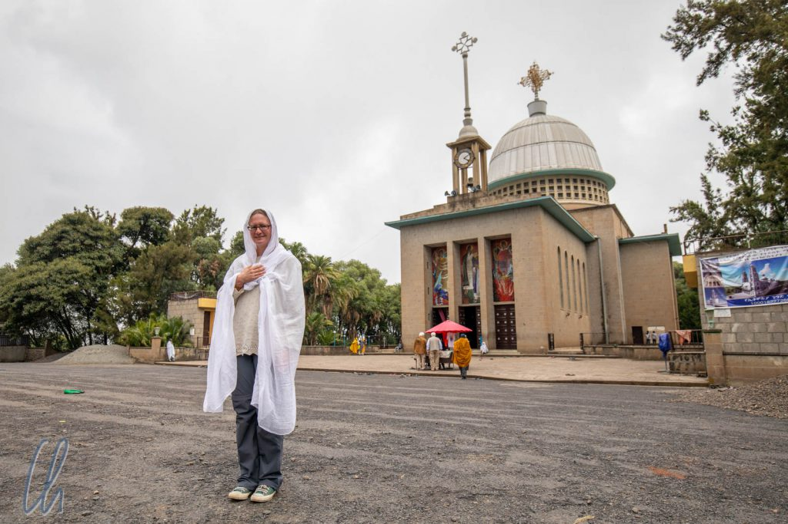

Unsere Reise durch den Norden Äthiopiens begann mit einem langen Fahrtag und es sollten noch weitere folgen. Von [Addis Abeba](http://wittmann-tours.de/addis-abeba-die-hauptstadt-aethiopiens) führte uns die Nationalstraße 3 fast 500km bis nach Bahir Dar am Tanasee. Unterwegs legten wir einen Zwischenstopp am sehenswerten Kloster Debre Libanos ein.

<!--more-->

## Wir verlassen Addis Abeba

Wir starteten wegen der vor uns liegenden langen Strecke morgens früh um 1 Uhr äthiopischer Zeit, also 7 Uhr morgens. Die Prognose von Google Maps lag bei 9 Stunden Fahrzeit, ob das wohl realistisch war? Trotz der frühen Stunde waren die Straßen voll, aber immerhin gab es keinen Stau, eher einen konstant zähfließenden Verkehr. Die Fahrbahn war in beide Richtungen nur einspurig und so hielten uns die vielen langsamen Lkws gehörig auf. An Überholen war wegen des Gegenverkehrs meist nicht zu denken.

In der Stadt gab es natürlich viele Pkws, deren Dichte nahm aber bald zugunsten von Transportern, Tuktuks, Kleinbussen oder Lkws ab. Die meisten Fahrzeuge dienten nicht dem Individualverkehr, sondern dem Transport von Menschen oder Waren. Die Straßen waren gut asphaltiert, hatten allerdings immer wieder auch bemerkenswerte Schlaglöcher. Nach gut einer Stunde hatten wir die Stadt endgültig verlassen und nun wurde es wirklich ländlich. Wir fuhren zwischen Äckern und Weiden entlang, eine sanfte Hügellandschaft erstreckte sich vor uns.

Auch wenn wir schon in Addis einige gesehen hatten, so waren nun deutlich mehr Fuhrwerke mit einem PS, einer ES (Eselstärke) oder 2 OS (Ochsenstärken) unterwegs. Esel waren allerdings meistens "nur" Lasttiere und manche trugen unglaublich schwere Lasten auf ihrem Rücken.

## Der Verkehr auf dem Lande

Die Landschaft erinnerte uns entfernt an Madagaskar (nicht so sehr an Tansania, da es dort wesentlich trockener war). Im Vergleich zu Madagaskar war das Verkehrsaufkommen höher, der Fahrbahnbelag deutlich besser (sah aber nicht nach einem chinesischen Neubau aus) und einiges wirkte moderner. Allein die Tatsache, dass es die vielen verschiedenen Nutztiere gab, war gegenüber Madagaskar ein deutlicher Fortschritt. Außerdem sahen wir Landmaschinen und folglich auch größere Felder, auf denen Bohnen, Hafer, [Sorghum](https://de.wikipedia.org/wiki/Sorghumhirsen) und natürlich auf [Teff](https://de.wikipedia.org/wiki/Teff) wuchsen. Manchmal verliefen Stromleitungen parallel zur Straße. Gelegentlich passierten wir auch Fabriken.

Außerhalb der Stadt nahm der Verkehr deutlich ab und wir kamen schneller voran. Maru musste trotzdem immer wieder Slalom fahren, nicht nur um die Schlaglöcher, sondern auch (nach deutlichem Abbremsen) um Ziegen, Kühe und Esel auf der Straße. Es schien uns, als ob Autoverkehr für manche Fußgänger in den Dörfern ein fremdartiges Konzept wäre. Vollkommen selbstvergessen und ohne zu Schauen überquerten sie die Straße, so dass Maru häufig hupte, um darauf aufmerksam zu machen, dass es besser wäre, ein wenig zu warten. Entgegenkommende Autos fuhren gerne auf der Suche nach der besten Spur auf der falschen Seite. Ein warnendes Aufblenden der Lichthupe forderte sie zum Räumen der Fahrbahnseite auf. Beim Überholen hupte Maru, um auf uns aufmerksam zu machen.

Auch wenn sich das rasant und abenteuerlich anhört, fuhr Maru doch auf der ganzen Reise konsequent defensiv und verantwortungsvoll, was wir sehr schätzten. Dennoch hätte in einem Dorf um ein Haar ein Hund sein Leben gelassen, als er sich direkt vor unsere Reifen warf. Nur Marus blitzschnelle Reaktion verhinderte seinen Tod.

## Das Kloster Debre Libanos

Das [Kloster](https://en.wikipedia.org/wiki/Debre_Libanos) Debre Libanos blickt auf eine lange Geschichte zurück. Es wurde 1284 gegründet und ist auch heute noch ein spirituelles Zentrum der äthiopisch-orthodoxen Christen. 500 Mönche und 300 Priester leben heute dort. Dennoch ist viel vom früheren Glanz des Klosters verblasst, da es während der italienischen Besatzung 1937 Schauplatz eines grausamen Massakers an den Mönchen war, komplett zerstört wurde und erst in den 1950er Jahren wieder aufgebaut wurde.

Im Kloster kamen wir das erste Mal mit der äthiopisch-orthodoxen Kirche in Berührung. Auch wenn es eine christliche Religion ist, unterscheidet sich diese Glaubensrichtung deutlich vom evangelischen oder katholischen Glauben. Zum Beispiel gibt es in Äthiopien Heilige, die im Westen vollkommen unbekannt sind. Einer davon ist [Tekle Haymanot](https://en.wikipedia.org/wiki/Tekle_Haymanot), der Gründer des Klosters. Tekle Haymanot wird mit Flügeln und nur einem Bein dargestellt. Der Legende nach betete er 34 Jahre lang stehend in einer Höhle. Durch das lange Stehen brach eines seiner Beine, (in einer anderen Version brach es der Teufel, um ihn am Beten zu hindern). Daraufhin schenkte Gott ihm Flügel und so konnte er weitere 7 Jahre beten.

## Besuch der Klosterkirche

Vor dem Betreten der Klosterkirche wurde auf einige wichtige Regeln hingewiesen. Frauen und Männer mussten verschiedene Eingangstüren durchschreiten. Das Innere der Kirche war in drei Bereiche eingeteilt, rechts für die Damen, in der Mitte für Priester und links für die Herren. Während des Besuches konnten wir uns allerdings frei im öffentlich zugänglichen Innenraum bewegen. Mona musste sich allerdings mit einem Tuch verhüllen, was wir eigentlich eher mit dem Islam verbinden. Desweiteren dürfen Frauen während der Menstruation nicht eintreten und es ist verboten, die Kirche zu besuchen, wenn man in den vergangenen 48 Stunden Geschlechtsverkehr hatte. Nicht zuletzt muss man seine Schuhe ausziehen, bevor man die Kirche betritt.

Im Inneren der Kirche bewunderten wir die farbenfrohen Glasfenster und die Waldgemälde im typisch äthiopischen Stil: bunt, gegenständlich und mit ihrer ganz eigenen Symbolik. So wird z.B. die Heilige Dreifaltigkeit in der Form von drei alten Männern mit weißem Bart und Heiligenschein dargestellt. Maria mit dem Jesuskind war ein ebenso häufiges Motiv wie die verschiedenen Erzengel.

## Spaziergang am Washa Gadel

Bevor wir unsere lange Fahrt fortsetzten, unternahmen wir einen Spaziergang am Washa Gadel, der Hundeschlucht, einem 700 Meter tiefen Canyon. Leider blieb uns der Ausblick über die Landschaft verwehrt, alles war in dichten Nebel gehüllt. Trotzdem spazierten wir die wenigen hundert Meter, da man hier oft [Dscheladas](https://de.wikipedia.org/wiki/Dschelada) (Gelada Monkeys) sehen kann. Diese Affen leben ausschließlich im äthiopischen Hochland. In der Tat erspähten wir einige Tiere auf einem Absatz im Canyon. Besonders die größeren männlichen Tiere mit ihrer üppigen Mähne waren sehr imposant.

Und dann geschah das Unglaubliche: In nur wenigen Minuten verflüchtigte sich der Nebel und gab einen weiten Panoramablick über die gewaltige Schlucht frei.

## Weiterfahrt nach Bahir Dar

Bald danach legten wir einen weiteren Stopp für eine Mittagspause ein und fuhren anschließend den Rest das Tages ohne größere Pausen weiter bis nach Bahir Dar, der längere Teil der Strecke lag noch vor uns. Gut 100 Kilometer weiter durchquerten wir die Schlucht des [Blauen Nil](https://de.wikipedia.org/wiki/Blauer_Nil), den wir auch am Folgetag sehen würden. Über unzählige Serpentinen verließen wir kurzzeitig das Hochland, bauten 1400 Höhenmeter ab und fuhren auf der anderen Seite wieder hinauf.

Die Fahrbahn sah auf den ersten Blick oft gut aus, hatte aber tiefe Furchen im Asphalt. Zu viele Lkws waren wohl hier entlang gefahren, um Material für ein Staudammprojekt am Blauen Nil zu transportieren.

Jede Stunde sahen wir mindestens ein Fahrzeugwrack am Straßenrand liegen, manchmal Pkws, aber meistens Transporter. Vermutlich waren ihnen eine zu sportliche Fahrweise, schlechtes Material und/oder zu viel Ladung zum Verhängnis geworden war. Einmal war es ein verunglückter Zwiebellaster, das andere Mal ein Gefahrguttransporter. Der Tanklastwagen war dabei undicht geworden und eine dunkle Flüssigkeit sickerte langsam ins Erdreich. In vielen Ländern dieser Welt fuhren die Menschen sehr ambitioniert, aber die Anzahl der Wracks, besonders angesichts der relativ geringen Verkehrsdichte, gab uns zu denken.

## Fahrt in die Nacht hinein

Als die Dämmerung einsetzte, hatten wir unser Ziel noch nicht erreicht. Maru fragte an einer Kreuzung einige Leute, ob eine kürzere Strecke mittlerweile asphaltiert wäre. Leider waren die Bauarbeiten noch nicht abgeschlossen und wir mussten den längeren Weg nehmen. Wir fuhren in die Nacht hinein und damit wurde der Verkehr auf eine andere Art interessant. Straßenbeleuchtung gab es natürlich nicht, Markierungen auch nicht. Dafür konnten unverhofft Steinhaufen auf der Straße liegen, Autos unmotiviert anhalten oder schlecht beleuchtet die Kurven schneiden. Die meisten anderen Fahrzeuge fuhren ausschließlich mit Fernlicht und blendeten dabei konsequent den Gegenverkehr. Mehrmals musste Maru dem entgegenkommenden Verkehr ausweichen und dabei das Asphaltband teils verlassen.

Schließlich erreichten wir erschöpft gegen 8 Uhr abends unser Ziel in Bahir Dar. Damit waren wir 13 Stunden unterwegs gewesen und hatten uns 2 Stunden davon nicht im Auto aufgehalten. Unter diesen Umständen stellten 500km an einem Tag eine mehr als beachtliche Leistung dar, anderswo auf der Welt wäre es eine Unmöglichkeit gewesen. Trotzdem war es hart am Limit des Machbaren, denn schneller wäre es auf keinen Fall gegangen, außer wir wären geflogen, aber das wäre teuer und vergleichsweise langweilig gewesen. Wir wollten ja schließlich Land und Leute sehen. Was wir zu dem Zeitpunkt noch nicht wussten: So flott sollten wir kaum mehr auf Äthiopiens Straßen unterwegs sein wie an diesem ersten Fahrtag.
