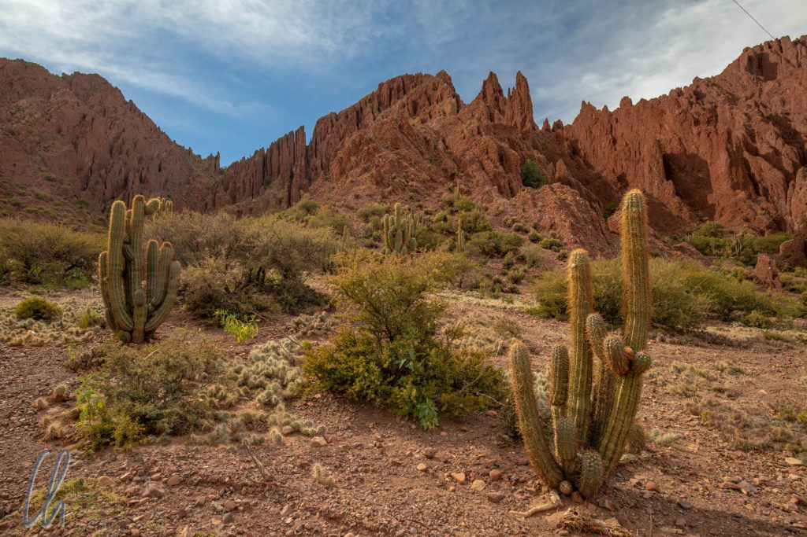
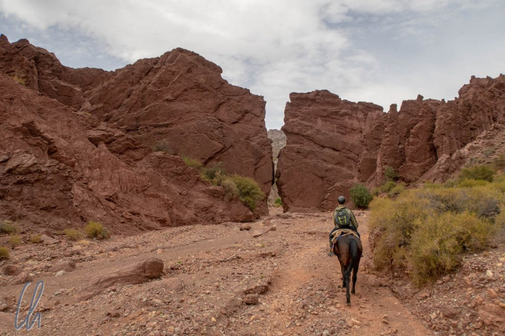
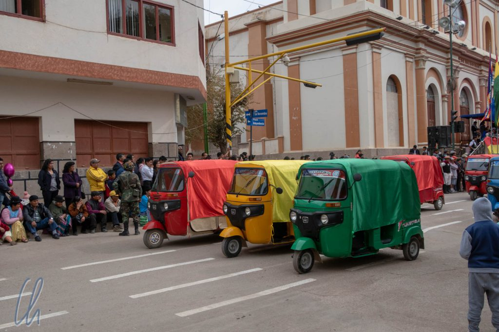
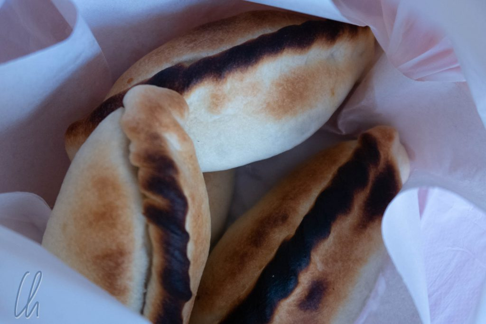

Die Kleinstadt Tupiza war für uns der logische Endpunkt unserer [Tour im Altiplano](http://wittmann-tours.de/salar-de-uyuni-salz-soweit-das-auge-reicht), da wir nicht wieder zurück nach Uyuni wollten. Nach der kargen, lebensfeindlichen Natur mit ihren teils abstrusen Manifestationen [in den vergangenen Tagen](http://wittmann-tours.de/das-suedliche-altiplano-zwischen-uyuni-und-tupiza) wirkte der Ort eher bodenständig. Wir hatten Zeit für Besorgungen, zum Erholen, aber trotzdem auch zum Entdecken der sehr sehenswerten Landschaft in der Umgebung. Außerdem hatte Tupiza noch einige kleine Überraschungen zu bieten. Auf der anschließenden Busfahrt nach Sucre erlebten wir ebenfalls ein komplett untouristisches Bolivien.

<!--more-->

## Ausritt rund um Tupiza

Auch wenn wir in den vergangenen Tagen vor allem im Auto gesessen hatten, waren wir nach der Altiplanotour recht erschöpft. Da kam es wie gerufen, dass auch Ausflüge zu Pferd rund um Tupiza angeboten wurden. Also buchten wir einen Halbtagesritt durch die Schluchten der Umgebung.

Damit begaben wir uns - passenderweise hoch zu Roß - auf die Spuren der berühmten Banditen [Butch Cassidy](https://de.wikipedia.org/wiki/Butch_Cassidy) und Sundance Kid, [deren Leben](https://de.wikipedia.org/wiki/Butch_Cassidy_und_Sundance_Kid) in der Nähe von Tupiza ein gewaltsames Ende fand. In der Tat erinnerte die Landschaft an eine Wild-West-Kulisse: Rote Felsformationen, große Kakteen. Wir besuchten den Cañon del Duende, eine enge Schlucht, in die man nur durch einen sehr schmalen Eingang gelangt und in der es angeblich spukt. Im Valle de los Machos sahen wir Steinsäulen, die sich phallusartig in die Höhe recken. Der Cañon del Inca ist deutlich breiter und wird durch die Puerta del Diabolo begrenzt.

Leider war es an dem Tag etwas bewölkt, so dass die Landschaft und die Felsformationen häufig im Schatten lagen. Dies schmälerte den monumentalen Eindruck leider ein wenig.

## Besorgungen, Fiesta und Salteñas

An unserem zweiten Tag in Tupiza hatten wir ursprünglich geplant, für den Blog zu schreiben und ein paar Besorgungen zu erledigen. Zum Beispiel gingen wir beide zum Friseur - mit gemischtem Ergebnis. Unser Programm wurde überraschenderweise dahingehend bereichert, dass in Tupiza das 444. Gründungsjubiläum gefeiert wurde. So sahen wir uns mittags die Parade auf dem Hauptplatz an. Das Spektakel reichte erwartungsgemäß bei weitem nicht an die [Fiesta del Gran Poder](http://wittmann-tours.de/la-paz-fiesta-del-gran-poder-und-mehr) heran, aber vermutlich war ganz Tupiza und Umgebung dabei, teils als Teilnehmer, teils als Zuschauer. Nicht nur Militär und Polizei marschierten in verschiedenen Gruppen mit, sondern auch z.B. der Fußballverein, verschiedenste Reiter auf wild zusammengewürfelten Pferden und die lokalen Tuktuks nahmen in Formation Teil.

Eine kulinarische Spezialität Boliviens sind Salteñas, köstliche, warme mit Hackfleisch und Kartoffeln gefüllte goldgelbe Teigtaschen. Obwohl sie an mehreren Stellen angeboten wurden, gab es eine lange Schlange vor dem Café "Salteñas del Pago". Wir dachten uns "When in Tupiza, do as the Tupizeños do" und stellten uns auch an. Als wir dran waren, signalisierten wir durch Handzeichen, wie viele der begehrten Backwaren wir haben wollten und bekamen einige Minuten später eine verheißungsvoll gefüllte Tüte ausgehändigt. Wir wurden nicht enttäuscht: Die Teighülle war knusprig, die Füllung herzhaft, saftig und kochend heiß.

## Basar oder Busbahnhof?

Bei der Organisation der Weiterfahrt nach Sucre über Potosí erlebten wir mal wieder, dass ein Busbahnhof auch wie ein Marktplatz funktionieren kann. Von den diversen Schaltern riefen uns die Verkäuferinnen der verschiedenen Anbieter die Ziele, die Zeiten und die Klasse der Busse zu. Vom Verkaufsstand, an dem wir später unsere Tickets kaufen sollten, schallte es ungefähr alle 30 Sekunden: „Potosí, Potosí, a las 10, Bus cama, Potosí!“.

In Bolivien stehen Nachtbusse anscheinend hoch im Kurs, da die Leute durch die Fahrt keinen Arbeitstag verlieren möchten. Bei uns jedoch nicht, da wir in echten Betten besser schlafen, egal, wie komfortabel der Bus ist. Außerdem wollten wir auch gerne etwas von der Landschaft sehen. Wir hatten erwartet, dass die Strecke nach Potosí tagsüber regelmäßig von Buslinien befahren würde. Als wir uns am Busterminal durchfragten, gab es aber nur einen Bus vormittags nach Potosí, also folgten wir den Rufen „Potosí, Potosí, a las 10, Bus cama, Potosí!“ und kauften zwei Tickets für den Bus um 10 Uhr.

## Busfahrt nach Potosí

Natürlich sagte man uns, dass wir mindestens 10 Minuten vor Abfahrt am Busbahnhof sein sollten. Aber Bolivien kann es beim Thema Pünktlichkeit nicht mit Mexiko oder Argentinien aufnehmen. Der Bus fuhr dann um 10 Minuten nach 10 Uhr ein. Das Versprechen der Klasse „Cama“ (wörtlich „Bett“) war hingegen nicht übertrieben. Der Doppeldeckerbus (bestimmt nicht neu, aber erstaunlich modern) hatte Raum wie in der Business Class und nur drei Sitze in einer Reihe und das für 30 Bolivianos, gut 4 Euro. Bei geschätzten 30 Plätzen erwirtschaftete der Bus also 120 Euro Umsatz, von dem der Bus selbst, der Busfahrer, die Fahrkartenverkäuferin und das Diesel bezahlt werden müssen. Es muss sich wohl lohnen, sonst würde die Busgesellschaft den Service bestimmt nicht anbieten.

Dann wurde eine Menge Gepäck und auch verschiedene Frachtgegenstände ausgeladen und eingeladen, ein paar Passagiere stiegen aus, wir stiegen ein. Weitere 10 Minuten später kamen noch ein paar fliegende Händler durch den Bus, ein sicheres Zeichen dafür, dass es nun wirklich bald losgehen würde ;). Fünf weitere Minuten später fuhr der Bus dann ab, also "pünktlich" um 10:30 Uhr. Die letzten riesigen Kakteen und Berge mit roten Felsen zogen an uns vorbei und wir sagten Tupiza „Adios“.

Dann geschah leider das Unvermeidliche: Wenige Minuten nach der Abfahrt wurde ein Film ("Geotormenta") gestartet und der Ton kam nicht über Kopfhörer, sondern in voller Lautstärke über die Lautsprecher. Es handelte sich um einen aktionsreichen Science Fiction-Streifen, dem man auf diese Weise nicht gänzlich entkommen konnte. Also schauten wir immer wieder „Geotormenta“ und waren froh, dass die Menschheit am Ende gerettet wurde. Noch erleichterter waren wir jedoch, dass der Film endlich vorbei war. Zur Mittagszeit hielt der Bus für 20 Minuten an einem Restaurant der Buslinie. Die kräftige Reissuppe mit Rindereinlage, Kartoffeln und getrockneten Kartoffeln kostete 5 Bolivianos (60 Euro Cent).

## Die legendäre Silberstadt Potosí

In der sagenumwobenen Stadt [Potosí](https://de.wikipedia.org/wiki/Potos%C3%AD) angekommen waren wir nicht wirklich traurig, dass wir sofort weiterfuhren. Der legendäre Cerro Rico, der reiche Silberberg von Potosí, hatte während der Kolonialzeit die Exzesse des spanischen Königshofes finanziert. Unzählige einheimische und afrikanische Sklaven waren der Gier nach dem edlen Metall zum Opfer gefallen und starben bei der harten Arbeit unter unmenschlichen Bedingungen in den Silberminen auf einer Höhe von über 4000m über dem Meeresspiegel. Es ist nicht bekannt, welche unermesslichen Schätze in Potosí gefördert und auf dem Seeweg nach Spanien gebracht worden waren. Doch irgendwann geschah das Unvermeidliche: Nach vier Jahrhunderten des Abbaus waren die Vorkommen erschöpft.

Noch heute suchen Bergleute unter sehr schlechten Arbeitsbedingungen in den Minen nach dem Metall, aber die Erträge sind mager. Die ehemals unermesslich reiche Silberstadt wirkte trostlos auf uns, soweit wir das aus dem Bus sehen konnten. (Die Altstadt mit ihren prachtvollen Gebäuden aus der Kolonialzeit bekamen wir nicht zu Gesicht.) In der Umgebung der Stadt lagen Berge von Müll überall am Straßenrand und der kalte Wind wehte das Plastik über die kahlen, staubigen Felder. Dem vegetationslosen Cerro Rico sah man an, dass sein Unterstes zuoberst gekehrt worden war, überall lag Abraum.

## Umsteigen in Potosí

Das Umsteigen in Potosí funktionierte sehr gut für uns. Wir kamen um 15:50 Uhr an und auf dem Weg in Richtung Hauptterminal kam uns eine Fahrkartenverkäuferin entgegen, die gerade dabei war, einen Bus nach Sucre aufzufüllen. Er sollte um 16:00 Uhr abfahren, was er natürlich nicht tat, da die Bolivianer noch ihr sämtliches umfangreiches Gepäck im Bus verstauen mussten. Es schien loszugehen, doch der Bus fuhr nur bis zum Ausgang des Busbahnhofes. Dann dauerte es dort noch etwas, da die obligatorische Terminalgebühr von 2 Bolivianos von jedem Passagier einzeln kassiert und noch zwei Fahrgäste eingesammelt wurden. "Pünktlich" um 16:20 Uhr war unser Solo Turismo-Bus ("nur Tourismus"), in dem zu 80% Einheimische saßen, unterwegs.

Diesmal waren wir mittendrin statt nur dabei. Der Gang war vollgestellt, der Bus schaukelte, klapperte und ratterte. Im Gegensatz zum Bus Cama, war so mancher Schulbus bequemer als unser Gefährt nach Sucre. Kaum 500 Meter weiter stiegen noch weitere Passagiere zu, mehrere Pakete und Taschen wurden in alle Ritzen gequetscht oder im Gang gestapelt, woraufhin von hinten unruhige Zwischenrufe ertönten „Vamos!“ („Auf geht‘s“) und dann waren wir schließlich und endlich unterwegs.

## Fahrt in die Dunkelheit

Von Potosí aus ging es endgültig bergab. Wir verließen das Hochland. Unser Ziel, die Stadt Sucre, lag "nur" noch auf 2800 Metern. Unterwegs vergoldete ein spektakulärer Sonnenuntergang den Himmel und bald wurde es stockdunkel im Bus. Es war still und nicht einmal der Schein von Smartphones erhellte die Dunkelheit.

