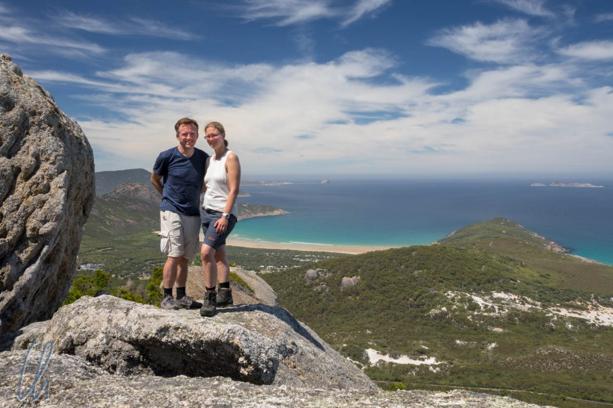
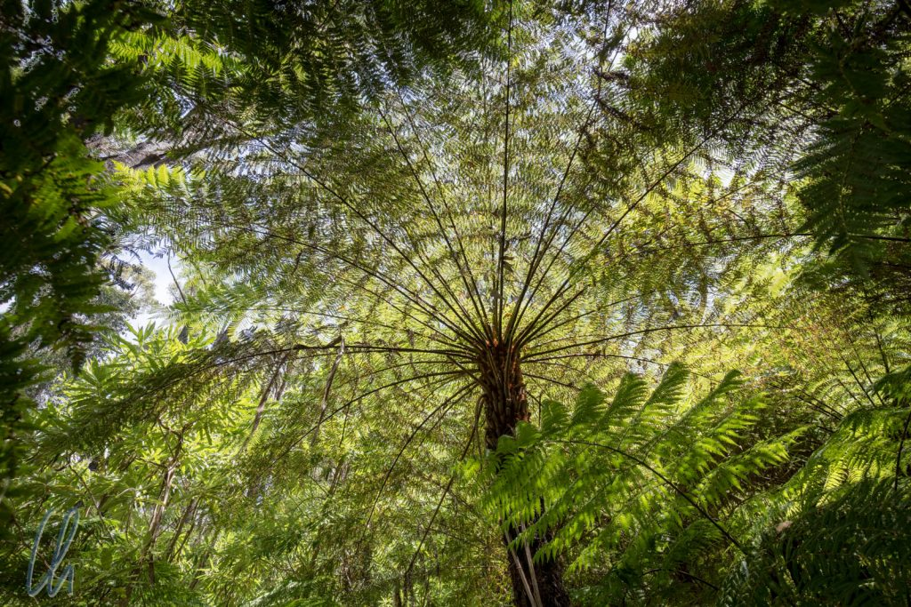
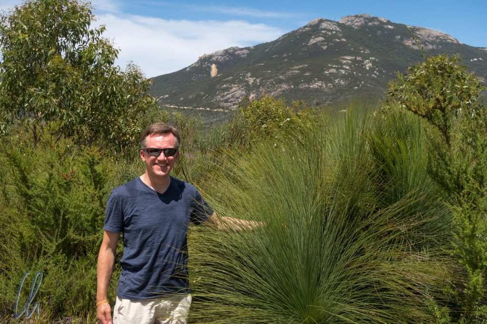

An der [Südspitze des Australischen Festlandes](https://de.wikipedia.org/wiki/Wilsons-Promontory-Nationalpark) liegt der Wilsons Promontory Nationalpark, nach Tasmanien kommt im Süden nur noch die Antarktis. Obwohl der Park nur gut 3 Stunden von Melbourne liegt, waren die Besucherzahlen für unser Empfinden trotz Sommerferien und Wochenende sehr gering. Für uns bot er die perfekte Kombination aus 3 Ws: Wandern, Wasser (soll heißen Strand) und Wildlife.

<!--more-->

## Wandern im Wilsons Promontory

Manchmal werden Länder von Besuchern aus dem Ausland gedanklich auf bestimmte, vermeintlich typische Regionen reduziert. So besteht Deutschland für viele Reisende nur aus Bayern und mit Australien assoziieren die meisten Leute erstmal das Outback und vielleicht noch Sydney mit Opernhaus und Harbour Bridge. Dass es in Australien auch Regenwald gibt, erlebten wir (etwas erstaunt) entlang der Ostküste. Auch im Wilsons Promontory gab es an den Hängen einiger Berge diesen dichten, grünen, von vielen Vögeln bevölkerten Wald.

Der Weg zum Mt. Bishop führte stetig bergauf durch den schattigen Wald. Entlang des Pfades sahen wir immer wieder - teils recht farbenfrohe - Vögel in den Bäumen oder hörten ihre Rufe. An einigen Stellen eröffneten sich spektakuläre Ausblicke auf die Küste und das Meer. An wieder anderen wurde es erfrischend kühl, dunkler, die Luftfeuchtigkeit stieg und die Baumfarne gediehen prächtig. Auf dem Rückweg passierten wir auch trockenere Bereiche, wo wir wieder auf die lustigen Grasbäume trafen.

Am zweiten Tag wanderten wir nahe der Küste über einen Bergrücken zum Aussichtspunkt "Tongue Point". Erst liefen wir unter Eukalyptusbäumen, dann durch einen niedrigen Trockenwald. Später säumten hohe Büsche den Weg. Somit gab es immer öfter herrliche Ausblicke auf Inseln, Buchten und Strände.

## Wasser: Wer kommt mit zum Baden?

An beiden Tagen waren wir gegen 3 Uhr nachmittags wieder zurück am Auto, haben uns dann im einzigen Ort im Park, in Tidal River, ein Eis am Stiel gegönnt und dabei die recht zahmen bunten Papageien beobachtet. Dann steuerten wir als nächstes Ziel den wunderhübschen Squeaky Beach an. Und wirklich macht der Strand seinem Namen alle Ehre, denn der feine Sand quietscht, wenn man nur fest genug auftritt :)

https://www.youtube.com/watch?v=Cf_UWQ6lpAc

Der weiße Sand und das klare Wasser luden nicht nur zum Quietschen ein, sondern die rauschenden Fluten auch zum Baden. Das Wasser war trotz hochsommerlichen Lufttemperaturen nur ca. 20 Grad warm, also noch schön erfrischend. Zum Schwimmen war die Brandung zu kräftig, aber wie dafür gemacht, durch die Wellen zu tauchen :).

## Wildlife in der Abenddämmerung

Der letzte Stopp des Tages war jeweils der Wildlife Walk, ein kurzer Rundgang in der Nähe des kleinen Flughafens im Park, der nicht viel mehr als eine lang gezogene, gemähte Wiese ist. Die Erwartungen waren hoch, schließlich hatten wir im Gästebuch unserer Unterkunft viele begeisterte Berichte gelesen. Aber bei den lieben Tierchen weiß man ja nie, ob sie sich wie gewünscht einstellen oder nicht.

Wir wurden nicht enttäuscht: Mit abnehmenden Temperaturen wurden die Kängurus aktiv und kamen allmählich auf die offenen Flächen, um dort zu grasen. Schon nach guten 100 Metern sahen wir die ersten beiden Beuteltiere am Rande einer Lichtung. Weiter entlang des Weges und auf der Landebahn sahen wir viele, viele Kängurus, große Männchen, kleinere Weibchen und auch Junge. Sie waren die Schaulustigen offensichtlich gewöhnt, da sie wenige Meter abseits des Weges unbeeindruckt grasten. Zuweilen hüpften sie auch, wie auf Sprungfedern, mal gemütlich, mal in hohem Tempo über die offene Graslandschaft. Als Dreingabe flogen Scharen von Gelbhaubenkakadus und bunten Papageien laut krakeelend durch die Luft.

Abends ruhten wir uns in unserem gemütlichem Cabin aus. Zum ersten Mal seit Mon Repos zeigten sich nachts die Sterne in Abwesenheit von Mond und Umgebungslicht in voller Pracht. Somit genossen wir noch ein viertes W, den Weltraum.

