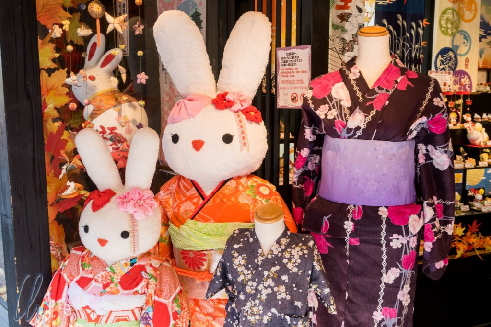
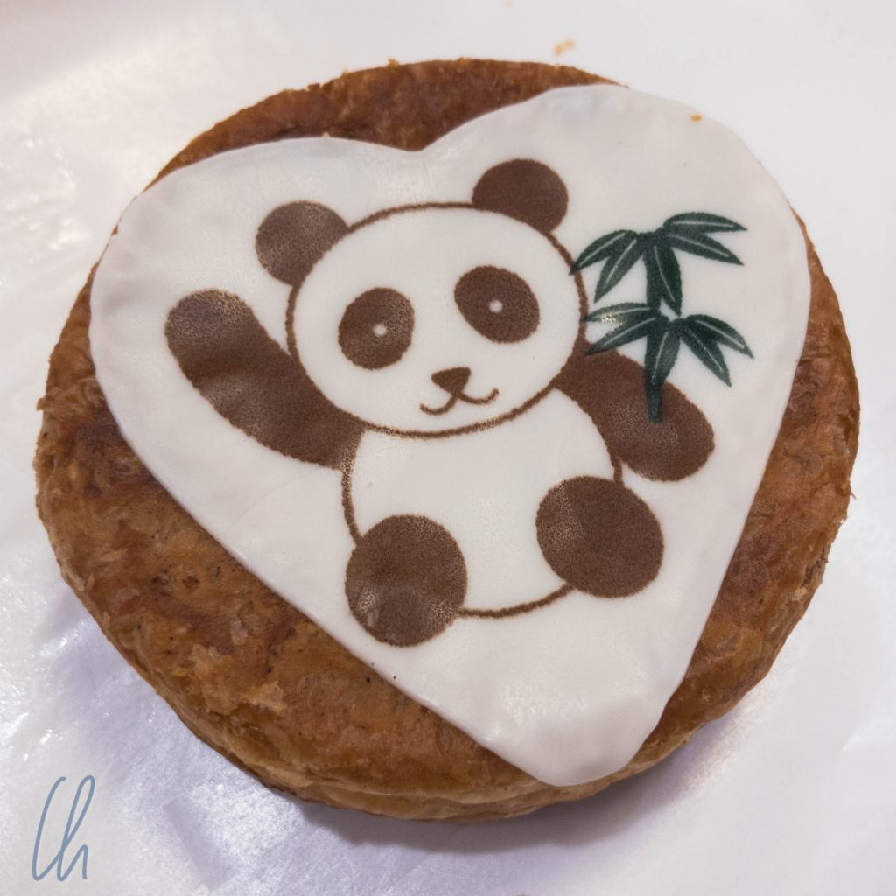
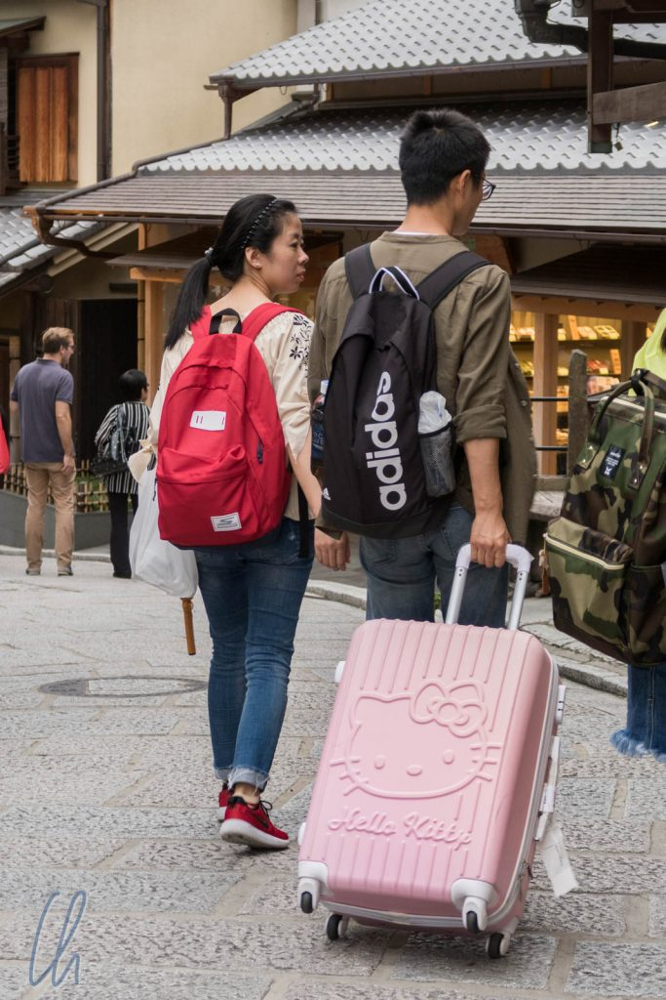
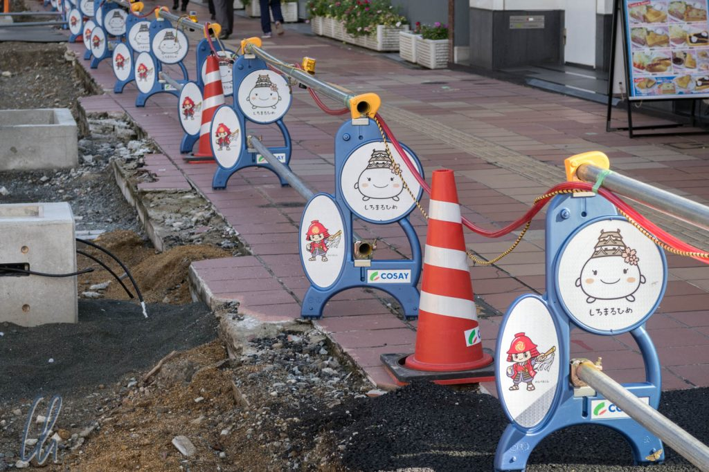

# Was bedeutet kawaii?

Das Wort "kawaii" hat keine wirkliche Entsprechung im Deutschen. Am besten lässt es sich vielleicht mit "niedlich" übersetzen, aber es schwingt noch mehr mit. Begeben wir uns also auf die Suche nach dem kawaii!

<!--more-->

## Was bedeutet kawaii?

Kawaii kann auch mal eine Komponente haben, die ans Kitschige grenzt. Dabei schüttelt es natürlich den Deutschen ;). Dann ist da auch noch etwas kindliches, auch in der Welt der Erwachsenen. Und manchmal ist kawaii aber auch einfach nur süß. Negativ abgegrenzt wäre ein lebendiger Hamster eher nicht kawaii, weil er zu natürlich ist. Ein Alltagsgegenstand wird kawaii, wenn man ein süßes Logo, Maskottchen oder Symbole aufbringt:

Hello Kitty ist vielleicht bekannt, in Japan sehr präsent und sehr kawaii. Hello Kitty Accessoires sind bei weitem nicht nur für Kinder gedacht sondern für jedermann: Eine Hello Kitty-Handyschale steht so auch der Generation 50+ gut, und auch sonst gibt es Hello Kitty auf Topflappen, Küchentüchern, Geldbörsen, Rucksäcken, als Anhängerchen, und, und, und. Dagegen ist der Einhorn-Hype in Deutschland noch vergleichsweise verhalten ;)

## Wo ist Japan kawaii?

Kawaii beschränkt sich aber nicht nur auf Hello Kitty. Uns begegneten weitere Bekannte aus der Popkultur und auch viele Eigenkreationen. Gefühlt hat jedes Geschäft ein süßes Maskottchen, auch solche, bei denen wir es schon fast als unseriös empfinden würden. Immobilienmakler und Banken gehen zuweilen ebenso in die Kawaii-Offensive wie Cafes, Restaurants oder Parkhäuser. Außerdem gibt es Städte-Maskottchen oder kawaii Straßenabsperrungen. Insgesamt ist es im öffentlichen Raum an vielen Stellen kawaii.

Wenn etwas kawaii ist, dann wird dies von den Japanern manchmal nicht nur stillschweigend wahrgenommen, sondern auch durch den Ausruf "kawaiiiiii!!" kommentiert. In Kyoto gingen wir z.B. in der Nähe des Inari-Schreins an einer Straße entlang. Einige Schulmädchen kamen uns in ihrer adretten Schuluniform entgegen und auf einmal quiekten sie beinahe im Chor "kawaiiiii". So hundertprozentig konnten wir nicht ausmachen, was ihre Aufmerksamkeit erregte, aber es muss super-kawaii gewesen sein :)

Im Oktober war Halloween auch ein großes saisonales kawaii-Thema. Überall lachten uns niedliche Kürbisse an, an der Hotel-Rezeption, in der Bäckerei, im Supermarkt oder im Restaurant. Den Halloween-Kawaii-Vogel hat MOS-Burger abgeschossen, dort gab es sogar einen Halloween-Baum - Kawaii!

Insgesamt fiel uns auf, dass es den Japanern an sehr vielen Stellen gelingt, über kawaii-Elemente Aufmerksam zu erzeugen. Und kawaii macht wirklich Spaß: Selbst am Geldautomaten kommt ein kawaii-Feeling auf. Eine lustige Melodie erklingt, wenn die Karte eingeführt wird oder wenn das Geld ausgegeben wird. Trotzdem tragen wir noch keine Hello-Kitty-Socken.

Abschließend hier ein paar weitere Kawaii-Impressionen in der nachfolgenden Bilder-Sammlung. Viel Spaß bei Anschauen!

\[envira-gallery id="981"]
