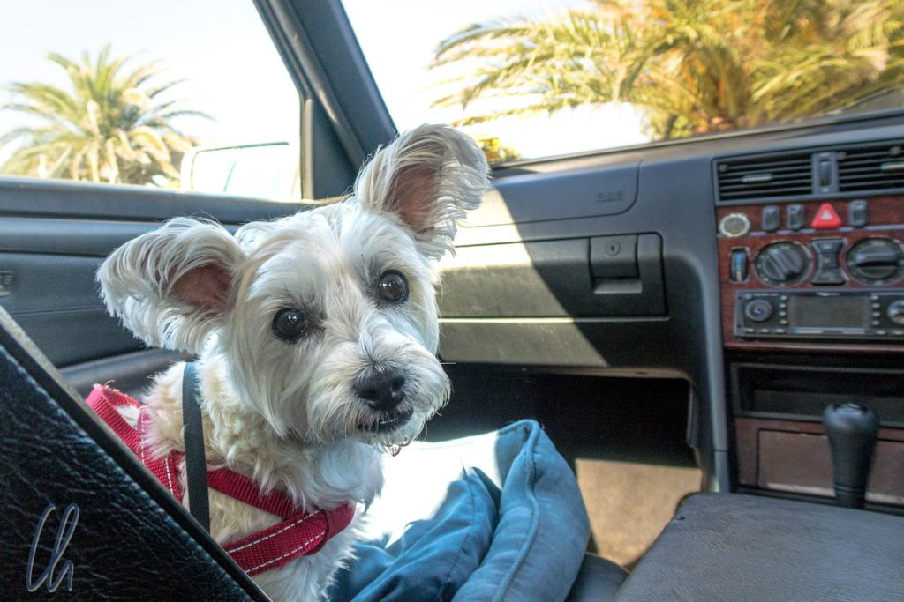
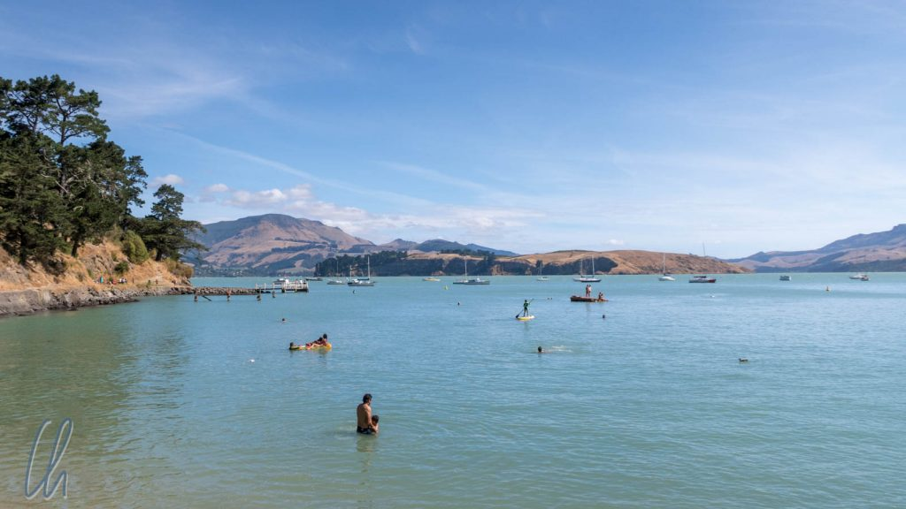
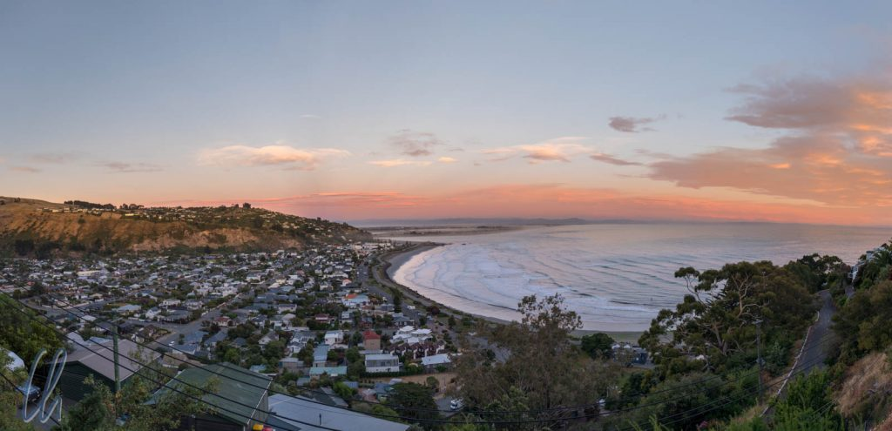
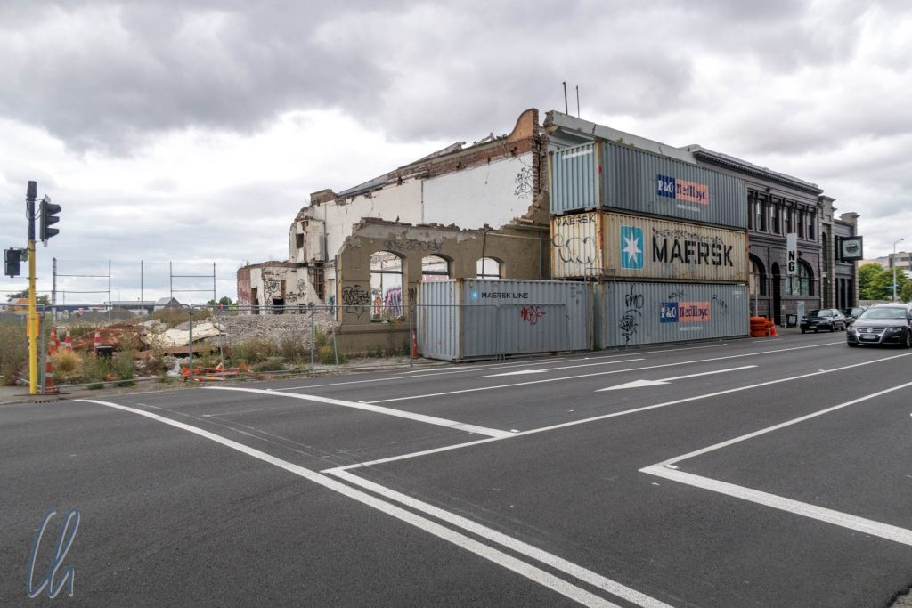
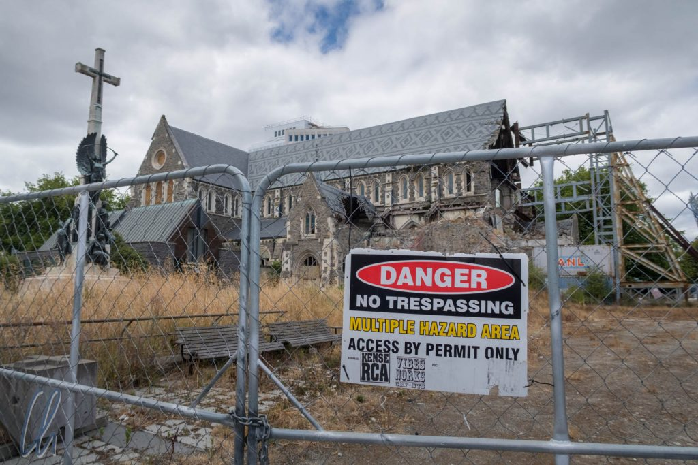

Die Zeit in Neuseeland war für uns eine Reisepause. Wir haben über [Weihnachten](http://wittmann-tours.de/frohe-weihnachten/) und Silvester zwei wunderbare Wochen bei Livia und Doris in Christchurch verbracht. Ein Tagesausflug nach Maruia Springs, der Besuch von Christchurch, schmackhaftes Essen, vollmundige Weine und - am wichtigsten - ausgezeichnete Gesellschaft! Fast täglich sind wir am Strand gewesen, mal zum Spazierengehen und, wenn es warm genug war, zum Schwimmen. Auch Hund Otti war auch ein Quell steter Freude für uns!

<!--more-->

## Das Ende der Welt

Christchurch, genauer gesagt der Stand von Corsair Bay einige Kilometer südlich von Christchurch, wird voraussichtlich der südlichste Punkt unserer Reise gewesen sein. Wir waren etwas erstaunt, als wir das eher zufällig auf der Karte herausfanden. Südlich von Neuseeland liegt nur noch die Antarktis. Außerdem ist Neuseeland deutlich weiter im Süden als das australische Festland und Südafrika. In Südamerika entspricht der 43. Breitengrad in etwa dem unteren Drittel von Chile. Da Patagonien nicht auf unserer Route liegt, waren wir also am südlichsten Punkt angekommen.

In Europa liegen Florenz und Nizza auf 43° nördlicher Breite. Entsprechend war der neuseeländische Sommer zwar etwas wechselhaft, meistens jedoch angenehm warm. Zu Weihnachten waren wir zu einer Grillparty im Garten eingeladen, wir aßen frische Erdbeeren und gingen barfuß am Strand spazieren - das war für uns eine ungewohnte Premiere ;)

Mit 12 Stunden Zeitverschiebung nach Deutschland und nochmal 6 bis 9 Stunden mehr in die USA mussten wir immer aufpassen, was die Stunde (oder sogar der Tag) am anderen Ende der Welt geschlagen hatte. Elektronische Weihnachts- oder Geburtstagsgrüße verschickten wir also immer erst am späten Nachmittag oder Abend, damit sie nicht einen Tag zu früh ankämen.

## Das Erdbeben von 2011

Das [Erdbeben von 2011](https://de.wikipedia.org/wiki/Christchurch-Erdbeben_vom_Februar_2011) hat die Stadt Christchurch bis ins Mark erschüttert. Das Beben war nicht extrem stark, "nur" maximal 6,3 auf der Richterskala, dafür fand es mittags zur Hauptgeschäftszeit statt. Durch ungewöhnliche geologische Umstände richtete es extrem viel Schaden an, forderte 185 Tote und Tausende Verletzte. Einen interaktiven Eindruck gibt diese [Website](http://www.stuff.co.nz/national/christchurch-earthquake/4705106/Photos-Before-and-after-the-Christchurch-earthquake). Selbst heute, gut 7 Jahre später, sind an vielen Orten die Schäden deutlich zu sehen. Die Baumaßnahmen werden noch Jahre dauern und unvorstellbare Summen verschlingen.

Im Zentrum von Christchurch mussten die Häuser ganzer Blocks abgerissen werden und bis heute sind sie nicht wieder aufgebaut worden. Die Kathedrale von Christchurch ist [weiterhin eine Ruine](https://www.stuff.co.nz/the-press/news/63810287/New-pictures-from-inside-Cathedral). Mittlerweile ist es zum Glück beschlossene Sache: Sie soll rekonstruiert werden. Wie lange es dauern wird, ist unbekannt. Die in wenigen Monaten gebaute provisorische Kirche hat eine prognostizierte Lebensdauer von 50 Jahren. Hoffentlich gibt das nicht den Zeitrahmen vor.

Für die Bewohner Christchurchs war die Naturkatastrophe ein einschneidendes Erlebnis. Die Menschen wissen genau, wo sie waren, als es passierte und jeder hat Opfer oder Verletzte in seinem Verwandten- oder Bekanntenkreis zu beklagen. Familien haben ihr Zuhause verloren. Selbst Gebäude, die nur beschädigt wurden, sind noch längst nicht alle repariert, auch weil z.B. Versicherungsfälle noch nicht abschließend geklärt sind oder Differenzen mit der staatlichen Erdbeebenkommission bestehen. Ganze Bereiche sind dauerhaft gesperrt ("red zones"). Deren Betreten ist unter Strafe verboten, selbst wenn es das eigene Grundstück ist. Dies trifft nicht immer auf Verständnis, befindet sich doch die gesamte materielle Habe - Dokumente, Möbel, Wertsachen, Kleidung, Fotos - in den einsturzgefährdeten Häusern.

## Wie Phönix aus der Asche

Trotz Erdbeben-Trauma und dem Verlust vieler schöner Gebäude ist Christchurch sehr sehenswert. Die Stadt macht in einigen Bereichen zwar noch den Eindruck einer Großbaustelle, erstrahlt in anderen aber schon in neuem Glanz. Einige historische Bauwerke konnten gerettet werden, elegante moderne Gebäude sind entstanden, die altmodische Straßenbahn fährt pittoresk durch die Innenstadt und die Kunstgalerie ist sehr sehenswert.

Außerhalb der Innenstadt haben wir die Strände von Sumner und Corsiar Bay sehr genossen. Trotz neuseeländischen Sommers lag die Wassertemperatur nur bei 18-20°C, was uns, die Schulkinder und die zahlreichen Surfer aber nicht abschreckte.

## Neuseeland kulinarisch

Was isst man in Neuseeland? Lamm natürlich - im Land in dem mehr Schafe als Menschen leben - und das vorzüglich! Auch die neuseeländischen Weine sind sehr zu empfehlen. Um die zweifelhafte Commonwealth-Errungenschaft [Marmite](<https://de.wikipedia.org/wiki/Marmite_(Lebensmittel)>) machten wir einen Bogen, aber die Kiwis lieben es - die Preise sind nach dem Erdbeben wegen Knappheit übrigens explodiert! Unser persönliches kulinarisches Highlight war aber zweifelsohne Pavlova.

[Pavlova](https://de.wikipedia.org/wiki/Pavlova) ist eine fluffig-leichte Baisertorte, die mit Sahne bestrichen und mit Früchten garniert wird. Auch wenn Neuseeland und Australien die Erfindung der Pavlova für sich in Anspruch nehmen, Neuseeland ist unser Pavlova-Land. Warum? Ganz einfach, hier stand sie öfter auf unserem Speiseplan: Gerne abends als Nachtisch und die Reste morgens zum Frühstück!

