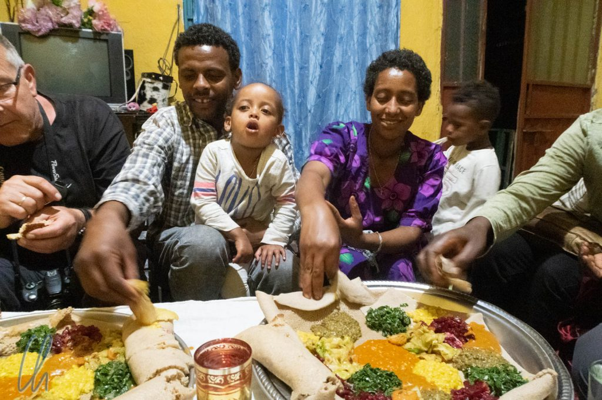

In Äthiopien begegneten uns viele Gegensätze. Die Menschen sind materiell sehr arm, das Land aber ist unglaublich reich an Kulturschätzen. In Äthiopien erreicht das Thermometer am tiefsten [Punkt Afrikas](http://wittmann-tours.de/dallol-der-heisseste-ort-der-welt) konstant so hohe Temperaturen wie sonst nirgendwo auf unserem Planeten. Dafür war es im Hochland mit einem der [höchsten Gebirgszüge](https://de.wikipedia.org/wiki/Hochland_von_Abessinien) Afrikas erstaunlich kühl. Trotz vieler einzigartiger Erlebnisse und Sehenswürdigkeiten gab es auch einige Wermutstropfen. Damit fällt unser Fazit zu Äthiopien eher gemischt aus. Warum? Weil wir keine Verbindung zu den Äthiopiern gefunden haben (oder sie zu uns).

<!--more-->

## Die Ferenji auf Reisen

In unseren drei Wochen im Norden Äthiopiens können wir uns an kein noch so kurzes freundliches und spontanes Gespräch mit einem Äthiopier erinnern, der nicht hoffte, uns Geld zu entlocken, bzw. den wir nicht bezahlt hätten. Klingt komisch? Vielleicht, aber in allen anderen Ländern auf unserer Weltreise gab es solche Begegnungen, teils trotz massiver Sprachbarrieren. In Äthiopien sind wir immer die Ausländer, die Ferenji, geblieben. Wir wollen uns keinen romantischen Illusionen des Reisens hingeben, aber ausnahmslos jeder Kontakt lief darauf hinaus, dass uns jemand nach Geld gefragt hat.

Wir hatten natürlich erwartet, als Ausländer wahrgenommen zu werden, aber leider müssen wir sagen, dass wir uns mehr als einmal respektlos behandelt gefühlt haben. Das äußerte sich häufig in extrem aufdringlichem Betteln mit mehr als überzogener Erwartungshaltung oder penetranten Verkäufern, für die ein wiederholtes und ehrliches "Nein" keine Antwort war. Sehr wahrscheinlich gibt es umgekehrt auch Touristen, die sich respektlos gegenüber Äthiopiern verhalten, aber diese immer wiederkehrenden unangenehmen Situationen wirkten ermüdend. Selbst wenn wir auf freier Strecke kurz anhielten, um hinter einem Busch zu verschwinden, konnte es passieren, dass fordernde Kinder auftauchten oder Bauern ihr Glück versuchten.

Die durchaus gute touristische Infrastruktur in Äthiopien hat vielleicht ihren Teil dazu beigetragen, da Ferenji immer die gleichen Orte aufsuchen. So konnte sich ein Teil der Einheimischen vor Ort anscheinend das eine oder andere Geschäftsmodell aneignen, um aus den Besuchern Profit zu schlagen. Im Nachhinein waren wir froh, nicht auf eigene Faust unterwegs gewesen zu sein. Zum einen war das Reisen in einem privaten Fahrzeug wesentlich bequemer und zuverlässiger als mit öffentlichen Verkehrsmitteln. Zum anderen konnte Maru einige unangenehme Situationen von uns fernhalten oder sogar ab und zu (letztendlich bezahlte) Brücken zu den Äthiopiern bauen.

## Pflügen wie vor Jahrhunderten

Auf dem Weg nach [Awra Amba](http://wittmann-tours.de/awra-amba-eine-verwirklichte-utopie/) fuhren wir zum Beispiel durch das ländliche Äthiopien und die Bauern gingen ihrer täglichen Arbeit nach. In dieser Region wurde viel Reis angebaut, aber auch Mais und Getreide. Es war Erntezeit. Durch den Regen der vorherigen Tage war der Boden feucht und lehmig und damit relativ weich. Optimale Bedingungen, um die ersten abgeernteten Felder umzupflügen. Damit wir diesen Vorgang aus der Nähe anschauen konnten, hielt Maru an einem Acker an, auf dem eine Familien direkt neben der Straße mit einem Ochsengespann arbeitete.

Es war ein Anblick wie aus der Vergangenheit, aber Realität in der Gegenwart. Ein Junge führte barfuß den Pflug, mit einer Peitsche dirigierte er zwei Ochsen. Sein kleiner Bruder und andere Familienmitglieder halfen außerdem, die Zugtiere mit Rufen und Stockhieben auf der Spur zu halten. Der Pflug an sich war eine Holzkonstruktion, nur die [Schar](https://de.wikipedia.org/wiki/Pflug#Aufbau_des_Pfluges), das den Boden schneidende Messer, war aus Metall und wurde über einen Hebel in den Boden gedrückt.

Maru redete mit den Leuten und fragte auf einmal: "Do you want to try?" Obwohl erstmal überrascht, waren wir sofort dabei und durften jeder selbst für zwei Spuren den Pflug führen. Es sah, wie mit vielen Dingen auf dieser Welt, sehr einfach aus, aber es war ziemlich schwer, das Gerät in der Spur zu halten (und wir reden nicht vom gleichzeitigen Dirigieren der Tiere).

Eigentlich musste man "nur" die metallene Schar über den Holzhebel in den Boden drücken, die Kraft nach vorne kommt durch den Zug der Ochsen. Aber klumpige Erdschollen warfen den Pflug immer wieder aus der Bahn. Die Tiere zogen etwas ruckartig und wir mussten auf dem unebenen Boden hinterherlaufen und trotzdem das Gerät in den Boden drücken. So braucht man relativ viel Kraft (oder die richtige Technik?), um den Pflug sauber zu führen, es ist echte Präzisions- und Knochenarbeit! Wir wären nicht überrascht, wenn sie unsere Spuren nach unserer Abfahrt erneut gepflügt hätten. ;)

## Unterwegs auf den Straßen Äthiopiens

Unterwegs haben wir sehr viel Zeit im Auto verbracht, ehrlich gesagt deutlich mehr als erwartet. Häufig haben sich Fahrtage mit Unternehmungstagen abgewechselt und auch für scheinbar überschaubare Distanzen haben wir erstaunlich viele Stunden benötigt. Außer auf den asphaltierten Straßen in die / in der Danakil-Wüste haben wir einen Schnitt von 40km/h selten überschreiten können, obwohl Maru zügig (aber sicher) fuhr.

Dabei waren die Straßen insgesamt nicht schlecht, aber die meiste Zeit bestand die Strecke aus einer Aneinanderreihung von Kurven und Steigungen. Es kam nicht selten vor, dass wir an einem Tag mehrere tausend Höhenmeter bergauf und bergab zurücklegten. Außerdem bremste uns der äthiopische Alltag aus. Selbstbewusste Esel gingen z.B. einsam ihrer Wege. Da machte es keinen Sinn, viel zu hupen, besser wir wichen aus.

Auch das Internet wies die meiste Zeit eher ein Schneckentempo auf. Von Hotel-WLANs waren wir das schon aus anderen Ländern gewohnt, dort war allerdings meist das mobile Internet wesentlich besser. In Äthiopien jedoch erinnerte auch bei vollem 3G-Ausschlag die Verbindung oft an die guten alten Zeiten des Modems. Dafür gab es immerhin fast überall Empfang, womit wir nicht gerechnet hatten. Die Abdeckung war sehr gut, aber die Netzkapazität konnte anscheinend (noch) nicht mit dem Bedarf mithalten. 15% der Menschen besaßen ein Mobiltelefon, Smartphones waren 2018 noch eine Seltenheit. Damit gehörte Äthiopien zu den Ländern, in denen man noch einen Nokia-Klingelton hören konnte.

## Äthiopien kulinarisch

Über unsere kulinarischen [Eindrücke in Äthiopien](http://wittmann-tours.de/aethiopien-kulinarisch-injera-mit-shiro) hatten wir bereits berichtet. Auch hier war schließlich das Fazit eher zurückhaltend, was auch daran liegen könnte, dass wir öfter als in anderen Ländern einen verstimmten Magen beklagen mussten. Nach anfänglicher Begeisterung wählten wir gegen Ende der Reise viel lieber internationale Gerichte, was sonst auf kein anderes Land unserer Weltreise zutraf. Vielleicht hätten wir einfach mehr Alkohol zur Desinfektion trinken sollen ;).

Der landestypische [Tej](https://de.wikipedia.org/wiki/Tej), äthiopischer Honigwein, ist uns sehr schmackhaft im Gedächtnis geblieben. Leider stand er nur relativ selten auf der Getränkekarte… Das metartige Getränk wird anscheinend nur lokal und in kleinen Mengen hergestellt, nicht für den Massenkonsum. Serviert wird Tej in dekorativen Glasrundkolben, die nicht als Karaffe, sondern als Glas dienen.

Außerdem wird Äthiopien uns als Land des Avocado-Saftes im Gedächtnis bleiben. Er war zwar beinahe eine Mahlzeit für sich, aber, mit einem Spritzer Zitrone verfeinert, immer köstlich. Man konnte auch eine Kombination aus saisonalen frischen Säften bestellen. Eigentlich handelte es sich mehr um ein Fruchtpüree, bei dem die verschiedenen Sorten schichtweise in einen großen Glas serviert wurden. Ebenso dekorativ wie köstlich und gesund.

## Touristen als Weihnachtsmänner

Wenn man auf Kuba sarkastisch fragt: "Was haben Touristen und Zuckerrohr gemein?" ("Beide werden ausgequetscht."), dann würde die Scherzfrage in Äthiopien lauten: "Was haben Touristen und der Weihnachtsmann gemein?" Unsere Antwort wäre: "Beide sollen möglichst viele Geschenke im Land verteilen." - So zumindest unsere Wahrnehmung der Erwartungshaltung vieler Äthiopier, vor allem der Kinder. Je länger wir im Land waren, desto mehr hatten wir den Eindruck, und womöglich war diese Haltung im Norden und in Lalibela (also gegen Ende unserer Reise) am ausgeprägtesten.

Wenn Kinder unser Auto erspähten, kamen sie immer in einem Affentempo angerannt. Sie standen am Straßenrand, winkten und riefen uns gelegentlich auch schon ihre Forderungen zu ("Pen!"). Wenn das Fahrzeug stand, bildete sich oft eine kleine Kindertraube um uns, die darauf wartete, dass endlich etwas abfiele: Geld, Stifte, Süßigkeiten. Wir fanden das etwas befremdlich, aber sie schienen gelernt zu haben, dass Ausländer Banknoten, Kugelschreiber und Bonbons einfach nach dem Gießkannenprinzip verteilten. Anders konnten wir uns dieses Verhalten nicht erklären. In unserem Falle war allerdings die Enttäuschung groß, da wir aus mehreren Gründen nie etwas verschenkt haben.

## Keine Geschenke auf der Straße

Süßigkeiten sind zwar ein Hochgenuss für die Kinder, aber der Zucker schadet bekanntlich ihren Zähnen. Vermutlich betreiben die wenigsten Kleinen regelmäßige Zahnpflege, ein Besuch beim Zahnarzt ist (leider) für viele nicht möglich. Geld zu verteilen ist erst recht problematisch, da man die Kinder so Bettlern erziehen würde. Die Touristen um Bares zu bitten wäre damit (kurzfristig) viel lukrativer, als in die Schule zu gehen. Aus genau dem gleichen Grund haben wir auch grundsätzlich nichts von Mädchen oder Jungs gekauft, egal wie oft wir gehört haben, dass der Unterricht zu einer anderen Tageszeit stattfände. Man sollte Kinderarbeit unserer Meinung nach generell nicht fördern.

Auch vom Verschenken der vermeintlich sinnvollen Stifte (für die Schule) würden wir eher abraten. Auch diese können zur Ware werden und beim Verteilen auf der Straße wäre eine gerechte Förderung Glückssache. So forderte eines schönen Tages ein hübsches Mädchen mit großen dunklen Kulleraugen, langen Zöpfen und Schulranzen auf dem Rücken, kaum dass sie uns sah: "Pen!". In ihrer Hand jedoch trug sie zwei neu aussehende Kugelschreiber. Woraufhin wir lachen mussten und sie aufforderten, sie solle uns doch lieber einen ihrer Stifte geben.

Spenden direkt an Schulen oder über Hilfsorganisationen erscheinen viel sinnvoller und in Äthiopien sind sehr viele NGOs tätig. Im Simiengebirge wiesen zahlreiche Schilder auf österreichische Hilfe hin, die Norweger unterstützten die Flüchtlinge aus Eritrea, USAID war sehr präsent und auch das EU-Logo tauchte immer wieder auf. Da ist es nicht verwunderlich, wenn sich die Einwohner eines Landes an Unterstützung aus dem Ausland gewöhnen und sie als selbstverständlich ansehen, ja sogar meinen, ein Anrecht darauf zu haben ( - ohne Entwicklungshilfe grundsätzlich infrage stellen zu wollen).

## Gutmenschen oder das Dilemma mit "gut gemeint"

Und selbst unter denjenigen, die wissen sollten, wie verantwortungsvolle Hilfe funktioniert, gab es noch Gutmenschen, deren Tun zwar gut gemeint, im Endergebnis aber eher kontraproduktiv war. In Lalibela trafen wir z.B. die ehrenamtliche Mitarbeiterin einer NGO, die vorher eine Woche bei einer äthiopischen Familie verbracht hatte. Die älteste Tochter arbeitete als Näherin für einen deutschen Textil-Discounter und verdiente 1690 Birr (47 Euro) im Monat. Der Lohn war nicht üppig, anderswo erhält man bis zu 2000 Birr pro Monat, aber der Job hatte einen Monat Kündigungsfrist als Sicherheit.

Diese deutsche Dame im mittleren Alter berichtete uns stolz, dass Kinder sie nach Stiften gefragt hätten. Da sie keine gehabt habe, sei sie in den nächsten Laden gegangen, hätte welche gekauft und verteilt. Auch berichtete sie von einem Jungen, der sich auf der Straße in Lalibela an sie gewandt habe. Sein Englisch sei sehr gut gewesen. Er erzählte ihr, er hätte so gerne ein Wörterbuch, um noch mehr lernen zu können und auch seine Freunde könnten das Nachschlagewerk nutzen. Auch hier hat die Gutfrau ("Beim Thema Lernen werde ich immer schwach.") geholfen, indem sie das gewünschte Buch kaufte (der Kleine wusste, wo es eines gab) und es ihm geschenkt.

Ohne ausschließlich schlechte Absichten zu unterstellen, ist es mehr als wahrscheinlich, dass das Wörterbuch kurze Zeit später wieder zum Händler zurückkehrte und der Ladenbesitzer und der Jugendliche sich das erschwindelte Geld teilten. Diese Art von Tricks sind in vielen ärmeren Ländern gängig, mal geht es dabei auch um Medikamente oder Milchpulver für Babies. Vermutlich wird das beredte Kind bald dem nächsten Ferenji die gleiche Geschichte aufgetischt haben. Was der Junge dabei lernt, ist, dass es viel einfacher ist, weichherzige Touristen zu betrügen, als eine Ausbildung zu machen und zu arbeiten.

Bestimmt mangelt es an Stiften und Lehrmaterial im Land, aber wir schüttelten nur die Köpfe, da diese Hilfe vermutlich nicht dort angekommen ist, wo sie gebraucht wird. Stattdessen haben die Kinder die Erfahrung gemacht, dass die Weißen wahllos Geschenke verteilen und dass Betteln und Betrügen sich lohnt. Dies wäre damit wohl eine Lose-Lose-Situation.

## Ein armes Land mit reicher Ernte

Bei Äthiopien handelt es sich zweifelsohne um ein armes Land. Auf unserer Weltreise war nur die Bevölkerung in Madagaskar materiell schlechter gestellt. Trotzdem sind uns nirgendwo im Land unterernährte Menschen aufgefallen. Viele Äthiopier haben sicher ein hartes Leben in der Landwirtschaft und wohnen in einem mit Kuhmist verkleideten Holzhaus, aber gleichzeitig standen die Felder im ganzen Hochland voller Getreide.

Doch Äthiopien ist anfällig für Dürren durch ausbleibenden Regen oder durch zu viel Niederschlag zum ungünstigen Zeitpunkt. Erst kürzlich, Anfang 2020, sind Teile des Landes (vor allem der Süden, den wir nicht besucht hatten) von verheerenden [Heuschreckenplagen](https://www.sueddeutsche.de/wissen/heuschrecken-plage-2020-afrika-1.4784106) heimgesucht worden. Die Situation könnte folglich dieses Jahr deutlich anders aussehen als zur Zeit unserer Reise Ende 2018.

## Ein zuversichtliches Land

Besonders besorgt stimmte uns allerdings das rasante [Bevölkerungswachstum](https://de.wikipedia.org/wiki/%C3%84thiopien#Bev%C3%B6lkerungsentwicklung) im Land. Äthiopien wird voraussichtlich in nicht allzu ferner Zukunft eines der bevölkerungsreichsten Länder der Welt sein. Dies liegt wohl auch in der Haltung der äthiopisch-orthodoxen Kirche bezüglich Familienplanung begründet. Es gibt sehr viele junge Menschen, aber zu wenige (für uns sichtbare) Verdienstmöglichkeiten. Trotzdem war Äthiopien das Land auf unserer Weltreise, das mit Abstand am zuversichtlichsten in die Zukunft blickte.

Viele Menschen waren stolz auf ihren neuen Ministerpräsidenten [Abiy Ahmed](https://de.wikipedia.org/wiki/Abiy_Ahmed) und vertrauten darauf, dass er das Land in Frieden und Wohlstand führen würde. Auch die Wahl von [Sahle-Work Zewde](https://de.wikipedia.org/wiki/Sahle-Work_Zewde) zur [neuen Präsidentin](http://www.spiegel.de/politik/ausland/aethiopien-erste-frau-zur-praesidentin-gewaehlt-a-1235112.html) fiel in unsere Reisezeit. Es herrschte Aufbruchsstimmung in Äthiopien und wir hoffen sehr für das Land und die Menschen, dass ihre Hoffnungen nicht enttäuscht werden.
