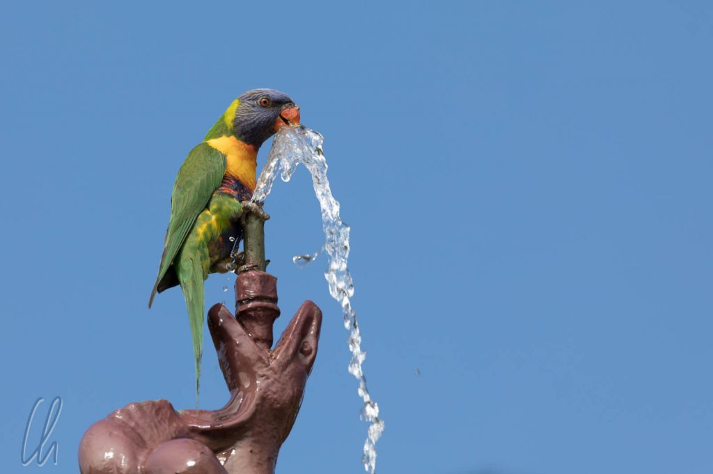
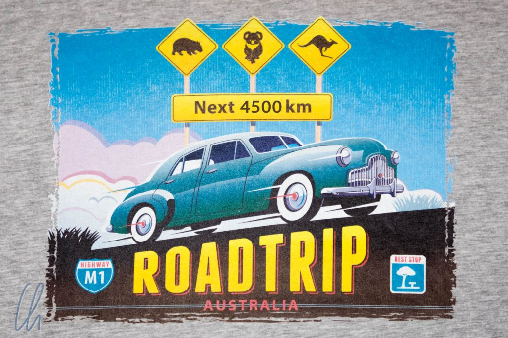
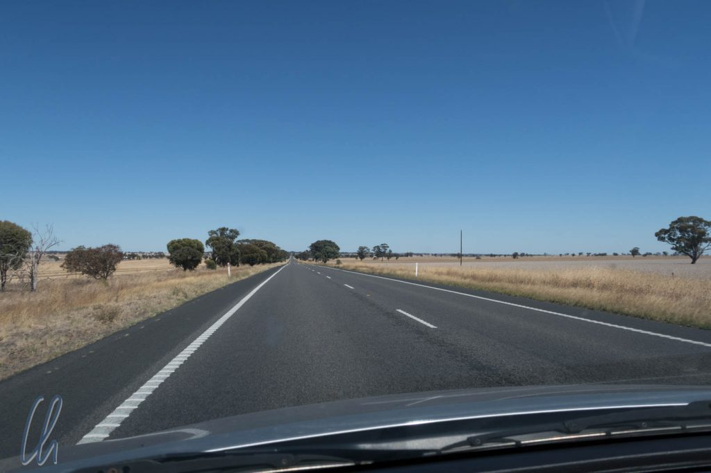
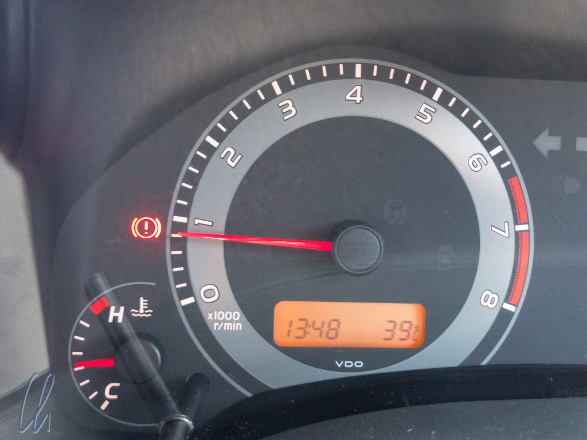

# Wie war Australien?

Auf den ersten Blick ist Australien ein sehr westlich geprägtes Land, keine fremdländische Exotik wie in Myanmar oder Kambodscha. Auf den zweiten Blick gibt es jedoch sehr viel zu entdecken: Die Kultur der ersten Bewohner, eine geradezu außerirdisch wirkende Tier- und Pflanzenwelt mit Kängurus, Schnabeltieren, Koalas, Flughunden und jeder Menge außergewöhnlicher Vögel, ulkiger Grasbäume oder undurchdringlichem Regenwald. Auch unter den Aussies selbst fanden sich einige lustige Vögel und alle, die wir trafen, waren sehr entspannt und freundlich, so dass wir die 5 Wochen in Australien sehr genossen haben.

<!--more-->

## Keep left!

Nach 4500 Kilometern hatten wir uns gut daran gewöhnt, auf der falschen Seite der Straße zu fahren. Eigentlich ist es ja nicht so schwierig, aber es dauert trotzdem. Auf der linken Seite zu fahren ist ungefähr so einfach oder so schwierig, wie seinen Nachnamen zu ändern. Vom ersten Moment an auf Australiens Straßen war uns klar: Ab jetzt wird links gefahren. Bis es zu eingeübter Routine wurde, dauerte es jedoch ein bisschen.

Am Anfang kam es recht häufig vor, dass wir den Scheibenwischer statt des Blinkers betätigten, da die Funktionen der beiden Hebel bei australischen Autos vertauscht sind. Nach ein bis zwei Tagen nahm die Anzahl der "Fehltritte" deutlich ab. Fährt man aber vermeintlich routiniert, ist man ganz allein auf der Straße oder durch viel Verkehr oder komplizierte Verkehrsführung auf eher unbewusste Reaktionen angewiesen, so blitzte auch nach Wochen noch der Rechtsfahrer durch, und die Scheibe war mal wieder unabsichtlich gewischt :).

Interessanterweise war die schwierigste Disziplin, elegant in der linken Fahrspur zu bleiben. Am Anfang hatten wir immer die Tendenz, zu weit links zu fahren, worauf uns die melodischen Seitenstreifen, die es auf vielen Straßen gibt, lautstark aufmerksam machten. Alles in allem hat die Umstellung 2 bis 3 Wochen gedauert. Sie war also abgeschlossen, als wir unseren Mietwagen zurückgaben ;).

## Der Schilderwald

Neben dem dichten Busch beheimatet Australien auch einen gut gehegten und gepflegten Schilderwald. Die Beschilderung („Signage“) bemüht sich an vielen Orten die Menschen zu regulieren, strikte Anweisungen zu geben und bei Zuwiderhandlung harte Strafen anzudrohen. Das Konzept ist ähnlich wie in [Hongkong](http://wittmann-tours.de/zu-ihrer-sicherheit/), hat aber mehr regulierenden Charakter. Trotz der warmherzigen und freundlichen Natur der Australier sind einige Schilder im Ton leider erschreckend drastisch ("By going beyond this point you risk serious injury or death!").

Auch wenn der Wille, die Menschen vor ihrer eigenen Dummheit zu bewahren, sicher gut gemeint ist, haben manchmal die Aussies unserer Meinung nach etwas übertrieben. Einige Schilder sind einfach nur lustig oder skurril, wie dieses Beispiel vom Flughafen in Adelaide:

Regeln sind insgesamt in Australien sehr wichtig. Es gibt nicht nur viele Schilder, sondern auch auf jeder Führung wird zu Beginn auf die Rahmenbedingungen eingegangen. Neben den üblichen Dingen wie "Nichts anfassen!" oder "Nicht mit Blitz fotografieren!" gab es auch hier einige Stilblüten. Unser absoluter Favorit bleibt die Führung im Split Point-Leuchtturm, wo explizit darauf hingewiesen wurde, dass die Farbe des Geländers giftig sein könnte, also bitte nicht daran lecken. Wir ergänzen: Lieber im Anschluss ein Eis kaufen ;)

Irgendwo im australischen Verkehrsministerium muss es auch eine Abteilung von Nachwuchs-Dichtern geben, die gereimte Schilder erfinden. So wurde immer wieder der "Driver Reviver" propagiert, kostenloser Kaffee für müde Autofahrer :). Außerdem lasen wir Hinweise wie "Drive and stay alive" oder "Open your eyes, stay alive" :). In Queensland gab es sogar ein Schilder-Quiz, um Autofahrer wach zu halten. So las man z.B. eine Frage wie „Was ist der längste Fluss Australiens?“ und ein paar Kilometer später folgte dann ein weiteres Schild mit der [Antwort](https://de.wikipedia.org/wiki/Liste_der_Fl%C3%BCsse_in_Australien).

## Australien kulinarisch

Kulinarisch gesehen bot Australien durchaus einige Highlights, obwohl auch hier die Exotik nur auf den zweiten Blick sichtbar wurde, z.B. beim [Bush Tucker](http://wittmann-tours.de/australien-kulinarisch-bush-tucker). Dank der vielen Einwanderer gibt es neben westlicher Küche auch exzellente internationale Küche, vor allem aus dem asiatischen Raum. In Sydney aßen wir zum Beispiel bessere Dim Sum als in Hongkong und auch exzellent thailändisch, inklusive ausgefallener Desserts.

Eine Mahlzeit, die uns in Australiens Hotelgewerbe unterrepräsentiert erschien, war das Frühstück: Brekkie war kein einziges Mal in der Hotel-, Motel- oder Guesthouse-Rate inkludiert und die wenigsten boten überhaupt Frühstück an. Immerhin waren fast alle Unterkünfte mit einen Kühlschrank ausgestattet. So kauften wir unser Frühstück selbst ein mit Müsli, Milch, Joghurt und frischen Früchten, alles stolz in Australien produziert.

Was nicht alles in Australien wächst! Der Kontinent ist riesig und erstreckt sich im Norden bis in die Tropen. Zu unserer großen Freude konnten wir fast überall aromatische frische Früchte einkaufen. Anscheinend war gerade Mango-Saison, da ließen wir uns nicht zweimal bitten. Die Früchte waren reif und das süße Fruchtfleisch zerging auf der Zunge.

## Zwei weitere Australische Klassiker

Vieles in Australien wird mit der Bezeichnung "Heritage" versehen, wenn es in irgendeiner Art geschichtlich bedeutsam sein könnte. Etwas kurios fanden wir die Rubrik "Heritage-Food". Unser absoluter Favorit war der Pie Floater in Adelaide: Ein Meat Pie, der mit Erbsensuppe übergossen wird. Erst beim zweiten Hinsehen sieht man den Hügel in der Erbsensuppe, das ist der Pie. Die besten Pie Floater gibt’s bei [Vili's](https://www.vilis.com/cafe-de-vilis) - 24 Stunden rund um die Uhr. Angeblich eignet sich das Gericht auch sehr gut als Mitternachtsimbiß.

Fish and Chips sind zwar das inoffizielle Nationalgericht des Vereinigten Königreiches, erfreuen sich aber auch in Australien großer Beliebtheit. Da wir immer an der Küste entlang fuhren, mangelte es nicht an frischem Fisch :). Die beliebteste Sorte ist der Flake, der auch als Gummy Shark bezeichnet wird :). Immer wenn wir unsere Fish'n'Chips im Freien aßen, waren wir sofort bei den Möwen extrem beliebt. Sie hofften auf fette Beute und man musste aufpassen, dass die lieben Vögelchen einem nicht Teile der Mahlzeit vom Teller stibitzten.

## Die gefiederten Freunde

Noch frecher als die Möwen war ein Kakadu in Gariwerd, der Mona die gerade gekauften Sandwiches abjagen wollte. Erst hüpfte er ganz zutraulich auf dem Boden herum. Auf einmal, schwuuups, flog er auf ihre Schulter in der Hoffnung, von dort besser auf Beutejagd gehen zu können.

Sonst fielen die Kakadus eher durch ihr lautes Krächzen und ihr schickes Federkleid auf. Wesentlich melodischer und fast wie von einem anderen Stern erschien uns der Ruf der Flötenvögel („Australian Magpie“). Wir nannten sie [Radiovögel](https://www.youtube.com/watch?v=oYEYc8Ge3nw), da sie sich fast so anhören als ob man mit einem alten Radio einen Sender sucht :). Im wahrsten Sinne des Wortes schießt jedoch der Kookaburra den Vogel ab. Er singt nicht, weder piepst noch trällert er, sondern man hat den Eindruck, als fiele er vor [wildem Gelächter](https://www.youtube.com/watch?v=UXA0-YAoo9Q) fast vom Ast :) :).

## Das unerwartete Australien

Der rote Kontinent präsentierte sich uns an seiner Ostküste recht grün. Vom dichten Regenwald ist zwar auch hier viel abgeholzt worden, trotzdem sind wir durch ausgedehnte Wälder gefahren. In den zahlreichen Nationalparks konnten wir fabelhaft wandern und diese grüne Seite Australiens näher kennenlernen.

Als wir Australien auf die Welt-Reiseroute setzen, waren zwei der Gründe die geografische Nähe zu Neuseeland und die geografische Ferne zu Europa. Da wir nun mal in Ozeanien waren, wollten wir auch den Roten Kontinent bereisen. Als wir uns später genauer mit Australien beschäftigten, merkten wir, dass viele Ziele in Australien im Januar nicht in Frage kommen würden. Im Norden herrschte Regenzeit, im Outback war es zu heiß. Ein wenig ernüchtert legten wir die Route von Brisbane nach Adelaide fest. Noch wussten wir nicht, was uns erwarten würde.

Rückblickend müssen wir sagen, dass selbst dieser "kurze" Abschnitt der australischen Küste ein sehr ambitioniertes Programm bot und sich die Highlights nur so aneinander reihten: Freundliche Aussies, sehenswerte Städte, traumhafte Küsten und Strände, dichte Urwälder und spektakuläre Tierbeobachtungen. Wir werden Australien in bester Erinnerung behalten und freuen uns darauf, noch weitere Teile des riesigen Landes zu entdecken!
