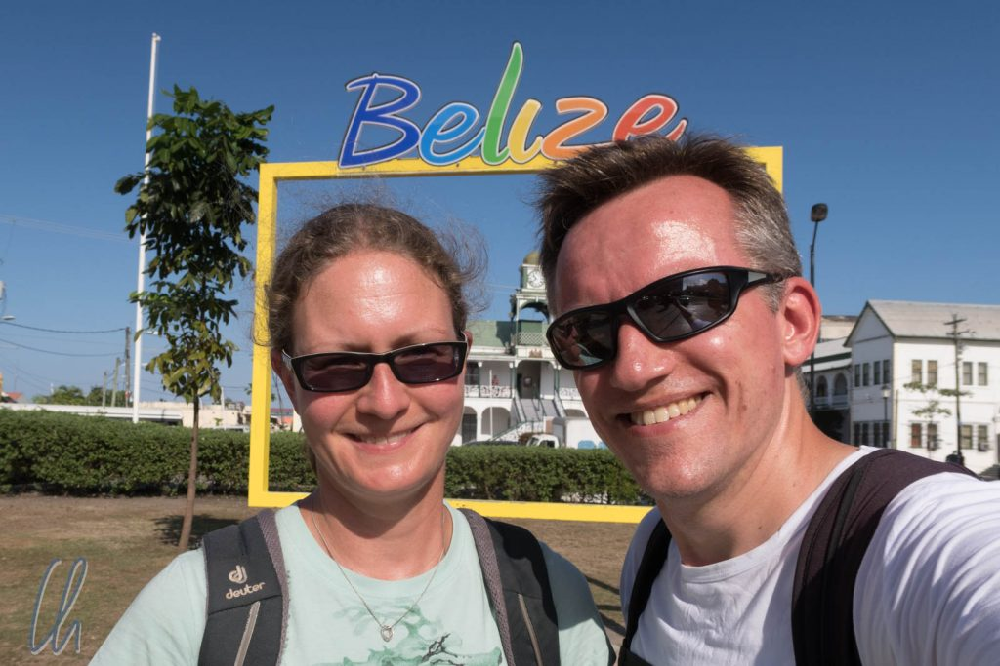
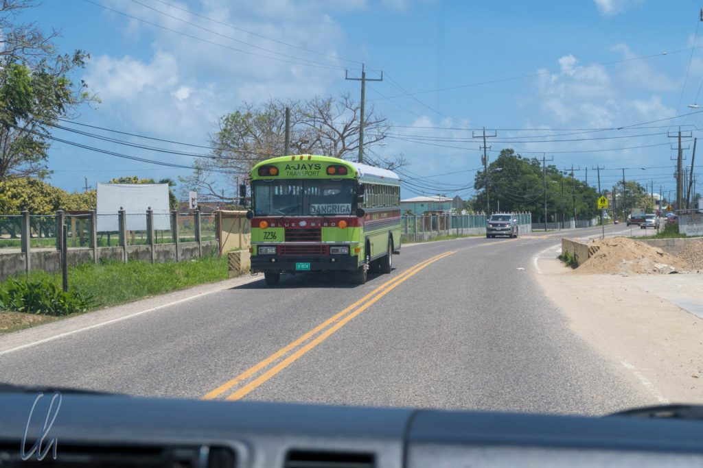
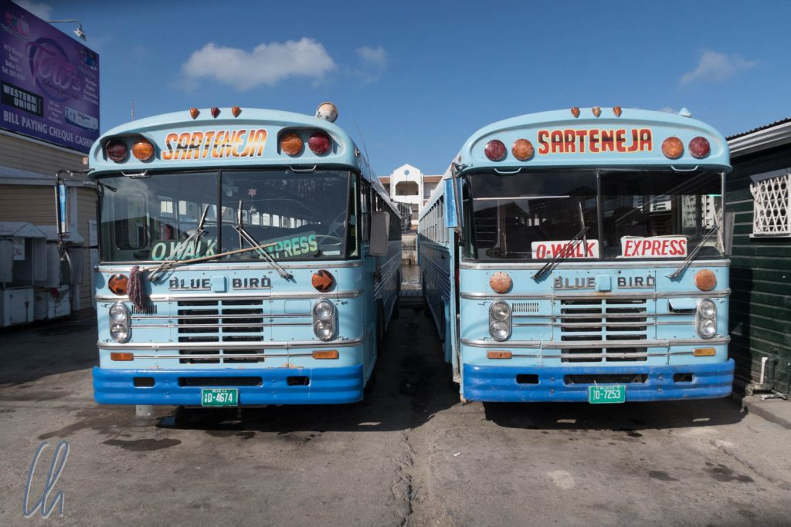

# Wie war Belize?

Eigentlich hatten wir Belize in unsere Länderauswahl aufgenommen, um eine Art Reisepause einzulegen, am Strand auszuspannen, Schnorcheln zu gehen und Zeit zum Planen zu gewinnen. Beim Studium des Reiseführers erfuhren wir jedoch, dass es in Belize viel zu sehen gibt, nämlich den Dschungel und die diversen Kulturen. In Belize befinden sich auch einige sehenswerte ehemalige Städte der Maya. Aus geplanten zwei Wochen wurden drei und wir wären - wie so oft - gerne noch länger geblieben.

<!--more-->

## Ein sehr interessantes und schönes Fleckchen Erde

Wie wir schon in den [ersten Eindrücken](http://wittmann-tours.de/erste-eindruecke-aus-belize) geschildert hatten, ist Belize sehr vielfältig. Diese Impression hat sich in der Tat bestätigt. In Belize gibt es große geschützte Gebiete Regenwaldes mit vielen wilden Tieren, eine spektakuläre Unterwasserwelt und das Land ist kulturell sehr divers. Aufgrund von Englisch als Amtssprache und der offenen Mentalität der Menschen war es sehr einfach, mit den Leuten in Kontakt zu kommen und mehr über das Land zu erfahren. Es gab viel zu entdecken!

Trotz scheinbar gut funktionierendem Multikulti und großer gegenseitiger Toleranz ist Belize auch ein in sich widersprüchliches Land. Die Unterschiede zwischen arm und reich sind gewaltig, mancherorts fühlte es sich wie ein Spielplatz für (zum Großteil US-amerikanische) Touristen an und viele Einheimische beschwerten sich über die Politik und die Korruption. Diese Seite von Belize offenbart sich aber erst, wenn die Reizüberflutung etwas abnimmt.

## Dubiose Geschäfte

Nehmen wir die Infrastruktur als Beispiel. Diese fanden wir insgesamt vergleichsweise gut (und trotzdem wird es ein "aber" geben). Die Landstraßen waren alle geteert und nahezu frei von Schlaglöchern. Das mobile Internet zeichnete sich in der Regel durch Schnelligkeit und Zuverlässigkeit aus. Einzig der Kauf einer Prepaid-SIM-Karte war vergleichsweise teuer. Im Vergleich zu Mexiko schlug dies mit mehr als dem doppelten Betrag zu Buche. Kein Wunder allerdings bei einem Monopolanbieter... Auch sonst war das Preisniveau in Belize erstaunlich hoch.

Und jetzt zum "aber". Einige Menschen schimpften über Korruption und wir hörten, dass vieles im Land früher besser funktioniert habe. Als Beispiel wurde die Organisation des Überlandverkehrs mit Bussen genannt. Früher habe Belize gute und zuverlässige Linien mit einem festen Fahrplan gehabt. Man hätte Sitzplatzreservierungen vornehmen können und die Leute seien zufrieden gewesen mit dem Service. Dann habe wohl ein Großinvestor einen Kredit vom Staat bekommen, um alle Buslinien aufzukaufen und ein Großunternehmen zu schaffen. Leider sei das Unternehmen nach kurzer Zeit bankrott gewesen und damit habe sich die heutige Situation entwickelt. Als quasi-sozialistische Lösung dieses Dilemmas sei die Konkursmasse den Busfahrern übertragen worden. Heute sind Buslinien nicht aufeinander abgestimmt, es existiert kein zentraler Fahrplan, Sitzplatzreservierungen gibt es nicht mehr und alles funktioniert eher flexibel und spontan.

## Subjektive Wahrheiten

Was man hört, ist manchmal eine subjektive Auffassung der Wahrheit, aber die heutige Situation des öffentlichen Transportwesens können wir bestätigen. Es war unmöglich, im Voraus Informationen über den Busfahrplan in Belize zu bekommen. Es gibt keine offiziellen Internetseiten oder zentralen Anlaufstellen. Wenn die Einheimischen eine Überlandfahrt planen, versuchen sie, den Bus in aller Herrgottsfrühe zu nehmen (man weiß ja nie). Irgendwie funktioniert es. Wie es dazu gekommen ist, ließ sich im Internet nicht ganz recherchieren. Es scheint ein staatlicher Kredit an Novelo (ein großes Busunternehmen der Novelo-Brüder) geflossen zu sein, dieses meldete dann 2006 Konkurs an. Unter identischer Führung (den beiden Brüdern) war das Busunternehmen anschließend als [National Transportation Services Limited](https://en.wikipedia.org/wiki/National_Transportation_Services_Limited) (NTSL) auferstanden. NTSL war einige Jahre später (2010) ebenfalls zahlungsunfähig und seitdem ist die Transportsituation so, wie wir sie erlebt haben. Klingt alles recht dubios...

Die Geschehnisse um [BTL](https://en.wikipedia.org/wiki/Belize_Telemedia_Limited) (Belize Telecom) sind ein weiterer Fall, in dem die Steuerzahler für Fehlentscheidungen der Regierung aufkommen müssen. Ein Name, der in diesem Zusammenhang (und anderen) immer wieder fällt ist Sir [Michael Ashcroft](https://en.wikipedia.org/wiki/Michael_Ashcroft). Ihm gehörten 94% dieses Unternehmens. In einer (geheimen?) Absprache mit der Regierung waren Ashcroft [15% Rendite garantiert](http://www.7newsbelize.com/sstory.php?nid=14843) worden. Da diese Rendite (angeblich) nicht erreicht wurde, verklagte Ashcroft regelmäßig den Staat Belize. Um die Klagewelle zu beenden, kaufte der Staat die Anteile von Michael Ashcroft. Dieser war der große Profiteur, der Staat Belize hat dadurch viel Kapital in einem angeblich weiterhin sehr profitablen Unternehmen gebunden (oder neue Schulden gemacht).

## Noch relativ untouristisch

Geschichten dieser Art hörten wir einige... Es ist zwar immer einfach zu sagen, dass sich die Reichen auf Kosten der Armen immer weiter bereichern und wahrscheinlich haben erstere eine andere Version der Geschichte. Trotzdem wirft es einen dunklen Schatten auf Belizes Regierungsriege und manche Geschäftsleute. Vielleicht sind Klüngelei und Korruption ein Grund, dass keine der großen Ketten und nur wenige internationale Investoren in Belize vertreten sind. Stattdessen gibt es nur kleine, private Restaurants oder Geschäfte und nicht viel Industrie. Einen modernen großen Supermarkt im westlichen Stil haben wir nur im Zentrum von Belize City angetroffen.

Die beiden größten Industrien des Landes sind laut Statistik die Holzwirtschaft und der Tourismus. Von ersterer haben wir nicht viel mitbekommen, wir sahen nur ein paar Plantagen am Wegesrand. Bei letzterer waren wir mittendrin. Insgesamt erschien uns das Ausmaß des Tourismus trotzdem eher gering, soll heißen, wir begegneten erfreulich wenig anderen Reisenden. Das mag allerdings an der Auswahl unserer Ziele gelegen haben.

## Vielleicht noch ein Geheimtipp

So werden uns die Unterwasserwelt, vor allem aber der Dschungel und die verschiedenen Tiere in bester Erinnerung bleiben. Außerdem erinnern wir uns gerne an viele interessante und positive Begegnungen mit Belizianern und auch einige kuriose Geschichten zurück. Eine davon erzählte uns einer unserer Fahrer, der in seinem früheren Job für einen Mennoniten gearbeitet hatte. Da der Mennonit traditionell lebte, besaß unser Fahrer offiziell dessen Mobiltelefon und auch dessen Auto. Wann immer ein Gespräch zu führen war oder eine Fahrt von A nach B anstand, war unser Fahrer zur Stelle. Auch das ist anscheinend eine Facette von Belize.

Aufgrund von Englisch als Amtssprache war Belize einerseits sehr einfach zu bereisen, da die Kommunikation nie ein Problem darstellte. Andererseits war Belize immer dann, wenn wir kein Paket (also nicht so wie z.B. die Tage am Glover's Reef) gebucht hatten, organisatorisch etwas aufwändig. Vor Busfahrten holten wir zum Beispiel immer vor Ort eine Zweit- oder Drittmeinung ein, um sicherzugehen, dass wir wie gewünscht ankommen würden. An manchen Orten machte allein die Tatsache, dass wir die einzigen Besucher waren, den Aufenthalt deutlich spannender und interessanter als in anderen Ländern, z.B. unsere Tage in [Dangriga](http://wittmann-tours.de/die-garifuna-hauptstadt-dangriga/). Aber sind das nicht genau die Ziele, die wir als Reisende suchen? Alles in allem sind wir von Belize sehr positiv überrascht worden!

