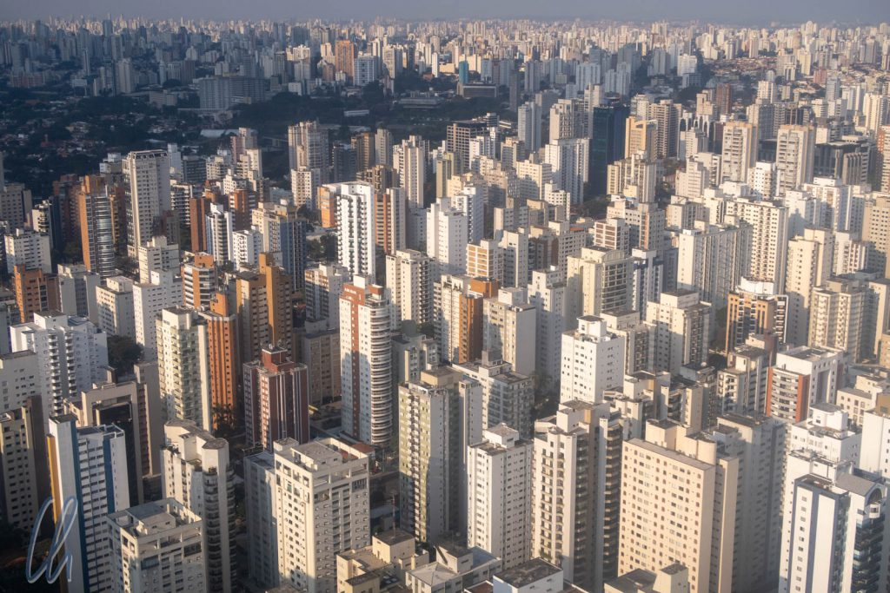
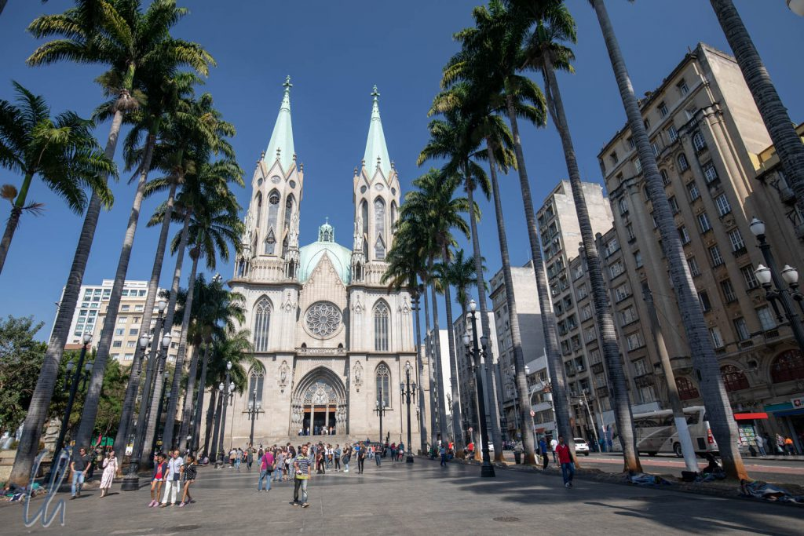

Brasilien hat uns sehr gut gefallen, nicht zuletzt, weil es erfreulich untouristisch und in vielerlei Hinsicht ein angenehmes Reiseland war. Natürlich waren wir als Nicht-Brasilianer leicht zu erkennen. Trotzdem fühlten wir uns nur selten als Touristen, da wir im brasilianischen Alltag mitschwammen und nicht ständig belagert wurden. Brasilien hatte einiges zu bieten, viele Kontraste, Reichtum und Armut, Tradition und Moderne, erfreuliche Kontakte mit den Einheimischen, eine ehrfurchteinflößende Natur und einige der größten Städte Lateinamerikas.

<!--more-->

## Großstadt São Paulo

[São Paulo](https://de.wikipedia.org/wiki/S%C3%A3o_Paulo), unsere letzte Station in Brasilien, ist mit 12 Millionen Einwohnern die größte Stadt in Südamerika. Selbst ohne die Statistik zu kennen, drängte sich dieser Gedanke auf. Aus dem Flugzeugfenster offenbarte sich uns ein Blick über ein schier endloses Häusermeer. Dagegen wirkte Rio mit seinen 6 Millionen Einwohnern, dank seiner landschaftlich wunderschönen Lage, aus der Luft vergleichsweise überschaubar. In São Paulo bestätigte sich der Eindruck einer gewaltigen Großstadt auch aus dem Blickwinkel am Boden. Die Straßen waren drei- bis fünfspurig und auf dem Weg vom Flughafen ins Hotel standen wir das erste Mal in Brasilien im Stau.

Ähnlich wie Rio blickt auch São Paulo nicht auf eine lange und glorreiche Geschichte zurück. Erst ab ca. 1850 gewann São Paulo durch den Handel mit Kaffee und später als Industriezentrum rasch an Bedeutung. Damit sind die architektonischen Sehenswürdigkeiten verhältnismäßig jung, aber trotzdem lohnenswert.

## Ordnung und Fortschritt?

Auch wenn wir beide eher Landeier sind, haben wir die Annehmlichkeiten der Großstadt und "Zivilisation" sehr zu schätzen gewusst: Eine unerschöpfliche Auswahl an guten Restaurants, interessante Museen, gepflegte Parks und funktionierender öffentlicher Nahverkehr. Man sieht Werbeplakate, die Käsefondue-Sets, Massage-Duschköpfe, Cola-Mehrweg(!)-Flaschen oder Kinofilme zu vermarkten versuchen. Brasilien war insgesamt deutlich moderner als die Länder, die wir in den vorherigen Monaten bereist hatten. Nicht umsonst prangt auf der Flagge der Wahlspruch: "Ordem e Progresso" (Ordnung und Fortschritt). Bei selektiver Wahrnehmung scheint für lateinamerikanische Verhältnisse auch wirklich ein erhöhter Grad an Ordnung präsent zu sein ;).

Der Fortschritt schien sich aber auch in São Paulo auf die Ober- und Mittelschicht zu konzentrieren. Ebenso wie in Rio waren wir über die Anzahl der Obdachlosen schockiert. Sie bevölkerten vor allem die Innenstadt und wieder konnten wir uns nicht daran gewöhnen. Dieses öffentlich zur Schau gestellte Elend wollte so gar nicht zum Wahlspruch "Ordnung und Fortschritt" passen.

Ohne zu sehr zu verallgemeinern fiel uns auch an anderer Stelle auf, dass unbequeme Fakten in Brasilien gerne mal ausgeblendet werden. Im Museu Histórico Nacional in Rio de Janeiro stand auf einem Schild, der Bergbau im Land werde heutzutage überall umweltverträglich betrieben und die multikulturelle Gesellschaft funktioniere wunderbar.

## Não tem problema, tudo bem!

Wie kamen wir nun im Reisealltag mit Portugiesisch bzw. mit Portuñol zurecht? Wie wir es schon in den [ersten Eindrücken aus Brasilien](http://wittmann-tours.de/erste-eindruecke-aus-brasilien-manaus/) beschrieben hatten, blieb Portugiesisch für uns eine Herausforderung. Am Ende der Reise in São Paulo fühlten wir uns schon ziemlich fortgeschritten, als wir ca. 30 Minuten Smalltalk mit einem Taxifahrer (unserer Meinung nach) gut meisterten ;). Drei Stunden später scheiterten wir allerdings kläglich im Restaurant, als der Kellner uns nach der gewünschten Garstufe unseres Steaks fragte :(. Nur Leo, Google Translate und die Geduld des Kellners konnten uns und das Steak retten.

Zu diesem Thema wollen wir einen sehr lustigen False Friend nicht unerwähnt lassen. Am Straßenrand sahen wir häufig Hinweisschilder zu einer Borracheria. Wir fragten uns ratlos, was das wohl sein könne. Auf Spanisch heißt "borracho" "betrunken". Vielleicht eine Kneipe? Ein Spirituosengeschäft? Nein! Eine Borracheria ist ein Reifenhänder bzw. ein Reifenreparaturservice. Wer hätte das gedacht? :) Obwohl wir uns in der Regel schließlich verständlich machen konnten, mussten wir insgesamt doch feststellen, dass Portugiesisch selbst auf der Basis von soliden Spanischkenntnissen nicht vom Himmel fällt ;).

## Englisch als Fremdsprache

Umgekehrt hat es uns allerdings auch sehr gewundert, dass die wenigsten Brasilianer Englisch sprachen. Damit meinen wir nicht fließendes Englisch, sondern wenigstens ein paar Brocken. Selbst Menschen, die vermutlich öfter mit Ausländern in Kontakt kommen, sprachen kein Englisch (öfter hingegen Spanisch). Demzufolge waren wir über unser Portuñol sehr froh.

Am auffälligsten war dies vielleicht in [Bom Jardim](http://wittmann-tours.de/suesswasserschnorcheln-in-bom-jardim/). Zugegeben, mindestens 90% der Besucher waren Brasilianer, aber wir waren auch nicht die einzigen Ausländer. Im Hotel war Portuñol angesagt. Dafür brauchte es aber auch immer zwei (verständnisvolle Seiten). Sehr gut hat Portuñol mit einer Angestellten funktioniert, mit der wir immer alle Fragen klären konnten. Auf einem Ausflug hingegen hatten wir einen sehr netten Fahrer, der viel Portugiesisch mit uns sprach. Wenn wir es nicht verstanden, wiederholte er es einfach noch einmal und noch einmal und sprach dabei immer lauter. Dabei war doch nicht unser Hörvermögen das Problem, sondern das Verständnis der Sprache ;).

## Ausländische Besucher in Brasilien, eine Seltenheit?

In Manaus und Cuiabá fragten wir uns zuweilen sogar, ob wir die einzigen fremdländischen Touristen seien, da wir keine (bzw. sehr wenige) andere Ausländer trafen. Auch die Hotels machten nicht den Eindruck, als ob sie regelmäßig nicht-brasilianische Gäste beherbergten, obwohl Cuiabá zum Beispiel das Tor zum nördlichen Pantanal ist.

Auf der Suche nach ein paar guten Besichtigungstipps für unsere Puffertage in Cuiabá schauten wir im Büro des Tourismus-Ministerium vorbei. (Die offizielle Touristen-Informationsstelle hatte dauerhaft geschlossen). Dort sprach eine Angestellte erstaunlich gutes Englisch, aber Informationsmaterial über die Sehenswürdigkeiten von Cuiabá gab es nicht. Zusammen mit zwei Kollegen improvisierte sie im Brain-Storming-Modus eine handschriftliche Liste mit mehr oder weniger spannenden Besuchszielen und Restaurants, die sie anschließend fotografierte - um beim nächsten Mal gleich etwas zur Hand zu haben.

Im sehr empfehlenswerten Museum Rondônia in Cuiabá, welches dem Besucher die Gebräuche und die Geschichte indigener Völker näherbringt, kamen wir mit einem Herrn ins Gespräch. Er war sehr erstaunt über unseren Besuch. Dreimal er fragte nach, ob wir nicht doch Verwandte in Cuiabá hätten, was wir standhaft verneinten. Wir waren nur dort, um die Stadt und die Umgebung (Pantanal, Bom Jardim) kennenzulernen. Das schien außergewöhnlich zu sein. Es fiel ihm offensichtlich schwer, uns zu glauben ;).

## Imposante Natur und eine deutlich andere Geschichte

Brasilien lässt sich auf keinen Fall mit anderen Ländern Lateinamerikas über einen Kamm scheren. Zu unterschiedlich sind die Naturräume und die Geschichte vor und nach der Kolonialisierung. Brasilien war nicht wegen der Schätze seiner Ureinwohner für die Europäer interessant, es fanden sich bei den Indigenen keine großen Reichtümer wie bei den Inka. Bei der Kolonialisierung entpuppte sich Brasilien hingegen als eine Schatzkammer natürlicher Rohstoffe, zum Beispiel wertvolles Holz und Gold. Das Land eignete sich auch für die Haltung von Vieh, den Anbau von Kaffee, Kakao, Zucker und die Gewinnung von Kautschuk.

Die Ausbeutung der Ressourcen führte auch zur Ausbeutung von Menschen, die ebenfalls zur Ressource und Handelsware wurden. Nirgendwo in der neuen Welt wurden so viele [Sklaven](https://de.wikipedia.org/wiki/Geschichte_der_Sklaverei#Brasilien) eingeführt wie in Brasilien. Der Bevölkerungsanteil dieser Rechtlosen betrug zeitweise deutlich über 50%. Außerdem schaffte Brasilien wegen der politisch einflussreichen Lobby der Plantagenbesitzer die Sklaverei erst sehr spät ab, nämlich im Jahre 1888. Die meisten Nachfahren der Sklaven (deren Kultur und Glaubenswelt einen starken Einfluß auf die brasilianische Gesellschaft haben) leben heutzutage im Nordosten Brasiliens, den wir leider aus zeitlichen Gründen nicht bereist haben. Auch heute noch gibt es im Land zahlreiche Quilombos, Siedlungen, die von entflohenen Sklaven gegründet worden waren.

Es gäbe mehrere Gründe, Brasilien noch einmal zu besuchen. Einer davon ist die vielschichtige Kultur der brasilianischen Bevölkerung. Außerdem werden wir uns immer an die unendlichen grünen Weiten des brasilianischen Regenwaldes erinnern. Trotz aller Zerstörung ist noch viel Dschungel erhalten und wir hoffen, dass er geschützt werden kann, da dieses Ökosystem in mehrfacher Hinsicht unverzichtbar für unseren Planeten ist. Natur, Kultur und Reisefreude pur - Brasilien bekommt als Reiseland von uns ein großes Thumbs-up.
