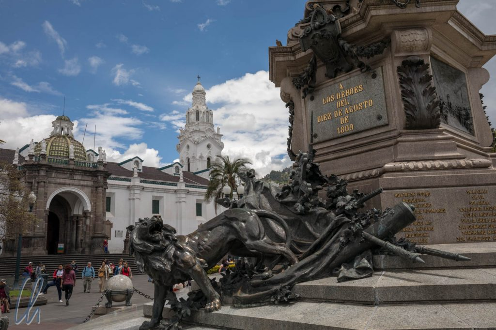
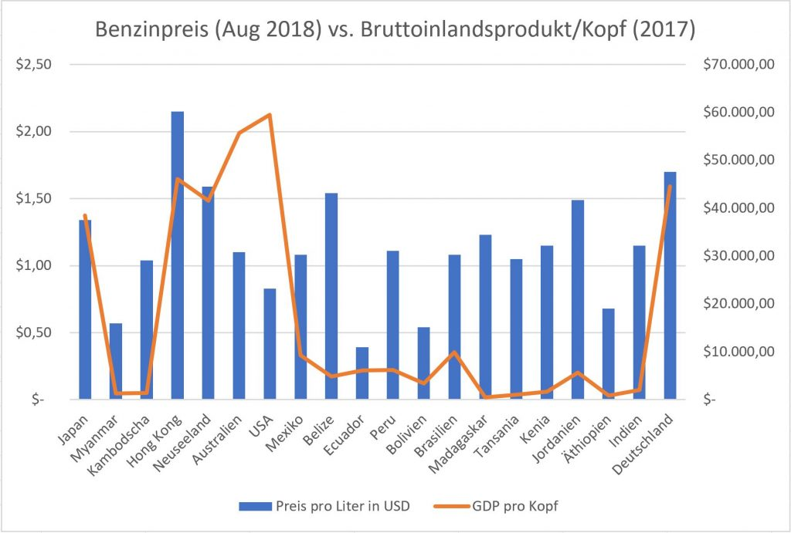
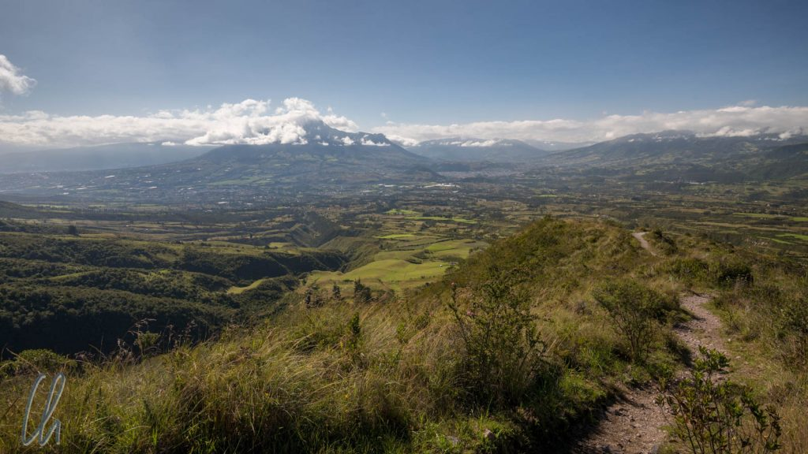

# Wie war Ecuador?

In Ecuador lag der Schwerpunkt für uns ganz klar auf Natur, und das auf Weltklasse-Niveau! Der Nebelwald und das Hochland, der Cotopaxi-Nationalpark und vor allem die Galapagos-Inseln waren mehr als spektakulär. Die Küste und das Amazonasgebiet hatten wir bewusst ausgelassen, da wir planten, in anderen Ländern (Bolivien und Brasilien) in den Dschungel zu fahren. Trotzdem gab es mit Otavalo und Quito auch kulturelle Highlights. Die koloniale Altstadt von Quito ist womöglich die schönste in Lateinamerika.

<!--more-->

## Panflötenvariationen

Es ist die Vorstellung verbreitet, dass die Musik der Anden mit Panflötenklängen gleichzusetzen ist, wie wir sie aus den Darbietungen in deutschen Fußgängerzonen kennen. In Ecuador selbst hörten wir Panflöten-Coverversionen aller gängiger Hits der 70er und 80er von ABBA bis Hotel California. Wir haben nicht erfahren, ob diese Art Musik den Einheimischen auch gefällt oder ob sie nur zur Unterhaltung der Touristen dient. Jedenfalls schien uns diese Art weichgespülter Klänge zu verfolgen, dies sollte auch später in Peru der Fall sein. Wir philosophierten schon, ob es auch Panflötenuntermalungen der Songs von Rammstein und Alice Cooper geben könnte ;).

Die echte Andenmusik, wie sie zum Beispiel aus dem Radio des Taxifahrers erklingt, hört sich anders an. Die inoffizielle Hymne, die sich seit 13 Jahren nicht verändert zu haben scheint, ist Ñuca Llacta. Noch mehr Ecuador geht nicht ;)

https://www.youtube.com/watch?v=X9xfjgYgRGM

Ebenfalls nicht verändert hat sich die Reinheit der spanischen Sprache in Ecuador und die höfliche Ausdrucksweise der Menschen. In Mexiko redeten die Menschen wesentlich schneller und informeller. Quito wird wegen genau diesem Hochspanisch als Hannover Lateinamerikas bezeichnet, zu Recht, wie wir finden. Auch für Mona war es einfach möglich, Führungen auf Spanisch zu folgen, ohne dass ich viel übersetzten musste, obwohl sie nie Spanisch gelernt hatte.

Auch die Menschen waren sehr freundlich und interessiert und sahen in uns (meistens) keine wandelnden Geldbörsen, so kamen wir oft ins Gespräch. Insgesamt war Ecuador trotz Weltklasse-Sehenswürdigkeiten erfreulich untouristisch. Die gute Infrastruktur machte es uns zudem sehr einfach, sich im Land zu bewegen.

## Tiefpreise an den Zapfsäulen in Ecuador

An den Tankstellen in Ecuador fielen uns die extrem niedrigen Benzinpreise auf. Erst dachten wir bei Preisen um 1,40 bis 1,50 USD, es handelte sich um Literpreise. In Wirklichkeit war es aber der Preis pro Gallone (3,8 Liter)! Das sind nur ca. 40 US-Cent pro Liter. Bei einer Suche im Internet stießen wir auf eine [sehr interessante Website](https://de.globalpetrolprices.com/gasoline_prices/), auf der die weltweiten Benzinpreise gelistet sind. Nur in 5 anderen Ländern dieser Welt ist Benzin günstiger (Stand August 2018: Venezuela (könnte sich aber wegen der aktuellen Krise im Land bald ändern), Iran, Sudan, Kuwait und Algerien).

Gründe für die günstigen Treibstoffpreise in Ecuador sind die Ölförderung im Land und anscheinend sehr geringe Steuern. Ecuador hat unter [Präsident Correa](https://de.wikipedia.org/wiki/Rafael_Correa) stark vom Erdöl profitiert, indem die Verträge mit den internationalen Ölunternehmen, die das Öl gewinnen, neu verhandelt wurden und jetzt wesentlich mehr Geld im Land bleibt. Das Geld wanderte nicht in die Taschen der Politiker, sondern wurde im Land in Bildung und Infrastruktur investiert. Über die niedrigen Benzinpreise wird ein Teil des Reichtums sogar an die Bevölkerung weitergegeben. Auch wenn nicht alle im Land Gewinner sind (und die Umwelt auch nicht), so hat Ecuador in den vergangenen Jahren doch stark von seinen Bodenschätzen profitiert.

## Morgens schön, später weniger

Mit Ausnahme von Galapagos war das ecuadorianische Wetter meistens nur (früh) am Morgen schön. Je später der Tag, desto größer wurden die Chancen auf Wolken und Regen. Trotzdem hatten wir (zum Glück) nur wenige echte Schlechtwettertage. Wie so oft hatte auch hier alles zwei Seiten. Die Wolken in den Bergen waren mehr als beeindruckend, nicht nur über uns, sondern auch unter uns oder in vielen verschiedenen Ebenen gestaffelt.

Egal bei welchem Wetter, im Andenhochland gab es immer wieder beeindruckende Ausblicke. Die Dimensionen wirkten ganz anders als in den europäischen Bergen. Von der Ebene, auf der wir uns aufhielten, in circa 3000m (oder höher) erhoben sich die Berge in der Regel noch 1000 bis 2000m in die Höhe und durch die trockene Luft war die Fernsicht meistens sehr gut.

An unserem letzten Tag in Ecuador zog ein heftiges Unwetter mit Starkregen und Hagel auf. Die Straßen wurden zu kleinen Flüssen und der Hagel trommelte auf dem Weg zum Flughafen fortissimo auf das Taxidach. So fiel uns der Abschied nicht so schwer. Das nächste Mal kommen wir besser etwas später im Jahr. Ab Mitte Mai, Anfang Juni soll sich das Wetter deutlich bessern. Trotz Abreise aus Quito blieben wir aber weiterhin in den Anden. Ecuador war nur der Einstieg, weiter ging es in Peru.
