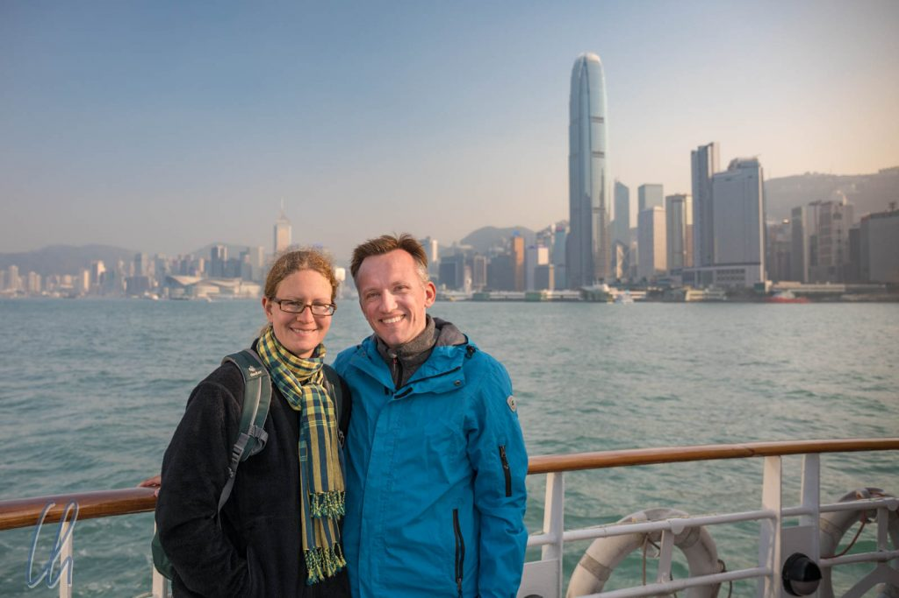
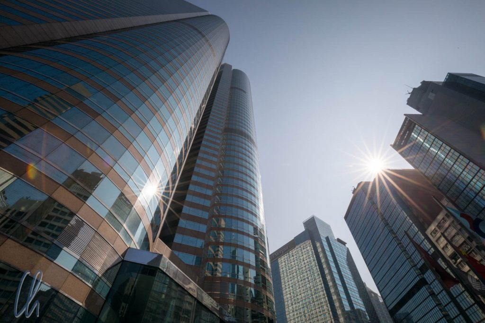
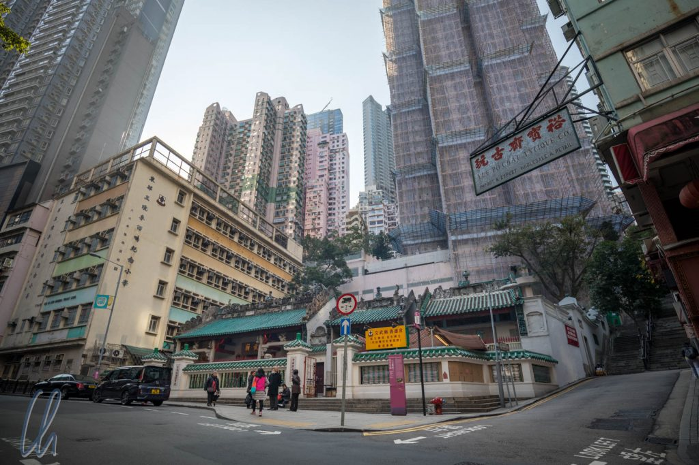

Auf dem Weg von Kambodscha nach Neuseeland haben wir Hongkong eine Stippvisite abgestattet. Dort haben wir nicht nur [fantastisch gegessen](http://wittmann-tours.de/essen-mit-stern-hongkong-kulinarisch/), sondern zwischen den Mahlzeiten auch die Weltmetropole erkundet. Hongkong war für uns weniger ein Kulturschock, dafür aber ein Temperaturschock. Mit tagsüber "nur" maximal 18 Grad hatten wir nicht gerechnet und haben Jacke und Pullover schnell aus den Tiefen des Rucksacks gezogen!

<!--more-->

## Großstadt wie aus dem Bilderbuch

Wer nach Hongkong kommt, um Großstadt zu sehen, ist hier genau richtig. In Hongkong leben mehr als 7 Millionen Menschen. Platz ist rar und teuer. Entsprechend eng geht es manchmal zu auf Gehwegen, in der U-Bahn oder in der Tram. Auch Häuser gibt es fast nur im Hochformat und die Banken mit ihren markanten Gebäuden, wie dem [HSCB Gebäude](<https://en.wikipedia.org/wiki/HSBC_Building_(Hong_Kong)>) oder der [Bank of China](https://de.wikipedia.org/wiki/Bank_of_China_Tower), tragen einen konstanten Wettbewerb um den höchsten, beeindruckendsten, teuersten oder den Wolkenkratzer mit dem wirkungsvollsten Feng Shui aus. Normalerweise gewinnt, wer später baut.

So sind in Hongkong aufgrund [seiner Geografie](https://de.wikipedia.org/wiki/Hongkong#/media/File:Hk-map.png) mittlerweile sogar 2 Skylines gewachsen, eine im Norden in Kowloon auf dem Festland und die eigentliche Skyline im Süden auf der Insel von Hongkong. Jeden Abend findet dort die [Symphony of Lights](https://en.wikipedia.org/wiki/A_Symphony_of_Lights) statt, angeblich die größte dauerhafte Lasershow der Welt. Sie erweckt die Skyline mit Scheinwerfern und Lasereffekten zum Leben.

## Tradition und Moderne

In all dieser Moderne gibt es trotzdem noch einige alte Tempel, die allerdings von Hochhäusern umzingelt sind. Trotzdem stellen sie Oasen der Ruhe im Getriebe der Großstadt dar und werden von den Menschen weiterhin als Anbetungsstätte genutzt. Ein Beispiel ist der taoistische [Man Mo Tempel](<https://en.wikipedia.org/wiki/Man_Mo_Temple_(Hong_Kong)>), der in der Vergangenheit nicht nur als Tempel, sondern auch als Ort zur Schlichtung von Konflikten mit der Kolonialverwaltung genutzt wurde.

Bei manchen Tempeln ist es für uns Westler schwierig, die spirituelle Bedeutung zu erfassen, da uns die asiatischen Religionen und Gottheiten fremd erscheinen. Dass es sich um einen religiösen Ort handelt, ist natürlich trotzdem spürbar. Viele Menschen kommen hierher, um zu beten und Opfer darzubringen. Eine ganz besondere Stimmung herrschte im Tin Hau Tempel in der Nähe des Jademarktes. Dort tauchten wir regelrecht in eine Duft- und Rauchwolke ein, erzeugt von unzähligen Räucherspiralen und -stäbchen, die in großen Bündeln abgebrannt wurden. Obwohl es in den Augen brannte, verwandelte das Sonnenlicht, das durch den Rauch schien, den Tempel in einen geradezu magischen Ort - mitten in der modernen Großstadt.

## In Hongkong unterwegs

Um von A nach B zu kommen, sind wir die meiste Zeit mit der U-Bahn gefahren, die hochgradig effizient ist. Die Eintrittskarte ist die Octopuscard und Google-Maps ist der Kompass, eigentlich das gleiche System wie in Japan. Wir mussten nie länger als 5 Minuten auf ein Verkehrsmittel warten. Busse und Bahnen fahren kontinuierlich, häufig und sind fast immer voll, zur Rushhour voller.

Für Kurztrecken auf der Insel nahmen wir gerne die historisch anmutende Doppeldecker-Tram, die genauso urig ist, wie sie aussieht. Als Signal wird eine Glocke geläutet, damit hebt sie sich angenehm melodisch vom restlichen Straßenverkehr ab. So rumpelten wir immer wenn sinnvoll durch die Hochhausschluchten, am besten im Obergeschoss.

Ein weiteres entschleunigendes Verkehrsmittel ist die [Star Ferry](https://de.wikipedia.org/wiki/Star_Ferry), die den Central District auf der Insel mit Kowloon auf dem Festland verbindet. Obwohl es Tunnel für Auto und U-Bahn gibt, schippert die Star Ferry weiterhin durch den [Victoria Harbour](https://de.wikipedia.org/wiki/Victoria_Harbour). Damit ist sie mehr als nur bloßes Transportmittel, da man auf der Fahrt das Panorama der Skyline genießen kann.

## Shop until you drop

Zurück vom Boot an Land im Central District sind die globalen und exklusiven Marken sehr präsent im Straßenbild von Hongkong. Ob Mont Blanc, Armani, Hugo Boss, Ferrari, Burberry, Apple, Dior, Tiffany & Co., sie sind alle da und irgendwie überall sichtbar, auf den Straßen und in den großen Malls. Selbstverständlich war in der Vorweihnachtszeit alles wunderbar [kitschig weihnachtlich](http://wittmann-tours.de/frohe-weihnachten/) geschmückt.

Im Gegensatz dazu gibt es in anderen Vierteln noch die familiären Geschäfte und Buden, in denen nicht nur Obst und Gemüse, sondern auch Fisch und Fleisch unter freiem Himmel angeboten werden. Kleine Läden verkaufen Lebensmittel für den täglichen Bedarf, unscheinbare Restaurants servieren bodenständiges Essen, und in den traditionellen Apotheken für chinesische Medizin konnten wir die feilgebotenen, uns fremden Waren nur schwer zuordnen: Kräuter, Pilze, Hölzer und allerlei Getier vom Land und aus dem Ozean.

Ein weiteres Highlight war der Singvogelmarkt. Hier wird alles rund um die Piepmätze verkauft und auch die Vögel selbst, vom Sittich bis zum Papagei, kunterbunte oder singfreudige Arten. Auch wenn die Käfige bestimmt zu klein und die Haltungsbedingungen nicht artgerecht sind, war es doch faszinierend anzusehen. Neben dem Markt ist der Park auch ein Treffpunkt für Vogelbesitzer, die ihre gefiederten Lieblinge hierher im Käfig ausführen und dafür mit melodischen Ständchen belohnt werden.

## Noch Britische Kolonie oder doch schon China?

Allein schon manche Namen zeugen noch von der Vergangenheit als englische Kolonie: Victoria Harbour, Prince Edward Station oder Admiralty. Alle Orte haben mittlerweile chinesiche Bezeichnungen und die Schilder sind zweisprachig. Englische Durchsagen, zum Beispiel in der U-Bahn, sind natürlich weiterhin in unverkennbar britischem Englisch, wie auch das Vokabular. In Hongkong sind es litter bins und letter boxes statt trash cans und mail boxes.

Manches koloniale Gebäude erinnert ebenso an die ehemalige Kronkolonie wie die historische Tram oder die Errungenschaft der öffentlichen Toiletten an vielen Orten in der Stadt. Trotzdem sind die Mehrzahl der Menschen für unsere Augen Chinesen. Allerdings schien uns ihr Verhalten etwas anders zu sein als auf dem Festland, meist zurückhaltender und höflicher. Wir hatten den Eindruck, viele liebgewonnene Dinge werden von den Hongkongern gerne bewahrt, zum Beispiel der High Tea für die Betuchten oder der starke Schwarztee mit Milch ("Panty Hose Tea"), der Tote wiederbelebt, für Alle.

Gleichzeitig ist China stark auf dem Vormarsch. Es gibt große Bauprojekte, die Hongkong stärker mit dem Festland verbinden sollen und auch politisch [erhöht China den Druck](http://www.faz.net/aktuell/politik/china-erhoeht-druck-auf-hongkong-15337688.html) auf Hongkong. Das Prinzip „[Ein Land, Zwei Systeme](https://de.wikipedia.org/wiki/Ein_Land,_zwei_Systeme)“ gilt zunächst theoretisch weiter. 20 der festgeschriebenen 50 Jahre sind bereits verstrichen und es wird interessant sein zu beobachten, was die Zukunft für Hongkong bereithält.

Uns hat Hongkong sehr gut gefallen. Die 3 Tage waren voll verschiedenster Eindrücke, den kulinarischen Höhepunkten, der interessanten Geschichte, dem [großen Buddha](http://wittmann-tours.de/frohe-weihnachten/), der modernen Megacity und trotzdem noch viel vor allem chinesicher Tradition, aber auch kolonialem Erbe. 3 Tage Hongkong und [3 Blogposts](http://wittmann-tours.de/category/asien/hongkong/) sprechen für sich ;)

