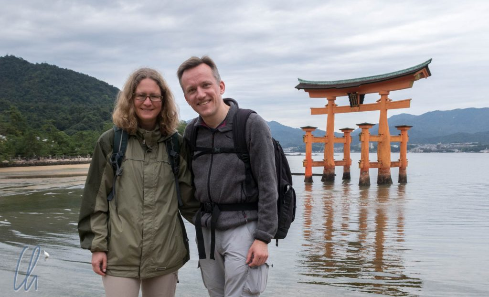
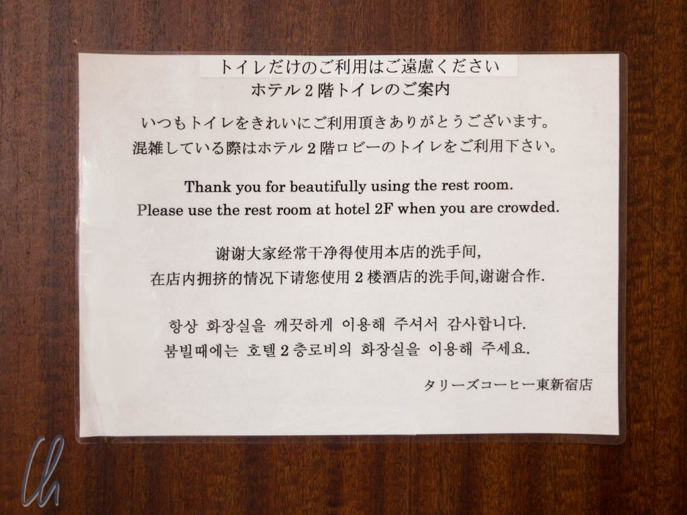
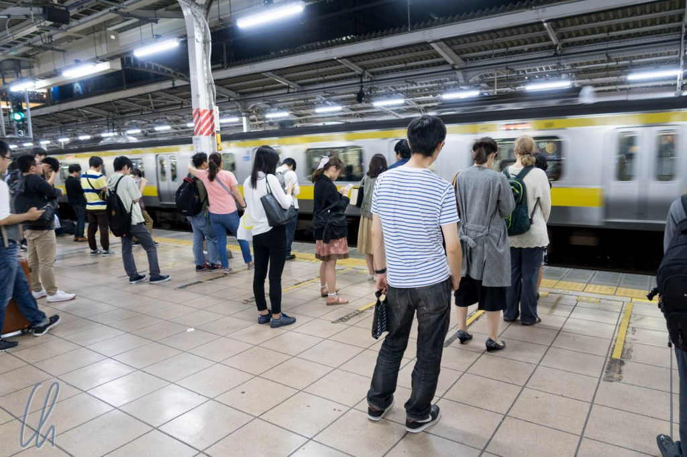
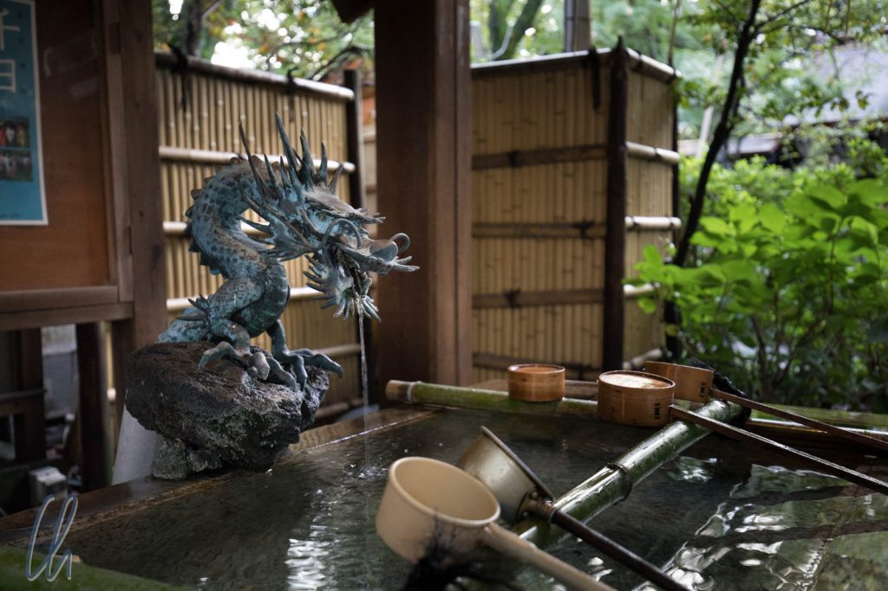

# Wie war Japan?

Die einfache Antwort ist: Japan hat uns sehr gut gefallen, das Land war sehr abwechslungsreich und vielfältig. Es gibt die große Kultur in [Kyoto](http://wittmann-tours.de/kyoto-tempel-schreine-und-gaerten/), [Nara](http://wittmann-tours.de/ausflug-nach-nara/) und Nikko. Dann ist da Hypermoderne in [Tokyo](http://wittmann-tours.de/sightseeing-in-der-mega-city-tokyo/), außerdem gibt es wunderbare Natur, von der wir leider nicht so viel gesehen haben, wie wir es uns gewünscht hätten. Leider hat [Taifun Lan](http://wetterkanal.kachelmannwetter.com/starker-taifun-lan-trifft-heute-auf-japan/) uns einen Strich durch die Rechnung gemacht, so dass unser geplantes Besichtigungsprogramm in Kanazawa buchstäblich ins Wasser gefallen ist. Damit gibt es einen Abzug in der B-Note für schlechtes Wetter, aber trotzdem 9,5/10 Punkten.

<!--more-->

## Japan glänzt mit Höflichkeit

Um die Frage etwas differenzierter beantworten zu können, müssen wir etwas weiter ausholen. Ein wesentlicher Aspekt sind die Japaner, die wir stets höflich, freundlich und hilfsbereit erlebt haben. Manchmal ist das Verhalten der Japaner schon fast niedlich, was nichts mit [kawaii](http://wittmann-tours.de/was-bedeutet-kawaii/) zu tun hat und in jeder Hinsicht positiv gemeint ist. Klingt eigenartig? Wir versuchen es an ein paar Beispielen zu erläutern.

Die Höflichkeit der Japaner ist für unsere Begriffe manchmal fast schon übertrieben. Kunden werden in Japan überschwänglich begrüßt "Irasheimasen!" und man bedankt sich immer und immer wieder "arigatou gozaimasu", dabei verbeugt man sich, auch gerne häufiger. Dieser freundliche Umgang steckt an und wir machten eifrig mit, ohne das Gefühl zu haben, mithalten zu können.

In unseren westlichen Augen wirkt es fast skurril, wenn sich der Kassierer im 7-Eleven tief verbeugt, wenn man nur eine Flasche Wasser kauft. Es ist auch ganz selbstverständlich, dass man Plastiklöffel und feuchte Erfrischungstücher in die Einkaufstüte gesteckt bekommt, wenn man einen der köstlichen japanischen Puddings oder ein Dessert erwirbt. Gleichermaßen würden wir uns wünschen, dass sich die Schaffner der Deutschen Bahn auch jedes Mal verbeugten, wenn sie einen Waggon betreten oder verlassen. Ebenso mutet es eigenartig an, wenn das Zimmermädchen im Hotel sich tief verbeugt und freudestrahlend einen Müllbeutel entgegennimmt, der die Kapazität des Mini-Mülleimerchen auf dem Zimmer übersteigt.

Auch im öffentliche Raum achten die Japaner einander, schätzen die Ruhe und wahren die Privatsphäre: Im Shinkansen ist wörtlich dieses Schild zu lesen: "Please be considerate of other passengers while using your computer (Keyboard noise, etc.)". Von derartigen Erlebnissen könnten wir noch eine Vielzahl mehr berichten.

Das erstaunliche an all diesen Begebenheiten ist, dass die Freundlichkeit selten aufgesetzt wirkt. Vielmehr ist diese Höflichkeit anscheinend tief verwurzelt im Wesen der Japaner, was wir sehr zu schätzen gelernt haben.

## Ordnung muss sein

Auch der Ordnungssinn der Japaner ist stark ausgeprägt. Natürlich stehen alle auf der Rolltreppe auf der richtigen Seite (links stehen, rechts gehen) und warten in den eingezeichneten Linien auf dem Bahnhof, für die der Zug auch immer passgenau anhält.

Manchmal hatten wir auch den Eindruck, die Japaner übertrieben ein wenig: Im Bus steigt man in der Regel hinten ein und vorne aus. Da uns manchmal nicht klar war, ob ein Bus das gewünschte Ziel ansteuerte, fragten wir einmal an der Vordertür: "Kanazawa eki?" ("Zum Bahnhof Kanazawa?") Der Busfahrer bejahte unsere Anfrage ("Hai!"), worauf wir Anstalten machten, einzusteigen. Daraufhin wurden wir höflich darauf aufmerksam gemacht, bitte hinten einzusteigen, was wir auch brav taten - Ordnung muss sein.

## Irgendwie niedlich

Eine andere Begebenheit erlebten wir in einem Tempel in Tokyo. Wir wollten eigentlich nur fragen, wieviel das [Goshuin](http://wittmann-tours.de/wir-sammeln-stempel/) kosten würde („How much does it cost?”). Die junge Dame war sichtlich verlegen, und leider fiel uns nicht schnell genug “ikura desu ka?” ein. Bevor wir uns versahen, huschte sie zu unserer Verblüffung kichernd und errötend von dannen…

Es dauerte vielleicht 10 Sekunden bis sie wieder um die Ecke lugte und eine andere Dame uns erklärte, das junge Mädchen spräche kein Englisch und dies wäre ihr sehr unangenehm. Nach einigen Entschuldigungen (“sumimasen”) bekamen wir 300 Yen zur Antwort. Uns war es fast genauso peinlich, diese Situation ausgelöst zu haben, wie dem Mädchen, dass sie uns nicht angemessen antworten konnte.

## In Japan ist der Kunde ist König

Japan ist in mehrfacher Hinsicht ein Kundenservice-Paradies. Es fängt damit an, dass es überall Menschen gibt, die sich um die Kunden kümmern und die wir im Zweifelsfall ansprechen konnten. Außerdem gibt es Funktionen, die bei uns nicht mehr oder noch nie besetzt waren: Es gibt Angestellte, die dafür da sind, die Kunden zu begrüßen oder zu verabschieden, Plastiktüten für nasse Regenschirme auszuteilen oder ähnliches.

Wenn wir nach dem Weg fragten, und nicht auf Anhieb den Eindruck vermittelten, als verstünden wir die Beschreibung, führte uns der Befragte oftmals den ersten Teil des Weges bis es offensichtlich war, wohin wir uns wenden sollten. Unglaublich nett und außergewöhnlich hilfsbereit und nicht nur in Einzelfällen!

Der Höhepunkt der Rücksichtnahme war vielleicht die Führung im Kaiserpalast, wo uns ernsthaft erklärt wurde, dass besonders weiche Steine auf dem Platz vor der Residenz des Kaisers verlegt worden waren, damit man sich nicht verletzt, falls man stürzen sollte!

Wie erstklassig der Service in Japan ist, merkt man erst, wenn das auf einmal nicht mehr der Fall ist. Beim Stopover in Bangkok waren die Angestellten bei der Sicherheitskontrolle zutiefst demotiviert und gleichgültig…

## Japan kulinarisch

Und dann gibt es natürlich das phantastische japanische Essen, über das wir schon berichteten. Mit den bisherigen Blogposts kratzen wir jedoch maximal an der Oberfläche. Es gibt noch Okonomiyaki, Sukiyaki, Shabu-Shabu, Gyoza, und und und. Überraschend für uns war, dass die japanische Küche so viele herzhafte Leckereien bietet.

Die Rubrik "Japan kulinarisch" wäre aber nicht vollständig ohne Kaiseki. So wie Kyoto die japanische Kultur verkörpert, so ist Kaiseki der Gipfel der japanischen Küche. Kaiseki ist bestimmt so gesund, wie wir uns die japanische Cuisine immer vorstellen. Es beinhaltet kein Fleisch, dafür aber Fisch und Meeresfrüchte, Gemüse, Suppe, Tofu - und das alles als Kunstwerk serviert.

An einem Abend haben wir uns dieses exklusive Vergnügen in einem Ryokan gegönnt und wurden mit zahlreichen Köstlichkeiten verwöhnt. Serviert wird natürlich auf dem eigenen Zimmer: Beim Mahl saßen wir auf dem mit Tatami-Matten ausgelegten Boden auf einem dünnen Kissen am niedrigen Tisch. Die Auswahl der Speisen erinnerte etwas an Tapas. Es gab viele sehr kunstvoll drapierte Kleinigkeiten in edlen kleinen Schüsselchen und Tellerchen, farblich harmonisch aufeinander abgestimmt und selbstverständlich passend zur Jahreszeit. Wir hatten unsere liebe Mühe, alles zu identifizieren. Auch die englische Speisekarte (eine Übersetzung wurde eigens für uns angefertigt!) konnte leider nicht alle Geheimnisse lüften. Daher stellen wir an dieser Stelle eine kleine Kaiseki-Sammlung ein, um die Vielfalt zu zeigen.

\[envira-gallery id="1060"]

Natürlich haben wir beim Ausprobieren auch mal die eine oder andere Niete gezogen. Vor allem das japanische Frühstück ist für uns Westler gewöhnungsbedürftig. Milder Fisch, Misosuppe und Reis können auch zum Frühstück lecker sein. Eingelegter ganzer Mini-Tintenfisch oder Natto (fermentierte Sojabohnen) verbuchten wir eher unter "Erfahrung" ;). Aber trotzdem: Es lohnt sich, allein wegen des Essens nach Japan zu fahren!

## Japan kurios

Immer wieder bemerkten wir, dass Japan an vielen Stellen einfach anders tickt, dass es Dinge gibt, die uns fremd sind oder die im japanischen Alltag für uns ungewohnt, aber clever gelöst sind. Ein Paradebeispiel sind die Getränkeautomaten, die wirklich überall in Japan zu finden sind.

Natürlich gibt es grünen Tee, Kaffee und Cola, aber auch [Coke Plus](http://www.independent.co.uk/life-style/food-and-drink/coca-cola-plus-new-coke-fibre-healthiest-soft-drink-fizzy-digestion-a7561341.html), Trinkpudding in der Dose (funktioniert leider nicht so gut), Calpis (fruchtiges japanisches Joghurtgetränk) und Zuckerwatte-Drinks. Viele Automaten können neben kalten auch Heißgetränke liefern, zuweilen das gleiche Getränk, z.B. Milchtee kalt oder warm. Als heiße Spezialität an kalten Tagen wird uns auch die Maissuppe aus der Dose für immer im Gedächtnis bleiben.

Heiß und kalt sind auch im Café wichtige Spezifikationen. Bestellt man Tee oder Kaffee wird man nicht nur gefragt, ob es "für hier" oder "zum Mitnehmen" ist, sondern auch, ob heiß oder kalt gewünscht ist. Im Supermarkt gibt es gleichermaßen nicht nur ein Kühlregal, sondern auch ein Wärmeregal - verrückt!

## Japan ist einfach zu bereisen

Sollten wir dem einen oder anderen jetzt Lust auf eine Japan-Reise gemacht haben, so gibt es zum Schluss zwei gute Nachrichten. Erstens ist Japan nicht so teuer wie befürchtet. Das Preisniveau liegt nach unserem Gefühl in etwa so wie in Deutschland. Damit ist Japan kein Budget-Urlaubsland, aber es ist nicht so wie zum Beispiel in Island, dass die Preise einem förmlich die Tränen in die Augen treiben. Eigentlich ganz im Gegenteil. Wir haben für gute (aber kleine) Hotelzimmer umgerechnet 70 bis 80 Euro ausgegeben. Sehr schmackhaft essen kann man auch oft für 20 bis 30 Euro (natürlich kein High-end-Sushi).

Vielleicht noch wichtiger: Trotz gewisser kultureller Unterschiede, v.a. der Sprache, ist Japan ein relativ einfach zu bereisendes Land. Die Infrastruktur ist extrem gut, es gibt eigentlich immer einen Bus oder eine Bahn, die einen ans Ziel bringt, und Google Maps weist dem Reisenden im Zweifelsfall den Weg. Der Shinkansen hatten in Summe auf der ganzen Reise 0 (in Worten: Null!) Minuten Verspätung, so dass man problemlos seine Uhr nach den Zügen stellen könnte :)

Eine Website, die wir lobend erwähnen und weiterempfehlen möchten ist [www.wanderweib.de](http://www.wanderweib.de). Hier gibt Tessa viele gute Tipps rund um Japan: Ausflüge, japanische Süßigkeiten und Vieles mehr. Solche Seiten würden wir uns auch für andere Länder wünschen!

In 4 Wochen haben wir einige Highlights auf der Hauptinsel Honshu gesehen. Es gibt natürlich noch viel mehr zu entdecken, so dass wir sehr gerne für eine Fortsetzung der Erkundungstour wieder nach Japan fliegen würden! Erst geht die Reise jedoch weiter nach Myanmar.
