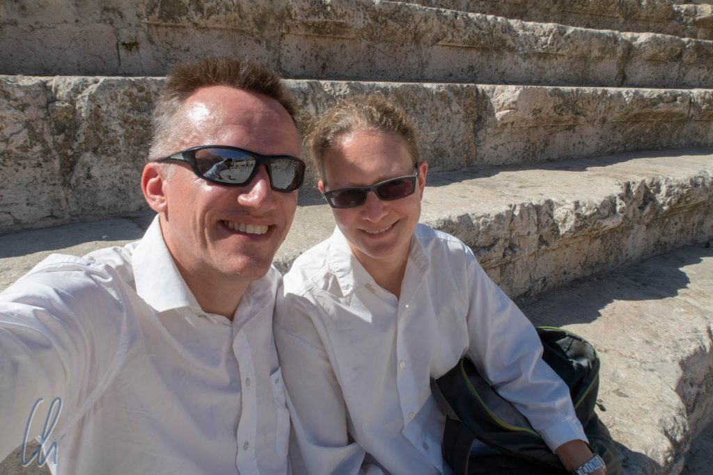
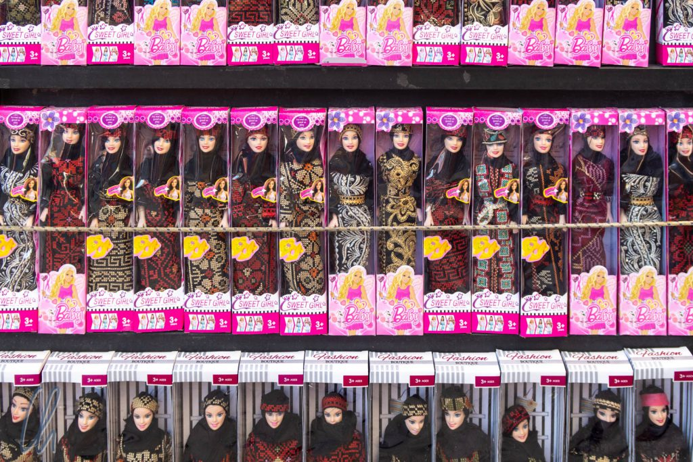

Jordanien unterschied sich von allen anderen Ländern, die wir vorher auf der Weltreise besucht hatten, und zwar nicht nur deshalb, weil es sich um einen arabischen Staat handelte. So viel geballte Geschichte und Kultur, das waren wir kaum noch gewohnt. Umringt von vielen Krisennationen ist Jordanien eine friedliche Insel, wegen der Sicherheitslage musste man sich nicht den Kopf zerbrechen. Während unseres Aufenthaltes sind wir vielen freundlichen, aufgeschlossenen und hilfsbereiten Jordaniern begegnet. Das Land kann aufgrund seiner modernen Infrastruktur außerdem vergleichsweise unkompliziert bereist werden und hat eine überaus schmackhafte Küche zu bieten. Ungewöhnlich fanden wir, dass wir in der Umgebung von Madaba immer wieder Beduinen sahen, die auf einem Feld ihre Zelte aufgeschlagen hatten und ihre Tiere dort weiden ließen. Es war überraschend für uns, dass anscheinend einige Menschen ihre traditionelle Lebensweise in einem vergleichsweise modernen Land nicht aufgegeben haben.

<!--more-->

## Islamische / arabische Welt für Einsteiger

Ein wesentlicher Grund für die Auswahl von Jordanien als Reiseland war, dass wir ein arabisches Land bereisen wollten. Vieles von dem, was wir oberflächlich mit der arabischen Welt verbinden würden, haben wir allerdings in Jordanien nicht erlebt. Wir mussten uns z.B. nicht viel anders kleiden als sonst. Kurze Hosen und kurzärmlige Oberteile ließen wir trotzdem meistens im Rucksack. Das Tragen solcher Kleidungsstücke gilt als ungehörig. Es bestand aber zum Beispiel für Mona keine Notwendigkeit, ein Kopftuch zu tragen oder ihr Gesicht zu verhüllen.

Auch den Islam als Religion haben wir eher am Rande wahrgenommen. Natürlich haben wir in regelmäßigen Abständen den Ruf des Muezzin vernommen und einige Führer baten um kurze Pausen, wenn sie beten wollten. Nur der Guide auf der Zitadelle von Amman startete einen kleinen Bekehrungsversuch, aber abgesehen davon wurde die Religion anscheinend als Privatsache betrachtet und war vielleicht so präsent wie der katholische Glauben in Lateinamerika.

Mona konnte zudem vielfach mit ihrem [Vornamen](<https://de.wikipedia.org/wiki/Mona_(Vorname)>) Sympathie wecken ("Oh, Arabic Name!"). Auf Arabisch bedeutet "Mona" "Hoffnung" oder "Traum" und so war das Eis schnell gebrochen, allein schon durch die Vorstellung, die immer auf Englisch erfolgte. Sprachprobleme hatten wir (fast) nie in Jordanien, was auch dazu beitrug, dass Jordanien sehr unproblematisch zu bereisen war.

## Sehr gute Infrastruktur

Die gute Infrastruktur in Jordanien vereinfachte das Reisen zusätzlich: Stabiles Internet, der Fahrdienst Uber funktionierte in den Städten problemlos und die Straßen waren einwandfrei. Nur einen Wermutstropfen gab es: Der öffentliche Personenfernverkehr soll laut Reiseführer für Ausländer nicht zu bewältigen sein. Da mein Führerschein in Mexiko geblieben war, Mona nicht ausschließlich fahren wollte und wir uns keiner Rundreisegruppe anschließen wollten, war die einzige Option auf längeren Strecken ein gemietetes Auto mit Fahrer. Was dekadent klingt, stellte sich allerdings sogar als Sparmodell heraus. Aufgrund unserer Reiseroute wäre ein Mietwagen für die gesamte Zeit sogar teurer gewesen.

Vor allem die Überlandverbindungen sind sehr gut ausgebaut. Der Desert Highway führt von Norden nach Süden durch das ganze Land und auch die Nebenstraßen sind weitestgehend schlaglochfrei. Geschwindigkeitsbegrenzungen sind allerdings eher Dekoration, auch weil sie (viel) zu niedrig angesetzt sind. An Baustellen auf dem Desert Highway herrscht ein Limit von 40 oder 60km/h, obwohl die Fahrspuren breit sind. Infolgedessen fahren alle Verkehrsteilnehmer trotzdem 80 bis 100km/h. Man kommt also schnell und zuverlässig von A nach B.

Die freilaufenden Kamele, die gelegentlich den Desert Highway überqueren, können zu einem echten Hindernis werden. Sie zeigen recht eindrucksvoll das Spannungsfeld zwischen dem traditionellen Leben der Beduinen und der Moderne. In den Städten, v.a. in Amman, nimmt der Verkehr bisweilen recht kreative Formen an. Einige Autos fahren gerne so nah an eine Ampel heran, dass der Fahrer das Signal nicht mehr erkennen kann. Dass die Ampel grün geworden ist, merken sie dann daran, dass hinten gehupt wird.

## Stempelsammeln mit dem Jordan Pass

[Tourismus](https://de.wikipedia.org/wiki/Jordanien#Tourismus) ist in Jordanien ein wichtiger Wirtschaftszweig und ein gutes Geschäft. Er macht etwa 10% des BIP aus und ist ein wesentlicher Devisenbringer. Ein Zeichen dafür ist, dass an den Straßen spezielle Hinweisschilder (in braun statt in blau) stehen, auf denen die Entfernungen zu den Sehenswürdigkeiten abzulesen sind. Es gibt eine eigene Touristenpolizei und man kann den [Jordan Pass](https://www.jordanpass.jo/) erwerben, der einem bei vielen Attraktionen freien oder reduzierten Eintritt gewährt. Eigentlich rechnet er sich sofort, sobald man nach Petra fahren (und wer will das nicht?) und noch ein paar weitere Sehenswürdigkeiten besuchen möchte.

Auch wenn ein digitaler Jordan Pass möglich gewesen wäre, hatten wir ihn sicherheitshalber ausgedruckt, was sich an den meisten Stellen als vorteilhaft erwies, da die Kontrolleure (außer in Petra) ihn meist abstempeln wollten. Als großen Bonus bekam ich auch in mein [Stempelbuch](http://wittmann-tours.de/wir-sammeln-stempel/) zahlreiche neue Stempel mit dekorativer arabischer Schrift :).

## Tourismus als Wirtschaftszweig

Trotzdem hatten wir keineswegs den Eindruck, dass Jordanien vom Tourismus überlaufen war. Wenige Ausnahmen davon sind [Petra](http://wittmann-tours.de/petra-die-hauptstadt-des-reiches-der-nabataeer) (natürlich), vermutlich auch [Aqaba](<https://de.wikipedia.org/wiki/Akaba_(Jordanien)>) am Roten Meer (wo wir nicht waren) und die sogenannte "Church of the Map" in [Madaba](http://wittmann-tours.de/die-filigranen-mosaike-von-madaba/). An allen anderen Orten waren die Besucherzahlen eher überschaubar. Vielleicht ist Jordanien doch noch so etwas wie ein Geheimtipp, da von Westlern die umliegenden Konfliktherde pauschal auf den gesamten Nahen Osten und die arabische Welt projiziert werden.

Wir hatten allerdings den Eindruck, dass die touristische Infrastruktur in Jordanien gezielt als Parallelwelt geplant und inszeniert wird. Besucher werden mit dem Reisebus oder mit privatem Transfer von Sehenswürdigkeit zu Sehenswürdigkeit gebracht und auf dem Weg dorthin in speziell für Touristen gebaute Geschäfte und Restaurants geschleust. Je nach Standpunkt könnte man sich über die gute Infrastruktur freuen oder aber Authentizität vermissen. Wir gehörten eher in die zweite Gruppe. Leider stieß unser Wunsch nach weniger Touristenblase nicht immer auf Verständnis.

## Wie der Tourismus Jordanien verändert

Auf jeden Fall bietet der Tourismus anscheinend viele gut bezahlte Jobs. Zu denken gab uns die Geschichte eines Fahrers, der uns von [Feynan](http://wittmann-tours.de/feynan-nachhaltigkeit-in-der-wueste/) nach Madaba brachte. Wir sprachen über unsere Berufe und zum Thema Medizin kannte er sich erstaunlich gut aus. Er erzählte, er sei um die 40 Jahre alt und wäre als Pfleger im Krankenhaus beschäftigt gewesen, auch auf der Intensivstation und im OP. Seine gute Arbeit wurde damit belohnt, dass er für die Koordination im OP zuständig war und dafür 20 Dinar (6,50 Euro) mehr im Monat bekam. Die Tätigkeit soll sehr stressig und anspruchsvoll gewesen sein, aber nicht gut bezahlt, daher sah er sich nach Alternativen um. Jetzt fährt er Touristen im Land umher und verdient damit nach eigenem Bekunden deutlich mehr als in seinem eigentlichen Beruf und die Arbeitszeiten sind angenehmer. Diese Erzählung hörte sich nicht nach einer positiven Entwicklung für das jordanische Gesundheitssystem an.

Auf dieser Taxifahrt lernten wir viel über Jordanien. Insgesamt waren viele Jordanier uns gegenüber sehr aufgeschlossen und interessiert an uns als Menschen. Sie wollten wissen, woher wir kamen, wer wir waren. Das betraf jedoch fast ausschließlich die Leute auf der Straße. Viele Angestellte, die im Tourismus arbeiteten, also auch die meisten Fahrer, schienen diese Tätigkeit nicht aus Berufung gewählt zu haben, sondern nur als Job zu sehen. Alle waren sehr höflich, aber trotzdem hatten wir den Eindruck, als ob sie nicht mit Herzblut bei der Sache wären. Wahrscheinlich hätten die meisten lieber auf andere Weise ihr Geld verdienst, vielleicht in dem Beruf, den sie einmal für sich auserkoren hatten?

## Jordanien kulinarisch

Immer wenn wir ohne Führer und ohne Fahrer unterwegs waren, entflohen wir schnell der Touristenblase, zum Beispiel beim Restaurantbesuch. Neben den interessanten Sehenswürdigkeiten ist allein das Essen Grund genug, Jordanien zu bereisen. In den [ersten Eindrücken](http://wittmann-tours.de/erste-eindruecke-aus-jordanien-in-amman/) berichteten wir schon über Mezze, sozusagen die jordanischen Tapas. Sie waren immer und überall (sogar in einem Fast Food Restaurant am Flughafen) schmackhaft und eine gute Wahl für eine leichte Mahlzeit. Die Klassiker Falafel, Hummus, Salat und Fladenbrot in zahlreichen Variationen wurden uns die ganze Zeit über nicht langweilig.

Aber die jordanische Küche hat mehr als nur Mezze zu bieten. Frischen Salat mit aromatischen Tomaten, Gurken, Oliven und Schafskäse genossen wir ebenso wie Fatoush, ein Salat, der zusätzlich mit gerösteten, knusprigen Fladenbrotstückchen garniert wird. Außerdem probierten wir Taboulé, Shawarma, gefüllte Weinblätter, schmackhafte Würstchen (Naqaneq), [Kibbeh](https://de.wikipedia.org/wiki/Kibbeh) und Maftool. Maftool ist ein Gericht aus einer speziellen Form von Couscous. Dieses ist uns besonders im Gedächtnis geblieben. Nicht nur schmeckte es exzellent, es wurde uns in Madaba auch überaus effektvoll serviert. Der Kellner erhitzte einem Tonkrug über offener Flamme am Tisch und öffnete ihn dann mit einem Messer an einer Sollbruchstelle - Voilà, Maftool mit Hühnchen war serviert!

Als Nachtisch ist uns besonders [Muhallabiyeh](https://en.wikipedia.org/wiki/Muhallebi) im Gedächtnis geblieben, eine delikate Milchcreme, die mit Rosenwasser aromatisiert und gehackten Pistazien bestreut wird. Kulinarisch gesehen war Jordanien definitiv eines der interessantesten Länder auf der ganzen Weltreise. Zufälligerweise lagen wir mit unserer Entdeckung der lokalen Kochkunst voll im Trend. In vielen Medien wurden 2018 die gesunden, würzigen, leichten und wenig fleischlastigen Gerichte der Levante-Küche als Inspiration einer hippen, weltoffenen Fusion-Cuisine gefeiert. Umso mehr freuten wir uns über das Privileg, diese Speisen in ihrer authentischen Form im Ursprungsland kosten zu dürfen.

## Die Laster der Jordanier

Jordanien ist im Wesentlichen trockengelegt, d.h. man trinkt wenig bis keinen Alkohol, wie es für ein muslimisches Land zu erwarten ist. Zwei Laster der Jordanier haben wir aber trotzdem schnell ausgemacht. Das erste ist Zucker, die Jordanier lieben es zuckersüß. Seien es sirupbeträufelte Baklava, [Kunafah](https://de.wikipedia.org/wiki/Kunafah) (warmes Blätterteiggebäck mit Quarkfüllung) oder einfach nur Tee. In der traditionellen Zubereitungsart kamen mehrere gehäufte Esslöffel(!) in eine Kanne. Bestellten wir im Restaurant einen Tee, bekamen wir in der Regel 3-4 Tütchen Zucker dazu.

Das zweite Laster ist das Rauchen, allerdings weniger Zigaretten, sondern häufiger Wasserpfeife. Diese steht in vielen Restaurants auf der Speisekarte. Den Rauch empfanden wir weniger als Belästigung, aber der blaue Dunst der Shisha soll noch gesundheitsschädlicher sein als der von Zigaretten. Kurioserweise baten einige Restaurants, in denen natürlich geraucht wurde, beim Bezahlen um eine Spende für die Jordanien Cancer Foundation.

## Geschichte zum Anfassen

Neben den weltlichen Genüssen hat der Besuch in Jordanien sich auch positiv auf unsere Bildung ausgewirkt. Von den Anfängen unserer Zivilisation über die biblische Zeit bis zur Moderne hat Jordanien eine sehr interessante und bewegte Geschichte. Im weiteren Sinne sind Menschen in den Gebieten des Nahen Ostens zum ersten Mal sesshaft geworden, haben Tiere domestiziert und Landwirtschaft betrieben. Jordanien hatte diesbezüglich in biologischer und geographischer Hinsicht Glück durch eine vorteilhafte Ausstattung an Flora und Fauna und fruchtbaren Böden am Jordan, die diese Entwicklung ermöglicht haben.

Die antiken Großmächte gaben sich auf dem Gebiet des heutigen Jordanien die Klinke in die Hand: Griechen, Römer, Byzantiner. Befeuert wurde deren Präsenz durch die vielfältigen Möglichkeiten, Handel zu treiben. Damals war diese Gegend, die [Levante](https://de.wikipedia.org/wiki/Levante), das Bindeglied zwischen dem Mittelmeer und Arabien. Neben den damals schon entscheidenden wirtschaftlichen Verflechtungen bestimmten auch Naturkatastrophen, allen voran Erdbeben, den Lauf der Geschichte. Auch diese sorgten für einige Zäsuren.

Nicht zuletzt ist Jordanien auch Schauplatz der Ereignisse gewesen, über die die Bibel berichtet. Auch wenn ihre genaue Lage wohl mehr auf Überlieferung als auf archäologischen Fakten beruht, so haben uns die [biblischen Orte](http://wittmann-tours.de/jordaniens-biblische-orte/) und Landschaften sehr fasziniert. Sie lassen die Geschichten des Buches der Bücher in einem lebendigeren Licht erscheinen. So verging die Zeit im Morgenland wie im Fluge und wir könnten uns gut vorstellen, Jordanien in der Zukunft noch einmal einen Besuch abzustatten.
