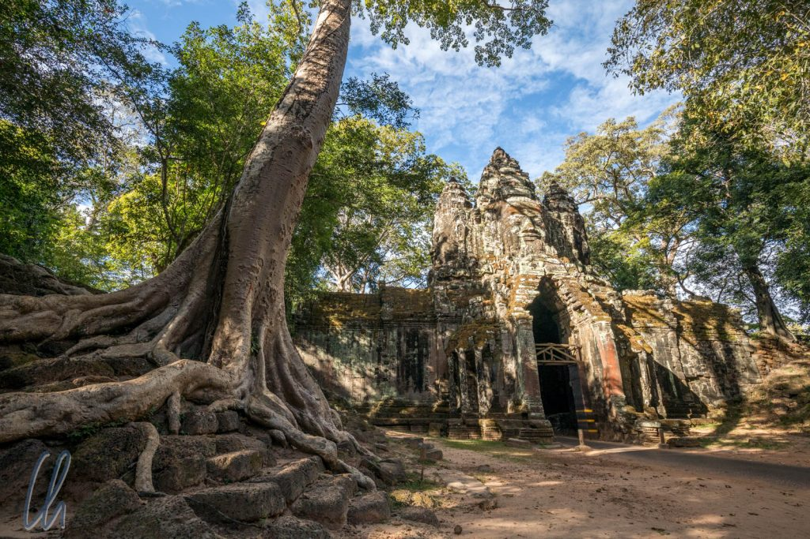

Es hat etwas gedauert, bis wir mit Kambodscha warm geworden sind. Das lag vor allem daran, dass der Tourismus in Phnom Penh und Siem Reap (bei [Angkor](http://wittmann-tours.de/die-tempel-von-angkor/)) sehr routiniert aufgezogen wird und dass Ausländer vor allem als Geldquelle und weniger als Mitmenschen gesehen werden. Das Thema "Geld" musste immer erst aus dem Weg geräumt werden, bis sich die Menschen gezeigt haben. Wenn es soweit war, lernten wir sehr freundliche Kambodschaner kennen, die in einem wunderschönen und vielschichtigen Land leben.

<!--more-->

## Eine dunkle Geschichte

Die Bewohner Kambodschas haben in ihrer jüngeren Geschichte viel durchgemacht. Die Schreckensherrschaft der Roten Khmer dauerte zwar "nur" von 1975 bis 1979, aber auch danach kam das Land lange Zeit nicht zur Ruhe. Erst seit Anfang der 2000er Jahre ging es für Kambodscha aufwärts. Damit einher ging auch ein gewisser Prozess der Aufarbeitung der Vergangenheit. International unterstützte langwierige und sehr teure [Gerichtsverfahren](https://de.wikipedia.org/wiki/Rote-Khmer-Tribunal) wurden geführt, in denen einige wenige Befehlshaber der Roten Khmer letztlich schuldig gesprochen wurden. Über den Grad und Nutzen dieser Aufarbeitung der Vergangenheit kann sicher trefflich debattiert werden. Immerhin haben überhaupt einige Prozesse mit nachfolgenden Verurteilungen stattgefunden und die begangenen Verbrechen sind in der Bevölkerung auf keinen Fall tabu.

Man trifft noch viele Zeitzeugen, die jeweils ihre eigene Leidensgeschichte zu erzählen haben. Außerdem gibt es das berühmte Museum des Gefängnisses [Tuol-Sleng](https://de.wikipedia.org/wiki/Tuol-Sleng-Genozid-Museum) und die [Killing Fields Choeung Ek](https://de.wikipedia.org/wiki/Killing_Fields). Beide Einrichtungen versuchen, einen Eindruck vom Wahnsinn und der Willkür des Regimes zu vermitteln und die Erinnerung an die vergangenen Greuel wachzuhalten. Unter der Schreckensherrschaft der Roten Khmer wurde ein Viertel bis ein Drittel des eigenen Volkes vernichtet.

## Kambodscha ist ein sehenswertes Land

Zum Glück ist nicht alles zerstört worden. In Angkor haben die Roten Khmer zwar auch gewütet, in den Tempeln aber nur relativ geringe Schäden angerichtet. Inzwischen blühen die darstellenden Künste wieder auf, auch wenn vor allem Touristen Interesse an den Vorführungen zeigen: Das Khmer-Schattentheater und die traditionellen Tänze haben uns in ihren Bann gezogen. Die Ausbildung der Künstler und die Aufführungen sind entweder von Exil-Kambodschanern initiiert worden oder es sind international unterstützte Hilfsprojekte.

Auch abseits von Phnom Penh und Angkor hat uns Kambodscha sehr gut gefallen, weil wir dort ein anderes, nicht so touristisches Kambodscha erleben durften. Battambang haben wir als entspannte Kleinstadt mit kolonialen Gebäuden erlebt: Weniger spektakuläre Tempel, weniger Tourismus, dafür alles sehr authentisch. Ein absolutes Highlight war hier der [Zirkus Phare Ponleu Selpak](https://phareps.org/events), der eine ausgefallene, ideenreiche Akrobatik-Vorführung mit gesellschaftskritischem Inhalt zeigte.

Nicht zuletzt wartete Kambodscha auch mit beeindruckender exotischer Fauna und Flora auf. Trotz vieler Probleme im Detail finden Umweltschutzbemühungen statt. Es gibt Naturschutzgebiete und Projekte, die bei der Bevölkerung ein Umweltbewusstsein zu wecken versuchen. Allein die Existenz von Tierschutzgebieten wie [Phnom Tamao](http://wittmann-tours.de/kuscheln-mit-elefanten-im-phnom-tamao/) ist ein Schritt hin zu einer positiven Entwicklung. Umso mehr hat uns gefallen, dass solche Projekte etwas erreichen können. Es bleibt zu hoffen, dass die Schaffung von Naturschutzgebieten dazu führt, die Ausbeutung und Zerstörung der Umwelt zu verhindern.

## Eine unsichere Zukunft

Ökologisch gesehen ist hingegen der [Tonle Sap See](<https://de.wikipedia.org/wiki/Tonle_Sap_(See)>) ein Sorgenkind Kambodschas. In den vergangenen Jahren ist sein Wasserstand konstant zurückgegangen. Das Wasser ist verschmutzt und er ist mittlerweile stark überfischt. Interessanterweise ist hier nicht der Klimawandel die primäre Ursache, sondern andere Dimensionen der Einflussgröße Mensch. Staudamm- und Bewässerungsprojekte am Oberlauf des Mekong (auch in China) sind verantwortlich für deutlich weniger Wasser im Mekong. Eine wachsende Bevölkerung, modernere Fischereimethoden und fehlende Weitsicht hinsichtlich der Fangmengen bedeuten immer weniger Fische, dafür eine Menge Plastikmüll im Tonle Sap. So steht für viele Menschen die Lebensgrundlage auf dem Spiel.

Auch politisch ist die Lage angespannt. Nachdem Mitte November 2017 die [größte Oppositionspartei verboten worden war](http://www.zeit.de/politik/ausland/2017-11/kambodscha-oberstes-gericht-oppositionspartei), herrscht Premierminister [Hun Sen](https://de.wikipedia.org/wiki/Hun_Sen) de facto autokratisch. Ein Zustand, den vielen Menschen im Lande mit großer Sorge betrachten.

Wir hoffen sehr für Kambodscha, dass die Fortschritte der letzten Jahre nicht zunichte gemacht werden. Wie einer unserer Guides sagte: "We want to change with vote, not with gun!". So wird es interessant sein zu verfolgen, was die Parlamentswahlen im Juli 2018 bringen werden. Den Bürgern kann man nur wünschen, dass eine positive Entwicklung ohne Repression und Gewalt möglich sein wird.

