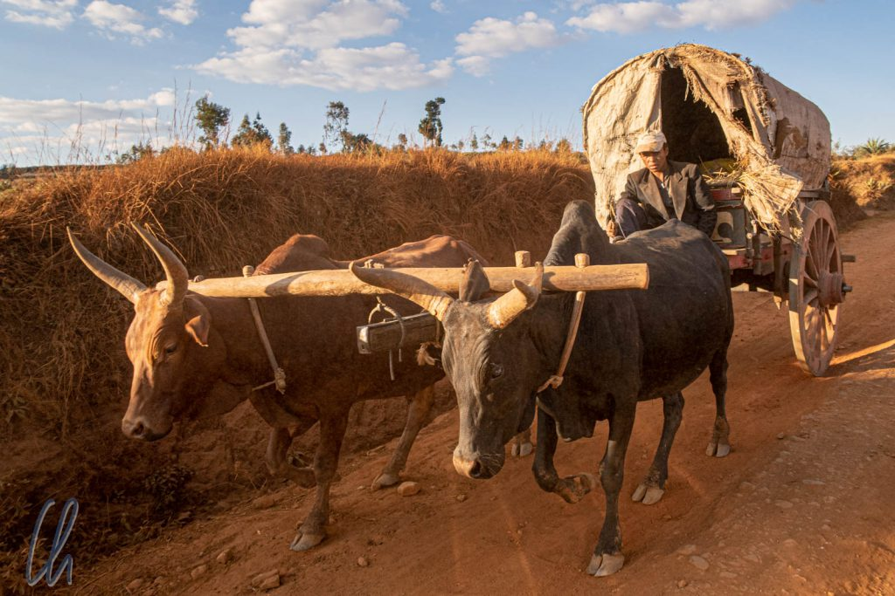
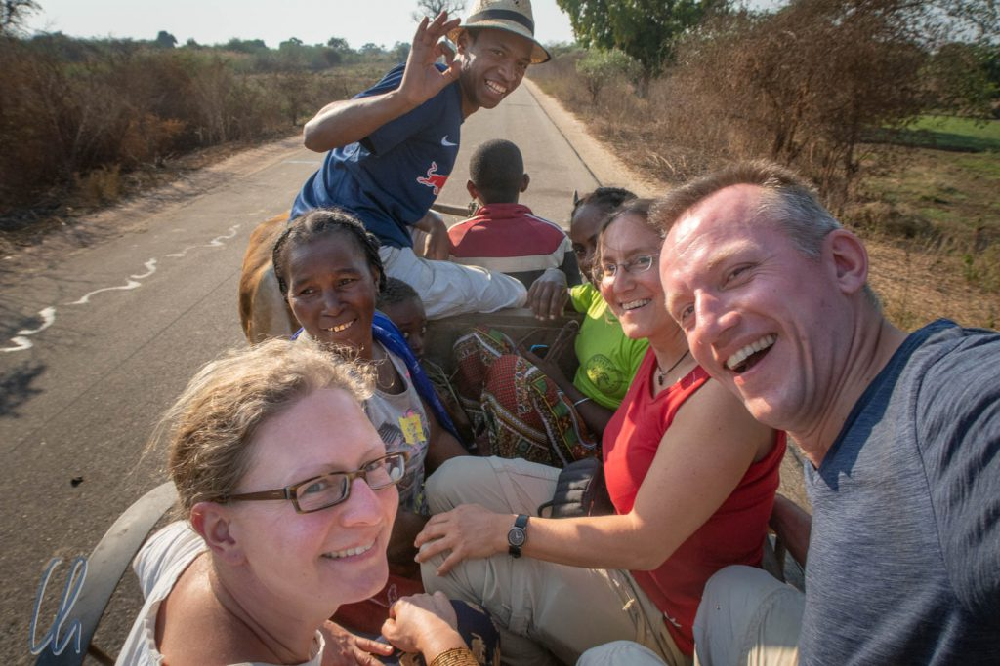
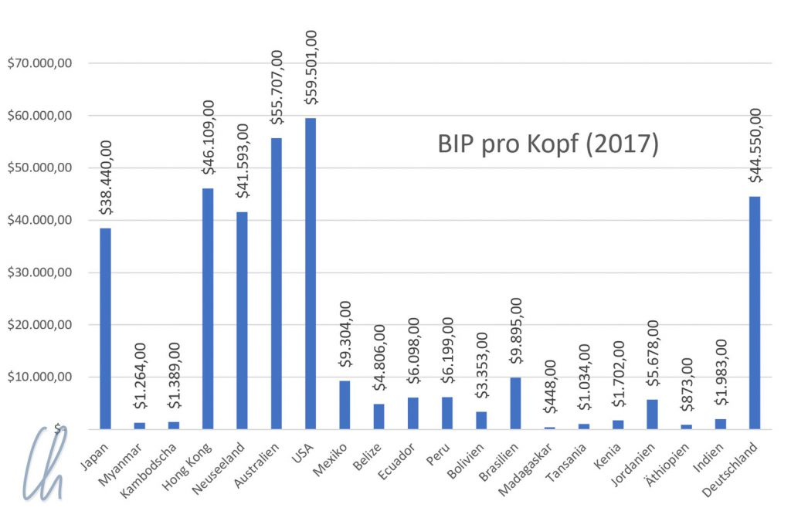
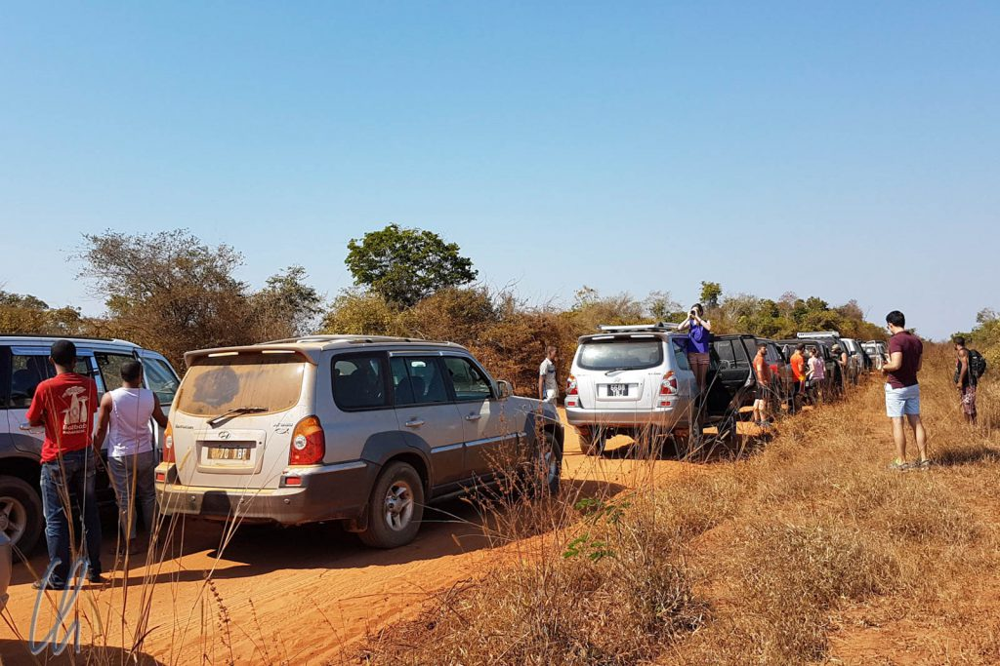
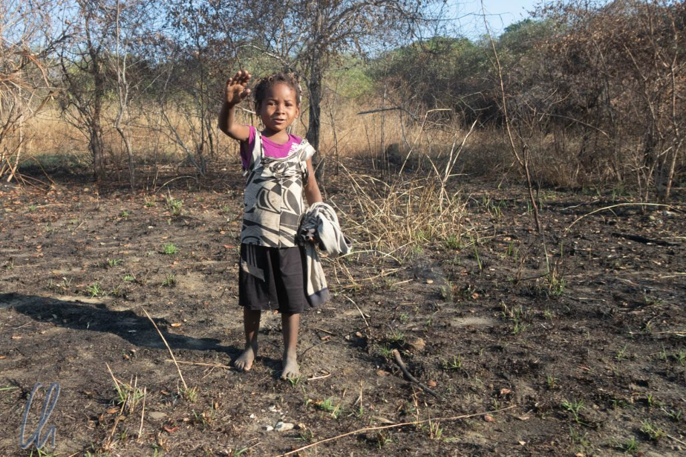

Auf Madagaskar haben wir 3 sehr intensive Wochen verbracht. Das Reisetempo war deutlich höher als in anderen Ländern, wie es auf einer organisierten Reise mit Reiseleiter eben ist. So wie es für Katja der Sommerurlaub war, hatten auch wir freigenommen vom Organisieren und Blogschreiben. Dafür wäre bei der Fülle von Eindrücken auch keine Zeit gewesen, der beeindruckenden Natur, den einzigartigen Tieren, der spannenden Kultur, der leider allgegenwärtigen Armut und den vielen Begegnungen mit den Madegassen.

<!--more-->

## Fahrt auf dem Zebukarren

Tahina war Meister darin, zwischendurch ein paar sehr madegassische Begegnungen zu organisieren. Auf der [Rückfahrt von Morondava](http://wittmann-tours.de/fotografien-als-bindeglied-madegassen-im-portrait/) fragte er eine Familie, ob wir ein Stück auf dem Zebukarren mitfahren könnten. Nach kurzem Dialog vom Beifahrersitz aus war alles geregelt: Die Vazahas durften Zebuwagen fahren. Freudestrahlend stiegen wir auf, hatten allerdings Probleme, alle auf dem Karren Platz zu finden. Er war kaum einen Meter breit, drinnen lag Stroh als Polsterung. Da wir nun zu siebt waren, setzten wir uns auf den Rand des Wagenkastens.

Für uns war es ein phantastisches und sehr authentisches Erlebnis. Die Mitglieder der Familie empfanden die Gegebenheit wahrscheinlich als sehr kurios, sie hatten großen Spaß dabei. Auch für die Passanten war es sehr bemerkenswert, dass die Vazahas im Zebukarren saßen. Alle begegneten uns mit einem breiten Grinsen, winkten und riefen Bemerkungen :).

## Umgang mit Armut

Madagaskar war das wirtschaftlich schwächste Land, das wir auf unserer Weltreise besuchten. Fast jeden Tag wurden wir mit materieller Not konfrontiert. Wir sahen arme Menschen auf der Straße und natürlich versuchten einige, uns um Geld zu bitten. Wie geht man damit um? Wie reagiert man auf bettelnde Kinder? Soll man etwas geben oder sie ignorieren? Auch wenn es hart klingt, wir haben nie etwas direkt auf der Straße ausgehändigt und auf keinen Fall ohne Gegenleistung. Bei allem, was wir verschenkt haben, zum Beispiel die leeren Wasserflaschen, haben wir lieber über Tahina als Mittelsmann gegeben.

Reisende sollten sich unserer Meinung nach hüten, im Land wahllos an Fremde Geschenke zu verteilen, da dies falsche Erwartungen weckt. Aber es ist schwer, oft sehr schwer! Am Morgen der Rückfahrt von den Tsingys ereignete sich Folgendes: Wir warteten darauf, dass sich die Fahrzeugkolonne in Bewegung setzten würde. Für vielleicht 20 Minuten standen wir neben unserem Wagen. Vor uns parkte ein Jeep mit Deutschen und Spaniern. Kinder kamen, fragten nach Süßigkeiten oder Geld, aber sie bekamen nichts.

Ein Junge von vielleicht 6 Jahren hatte sein jüngeres Brüderchen auf dem Arm. Der Führer des Nachbarautos übersetzte, was er sagte. Der Vater war vergangenes Jahr bei einem Unfall ums Leben gekommen und sie hätten noch kein Frühstück bekommen. Eine Deutsche aus dem anderen Auto gab ihnen daraufhin ein Sandwich, das sie sich im Hotel mitgenommen hatte. Die Kinder waren sehr glücklich. Das ältere Geschwister begann sofort, den kleinen Bruder damit zu füttern, rührende Fürsorge.

## Wohltaten oder nur gut gemeint?

Daraufhin sagte die Deutsche aus dem Nachbarauto: „Ab sofort nehmen wir jetzt jeden Morgen immer etwas vom Frühstücksbüffet mit, im Restaurant gibt es so viel und es bleibt doch immer etwas übrig! Das verteilen wir dann an die Kinder.“ Klingt vernünftig, oder? Ihr Guide erwiderte daraufhin, sie sollten das besser nicht tun. Die Kinder würden sich schnell daran gewöhnen, nicht zur Schule gehen, sondern noch mehr betteln. Bei knappem Angebot an Helfern und Spenden würden die Kinder vielleicht sogar untereinander kämpfen, sich dabei verletzen, um die milden Gaben zu erhaschen.

Wer hat recht, der Führer oder die Wohltäterin? Schwer zu sagen. Wir teilten jedoch die Auffassung des Guides, da wir gesehen haben, was die willkürliche Verteilung von Geschenken bewirken kann. Mädchen und Jungen fragten aufdringlich und penetrant: "Vazaha, Bonbon?" ("Ausländer, gib uns ein Bonbon!") und wir sahen tatsächlich Touristen, die tütenweise Bonbons verteilt haben. Nicht nur, dass sie damit für andere Reisende aufdringliche Kinder heranzüchten, die Kleinen führen zu Hause vermutlich keine Zahnpflege mit Zahnbürste oder Zahnpasta durch. Der Zucker macht kurzfristig glücklich, aber kurze Zeit später sehr hungrig (durch die Ausschüttung von Insulin). Die Kinder werden so dazu erzogen, in Zukunft lieber die Touristen zu bedrängen als zur Schule zu gehen. Gut gemeint, aber diese Praxis hat im Endeffekt nur negative Konsequenzen für alle Beteiligten.

## Madagaskar, ein (Tourismus-)Entwicklungsland

Auch wenn der Tourismus, und damit seine Auswirkungen auf die Madegassen, seit 2011 zugenommen und vielleicht auch ein wenig seine Unschuld verloren hatte, so steckte er insgesamt doch noch in den Kinderschuhen. Insgesamt hielt sich der Nepp fast überall (noch?) stark in Grenzen. Natürlich wurden wir das eine oder andere Mal angebettelt, aber mit etwas Kreativität zeigte sich die Arglosigkeit der Leute. An der [Baobab-Allee](http://wittmann-tours.de/ueber-die-baobab-allee-nach-norden/) fragte ein Mann recht penetrant nach Geld. Tahina antwortete ihn daraufhin sehr schlagfertig, die Vazahas hätten kein Bargeld, sondern nur eine Kreditkarte. Das erschien dem Madegassen plausibel, enttäuscht entfernte er sich ;).

Im kommerziellen Sektor waren die "Segnungen" der Zivilisation noch kaum in Madagaskar angekommen. Wir sahen sehr wenig Werbung, die großen Marken waren durch die Bank nicht vertreten, mit einer Ausnahme: Coca Cola. Damit entstand auch vergleichsweise wenig Müll. Wo es kein Plastik gibt, kann man es auch nicht wegwerfen. Hoffen wir, dass es so bleibt. (Hier war Toamasina das unrühmliche Gegenbeispiel. Entlang mancher Straße in der Stadt türmten sich stinkende Müllberge.)

Auch Waschmaschinen gab es nicht auf Madagaskar, die Frauen wuschen mit der Hand, und wie! Unsere Wäsche war strahlend sauber wie noch nie zuvor! Der Dreck und die Flecken, die wir über 10 Monate in zahlreichen Ländern um den Globus gesammelt hatten, und die die internationale Flotte an Waschmaschinen nicht herausbekommen hatte, beseitigten die fleißigen madegassischen Wäscherinnen erfolgreich, ganz ohne den weißen Riesen.

## Mehr Lösungen als Probleme

Auch scheinbar Unmögliches wird in Madagaskar trotz aller Widrigkeiten möglich. Eines schönen Abends schaltete sich in einem Hotel die Stromversorgung von Generator auf Solar(batterie)betrieb um, es gab einen Knall im Laptop-Netzteil… und es hatte seinen Geist aufgegeben. Uns war sofort klar, dass die Aussichten, auf Madagaskar Ersatz zu beschaffen, asymptotisch gegen null tendierten, also musste ein Plan B gefunden werden.

Ich schilderte das Problem Hasina, der unsere Tour organisiert hatte, und er sagte erstmal nur "Verstanden, ich kümmere mich", nur um sich 5 Minuten später zurückzumelden: "Warum habe ich so lange überlegt? Meine Cousine fliegt am Samstag aus Deutschland nach Madagaskar" (es war Dienstag) "Bestell das Netzteil einfach im Internet, lass es an ihre Adresse liefern und sie bringt es Dir mit." Gesagt getan. Bestellt, einen Tag später versandt, pünktlich in Deutschland ausgeliefert, weiter mit Cousinenkurier nach Madagaskar und am Sonntag überreichte Tahina mir das Päckchen. Mehr Lösungen als Probleme! Not macht bekanntlich erfinderisch und auf Madagaskar funktioniert dadurch so manches scheinbar Unmögliche am Ende erstaunlicherweise doch.

## Wer gut schmiert, der gut fährt

Wo im Kleinen die Problemlösung gut funktioniert, herrscht an anderer Stelle ein Dauerproblem, nämlich die Korruption. Sie durchzieht, wie uns berichtet wurde, den gesamten offiziellen Sektor. Selbst an der Uni kann man sich gute Noten erkaufen. Persönlich blieb uns dieser unangenehme Bestandteil der madegassischen Lebenswirklichkeit weitestgehend verborgen, nur einmal erlebten wir, wie lästig es ist, wenn man der Willkür von Staatsbediensteten ausgeliefert ist.

Auf der Rückfahrt von Morondava nach Antsirabe hielt uns die Polizei an einem Kontrollposten auf. Wir hätten angeblich noch eine offene Rechnung in Morondava. Ein Werkstattaufenthalt unseres Autos sei nicht bezahlt worden, daher durften wir nicht weiterfahren. Richtig, unser Geländewagen war in Morondava in der Werkstatt gewesen. Während wir einen [Tag am Meer](http://wittmann-tours.de/ein-tag-am-meer-in-morondava/) verbrachten, hatte Christian versucht, einige Blessuren des Wagens von der Fahrt auf der [Nationalstraße 8](http://wittmann-tours.de/die-nationalstrasse-8-ueber-belo-nach-bekopaka/) beheben zu lassen, aber ohne Erfolg. Die Reparaturen konnten erst später in Antananarivo erfolgen.

Ein Schelm, wer jetzt vermutet, dass die Staatsdiener versucht hätten, diese Situation auszunutzen. Es hieß, es sei ein schwarzer Hyundai Terracan (das war das Modell des Fahrzeugs) gewesen, das Kennzeichen war den Polizisten aber nicht bekannt. Nach einer halben Stunde Diskussion zwischen unserem Fahrer Christian und den Beamten, wichtig aussehenden Ermittlungen und Telefonaten durften wir schließlich weiterfahren. Es hatte sich herausgestellt, dass der gesuchte Wagen ein zerbrochenes Rücklicht hatte. Ob die Polizisten wohl auf eine Gratifikation zur Vereinfachung der Problemlösung gehofft hatten und ob eine finanzielle Zuwendung den Prozess beschleunigt hätte, wissen wir nicht, aber dieser Schluss wäre naheliegend.

## Hilfsprojekte dauerhaft in der Schwebe

Auch bei Hilfsprojekten fließt das Geld anscheinend oftmals in dunkle Kanäle ab. Auf dem Weg zu den Tsingys fuhren wir an einer scheinbar idyllischen Schule im Grünen vorbei. Marode Bänke standen im Freien direkt neben der Straße und die Tafel hing an einem Baum. Etwas im Hintergrund sahen wir die bröckelnden Reste einer überwucherten Backsteinruine. Das hätte das Schulgebäude werden sollen. Das Projekt (international gefördert) konnte aufgrund mangelnder Finanzierung nicht vollendet werden. Daher befand sich die halbfertige Schule im Stadium des Verfalls. Es ist natürlich vollkommen offen, ob wirklich die gesamten Hilfsgelder in den Bau geflossen sind und wer von einer eventuellen Differenz profitiert hat.

In Maroansetra fuhren wir über die marodeste Brücke, die wir auf Madagaskar gesehen hatten. Die Holzbrücke hatte tiefe Löcher und es war notwendig, immer wieder ein Stück Metall an anderer Stelle unterzulegen, damit unser Auto überhaupt passieren konnte. Vor der Brücke stand ein großes buntes Schild, das besagte, dass der Neubau von der EU gefördert würde. 2017 sollte die Renovierung abgeschlossen sein. Wir schrieben Ende August 2018. Vielleicht hat das Geld nur für das Schild gereicht und der Rest ist auf unerklärliche Weise verloren gegangen?

## Madagaskar kulinarisch

Es war für uns ein wenig schwierig, die madegassische Küche kennenzulernen, da uns, den Vazahas, oft internationale Kost serviert wurde. Meist waren dies Gerichte mit Hühnchen- oder Zebufleisch. Und trotzdem wäre es nicht gerecht, Madagaskar kulinarisch darauf zu reduzieren. Es gab buchstäblich an jeder Straßenecke köstliche frische Früchte der Saison: Cherimoyas, Bananen, Papayas, Avocados (Mango, Litschi und Mangosteen waren leider zu der Zeit noch nicht reif). An der Küste bekamen wir Fisch und Meeresfrüchte in Hülle und Fülle.

Kulinarisch zeigten sich die positiven Einflüsse der französischen Kolonialzeit. Schlecht essen wird man in Madagaskar kaum. Die einheimische Küche ist einfach, aber schmackhaft und für alles andere haben die Franzosen gesorgt. Zum Frühstück gab es gutes Baguette. Einmal nahmen wir unser Mittagessen in einem Restaurant zu uns, dessen Spezialität köstliche gebratene Ente und Entenleber waren. Nicht zuletzt wurden wir mehrmals mit herrlich cremigem Mousse au Chocolat zum Nachtisch verwöhnt.

## Typisch madegassische Getränke

Ohne Alkohol und typisch madegassisch hat Bonbon Anglais auf uns einen bleibenden Eindruck hinterlassen: Es ist eine klare Limonade wie Sprite, allerdings extrem süß und mit Minz-Menthol-Geschmack wie Eisbonbons.

Auch ganz häufig begegnete uns [Three Horses Beer (THB)](https://en.wikipedia.org/wiki/Three_Horses_Beer) mit seinem markanten Logo mit den drei Pferdeköpfen. Früher eine eigenständige madegassische Marke befindet die Brauerei sich mittlerweile im Besitz des französischen Konzerns [Castel](https://en.wikipedia.org/wiki/Castel_Group). Trotzdem ist es weiterhin die am meisten verbreitete Biersorte im Land und die normale Flaschengröße fasst gut gemeinte 65cl. Bei Mona und Katja war das Fresh (Panaché) sehr beliebt, ein erfrischendes Radler mit nur sehr wenig Alkohol (weniger als 1%).

Auf keinen Fall zu vergessen ist der [Rhum Arrangé](https://fr.wikipedia.org/wiki/Rhum_arrang%C3%A9). Hierbei handelt es sich um Rum, in den Früchte oder einfach nur ein paar Vanilleschoten eingelegt wurden, und der dadurch geschmacklich verfeinert wird. Rhum Arrangé ist eine typisch madegassische Spezialität. Man stößt an mit den Worten "Samy tsara" (gesprochen in etwa "Tsamzara"). "Tsara" bedeutet "gut" und frei übersetzt bedeutet "Samy tsara" "Gemeinsam sind wir schön". Na, wenn das nichts über die Qualität des Rhum Arrangé aussagt ;).

## Der Kreis schließt sich

Vielleicht erinnert Ihr Euch noch an die Episode aus den "[Ersten Eindrücken aus Madagaskar](http://wittmann-tours.de/erste-eindruecke-aus-madagaskar/)", als wir die Lehmziegelherstellung auf dem Reisfeld beobachtet und die Kinder sich für meine Brille begeistert hatten? Am letzten Tag auf Madagaskar konnten wir auch diese Fotos [übergeben](http://wittmann-tours.de/fotografien-als-bindeglied-madegassen-im-portrait/). Die Kleinen selbst waren zwar nicht dort, aber ihre Mutter, die sich sehr über die Bilder freute. Dafür trafen wir den jungen Mann wieder, der Lehmziegel herstellte, und dessen Portrait wir ausgedruckt hatten.

Er verhielt sich uns gegenüber schüchtern, freute sich aber sichtlich über die Aufnahme. Eigentlich hatten wir uns schon verabschiedet, aber dann formierte sich eine kleine Gruppe für ein Abschiedsgruppenbild, die überreichten Fotos in den Händen, vielleicht, um sich auf diese Art und Weise zu bedanken.

## Lamako!

Wir haben unsere Reise in Madagaskar zu fünft sehr genossen, außerdem haben wir mit Tahina mehr als nur einen Reiseleiter gehabt. In den knapp 3 Wochen sind wir zu Freunden geworden und freuen uns, ihn hoffentlich bald in Deutschland willkommen zu heißen. Vielleicht wird sich auch die Möglichkeit ergeben, dass wir uns bei ihm revanchieren können und ihm als kleinen Dank etwas von unserer Heimat zeigen dürfen.

Verabschieden wollen wir uns mit einem donnernden Lamako! Lamako ist eigentlich ein Element aus der madegassischen Redekunst. Es dient dazu, die Zuhörer auf langen Feiern mit einzubeziehen und bei der Stange zu halten. Das funktioniert so: Der Redner ruft "Lamako!", daraufhin klatschen alle Anwesenden viermal in die Hände, anschließend das Ganze noch mal: "Lamako!" und viermal klatschen. Dann ruft der Initiator: "Avereno!" ("Nochmal!"), alle klatschen 10 mal. Abschließend ruft der Redner: "Atambaro!" und alle klatschen noch einmal zum Abschluss.

**Lamako!** Klatsch! Klatsch! Klatsch! Klatsch! Kurze Pause **Lamako!** Klatsch! Klatsch! Klatsch! Klatsch! Kurze Pause **Avereno!** Klatsch! Klatsch! Klatsch! Klatsch! Klatsch! Klatsch! Klatsch! Klatsch! Klatsch! Klatsch! **Atambaro!** Klatsch!

Eine abgewandelte Version dieses Lamako benutzten wir, um uns zum Abschied bei Führern oder in Unterkünften zu bedanken. Rhythmisches Klatschen und Kusshändchen.

Im folgenden Video seht ihr den letzten Abschnitt der Prozedur:

https://www.youtube.com/watch?v=-Abzbkoo2KM?start=35&end=43&version=3

Danke, Madagaskar, für 3 phantastische Wochen! Veloma Madagaskar! Auf Wiedersehen Madagaskar! Bis zum nächsten Mal!

