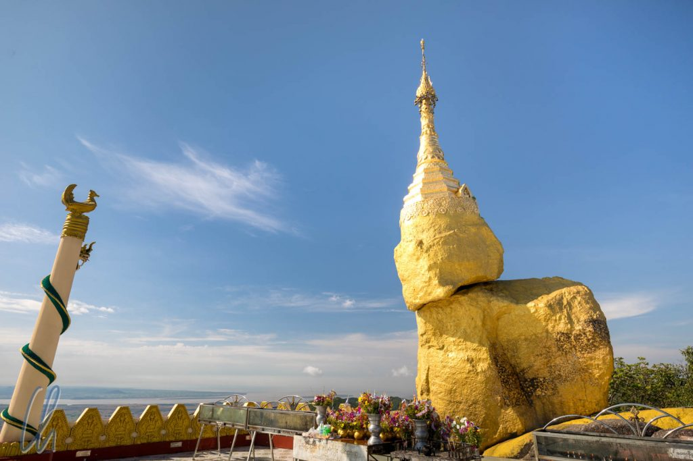
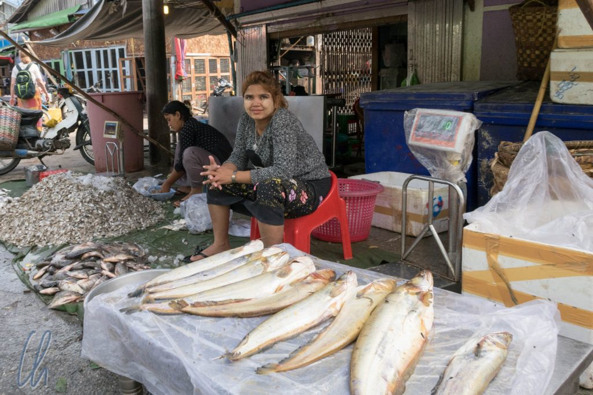

# Wie war Myanmar?

Myanmar hat uns sehr gut gefallen. Auch auf den vermeintlich ausgetretenen Pfaden sind (noch) vergleichsweise wenige Touristen unterwegs. Bagan, die Shwedagon-Pagode in Yangon und Kalaw waren die einzigen wirklich touristischen Orte. Sonst tauchten wir in den Alltag Myanmars ein. Aufgefallen sind wir natürlich trotzdem, v.a. Mona mit Ihren blonden Löckchen. Die Einheimischen waren uns gegenüber aber fast ohne Ausnahme freundlich und aufgeschlossen, was zu schönen und interessanten Begegnungen führte. Und es gibt in Myanmar viele spektakuläre Sehenswürdigkeiten.

<!--more-->

## Myanmar war anders als erwartet

Es ist schwer zu sagen, was wir wirklich erwartet haben, aber wir sind uns einig, wir hatten uns Myanmar anders vorgestellt, irgendwie ärmer, irgendwie unorganisierter. Laut Statistik sieht es für Myanmar finanziell nicht so gut aus: Mit einem [BIP von 1269 Dollar pro Kopf](https://de.wikipedia.org/wiki/Liste_der_L%C3%A4nder_nach_Bruttoinlandsprodukt_pro_Kopf), auf Platz 155 von 190, rangiert Myanmar deutlich im unteren Viertel der in der Statistik verglichenen Länder dieser Erde.

Misst man hingegen kaufkraftbereinigt, so ist Myanmar mit 5832 Dollar auf Platz 131, knapp hinter Vietnam (Platz 129) aber vor Laos (Platz 132) und Kambodscha (Platz 145). Diese Einordnung passt gefühlt auch deutlich besser. Die Märkte bieten ein großes und vielfältiges Warenangebot und viele Menschen machen einen sehr geschäftstüchtigen Eindruck. Die großen ausländischen Marken sind relativ wenig präsent, und so bekommen die Menschen viel Gegenwert für ihre Kyats, da kein Shareholder Value befriedigt oder aufwändiges Marketing betrieben werden muss.

## Myanmar ist erstaunlich gut organisiert

Außerdem funktionierte das Land vergleichsweise gut. Die Busse und Bahnen waren in der Regel langsam aber zuverlässig - die holperige Infrastruktur wird einfach mit eingerechnet. Wir konnten uns trotz manchmal auftretender Verständigungsschwierigkeiten immer auf die Menschen verlassen, versetzt wurden wir nie. Kurze Stromausfälle gab es nur im Süden in Mawlamyine, und das Internet funktionierte prima. Auch wenn so manches Hotel-WLAN eher auf Modem-Geschwindigkeit lief - vor allem mobil war man für umgerechnet 3 Euro im Monat bestens mit schnellem Internet versorgt.

Kein Wunder also, dass fast jeder Burmese nonchalant ein Smartphone im Bund seines [Longyi](https://de.wikipedia.org/wiki/Longyi), des traditionellen Wickelrockes für Frauen und Männer, stecken hatte. Mönche waren da keine Ausnahme. Zuweilen hatten wir den Eindruck, dass das Gebot der Enthaltsamkeit in diesem Punkt aufgeweicht war. Traditionell darf ein Mönch nur Gewand, Sandalen, einen Fächer, einen Schirm und eine Almosenschale besitzen. Neuerdings scheint die Liste der erlaubten Besitztümer um das Smartphone erweitert worden zu sein.

## Sehr buddhistisch und sehr golden

Mönche waren überall ein fester Bestandteil des Straßenbildes in Myanmar. Ob Großstadt oder Dorf, am Flughafen oder im Vergnügungspark, Mönche haben wir überall gesehen. Auch wenn es zahlenmäßig nach unserer Wahrnehmung deutlich weniger sind, so gibt es auch viele buddhistische Nonnen, die an ihrer markanten rosafarbenen Tracht zu erkennen sind. Die Zahl der Mönche und Nonnen muss in die Hunderttausende gehen.

Weiterhin prägen Tausende goldener Pagoden die Städte und das Landschaftsbild von Myanmar. Es ist kein Klischee sondern Realität: Es gibt nicht nur die großen bekannten - man hat den Eindruck an jeder Ecke stünde eine goldene Stupa. Das Gold ist natürlich selten echt sondern meistens Goldfarbe, aber die Farbpräferenz ist eindeutig: Gold is beautiful!

Der Buddhismus ist nicht nur dadurch wahrnehmbar im alltäglichen Leben der Menschen verwurzelt. Die vielen Tempel, Payas und Stupas sind aktive Anbetungsstätten. Für die Tempel, Klöster und das eigene Karma spenden die Burmesen gerne Kyats und Gebrauchsgegenstände oder legen den Mönchen, die morgens in langen Reihen durch den Ort gehen, Lebensmittel in ihre Almosenschalen. Oft gibt es einen Vorboten, der eine Art Glocke schlägt, damit die Gläubigen die Speisen bereitstellen können. Die Prozession der Mönche folgt einige Minuten später mit ihren Sammelschalen. Die Menschen geben ihnen Nahrungsmittelspenden und auch Hotelangestellte bringen etwas vom Buffet.

## Viele Herausforderungen

Man könnte also den Eindruck gewinnen, die Lage in Myanmar sei doch ganz gut. Das ist jedoch nur bedingt der Fall. Auf der [politischen Bühne](http://wittmann-tours.de/politik-in-myanmar/) herrscht noch lange keine Einigkeit im Land, obwohl die Einheit Myanmars demonstrativ immer wieder betont wird. Das Militär bestimmt noch überproportional die Geschicke des Landes. In manchen Regionen herrschen kriegsähnliche Zustände. Der Drogenanbau und -handel ist weiterhin ein blühende Einkommensquelle in den Grenzgebieten im Osten. Zudem ist der Alltag für viele Bewohner Myanmars sehr hart und beschwerlich.

Auf dem Land haben sich in großen Teilen des Landes nach unserem Eindruck die landwirtschaftlichen Anbaumethoden seit Jahrhunderten nicht verändert. So romantisch einem als Reisenden von Ochsen gezogene Pflüge und von Hand gedroschener Reis auch erscheinen mögen, in Wirklichkeit ist es - vor allem in tropischem Klima - harte Knochenarbeit. Auch wenn wir insgesamt vom Lebensstandard positiv überrascht waren, so wirkten selbst die Großstädte auf uns eher wie große Dörfer und stellenweise fast ländlich.

Sobald man die Hauptstraßen verlässt, durchquert man selbst im Zentrum Yangons in den Nebenstraßen improvisierte Märkte mit Obst- und Gemüseständen, kleinen mobilen Garküchen und diversen anderen Ständen, die von der Handyhülle bis zum Regenschirm alle denkbaren Alltagsgegenstände verkaufen.

Soziale Absicherung oder regelmäßiger Schulbesuch für Kinder sind leider keine Selbstverständlichkeit. Auch wenn gerne betont wird, dass Schulpflicht herrscht, haben wir trotzdem immer wieder Kinderarbeit gesehen. Am Eingang DER wichtigsten heiligen Stätte in Yangon, der Shwedagon-Pagode, passen Kinder auf die Schuhe der Besucher am Eingang auf - keine harte Arbeit, aber dennoch für uns ein ungewohnter Anblick. Unfassbar fanden wir allerdings, dass Kinder auch harte körperliche Arbeit nachts im Straßenbau verrichten.

## Myanmars Zukunft

Es liegt also noch ein langer und steiniger Weg vor Myanmar. Die Menschen, mit denen wir gesprochen haben, blickten jedoch zuversichtlich in die Zukunft. Mit Aung San Suu Kyi als Kristallisationspunkt ist die Hoffnung auf mehr Demokratie vorhanden. Vor allem in wirtschaftlicher Hinsicht geht es den Menschen deutlich besser als noch vor einigen Jahren. So hoffen wir, dass sich die Lebensbedingungen auch in Zukunft verbessern werden.

Es wäre erfreulich, wenn Myanmar weiterhin das freundliche und aufgeschlossene Land bleiben würde, das wir erlebt haben. Je mehr Touristen kommen, desto mehr Einheimische werden von dieser Entwicklung profitieren wollen. Dies wird zu mehr Professionalität im Umgang mit Reisenden, aber auch zu weniger persönlichen Begegnungen für diese mit Burmesen führen. Wie wenig touristisch Myanmar war, merkten wir erst so richtig, nachdem wir in Kambodscha gelandet waren, aber das ist eine andere Geschichte. Tata Myanmar! Auf Wiedersehen Myanmar! Den Einwohnern dieses wunderschönen Landes wünschen wir für die Zukunft alles Gute!

