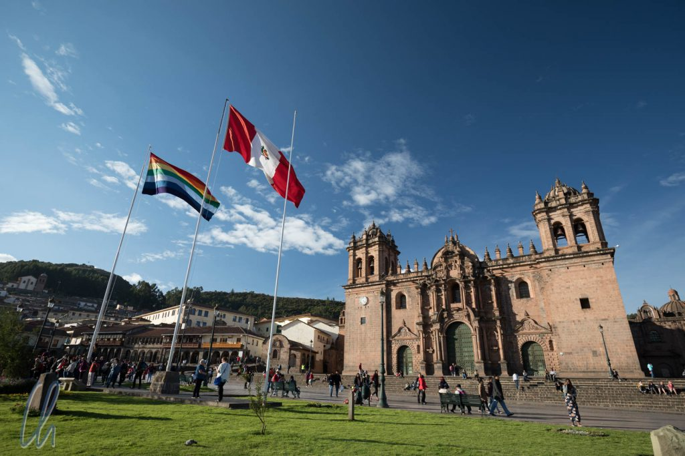

# Wie war Peru?

In Peru waren wir hauptsächlich auf sehr ausgetretenen Touristenpfaden unterwegs: Cuzco, Machu Picchu, Titicacasee, alles keine Geheimtipps. Dort sind die Zeiten des Backpacking mit echtem Abenteuer vorbei, dafür kommen mittlerweile (auch in der Vorsaison) zu viele Besucher. Trotzdem ist Peru zwei Ecken weiter - und erst recht im ländlichen Raum - zum Glück noch ein ganz normales und sehr liebenswertes Land. Und egal wo, Peru bot (soviel können wir vorweg nehmen) kulinarisch die beste Küche der andinen Staaten.

<!--more-->

## Touristische Parallelwelt

Die Attraktionen in Peru sind wirklich sehenswert und entsprechend viele Besucher ziehen sie auch an. Der Tourismus scheint zu boomen und erzeugt damit an den Hauptsehenswürdigkeiten eine touristische Parallelwelt, die nichts mit dem echten Peru zu tun hat. Im Zentrum von Cuzco oder in Aguas Calientes ist alles auf die Reisenden ausgerichtet und die Preise sind für die meisten Peruaner unerschwinglich hoch. Die Besucher sind also unter sich. Tourismus ist ein sehr wichtiger Wirtschaftszweig und natürlich möchten viele Einheimische (und auch Ausländer) mitverdienen.

Auch der Staat (oder die Gemeinden?) scheinen diese Parallelwelt zu fördern. Die Touristen-Information iPeru hatte hilfreiche Tipps für uns, der Verkauf von Tickets in und um Cuzco oder für Machu Picchu machte einen zentralisierten Eindruck und natürlich gab es auch eine Touristenpolizei. Fahrzeuge, die Touristen transportierten (oft weiße Minibusse) trugen die Aufschrift "Servicios Turísticos" - ein deutlicher Hinweis, dass man in der Parallelwelt angekommen war.

## Vor- und Nachteile der Tourismusmaschinerie

Diese touristische Parallelwelt ist zugleich anstrengend und bequem. Anstrengend ist sie schon deshalb, weil (zu?) viele Besucher kommen und damit auch die Nepper, Schlepper, Bauernfänger auf den Plan treten. Andererseits gab es (zum richtigen Preis, oft nicht in [Soles](https://de.wikipedia.org/wiki/Peruanischer_Sol), sondern in US-Dollar) überall hübsche Hotels und gute Restaurants, in denen wir die ereignisreichen Tage ausklingen lassen konnten.

Auf keinen Fall wollen wir unerwähnt lassen, dass die Führer vor Ort unserer Wahrnehmung nach in Peru überdurchschnittlich kompetent waren. Sicher gibt es überall motivierte und weniger ambitionierte, aber in Peru haben wir keine Möchtegern-Guides erlebt, die maximal die Infos herunterbeteten, die sowieso im Reiseführer stehen. Alle Führer, auf die wir trafen, waren zertifiziert und hatten offensichtlich eine touristische Ausbildung genossen. Tourismus ist sogar ein Studienfach. Rolando, unser bester peruanischer Guide, hatte drei Jahre Tourismus studiert, kannte sein Land theoretisch und praktisch sehr gut und konnte die Informationen auch lebhaft und interessant vermitteln.

## Peru ist kalt

Egal ob in der Parallelwelt oder im echten Peru, im Hochland war es selten mollig warm. Vor allem nachts wurde es an den meisten Orten recht schattig. Die Sonne tat zwar ihr bestes, tagsüber etwas Wärme zu verbreiten, aber in 3000+ Metern Höhe wurde es in Cuzco, Arequipa und Puno schlagartig kalt, sobald sie hinter den Bergen verschwunden war. Nachts stoppte die Talfahrt des Thermometers nur knapp über dem Gefrierpunkt.

In Peru gilt damit mehr als anderswo auf der Welt, dass es kein kaltes Wetter gibt, sondern nur unangemessene Kleidung. Mit unserer hauptsächlich auf Sommerwetter ausgerichteten Ausrüstung hatten wir die wenigen dicken Kleidungsstücke ständig in Gebrauch. Heizung und Warmwasser sind in Peru zudem anscheinend eher neuere Errungenschaften, die manchmal von den Einheimischen mit Argwohn betrachtet werden. Wir haben von Peruanern gehört, die glauben, in geheizten Räumen würde man krank. Wir sind eher vom Gegenteil überzeugt ;).

## Hay Calefacción?

Weshalb auch immer, viele (auch gehobene) Restaurants und Hotels haben keine Heizung. In diesem Fall ist es normal, in voller Montur, also mit Jacke, Mütze, Schal etc. im Restaurant oder Hotelzimmer zu sitzen. Bei der Auswahl der Unterkünfte haben wir immer auf das Extra Heizung geachtet. Wird die Frage "Hay Calefacción?" ("Gibt es eine Heizung?") mit "Si" ("Ja") beantwortet, darf man allerdings keine moderne Zentralheizung erwarten. Stattdessen fanden wir in der Regel einen (oft überforderten) Elektroheizkörper in Zimmer vor, der bei Maximalbetrieb die Innentemperatur eines vollkommen ausgekühlten Raumes um bestenfalls einige Grad über die Außentemperatur anheben konnte. Was auch nicht heißt, dass im Badezimmer irgendetwas der wohltuenden Wärme ankam.

Nur einmal hatte wir gar keine Heizung im Zimmer (in Lari auf der [Reittour im Colca-Tal](http://wittmann-tours.de/ritt-auf-paso-peruanos-im-colca-tal)), was im Klartext hieß, dass es drinnen genauso kalt war wie draußen. Am nächsten Morgen erfuhren wir, dass die Tiefsttemperatur bei -3 Grad Celsius gelegen hatte und wirklich war draußen der Boden an einigen feuchten Stellen mit Eis bedeckt. Zum Glück bekamen wir dicke Schlafsäcke und es gab immerhin warmes Wasser :). So verstanden wir bald nur zu gut, warum die Inka [Inti](<https://de.wikipedia.org/wiki/Inti_(Gottheit)>) verehrt hatten, den Wärme spendenden Sonnengott.

## Die Peruaner sind leistungsstarke Esser

Peru hat zwei kulinarische Seiten: Die eine ist die qualitative Feinschmeckerseite mit interessant gewürzten und raffiniert angerichteten Speisen, die andere ist eine sehr quantitative Seite. Klar, auch anderswo versuchten viele Restaurants, durch Masse zu punkten, aber in Peru wurden für uns neue Dimensionen erreicht. Beim Restaurantbesuch haben wir oft nur eine Vorspeise gegessen und waren danach satt. Die Peruaner jedoch sind wirklich außergewöhnlich leistungsstarke Esser. Zum ersten, aber bei weitem nicht zum letzten Mal, bemerkten wir dies in der Markhalle von [Cuzco](http://wittmann-tours.de/erste-eindruecke-aus-peru/).

Auch auf der Reittour im Colca-Tal bekamen wir diese beiden Seiten auf beeindruckende Weise demonstriert. Thomas kochte phantastisch - was bestimmt an seinen französischen Genen lag ;) - und viel. Er wusste warum. Bei der ersten Runde gab es ausgewachsene Portionen, Reiten macht schließlich hungrig ;). Beim Nachschlag staunten wir allerdings nicht schlecht. Ein normaler Nachschlag war mindestens so viel wie die erste Runde! Und dann nochmal etwa die Hälfte der ursprünglichen Portion. Selbstredend waren die Teller am Ende leer. Wenn am Ende noch etwas Brot übrig war, griff der eine oder andere auch gerne noch zu, damit niemand hungrig ins Bett gehen musste.

## Die andinen Gourmets

Neben vielen schmackhaften Gerichten der novoandinen Küche glänzte Peru auch, wenn es um Getränke ging. So war zum Beispiel das Nationalgetränk Perus sehr nach unserem Geschmack. Damit meinen wir nicht den bei Peruanern sehr beliebten Softdrink [Inca Cola](https://de.wikipedia.org/wiki/Inca_Cola) in gedecktem Neongelb, sondern [Pisco Sour](https://de.wikipedia.org/wiki/Pisco_Sour). In der klassischen Form ist der Cocktail eine Mischung aus Zitronensaft, Eiweiß, Zucker und, natürlich, [Pisco](<https://de.wikipedia.org/wiki/Pisco_(Getr%C3%A4nk)>). Pisco ist ein hochprozentiges Destillat aus Traubenmost und damit einem albanischen Raki vergleichbar. Sowohl Peru als auch Chile beanspruchen den Ursprung von Pisco und Pisco Sour für sich.

Eine andere Entdeckung für uns war [Muña](https://en.wikipedia.org/wiki/Minthostachys_mollis), ein Kraut, dessen Aroma an Pfefferminze erinnert. Es schmeckt hervorragend als Tee - pur oder auch gemischt mit Coca-Blättern.

Und der wichtigste Gang jeder vollwertigen Mahlzeit? Natürlich der Nachtisch ("postre")! Echte peruanische Klassiker sind uns nicht im Gedächtnis geblieben. Selbst die Vermarktung peruanischer Schokolade war eher verhalten. (Hier hat Peru gegenüber Ecuador noch Nachholbedarf!) Trotzdem zauberten die Peruaner verschiedene Desserts in phantastischer Qualität.

## Hoch, höher, Peru

Trotz zwei Wochen "Höhentraining" in Ecuador spürten wir die Höhe in Peru sehr deutlich, vermutlich, weil wir immer weiter aufstiegen. Cuzco liegt auf 3600m und der Titicacasee auf 4000m. Wir fühlten uns nicht höhenkrank, aber alles, was normalerweise anstrengend ist, war in den Anden noch kraftraubender, zum Beispiel eine Steigung zu erklimmen.

Die Höhe machte nicht nur uns Menschen zu schaffen, sondern scheinbar auch den Fahrzeugen. Auf der Busroute von Arequipa nach Puno ging es öfter steil bergauf, was zur Folge hatte, dass sich voll beladene Lkws im ersten oder zweiten Gang die Berge hochquälten. Die in der Regel einspurige Straße wurde damit immer wieder zum Schauplatz manches gewagten Überholmanövers.

Insgesamt empfanden wir das peruanische Hochland als noch ursprünglicher als in Ecuador. Sehr viele Menschen trugen noch traditionelle Kleidung. Der Coca-Tee war in der Region so selbstverständlich wie für uns ein Pfefferminztee. Besonders die interessanten Inka-Stätten haben uns sehr beeindruckt. Aber es geht noch höher hinauf. Wir fuhren weiter gen Süden, entlang des Titicacasees über den Grenzübergang Kasani nach Bolivien.
