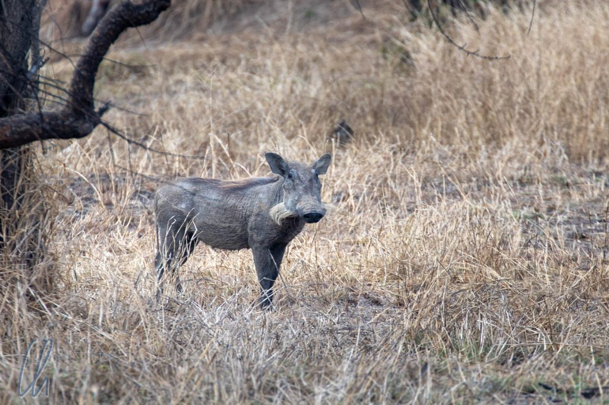

Eigentlich hatten wir länger in Tansania bleiben wollen, entschieden uns jedoch stattdessen, auch nach Kenia zu fahren. Damit waren wir insgesamt "nur" 3 Wochen im Land, eine Woche davon auf [Sansibar](http://wittmann-tours.de/erste-eindruecke-aus-tansania-sansibar/). Die meiste Zeit verbrachten wir mehr oder weniger behütet durch touristische Infrastruktur, aber trotzdem fühlten wir uns als Individualreisende und hatten häufig sogar den Eindruck, "off-the-beaten-track" unterwegs zu sein. Abgesehen von den Hotspots begegneten wir nur wenigen Ausländern.

<!--more-->

## Tansania ist kein günstiges Reiseland

Tansania war gemessen am BIP pro Kopf das drittärmste Land auf unserer Weltreise. Damit ist man versucht, sich der Illusion hinzugeben, dort auch günstig reisen können. Das stimmt allerdings nur so lange, wie man die einheimische Infrastruktur nutzen möchte und darf bzw. keine Angebote in Anspruch nimmt, deren Zielgruppe ausländische Reisende sind. In Tansania wird [preisdiskriminiert](https://de.wikipedia.org/wiki/Preisdifferenzierung), d.h. Menschen unterschiedlicher Nationalität wird die gleiche Leistung zu verschiedener Vergütung verkauft. Wir als Wazungu zahlten somit häufig einen höheren Preis als die Einheimischen. Prinzipiell ein naheliegendes Konzept, um die Einnahmen vor dem Hintergrund unterschiedlicher Kaufkraft zu steigern.

Ein Beispiel ist die Überfahrt mit der Fähre von Sansibar nach [Dar es Salaam](http://wittmann-tours.de/dar-es-salaam/). Das Ticket kostete für Einheimische [25.000 Tsh (etwa 11 USD)](https://azammarine.com/passengers/), wir bezahlten 35 USD (zu begleichen in US-Dollar-Banknoten!) in der Economy Class, also etwa den dreifachen Preis. Auf Safari erhöhte sich die Differenz beträchtlich. Im [Ruaha Nationalpark](http://wittmann-tours.de/auf-safari-im-ruaha-nationalpark) lag der Faktor zwischen der Eintrittsgebühr für Tansanier und Ausländer beim [10- bis 15-fachen](http://ruahanationalpark.weebly.com/park-fees.html). Damit schlug ein Tag Safari pro Person mit mindestens 300 Dollar zu Buche und das waren noch nicht die teuren Angebote. Dass der Übernachtungspreis für ein Hotel auf Sansibar bei durchschnittlich 100 Euro pro Nacht lag, war keine Seltenheit.

## Warum so teuer?

Damit kann nicht mehr von einem erschwinglichen Reiseland die Rede sein, allein schon deshalb, weil günstige Angebote oft schlicht nicht existieren. Das Preisniveau liegt im Tourismus oft im gleichen Rahmen oder über dem der westlichen Welt. Wir könnten ketzerisch spekulieren, dass viele Hotels oder Safarianbieter ausländischen Investoren gehören und damit internationale Renditen erwirtschaften wollen oder müssen. Unabhängig davon erlebten wir allerdings zuweilen stolze Preise und minimalen Service. Spätestens da hörte der Spaß für uns dann allerdings auf.

Die Ursache für die hohen Preise der Safaris liegt auch in den gesalzenen Eintrittspreisen der Nationalparks selbst. Wenn man sich allerdings überlegt, dass Tansania viele große Parks aufweist und dass Wilderei ein Problem sein kann, dann hat der Schutz der Natur und der Tiere eben seinen Preis. Gerne möchten wir daran glauben, dass die Eintrittsgelder auch wirklich zu diesem Zwecke verwendet werden. Was uns etwas nachdenklich stimmte war, dass es für uns leider so aussah, als seien die Parks nicht für die Tansanier da, sondern eher für ausländische Besucher.

## Ein L für ein R vormachen

Wenn wir eine Frühlingsrolle als "Flühlingslolle" bezeichnen, dann machen wir uns darüber lustig, dass Asiaten angeblich kein R aussprechen können. Das stimmt so auf keinen Fall, schließlich bedankt man sich in Japan mit "Arigato!" (nicht mit "Aligato" ;) ). Trotzdem ist es richtig, dass die Angehörigen einiger asiatischer Völker manchmal R und L vertauschen. In Japan bemerkten wir diesen Sachverhalt am eindrucksvollsten im [Samurai-Museum in Shinjuku](http://wittmann-tours.de/sightseeing-in-der-mega-city-tokyo/), wo uns bei der englischsprachigen Führung ein engagierter Mitarbeiter die Brustpanzer und Helme in "bruh", einer beliebten Farbe bei den Kriegern, näherbringen wollte. Er meinte "blue". Es dauerte ein bisschen, bis bei uns der Gloschen fiel ;).

In Tansania dachten wir erst, wir hätten einen Hörfehler, als unser Führer auf Chumbe vom "Leef" sprach, aber das "Reef" (also das Riff) meinte. Das Phänomen blieb kein Einzelfall. Auf Safari wiesen uns unsere Guides regelmäßig auf den Vogel "Lola" hin. Gemeint war der prächtige Lilac Breasted Roller ("Lilac Blested Lola"). "Look on the light of the load! In the liver there is a leino!" Alles klar? Natürlich stark übertrieben, aber R und L scheinen auch Swahili-Muttersprachler vor Herausforderungen zu stellen. Anfänglich waren wir überrascht und mussten uns erst etwas in die lokale Sprechweise einhören.

## Intrastruktur in Tansania

Tansania entwickelt sich und die Infrastruktur war wesentlich besser, als wir erwartet hatten. Lasen wir in unserem [Reiseführer](https://www.amazon.de/Rough-Guide-Tanzania-Guides/dp/1409354865) von 2015 (neue Auflage überfällig, aber trotzdem sehr empfehlenswert) von vielen schlechten Straßen, so hatte sich die Situation in den 3 Jahren zwischen Auflage und von uns erlebter Realität deutlich verändert. Die Fernstraßen, auf denen wir unterwegs waren, hatten keine Schlaglöcher. Sie waren frisch asphaltiert und wir kamen zügig voran.

Einen wesentlichen Beitrag dazu hat vermutlich der seit 2015 amtierende Präsident [John Magufuli](https://de.wikipedia.org/wiki/John_Magufuli) geleistet. Nicht nur kämpft er gegen Korruption und unnötige Staatsausgaben, sondern er brachte auch viele Infrastrukturprogramme auf dem Weg. Dies hat ihm den Spitznamen "Bulldozer" eingebracht. Die meisten dieser Projekte werden von chinesischen Partnerfirmen umgesetzt, was unter der Bevölkerung allerdings nicht uneingeschränkt positiv gesehen wird.

Spannungsfelder ergeben sich unter anderem daraus, dass chinesische Firmen ihre eigenen Arbeitskräfte mitbringen und somit in Tansania keine Jobs für Einheimische schaffen. Angeblich auch ein Thema, das unter John Magufuli besser geworden sei. Neben den Chinesen sind auch die zahlreichen Inder, die im Land leben, nicht sehr beliebt. Sie blieben unter sich, seien knallkarte Geschäftsleute und kommandierten die tansanischen Angestellten gerne herum, wie uns erzählt wurde. Sicher sind die Meinungen, die wir hörten, subjektiv eingefärbt, aber vermutlich ist etwas daran, dass eine Art moderne Kolonialisierung stattfindet. Der Theorie nach ist es das Ziel, die Märkte in Afrika vorzubereiten und die Nachfrage zu schaffen, damit dort mehr und mehr in Asien hergestellte Produkte verkauft werden können.

## Arusha-Cut

In vielen Ländern rund um den Globus war ein Besuch beim Friseur immer wieder aufregend. In Tansania (Arusha) galt dies umso mehr als anderswo auf der Welt, da die Tansanier einfach andere Haare haben als wir Mitteleuropäer. Ray arbeitete sehr ordentlich, rasierte in mehreren Durchgängen und mit verschiedenen Aufsätzen meine Haare. Die Schere nutzte er nur, um abstehende Haare schwungvoll abzuschneiden. Das Konzept der Ausdünnschere (bzw. [Effilierschere](https://de.wikipedia.org/wiki/Friseurschere#Effilierschere)) kannte er nicht. Wo in Asien oder Lateinamerika das Zeigen eines Fotos des betreffenden Gegenstandes das Instrument häufig zutage förderte, musste Ray passen. Vermutlich hatte er dafür normalerweise keine Verwendung. So geriet der Schnitt sommerlich luftig, aber trotzdem dicht ;)

## Auf dem Landweg nach Kenia

Vermutlich wurde unsere Auswahl an Zielen (Sansibar, Safari und ein bisschen mehr) Tansania als Land nicht ganz gerecht. Gerne hätten wir noch weitere Orte entdeckt, aber selbst auf einer Weltreise mit scheinbar unendlich viel Zeit muss man Prioritäten setzen ;). So verließen wir das frühere [Deutsch-Ostafrika](https://de.wikipedia.org/wiki/Deutsch-Ostafrika) nordwärts Richtung Kenia.

Tansania (genauer gesagt [Tanganjika](https://de.wikipedia.org/wiki/Tanganjika)) war die einzige ehemalige deutsche Kolonie auf unserer Reise. Die wenigen Male, die wir mit der Geschichte in Berührung kamen, waren interessant, aber trotzdem ungewohnt und kurios zugleich. Höflicherweise erzählten uns die Tansanier häufig, dass sie die deutschen Kolonialisten (wir ergänzen: aus heutiger Sicht) positiv sähen, zumindest positiver als die Engländer. Die Deutschen hätten einiges aufgebaut und zurückgelassen. Die Gebäude stünden noch heute und selbst die Eisenbahnstrecken existierten noch - vielleicht fahren wir ja beim nächsten Mal auf einer davon!
