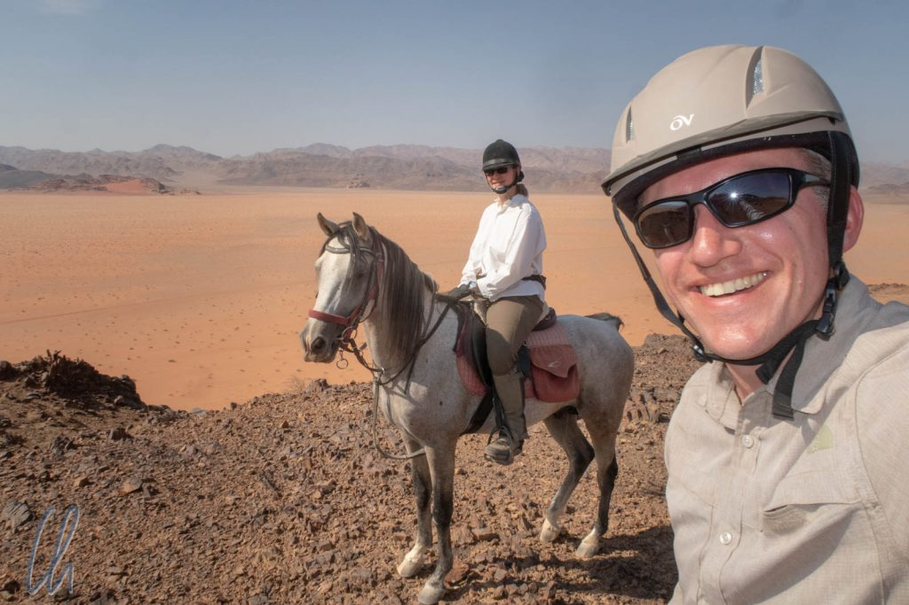
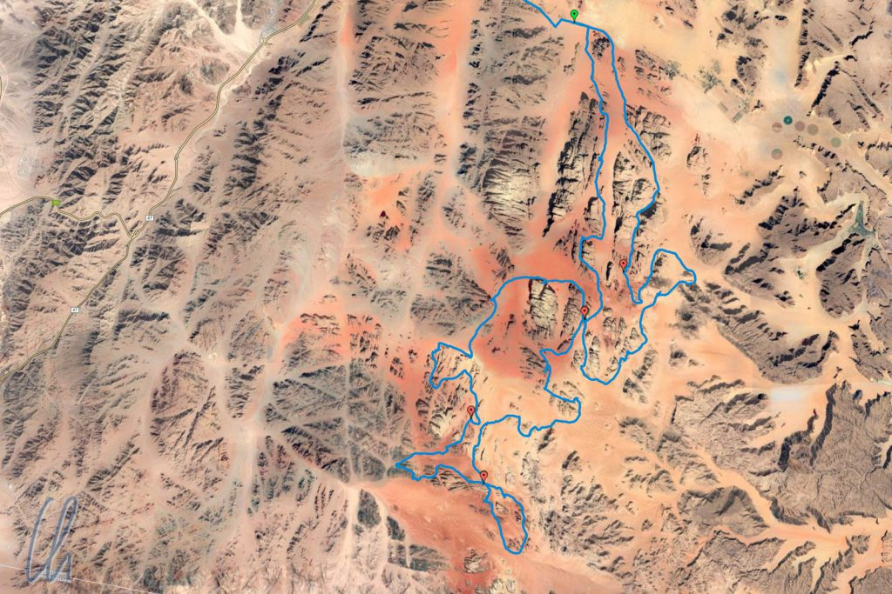
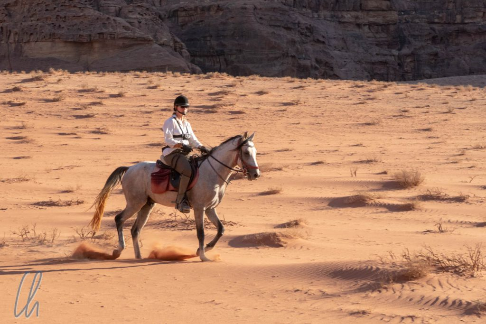

# Wir reiten im Wadi Rum

Bekanntlich ist Jordanien ein arabisches Land. Araberpferde sind wegen ihrer Kraft und Ausdauer zur Legende geworden und haben ihren Teil zur Geschichte Jordaniens beigetragen. Für 5 Tage unternahmen wir eine Reittour durch die Wüste im Wadi Rum, um diese vielbesungene Pferderasse näher kennenzulernen und die außergewöhnliche Landschaft zu genießen.

<!--more-->

## Unsere Pferde

Wir stießen in [Petra](http://wittmann-tours.de/petra-die-hauptstadt-des-reiches-der-nabataeer) zu unserer gemischten englischen, französischen, niederländischen und deutschen Reisegruppe, nahmen dort an einer gemeinsamen Führung teil und fuhren am Tag darauf ins Wadi Rum, das 100km bzw. 2 Autostunden entfernt im Süden Jordaniens liegt. Es handelt sich um das [größte Wadi Jordaniens](https://de.wikipedia.org/wiki/Wadi_Rum), allerdings gab es nicht einen einzelnen Flusslauf. Stattdessen besteht das Wadi Rum aus einer 60x100km umfassenden Fels- und Sandwüste, in der Erhebungen aus Granit und Sandstein verstreut liegen. Das Wadi Rum ist außerdem für die abwechslungsreichen Farbschattierungen seines Sandes bekannt, von gelb bis tiefrot. Auf unserem fünftägigen Rundritt legten wir insgesamt etwa 170km Strecke zurück.

Bei der Einteilung der Pferde bekamen wir zwei Hengste zugewiesen: Mona ritt auf Dahan, ich auf Sulfaca. Sie waren Brüder, verstanden sich gut miteinander, aber trotzdem war es uns leider nicht möglich, zusammen in der Gruppe zu reiten. Sulfaca war weniger Hengst ("half stallion" laut Auskunft unseres Reitführers) und wollte immer vorne in der Gruppe sein, nur dort waren seine Ohren zufrieden nach vorne gerichtet. Dahan war deutlich hengstiger und musste vor allem den Stuten immer wieder zeigen, was für ein toller Hecht er sei. Deshalb musste er immer mit etwas Abstand hinter der Gruppe gehen. Also ritt Mona weit hinten und ich vorne, was auf unseren bisherigen Reittouren meistens anders war.

Sulfaca war mit Abstand das stärkste und schnellste Pferd, das ich jemals geritten habe, soviel war schnell klar. Und dennoch war er tief in seinem Herzen ein kleiner Angsthase. Trotz seiner stattlichen Figur und all seiner Kraft erschrak sich Sulfaca sehr, als wir den ersten Kamelen begegneten. Zugegeben, wir ritten über eine Düne und die Kamele hielten sich gut getarnt im Schatten auf. Er machte einen kräftigen Satz zur Seite und trabte noch ein Stück weiter, bis dann klar war, dass die Welt nicht untergehen würde. Kamele in der Wüste, wer kann auch mit so etwas rechnen?

## Reiten im Wadi Rum

Auch wenn die Zivilisation nicht weit entfernt war, trafen wir erstaunlich wenige andere Touristen (nur ein paar Jeeps mit ihren Insassen), ab und zu frei herumlaufende Kamele und auch nur selten einige Beduinen, die im Wadi Rum lebten. Die meiste Zeit erlebten wir die Wildnis als menschenleer. Nur die schroffe, trockene, aber landschaftlich sehr beeindruckende Wüste umgab uns. Dabei war der Boden sandig, selten locker wie an einem Strand, meistens staubig-fest. Um uns herum standen Hügel, die wie aufgeschichtet aussahen, teilweise wie mit Sirup übergossener mehrschichtiger Kuchen - vielleicht haben wir aber auch in der Hitze angefangen zu halluzinieren ;)

So eintönig es vielleicht klingen mag, so abwechslungsreich war die Landschaft trotzdem. Zu Pferd konnten wir die Stille und Weite der Wüste auf uns wirken lassen. Unsere Araber kamen mit der Hitze und dem weichen Untergrund erwartungsgemäß sehr gut zurecht. Auch im tiefen Sand schritten sie unbeirrt und zügig vorwärts. Dann fühlte sich der Schritt deutlich ausgeprägter an, fast ein wenig wie auf einem Kamel ;).

Auf den Trab- oder Galoppstrecken offenbarte sich rasch das Temperament der Araber. Unser Reitführer hätte gerne gehabt, dass wir schön in Formation in Zweierreihen blieben. Das klappte aber selten genug, mag es an kollektiver mangelnder Reiterfahrung der Gruppe gelegen haben oder am Feuer der Tiere. Immer wieder brachen die Pferde aus der Gruppe aus oder stürmten forsch voran. Wenn in [Kenia](http://wittmann-tours.de/auf-reitsafari-in-der-masai-mara/) jede Galoppade ein Genuss war, war es im Wadi Rum immer wieder aufregend, was diesmal passieren würde.

## Ein gigantischer Sternenhimmel

Wenn wir abends am jeweiligen Ziel des Tages angekommen waren, sattelten wir ab und endlich konnten sich die Pferde im Wüstenstaub wälzen. Anschließend versorgten wir unsere Reittiere: Sie bekamen mindestens einen Eimer Wasser zu trinken und danach wurde das Abendessen serviert. Damit die Pferde es nicht in der Wüste verteilten, bekam jedes einen Futtersack um den Kopf gelegt, aus dem sie ihr Kraftfutter verspeisten. Für unser leibliches Wohl sorgte Koch Ali. Howard und Massah beförderten unser Gepäck, Ausrüstung, Futter und Wasser auf den Jeeps zu den Mittagspausen bzw. Abendlagern. Auf den Reitstrecken begleiteten uns auch zwei Salukis, elegante Windhunde, die mit unserer langsamen Form der Fortbewegung nicht ganz ausgelastet schienen.

Nach Sonnenuntergang waren die einzigen Lichtquellen einige wenige Lampen (nur bei Hüttenübernachtung), unsere Taschenlampen und die Sterne am Himmel (später auch der Mond). Wir sahen deutlich die Planten Mars, gut an seiner rötlichen Farbe zu erkennen, Saturn und Jupiter, der allerdings sehr früh unterging. Außerdem leuchtete die Milchstraße hell über unseren Köpfen am Firmament.

Es war sogar so dunkel, dass es möglich war, mit Langzeitbelichtung [Sternenstreifen](https://en.wikipedia.org/wiki/Star_trail) als Nachweis für die Rotation der Erde zu fotografieren. Das nachfolgende Bild zeigt eine Belichtung von 30 Minuten.

## Ein Tag in der Wüste

Morgens begann der Tag für uns mit Sonnenaufgang, damit wir so früh wie möglich, aber trotzdem ohne Hektik aufbrechen und die größte Hitze meiden konnten. Wir ritten morgens 3 bis 4 Stunden und die Wüste hatte erstaunlich viel Abwechslungsreiches zu bieten: In der Khazali-Schlucht sahen wir jahrhundertealte Felszeichnungen von Beduinen, die früher als Wegweiser gedient hatten. Sie stellten Menschen, Pferde, Kamele und Fußabdrücke dar. Mit unseren Reittieren zusammen kletterten wir ein Stück weit den Jabal Qattar hinauf und tränkten die Araber an einer Quelle, die bereits von den Nabatäern genutzt worden war. Auch passierten wir Orte, an denen schon [Lawrence von Arabien](https://de.wikipedia.org/wiki/T._E._Lawrence) geritten war, sahen eindrucksvolle Felsformationen, die gewaltige natürliche Brücken formten, und blickten von einer Anhöhe aus ins Staatsgebiet des nur noch wenige Kilometer entfernten Saudi-Arabien.

Für die "heiß" ersehnte Mittagspause erwarteten uns Ali, Howard und Massah immer an einem anderen Ort, der im Schatten der Felsen lag. Die Matten, die uns nachts als Matratzen dienten, legten wir auf dem Boden aus. Auf einem Campingtisch baute Ali ein kleines Buffet mit Wasser, Limonade, Tee und einem einfachen, aber köstlichen Mittagessen auf. Die Mittagspause dauerte normalerweise ausgedehnte 3 Stunden, so dass auch genug Zeit für eine Siesta blieb, für den Austausch mit unseren Mitreitern, um ein wenig Blog zu schreiben oder etwas zu lesen.

Nachmittags ritten wir wieder 2 bis 3 Stunden. Kurz vor oder zum Sonnenuntergang erreichten wir das Ziel. Selbst an den Campingtagen bestand die Möglichkeit, uns in einem Duschzelt mit ein wenig Wasser etwas frischzumachen und den Schweiß des Tages abzuwaschen. Als Unterkunft hatten wir nagelneue Wurfzelte. Sie waren zwar schnell aufgebaut, niemand wusste allerdings genau, wie man sie wieder zusammenlegte. Jeden Morgen fühlte es sich mehr wie Zufall an, wenn ein widerspenstiges Zelt niedergerungen und verstaut war ;)

## Übernachtung unter den Sternen

Nachdem sich die Gruppe, meistens eher früher als später, zum Schafen zurückgezogen hatte, war es nicht nur dunkel, sondern auch still, erstaunlich still. Es war mucksmäuschenstill! Der kleinste Laut trug sehr weit und andere sonst unbedeutende Geräusche waren auf einmal hörbar. Ich saß im Dunkeln auf meiner Matratze, halb im Schlafsack, und notierte mir auf dem Smartphone ein paar Erlebnisse des Tages. Dabei hörte ich zum ersten Mal das Tippgeräusch meiner Finger auf dem Display des Gerätes.

In der Nacht des ersten und vorletzten Reittages übernachteten wir in einem Camp mit permanenten Hütten. Die beiden anderen Nächte konnten wir zwischen Matratze im Zelt (Mona) und Matratze unterm Sternenhimmel (ich) wählen. Die Option "Matratze unter dem Himmelszelt" war nicht in aller Konsequenz bequem, aber immer, wenn ich aufwachte, sah ich, dass sich die Sterne etwas weiter bewegt hatten. [Kassiopeia](<https://de.wikipedia.org/wiki/Kassiopeia_(Sternbild)>) zum Beispiel war immer im Dunklen zu sehen, wie ein "M" oder "W" am Himmel. Andere Sternbilder gingen früher unter oder erschienen erst im Laufe der Nacht.

## Am Ende leider keine Empfehlung

So schön wie die die Wüste auch war, so elegant und kraftvoll die Pferde - Mona wollte ihren Dahan am Ende kaum hergeben - so bleibt diese Reittour eine der wenigen Aktivitäten weltweit, die wir nicht weiterempfehlen würden. Dabei lag es nicht am Ritt selbst, sondern an der Art, wie er geführt wurde. Es fing damit an, dass es etwas seltsam war, einen Gast durch den Einsatz eines Hengstes dauernd von der Gruppe zu trennen. Es stand zwar in der Reisebeschreibung, dass auch Hengste mit auf den Ritt gehen, aber trotzdem wird dies wohl eine Kuriosität unserer Reiterurlaube bleiben.

Sowieso waren immer die Gäste schuld, wenn etwas nicht passte. Wir hatten zum Beispiel keine Helme und Chaps dabei (vorher mehrmals angemeldet, also keine Überraschung) und wollten diese gerne vor Ort ausleihen. Als die ersten Chaps, mit Präzisionsblick vom Guide ausgewählt, nicht passten, bekamen wir gleich vorgeworfen, dass wir doch selbst welche hätten mitbringen sollen. Trotz einiger Beinaheunfälle unternahm unser Reitführer keinen Anlauf, das Chaos der Galoppaden in den Griff zu bekommen. Weder regte er Pferdewechsel an, noch gab er den Gästen den einen oder anderen Tipp ("I am no riding school."). Stattdessen wurde das Problem am liebsten totgeschwiegen ("We keep silence.") anstatt “Safety First” zu praktizieren. Ob das Kommunikationsdefizit wohl an den interkulturellen Unterschieden lag?

Dass jeder Gast für 3 Stunden in der Hitze jeweils immer nur einen halben Liter Wasser zugeteilt bekam, war ebenso erstaunlich wie die Tatsache, dass die Guides in den Pausen das Gespräch mit den Gästen eher mieden. Sie waren nur zur Bewirtung da, ansonsten blieben sie gerne unter sich. Wir hingegen haben die Gesellschaft unserer Mitreiter sehr genossen. So bleibt ein Geschmäckle, trotzdem erinnern wir uns gerne an die einzigartige Landschaft, die kraftvollen Pferde und den funkelnden Sternenhimmel.
