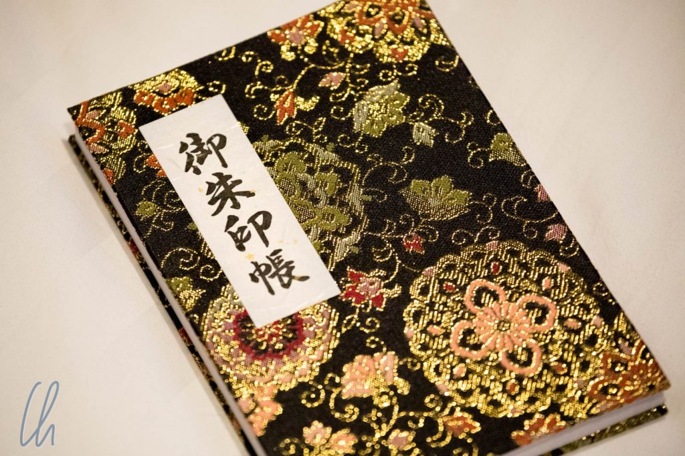
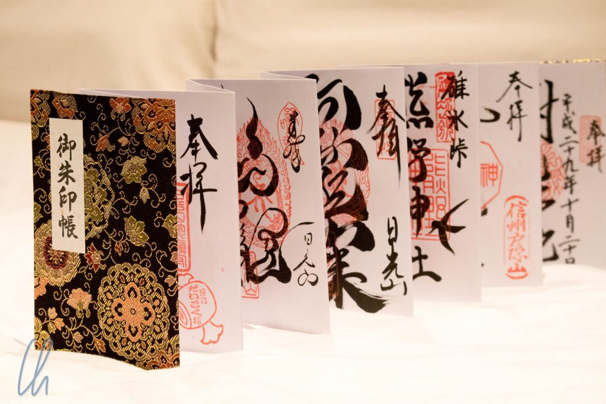
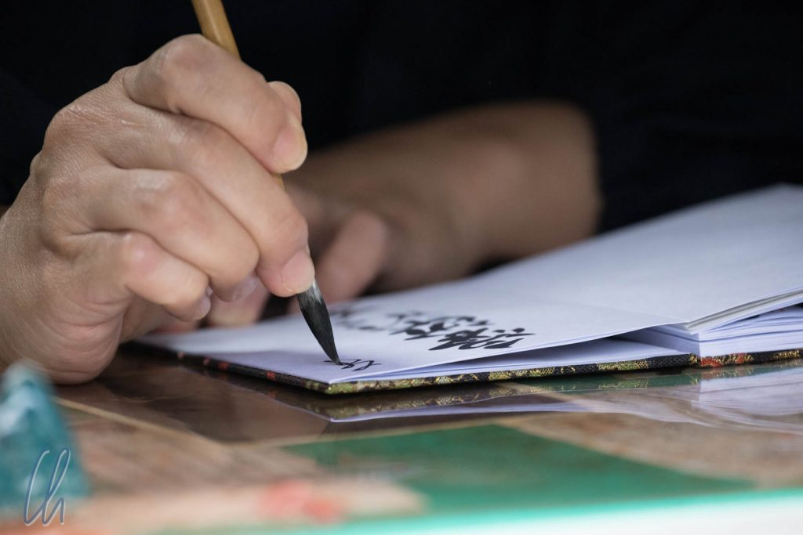

Was nimmt man mit von einer Weltreise? Viele Erfahrungen, aber im klassischen Sinne eher keine Souvenirs, da diese auf die Dauer zu sperrig und zu schwer werden. Trotzdem haben wir uns von den Japanern in einer Disziplin anstecken lassen. Wir sammeln Stempel - nicht nur im Pass, sondern auch auf andere Art und Weise.

<!--more-->

## Das Goshuinchou (御朱印帳)

Das Pilgerbuch oder auch Goshuinchō (御朱印帳) ist ein Buch, in dem man Stempel von [buddhistischen Tempeln](https://de.wikipedia.org/wiki/Buddhistischer_Tempel) und [Shintō-Schreinen](https://de.wikipedia.org/wiki/Shint%C5%8D-Schrein) in Japan sammeln kann. Der Name besteht aus 3 Teilen: [Honorativpräfix ](https://de.wikipedia.org/wiki/Honorativpr%C3%A4fix)Go- (御), [Shuin](https://de.wikipedia.org/wiki/Shuin) (朱印) was soviel wie „rotes Siegel“ bedeutet und chuo (帳) das Buch.

In eigentlich allen Tempel und Schreinen kann man ein Goshuin, einen Stempel, also einen Eintrag ins Buch bekommen. Es kostet normalerweise 300 Yen. Jedes Goshuin füllt eine Seite im Buch aus. Dabei wird nach unserer westlichen Denkweise hinten angefangen, da auf japanisch von rechts nach links gelesen wird. Außerdem hat das Büchlein keinen Buchrücken, sondern ist wie eine Ziehharmonika gefaltet.

## Das Goshuin

Ein Goshuin enthält den Namen des Schreins oder Tempels, ggf. so etwas wie einen Sinnspruch und das Datum des Eintrags. All diese Bestandteile werden in Kanji-Zeichen von Hand mit dem Pinsel kalligraphiert. Zusätzlich wird das rote Siegel eingestempelt. Es können aber auch mehrere Stempelelemente verwendet werden.

Das Sammeln der Goshuins hat eine spirituelle Bedeutung. Es ist aber auch ein sehr schönes Souvenir, das man sich im Laufe einer Japan-Reise "erarbeiten" kann - und das ist offen und ehrlich die Intention gewesen. Jedes einzelne Goshuin ist ein Kunstwerk, welches am Tempel von Hand angefertigt wird und kunstvolle Kalligraphien und Stempel beinhaltet.

Traditionell ist das Goshuinchou eine Eintrittskarte für das Jenseits. Mit ihm "beweist" man, dass man ein gutes, gläubiges und hingebungsvolles Leben geführt hat, da die Pilgerreisen belegt werden. Das Buch wird bei der Beerdigung verbrannt, und damit wandert der Geist des Goshuinchous mit dem Toten weiter. Über Verbrennen kann man im Buddhismus viel transportieren: Gute Wünsche über Räucherstäbchen, Geld in Form von Spielgeld, High-Tech über Laptops aus Pappe, wobei die beiden letzten Varianten uns in Japan nicht begegnet sind. Das Goshuinchou ist natürlich eine viel ernstere Angelegenheit.

Eigentlich kauft man das Buch in einem Tempel oder Schrein, dem man sich besonders verbunden fühlt. Da wir gelesen haben, dass nicht alle Schreine die Bücher verkaufen, haben wir es noch in Deutschland [bei Amazon bestellt](https://www.amazon.de/gp/product/B00DM02NXM) - interessanter Tempel ;). Die Lieferung erfolgte direkt aus Japan.

## Weltliche Stempel

Zusätzlich kann man in Japan auch noch ganz profane Stempel sammeln, diese dürfen aber auf keinen Fall im Goshuinchou landen. Hierfür haben wir ein kleines Büchlein, welches auf den ersten Blick wie ein Pass aussieht, aber nur leere weiße Seiten enthält.

An fast allen Bahnstationen gibt es einen "station stamp", mit dem man die Stationen der Reise eintragen kann. Außerdem gibt es Stempel in verschiedenen Farben häufig, manchmal allerdings gut versteckt, in Parks, Museen, anderen Sehenswürdigkeiten und sogar (selten) bei Tempeln oder Schreinen.

Manche Stempel sind wahrhaft gigantisch und füllen fast eine ganze Seite aus. Deluxe-Stempelmaschinen zaubern sogar besonders saftige Stempel ins rote Büchlein. Da das Papier relativ dünn ist, drücken diese Stempel manchmal bis auf die Rückseite etwas durch, so dass wir dort auch schon einen Farbklecks haben. So wird das Büchlein bunt gestaltet.

Wir sind gespannt, ob wir auch außerhalb Japans noch weiter fleißig stempeln dürfen.
