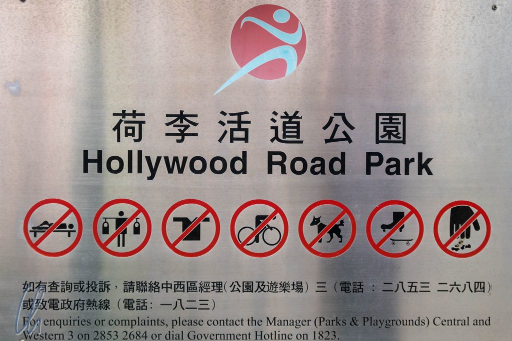
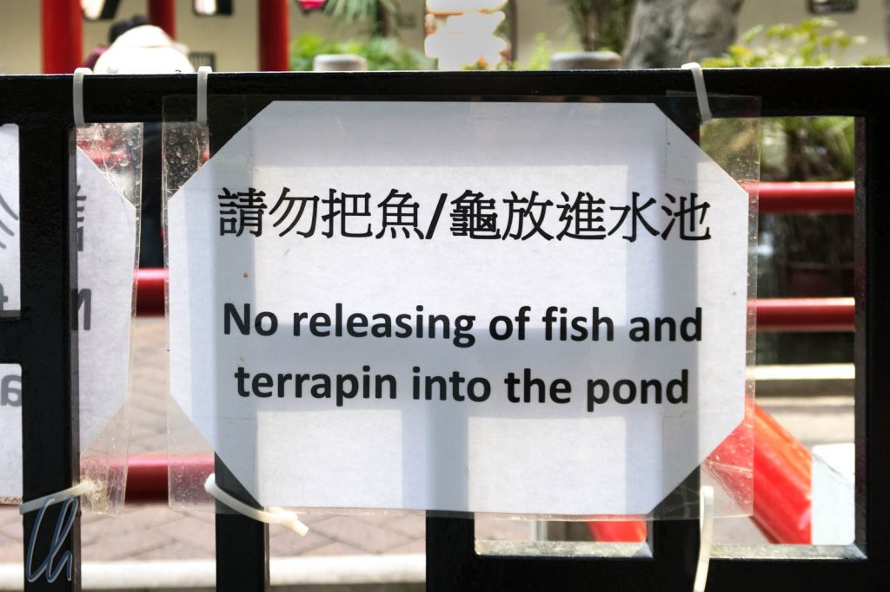

Dieser Artikel fängt gleich an. Bitte beachten Sie den Unterschied der Helligkeit zwischen der Umgebung und Ihrem Bildschirm. Bitte fangen Sie nicht mit dem Lesen an, wenn Ihre Augen geschlossen sind. Achten Sie zu Ihrer eigenen Sicherheit auf einen konstanten und regelmäßigen Lidschlag zur Befeuchtung der Hornhaut Ihrer Augen. Sollten Sie trotzdem einzelne Buchstaben oder Worte nicht klar erkennen können, konsultieren Sie bitte sofort Ihren Augenarzt.

<!--more-->

## Ihre Persönliche Sicherheit

Sollten Sie stehen, achten Sie bitte zu Ihrer eigenen Sicherheit darauf, mit beiden Beinen fest auf dem Boden zu stehen. Achten Sie auf unebenen oder feuchten Untergrund, um nicht zu fallen oder auszurutschen. Gehen, Rennen, Radfahren, Skateboarden, Inlinern oder auf einem Bein stehen ist strengstens verboten. Sollten Sie sich unsicher fühlen, stützen Sie sich bitte mit einer Hand ab oder bitten andere, Ihnen zu helfen. Ob stehend oder sitzend, bitte nehmen Sie unbedingt eine aufrechte Körperhaltung ein. Das Lesen unter der Bettdecke ist strengstens verboten!

Achten Sie auf einen konstanten Lesefluss. Lesen Sie jede Zeile aufmerksam von links nach rechts, beachten Sie unbedingt die Satzzeichen. Absätze und Zwischenüberschriften gliedern zu Ihrer eigenen Sicherheit den Artikel. Das Überspringen einzelner Wörter oder Absätze ist strengstens verboten! Lesepausen sind nur zwischen den Absätzen erlaubt. Zu schnelles Scrollen kann zu epileptischen Anfällen führen.

## Unter Strafe verboten!

Internationale Gesetzgebung verpflichtet Brillenträger, ihre Brille jederzeit zu tragen, dies gilt insbesondere für Lesebrillen(träger). Verschmutze Brillengläser sind umgehend zu reinigen. Brillenputztücher erhalten Sie in jeder Drogerie. Eine Missachtung wird mit mindestens 150.000 Dollar Geldstrafe oder 2 Monaten Freiheitsstrafe geahndet. 3D-Brillen dürfen nicht verwendet werden, dieser Artikel ist strengstens zweidimensional!

Während des Lesens ist es strengstens untersagt, Tauben, Kanarienvögel, Fische, Hunde, Katzen, Pferde, Hamster, Meerschweinchen, Pandabären, Delphine oder andere Haus-, Wild- oder Kuscheltiere zu füttern, zu streicheln, anzufassen oder an der Leine zu führen. Blindenhunde sind von dieser Regelung selbstverständlich ausgenommen. Grünflächen dürfen nicht betreten werden. Bitte nicht auf die Bäume klettern. Offenes Feuer ist zu meiden. Auf keinen Fall darf dieser Text mit Blitzlicht oder Selfiestick fotografiert werden!

## Bitte die Regeln beachten!

Essen und Trinken ist nicht gestattet. Dies gilt auch und im besonderen für Eiscreme, Kaugummi, sowie alkoholische Getränke. Dieser Artikel darf nicht zur Herstellung von Buchstabensuppe verwendet werden. Bitte benehmen Sie sich respektvoll. Über diesen Text darf nicht gelacht oder gelästert werden!

Als hätten wir es geahnt: Dieser Artikel ist ein Nichtraucherbeitrag. Obwohl Aschenbecher zwischen den Zeilen vorhanden sind, haben wir natürlich auch Rauchmelder installiert. Diese entdecken auch Schokoladen-, Kaugummi-, Gras-, Wasser- und Zuckerwattezigaretten, -pfeifen und -zigarren.

Träger von Herzschrittmachern oder Glasaugen, Diabetiker, Asthmatiker, Schlafwandler sowie überzeugte Veganer müssen wir darauf hinweisen, dass das Lesen dieses Artikels auf eigene Gefahr erfolgt. Erdnuss! Dieser Artikel kann Spuren von Erdnüssen enthalten.

Abschließend noch eine Warnung an alle Nutzer von Smartphones und Tablets: Bitte den Artikel nicht berühren!

Sollte Euch das alles zu kompliziert erscheinen, benutzt bitte einfach Euren gesunden Menschenverstand.

PS.: Die Hongkonger sind die Großmeister im Aufstellen von Verbots- und Hinweisschildern.

