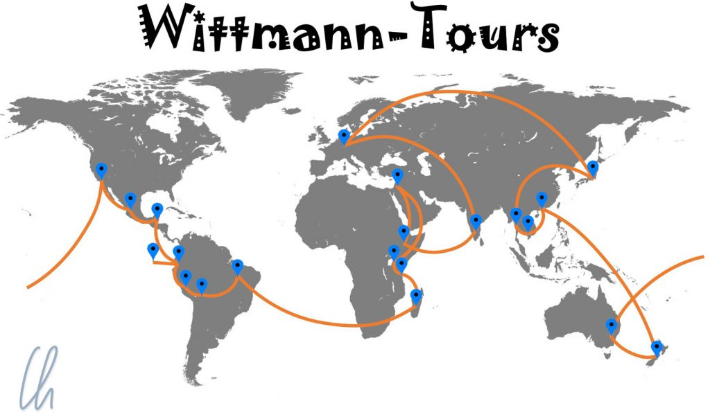
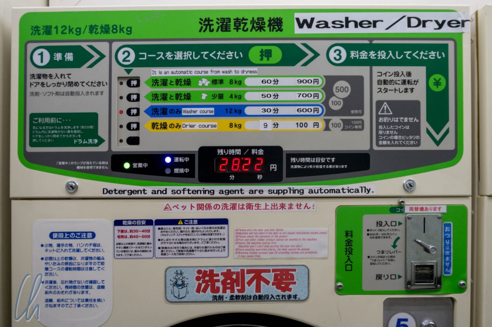
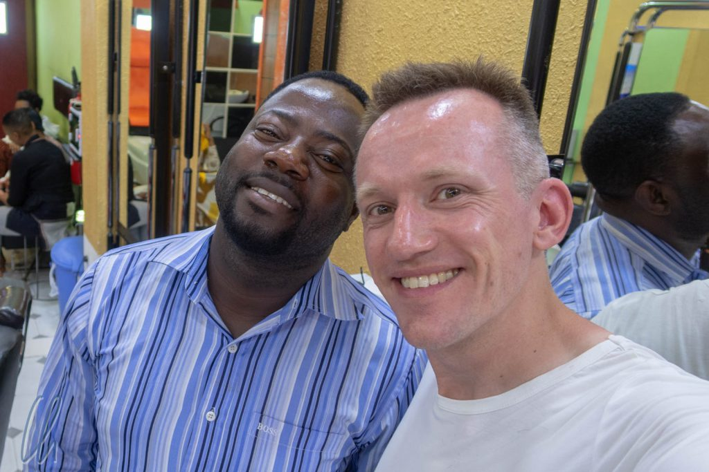

# Zurück in Deutschland - Home Sweet Home

Wir sind zurück in Deutschland. Aktuell versuchen wir, unsere Wohnung und unseren Alltag wieder in Betriebsmodus zu bringen. Jede Menge Post durchsehen, Internet- und Telefonanschluss organisieren, Auto wieder zulassen usw. Insgesamt scheint sich zu Hause relativ wenig verändert zu haben, während wir unterwegs waren. Angela Merkel ist noch Bundeskanzlerin, der BER ist weiterhin [fast fertig](http://www.faz.net/aktuell/wirtschaft/flughafen-ber-berlin-termin-herbst-2020-soll-bleiben-15860516.html) und unsere Wohnung war noch so, wie wir sie verlassen haben. Ohne einem zukünftigen Artikel "Wie war die Welt?" vorzugreifen, hier ein kleines Fazit.

<!--more-->

## Wie war die Weltreise?

Sehr interessant :) - und zu kurz ;) - wir haben nur 19 von 193 Ländern dieser Welt bereist. Und selbst wenn man die Staaten dieser Erde abzieht, die aufgrund von militärischen Konflikten aktuell keine Reiseziele sind, bleiben noch genug weiße Flecken auf der Landkarte und einige freie Seiten in unseren Pässen. Aber im Ernst, wir haben die Zeit sehr genossen und fühlen uns sehr privilegiert, dass wir diese lange Reise unternehmen konnten. 4 Kontinente, 19 Länder in 14 Monaten, mit dem Flugzeug, im Ballon, mit der Bahn, im Bus, mit dem Boot, mit dem Mietwagen, in der Pferdekutsche, im Zebukarren, im Tuktuk, zu Pferd, auf dem Fahrrad, zu Fuß, einmal um die Welt. Fast wie [Phileas Fogg](https://de.wikipedia.org/wiki/Reise_um_die_Erde_in_80_Tagen) im Roman von Jules Verne, aber etwas länger als in 80 Tagen und ohne Elefanten als Reittier, Elefanten habe wir [nur gefüttert](http://wittmann-tours.de/kuscheln-mit-elefanten-im-phnom-tamao/) ;).

Die Elefanten waren nur einer der vielfältigen Höhepunkte. Seien es die Tempel von [Angkor Wat](http://wittmann-tours.de/die-tempel-von-angkor/), das [Whale Watching](http://wittmann-tours.de/die-wale-von-guerrero-negro/) in Mexiko, die [Galapagos-Inseln](http://wittmann-tours.de/galapagos-die-verwunschenen-inseln/), die [Fiesta del Gran Poder](http://wittmann-tours.de/la-paz-fiesta-del-gran-poder-und-mehr/) in La Paz, die [berückende](https://www.duden.de/suchen/dudenonline/ber%C3%BCckend) Schönheit der Landschaft im Amazonasgebiet oder, oder, oder. Die vollständige Liste wäre sehr lang. Diese Welt ist sehr, sehr sehenswert und wir werden uns ein Leben lang immer wieder gerne an den Reiz unterschiedlichster Landschaftsformen, die verschiedenen Kulturen und die Begegnungen mit den Menschen erinnern :).

## Reisen ist kein Urlaub

Das Reisen war dabei meistens sehr abwechslungsreich und spannend, aber manchmal auch etwas anstrengend. Reisen ist eben nicht gleichbedeutend mit Urlaub. Nicht nur haben wir oft bis spät in die Nacht hinein im Reiseführer gelesen und Hotels oder Transportmittel gebucht. Ein wesentlicher Punkt war auch, dass wir uns nur selten auf Erfahrungswerte verlassen konnten.

In Deutschland, in unserem gewohnten Umfeld, segeln wir einfach durch den Alltag, ohne groß darüber nachzudenken. Das merken wir gerade jetzt, kurz nach der Rückkehr, extrem! Auf Reisen ist hingegen alles neu, überall, und selbst die vermeintlich einfachen Dinge sind beim ersten Mal kompliziert. Die Lernkurve ist zwar steil, aber trotzdem fingen wir oft bei Null an. Jedes Land hat neues Geld und einen eigenen Umrechnungskurs. Was sind angemessene Preise? Auf welche Art kommuniziert man am besten mit den Menschen vor Ort? Häufig begegneten wir uns unbekannten Sprachen und teilweise auch anderen Schriften. Wie funktioniert das Metronetz? Was steht da alles auf der Speisekarte? Wo fahren die Busse ab? Hatten wir einmal den Bogen raus, brachen wir meistens wieder auf.

Das Fehlen von Routine war natürlich auch bereichernd, da wir immer mit offenen Augen durch die Welt laufen mussten. Und so waren es nicht nur die großen Sehenswürdigkeiten, sondern auch der Reisealltag, der uns sehr gefallen hat. Auf diese Weise bekamen wir eine Idee davon, wie die einzelnen Länder ticken. Immer wieder spannend war zum Beispiel der Besuch beim Friseur. Die besten Haarschnitte gab es in Neuseeland (für Mona) und in Japan (für mich), andere waren nicht immer 100% überzeugend ;)

## Norden, Süden, Osten, Westen, zu Hause ist's am besten?

Einerseits könnten wir problemlos weiterreisen, andererseits ist vielleicht jetzt auch eine Pause ganz gut, die Weihnachtszeit ist schließlich etwas ganz Besonderes. Nebenbei, Deutschland ist in der Top Ten als Reiseland des kommenden Jahres vom Lonely Planet-Reisebuchverlag [für 2019 empfohlen](http://www.spiegel.de/reise/aktuell/lonely-planet-best-in-travel-2019-deutschland-gehoert-zu-den-top-ten-laendern-a-1234589.html) worden! Außerdem ist unsere Ausrüstung nach 14 Monaten ziemlich am Ende. Die Technik hat erstaunlich gut gehalten, aber unsere Sohlen sind abgelaufen und unsere Kleidungsstücke mürbe. Einiges konnten (und mussten) wir unterwegs ersetzen, anderes war in vielen Ländern unmöglich zu beschaffen. Dafür war es dann aber meistens möglich, Kleidung oder Schuhe schnell und für wenig Geld reparieren zu lassen.

Zu Hause ist es am schönsten? Ja und nein! Es gab natürlich manches, was wir unterwegs vermisst haben: Allen voran unsere Familie und Freunde, aber auch ganz Profanes wie eine verlässliche Infrastruktur. Zurück in Deutschland fiel uns sofort auf, wie gut hier doch alles funktioniert. Züge fahren relativ pünktlich, auf dem Amt muss man niemanden bestechen, die Straßen sind keine Aneinanderreihung von Schlaglöchern. Ab und zu - je nach Unterkunft - wünschten wir uns gelegentlich das eigene Bett herbei, eine Dusche mit ausreichend warmem Wasser oder eine funktionierende Heizung(!). An Nahrungsmitteln waren wir am Ende ausgehungert nach g´scheitem Brot (wie es sich für echte Deutsche gehört), abwechslungsreichem Käse, Schokolade, Nutella….

## In Deutschland geht es uns gut

Wir leben in Deutschland in [paradiesischer Sicherheit](http://www.spiegel.de/panorama/justiz/kriminalstatistik-zahl-der-straftaten-2017-deutlich-gesunken-a-1206707.html). Im internationalen Vergleich sind die deutschen Politiker (von wenigen Ausnahmen abgesehen) integer und schwer in Ordnung, auch wenn manche Stimmen uns etwas anders suggerieren wollen. Für alle diejenigen, die daran Zweifel hegen, können wir gerne ein paar Reisetipps geben, wo man korrupte Regierungen, Kriminalität auf der Straße, mangelhafte Infrastruktur und bittere Armut jeden Tag erleben kann. Jeder genießt in Deutschland die Freiheit, laut seine Meinung äußern zu dürfen und wir sind vor Unrecht, Verbrechen und staatlicher Willkür geschützt. Es geht uns schon sehr gut!

Was ist es nun, was wir im Vergleich zu unserem Reisealltag in Deutschland vermissen (werden)? Vom elektrisierenden Abenteuer der Entdeckung neuer Orte und Kulturen mal abgesehen, ist es das abwechslungsreiche Treiben außerhalb der Gebäude auf der Straße, das meist mit angenehm warmem Wetter und Sonnenschein einherging. Auch konnten wir viel Zeit im Freien und in der Natur verbringen. Die Selbstverständlichkeit von saftig-süßen tropischen Früchten und aromatischem frischen Gemüse in unseren Reiseländern kommt uns im deutschen Winter wie ein großer Luxus vor.

## Wittmann Tours reist virtuell weiter

Auch wenn wir jetzt wieder zurück im kalten Deutschland sind, gibt es noch viel von unserer Reise zu berichten. Im Laufe der Zeit sind wir mit dem Blog ganz schön ins Hintertreffen geraten. Es gab unterwegs einfach zu viel zu sehen und zu viel zu schreiben. Fast 100 Artikel in 430 Tagen sind immerhin schon zusammengekommen. Wir sind selbst überrascht, wie viele Blogposts wir veröffentlicht haben ;).

Von Bolivien aus, über das wir in den aktuellen Artikeln berichten, reisten wir weiter nach Brasilien, dann nach Madagaskar, Tansania, Kenia, Jordanien, Äthiopien und von Indien aus wieder zurück nach Deutschland. 7 Länder liegen also virtuell noch vor uns und wir sind fest entschlossen, unsere Reiseberichte zu komplettieren. Als Teaser hier ein Video mit einigen Höhepunkten.

https://www.youtube.com/watch?v=hviVBDuTg9Y

Hoffentlich sehen wir den einen oder anderen von Euch bald wieder! Auf jeden Fall wünschen wir Euch allen eine fröhliche und angenehme Weihnachtszeit!
